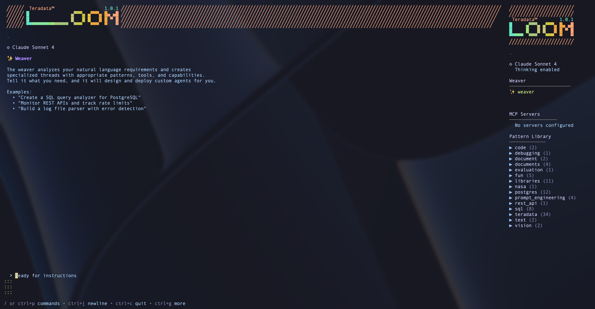

# Loom

An LLM agent framework for Go. Create agents from natural language, orchestrate them with workflow patterns, and improve them through pattern-guided learning.

[](https://github.com/teradata-labs/loom/actions/workflows/ci.yml)
[](https://pkg.go.dev/github.com/teradata-labs/loom)
[](https://opensource.org/licenses/Apache-2.0)
[](https://www.bestpractices.dev/projects/11888)
[](https://github.com/teradata-labs/loom/releases/latest)

**Version**: v1.1.0



---

## Quick Start

```bash
# 1. Install
git clone https://github.com/teradata-labs/loom && cd loom
./quickstart.sh          # macOS/Linux (handles Go, Buf, patterns)
# .\quickstart.ps1       # Windows (PowerShell)

# 2. Set your LLM provider
export ANTHROPIC_API_KEY="your-key"    # or Bedrock, Ollama, OpenAI, etc.

# 3. Start the server
looms serve              # gRPC :60051, HTTP :5006

# 4. Launch the TUI
loom                     # Opens with Guide agent
loom --thread weaver     # Or go straight to the Weaver
```

The **Weaver** is a meta-agent that creates other agents from natural language:

```
You: Create a Teradata query optimizer that analyzes EXPLAIN plans
Weaver: Analyzing requirements... selecting patterns... activating agent.
```

**API endpoints** after `looms serve`:
- **gRPC**: `localhost:60051` (75 RPCs)
- **HTTP/REST**: `localhost:5006` (with SSE streaming)
- **Swagger UI**: `localhost:5006/swagger-ui`
- **MCP Apps**: `localhost:5006/apps/`

---

## How It Works

Instead of prompt engineering, Loom uses **pattern-guided learning**. Domain knowledge is encoded as reusable YAML patterns that agents select and apply based on user intent:

```
User message → Pattern selection (from 95 patterns) → LLM call with context → Tool execution → Response
     ↑                                                                                            |
     └────────────────────── Learning feedback loop (optional) ───────────────────────────────────┘
```

Patterns are plain-English YAML files anyone can write. They turn generic LLMs into domain specialists for SQL optimization, data quality, Teradata analytics, code review, and more.

---

## Features

### Weaver (Meta-Agent)

Describe what you need; the Weaver builds it:
- Analyzes requirements to determine domain and capabilities
- Selects patterns from the library (95 patterns across 16 domains)
- Generates YAML configuration and activates the agent
- Automatically selects workflow patterns for multi-agent tasks

### Multi-Agent Workflows

9 orchestration patterns defined in proto:

| Pattern | Use Case |
|---------|----------|
| **Pipeline** | Sequential stages (ETL, multi-step analysis) |
| **Parallel** | Independent concurrent tasks |
| **Fork-Join** | Parallel execution with merged results |
| **Debate** | Multiple agents argue perspectives, reach consensus |
| **Conditional** | Route based on agent decisions |
| **Swarm** | Dynamic agent collaboration |
| **Iterative** | Pipeline with autonomous restart on failure |
| **Pair Programming** | Two agents collaborate on code |
| **Teacher-Student** | One agent teaches/evaluates another |

### Judge Evaluation System

Multi-judge evaluation with 6 aggregation strategies (weighted-average, all-must-pass, majority-pass, any-pass, min-score, max-score) and 3 execution modes (synchronous, asynchronous, hybrid). Includes DSPy integration for judge optimization.

See [Judge CLI Guide](docs/guides/judge_cli_guide.md).

### Learning Agents

Self-improving agents that analyze successes/failures and propose pattern improvements. Three modes: observation, proposal, and auto-apply. Integrates with [DSPy](https://dspy.ai/) for prompt optimization.

See [Learning Agent Guide](docs/guides/learning-agent-guide.md).

### Pattern Library

95 YAML patterns across 16 domains, installed to `$LOOM_DATA_DIR/patterns/`:

| Domain | Count | Examples |
|--------|-------|----------|
| `teradata/` | 34 | ML models, analytics, data quality, performance, FastLoad |
| `postgres/` | 12 | Query optimization, index analysis, vacuum tuning |
| `libraries/` | 11 | Domain-specific pattern bundles |
| `sql/` | 8 | Data validation, profiling, duplicate detection |
| `fun/` | 5 | Entertainment patterns |
| `prompt_engineering/` | 4 | Chain-of-thought, few-shot, structured output |
| `documents/` | 4 | PDF extraction, Excel analysis, CSV import |
| Others | 17 | Vision, code, text, debugging, REST API, NASA |

Write your own patterns in plain English YAML to make Loom agents into domain experts for your specific use cases.

### MCP Integration

Connect any [MCP server](https://modelcontextprotocol.io/) without code:

```bash
looms config set mcp.servers.github.command /path/to/github-mcp
looms config set mcp.servers.github.env.GITHUB_TOKEN "${GITHUB_TOKEN}"
# MCP servers auto-start with: looms serve
```

**4 built-in MCP UI Apps** served at `/apps/` and as MCP resources (`ui://` scheme):

| App | Description |
|-----|-------------|
| Conversation Viewer | Browse agent conversations, sessions, tool calls |
| Data Chart | Interactive Chart.js visualizations for time-series data |
| EXPLAIN Plan Visualizer | SVG DAG rendering of Teradata EXPLAIN plans with cost coloring |
| Data Quality Dashboard | Completeness, uniqueness, distribution, and outlier analysis |

**Dynamic App Creation**: Agents and MCP clients can create custom dashboards at runtime from a declarative JSON spec with 14 component types (stat cards, charts, tables, heatmaps, DAGs, etc.). Up to 100 dynamic apps, compiled to secure standalone HTML with the Tokyonight Dark theme. See [MCP Apps Guide](docs/guides/mcp-apps-guide.md).

### Built-in Tools

| Tool | Description |
|------|-------------|
| `web_search` | Web search ([Tavily](https://www.tavily.com) or [Brave](https://brave.com/search/api/)) |
| `file_read` / `file_write` | File system operations |
| `http_client` / `grpc_client` | External service calls |
| `send_message` / `receive_message` | Inter-agent messaging |
| `shared_memory` | Key-value store for multi-agent shared state |
| `workspace` | Session-scoped artifact management with FTS5 search |
| `shell_execute` | Sandboxed command execution |
| `analyze_image` | Vision analysis (work in progress) |
| `parse_document` | PDF, Excel, CSV extraction (work in progress) |

### Artifact Management

Session-scoped file storage with SQLite FTS5 full-text search, automatic metadata extraction, soft/hard delete with 30-day recovery, and archive support. See `loom artifacts --help`.

### LLM Providers

8 providers, 18+ models with mid-session switching:

| Provider | Models |
|----------|--------|
| **Anthropic** | Claude Sonnet 4.5, Claude 3.5 Sonnet, Claude 3 Opus |
| **AWS Bedrock** | Claude Sonnet 4.5, Claude Opus 4.5, Claude Haiku 4.5 |
| **OpenAI** | GPT-4o, GPT-4 Turbo, GPT-4o Mini |
| **Azure OpenAI** | GPT-4o |
| **Google Gemini** | Gemini 2.0 Flash, Gemini 1.5 Pro |
| **Mistral** | Mistral Large, Mistral Small |
| **Ollama** | Llama 3.1, Llama 3.2, Qwen 2.5 (+ any local model) |
| **HuggingFace** | Llama 3.1 70B (+ Inference API models) |

---

## TUI

The terminal UI (`loom`) is built on [Bubbletea](https://github.com/charmbracelet/bubbletea) with [Crush](https://github.com/charmbracelet/crush)-inspired aesthetics.

- **Guide agent** greets you and helps find the right agent for your task
- **Sidebar** shows Weaver status, MCP servers, loaded patterns, model info
- **Mid-session model switching** with cost transparency
- **Multi-agent colors** (6 predefined + golden-ratio generation for 50+ agents)
- **Streaming** with animated progress, tool execution states, cost tracking

**Shortcuts**: `ctrl+e` agents | `ctrl+w` workflows | `ctrl+p` command palette | `ctrl+o` sessions | `ctrl+n` new session

---

## Architecture

```
┌──────────────────┐  ┌──────────────────┐  ┌──────────────────┐
│   loom (TUI)     │  │  looms (server)  │  │  loom-mcp        │
│   Interactive     │  │  gRPC + HTTP     │  │  MCP bridge      │
└────────┬─────────┘  └────────┬─────────┘  └────────┬─────────┘
         │                     │                      │
         └─────────────────────┼──────────────────────┘
                               v
┌──────────────────────────────────────────────────────────────┐
│                      Loom Framework                          │
│  ┌─────────────┐ ┌──────────────┐ ┌────────────┐ ┌────────┐ │
│  │ Agent       │ │ Orchestration│ │ Patterns   │ │ Shuttle│ │
│  │ Runtime     │ │ (9 patterns) │ │ (95 YAML)  │ │ (tools)│ │
│  └─────────────┘ └──────────────┘ └────────────┘ └────────┘ │
│  ┌─────────────┐ ┌──────────────┐ ┌────────────┐ ┌────────┐ │
│  │ Judges      │ │ Learning     │ │ MCP Apps   │ │ Comms  │ │
│  │ (6 strats)  │ │ (DSPy)       │ │ (4 apps)   │ │ (3-way)│ │
│  └─────────────┘ └──────────────┘ └────────────┘ └────────┘ │
└──────────────────────────────────────────────────────────────┘
         │                     │                      │
         v                     v                      v
┌──────────────────┐  ┌──────────────────┐  ┌──────────────────┐
│   Hawk           │  │  LLM Providers   │  │  SQLite/FTS5     │
│   (observability)│  │  (8 providers)   │  │  (persistence)   │
└──────────────────┘  └──────────────────┘  └──────────────────┘
```

**Proto is law**: All APIs defined in `proto/loom/v1/` first. 75 RPCs covering agents, workflows, patterns, sessions, artifacts, MCP, judges, and scheduling. HTTP/REST via gRPC-gateway.

---

## Installation

### Quickstart (Recommended)

```bash
git clone https://github.com/teradata-labs/loom && cd loom
./quickstart.sh     # macOS/Linux
# .\quickstart.ps1  # Windows
```

Installs Go, Buf, builds binaries, installs 95 patterns, and configures your LLM provider interactively. See [QUICKSTART.md](QUICKSTART.md).

### Manual

```bash
git clone https://github.com/teradata-labs/loom && cd loom
just install        # Builds binaries to ~/.local/bin/, installs patterns
```

### From Source

```bash
go install github.com/teradata-labs/loom/cmd/loom@latest
go install github.com/teradata-labs/loom/cmd/looms@latest
just install-patterns   # Patterns required for Weaver
```

### Package Managers

**macOS** (Homebrew) and **Windows** (Scoop, winget, Chocolatey) formulas are ready in `packaging/` but not yet published to registries. Use quickstart or manual install for now.

### Release Verification

Releases are GPG-signed with SLSA provenance starting v1.1.0. See [docs/installation/](docs/installation/) for verification steps.

---

## Documentation

| Topic | Link |
|-------|------|
| Getting Started | [QUICKSTART.md](QUICKSTART.md) |
| Architecture | [docs/architecture/](docs/architecture/) |
| Pattern System | [docs/reference/patterns.md](docs/reference/patterns.md) |
| Backend Implementation | [docs/reference/backend.md](docs/reference/backend.md) |
| HTTP Server & CORS | [docs/reference/http-server.md](docs/reference/http-server.md) |
| Judge System | [docs/guides/judge_cli_guide.md](docs/guides/judge_cli_guide.md) |
| Learning Agents | [docs/guides/learning-agent-guide.md](docs/guides/learning-agent-guide.md) |
| Observability (Hawk) | [docs/guides/integration/observability.md](docs/guides/integration/observability.md) |
| Streaming | [docs/reference/streaming.md](docs/reference/streaming.md) |
| MCP Apps Guide | [docs/guides/mcp-apps-guide.md](docs/guides/mcp-apps-guide.md) |
| MCP Apps Reference | [docs/reference/mcp-apps.md](docs/reference/mcp-apps.md) |
| API Reference | [pkg.go.dev](https://pkg.go.dev/github.com/teradata-labs/loom) |
| Examples | [examples/](examples/) |

---

## Contributing

1. Run `go test -tags fts5 -race ./...` before submitting PRs
2. Follow existing code patterns and proto-first design
3. Add tests for new features
4. See [CONTRIBUTING.md](CONTRIBUTING.md)

---

## Support

- **Issues**: [github.com/teradata-labs/loom/issues](https://github.com/teradata-labs/loom/issues)
- **Security**: security@teradata.com (do not post security issues in GitHub Issues)

---

## Quality

- 2,594 test functions across 286 test files
- All tests run with `-race` detector; 0 race conditions
- CI: proto lint, go vet, gofmt, race detection, fuzz tests, gosec, multi-platform build

---

## License

Apache 2.0 - see [LICENSE](LICENSE)

Built by Teradata Labs
