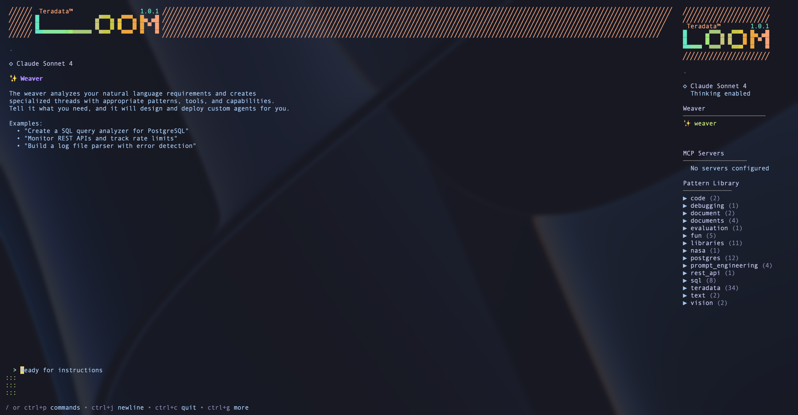

# Loom

An LLM agent framework for Go. Create agents from natural language, orchestrate them with workflow patterns, and improve them through pattern-guided learning.

[](https://github.com/teradata-labs/loom/actions/workflows/ci.yml)
[](https://pkg.go.dev/github.com/teradata-labs/loom)
[](https://opensource.org/licenses/Apache-2.0)
[](https://www.bestpractices.dev/projects/11888)
[](https://github.com/teradata-labs/loom/releases/latest)

**Version**: v1.1.0



---

## Quick Start

```bash
# 1. Install
git clone https://github.com/teradata-labs/loom && cd loom
./quickstart.sh          # macOS/Linux (handles Go, Buf, patterns)
# .\quickstart.ps1       # Windows (PowerShell)

# 2. Set your LLM provider
export ANTHROPIC_API_KEY="your-key"    # or Bedrock, Ollama, OpenAI, etc.

# 3. Start the server
looms serve              # gRPC :60051, HTTP :5006

# 4. Launch the TUI
loom                     # Opens with Guide agent
loom --thread weaver     # Or go straight to the Weaver
```

The **Weaver** is a meta-agent that creates other agents from natural language:

```
You: Create a Teradata query optimizer that analyzes EXPLAIN plans
Weaver: Analyzing requirements... selecting patterns... activating agent.
```

**API endpoints** after `looms serve`:
- **gRPC**: `localhost:60051` (111 RPCs)
- **HTTP/REST**: `localhost:5006` (with SSE streaming)
- **Swagger UI**: `localhost:5006/swagger-ui`
- **MCP Apps**: `localhost:5006/apps/`

---

## How It Works

Instead of prompt engineering, Loom uses **pattern-guided learning**. Domain knowledge is encoded as reusable YAML patterns that agents select and apply based on user intent:

```
User message → Pattern selection (from 104 patterns) → LLM call with context → Tool execution → Response
     ↑                                                                                             |
     └────────────────────── Learning feedback loop (optional) ────────────────────────────────────┘
```

Patterns are plain-English YAML files anyone can write. They turn generic LLMs into domain specialists for SQL optimization, data quality, Teradata analytics, code review, and more.

---

## Features

### Weaver (Meta-Agent)

Describe what you need; the Weaver builds it:
- Analyzes requirements to determine domain and capabilities
- Selects patterns from the library (104 patterns across 17 domains)
- Generates YAML configuration and activates the agent
- Automatically selects workflow patterns for multi-agent tasks
- **/agent-plan mode** for guided requirement gathering with skills-based recommendations

### Multi-Agent Workflows

9 orchestration patterns defined in proto:

| Pattern | Use Case |
|---------|----------|
| **Pipeline** | Sequential stages (ETL, multi-step analysis) |
| **Parallel** | Independent concurrent tasks |
| **Fork-Join** | Parallel execution with merged results |
| **Debate** | Multiple agents argue perspectives, reach consensus |
| **Conditional** | Route based on agent decisions |
| **Swarm** | Dynamic agent collaboration |
| **Iterative** | Pipeline with autonomous restart on failure |
| **Pair Programming** | Two agents collaborate on code |
| **Teacher-Student** | One agent teaches/evaluates another |

### Judge Evaluation System

Multi-judge evaluation with 6 aggregation strategies (weighted-average, all-must-pass, majority-pass, any-pass, min-score, max-score) and 3 execution modes (synchronous, asynchronous, hybrid). Includes DSPy integration for judge optimization.

See [Judge CLI Guide](docs/guides/judge_cli_guide.md).

### Learning Agents

Self-improving agents that analyze successes/failures and propose pattern improvements. Three modes: observation, proposal, and auto-apply. Integrates with [DSPy](https://dspy.ai/) for prompt optimization.

See [Learning Agent Guide](docs/guides/learning-agent-guide.md).

### Pattern Library

104 YAML patterns across 17 domains, installed to `$LOOM_DATA_DIR/patterns/`:

| Domain | Count | Examples |
|--------|-------|----------|
| `teradata/` | 34 | ML models, analytics, data quality, performance, FastLoad |
| `libraries/` | 16 | Domain-specific pattern bundles (sql-core, teradata-analytics, etc.) |
| `postgres/` | 12 | Query optimization, index analysis, vacuum tuning |
| `weaver/` | 9 | Workflow patterns (debate, pipeline, fork-join, swarm, etc.) |
| `sql/` | 8 | Data validation, profiling, duplicate detection |
| `fun/` | 5 | Entertainment patterns |
| `prompt_engineering/` | 4 | Chain-of-thought, few-shot, structured output |
| `documents/` | 4 | PDF extraction, Excel analysis, CSV import |
| Others | 12 | Vision, code, text, debugging, REST API, NASA, evaluation |

Write your own patterns in plain English YAML to make Loom agents into domain experts for your specific use cases.

### MCP Integration

Connect any [MCP server](https://modelcontextprotocol.io/) without code:

```bash
looms config set mcp.servers.github.command /path/to/github-mcp
looms config set mcp.servers.github.env.GITHUB_TOKEN "${GITHUB_TOKEN}"
# MCP servers auto-start with: looms serve
```

**4 built-in MCP UI Apps** served at `/apps/` and as MCP resources (`ui://` scheme):

| App | Description |
|-----|-------------|
| Conversation Viewer | Browse agent conversations, sessions, tool calls |
| Data Chart | Interactive Chart.js visualizations for time-series data |
| EXPLAIN Plan Visualizer | SVG DAG rendering of Teradata EXPLAIN plans with cost coloring |
| Data Quality Dashboard | Completeness, uniqueness, distribution, and outlier analysis |

**Dynamic App Creation**: Agents and MCP clients can create custom dashboards at runtime from a declarative JSON spec with 14 component types (stat cards, charts, tables, heatmaps, DAGs, etc.). Up to 100 dynamic apps, compiled to secure standalone HTML with the Tokyonight Dark theme. See [MCP Apps Guide](docs/guides/mcp-apps-guide.md).

### Built-in Tools

| Tool | Description |
|------|-------------|
| `web_search` | Web search ([Tavily](https://www.tavily.com) or [Brave](https://brave.com/search/api/)) |
| `file_read` / `file_write` | File system operations |
| `http_request` / `grpc_call` | External service calls |
| `shell_execute` | Sandboxed command execution |
| `analyze_image` | Vision analysis (work in progress) |
| `parse_document` | PDF, Excel, CSV extraction (work in progress) |
| `send_message` / `publish` | Inter-agent messaging (event-driven delivery) |
| `shared_memory_read` / `shared_memory_write` | Key-value store for multi-agent shared state |
| `workspace` | Session-scoped artifact management with FTS5 search |
| `conversation_memory` | Query conversation history with recall/search/clear |
| `session_memory` | Persist/restore agent session state with FTS5 search |
| `agent_management` | Spawn, list, pause, resume agents with structured JSON API |
| `contact_human` | Request human-in-the-loop intervention |

### Artifact Management

Session-scoped file storage with SQLite FTS5 full-text search, automatic metadata extraction, soft/hard delete with 30-day recovery, and archive support. See `loom artifacts --help`.

### Skills System

LLM-agnostic activatable behaviors combining prompt injection, tool preferences, and trigger conditions. Skills activate via slash commands (`/skill-name`), keyword auto-detection, or always-on mode. Includes hot-reload via fsnotify and token budget control. See `pkg/skills/`.

### Per-Role LLM Providers

Assign different LLM providers per operational role (judge, orchestrator, classifier, compressor) with automatic fallback to the main agent LLM. Enables cost optimization by using smaller models for classification while reserving larger models for complex reasoning.

### LLM Providers

7 providers, 44 models with mid-session switching:

| Provider | Models |
|----------|--------|
| **Anthropic** | Claude Opus 4.6, Claude Sonnet 4.6, Claude Opus 4.5, Claude Sonnet 4.5, Claude Haiku 4.5, Claude Opus 4.1 |
| **AWS Bedrock** | Claude Opus 4.6, Claude Sonnet 4.6, Claude Opus 4.5, Claude Sonnet 4.5, Claude Haiku 4.5, Claude Opus 4.1 |
| **OpenAI** | GPT-5, GPT-5 Mini, GPT-4.1, GPT-4.1 Mini, GPT-4.1 Nano, o3, o3-mini, o4-mini |
| **Azure OpenAI** | GPT-5, GPT-4.1, GPT-4.1 Mini, o3, o4-mini |
| **Google Gemini** | Gemini 2.5 Pro, Gemini 2.5 Flash, Gemini 2.5 Flash-Lite |
| **Mistral** | Mistral Large, Mistral Small, Magistral Medium, Magistral Small, Codestral, Devstral |
| **Ollama** | Llama 3.3, Llama 3.2, Llama 3.1, Qwen 3, Qwen 2.5, DeepSeek R1, DeepSeek V3, Phi 4, Gemma 3 (+ any local model) |

---

## TUI

The terminal UI (`loom`) is built on [Bubbletea](https://github.com/charmbracelet/bubbletea) with [Crush](https://github.com/charmbracelet/crush)-inspired aesthetics.

- **Guide agent** greets you and helps find the right agent for your task
- **Slash commands** — `/clear`, `/quit`, `/sessions`, `/model`, `/agents`, `/workflows`, `/patterns`, `/help`, and more
- **Sidebar** shows Weaver status, MCP servers, loaded patterns, model info, keyboard hints
- **Mid-session model switching** with cost transparency
- **Multi-agent colors** (6 predefined + golden-ratio generation for 50+ agents)
- **Streaming** with animated progress, tool execution states, cost tracking

**Shortcuts**: `ctrl+e` agents | `ctrl+w` workflows | `ctrl+p` command palette | `ctrl+o` sessions | `ctrl+n` new session

---

## Architecture

```
┌──────────────────┐  ┌──────────────────┐  ┌──────────────────┐
│   loom (TUI)     │  │  looms (server)  │  │  loom-mcp        │
│   Interactive     │  │  gRPC + HTTP     │  │  MCP bridge      │
└────────┬─────────┘  └────────┬─────────┘  └────────┬─────────┘
         │                     │                      │
         └─────────────────────┼──────────────────────┘
                               v
┌──────────────────────────────────────────────────────────────┐
│                      Loom Framework                          │
│  ┌─────────────┐ ┌──────────────┐ ┌────────────┐ ┌────────┐ │
│  │ Agent       │ │ Orchestration│ │ Patterns   │ │ Shuttle│ │
│  │ Runtime     │ │ (9 patterns) │ │ (104 YAML) │ │ (tools)│ │
│  └─────────────┘ └──────────────┘ └────────────┘ └────────┘ │
│  ┌─────────────┐ ┌──────────────┐ ┌────────────┐ ┌────────┐ │
│  │ Judges      │ │ Skills       │ │ MCP Apps   │ │ Comms  │ │
│  │ (6 strats)  │ │ (hot-reload) │ │ (4 apps)   │ │ (3-way)│ │
│  └─────────────┘ └──────────────┘ └────────────┘ └────────┘ │
└──────────────────────────────────────────────────────────────┘
         │                     │                      │
         v                     v                      v
┌──────────────────┐  ┌──────────────────┐  ┌──────────────────┐
│   Observability  │  │  LLM Providers   │  │  SQLite/FTS5     │
│   (self-contained│  │  (7 providers)   │  │  or PostgreSQL   │
│    + Hawk opt.)  │  │                  │  │  (persistence)   │
└──────────────────┘  └──────────────────┘  └──────────────────┘
```

**Proto is law**: All APIs defined in `proto/loom/v1/` first. 111 RPCs covering agents, workflows, patterns, sessions, artifacts, MCP, judges, skills, and scheduling. HTTP/REST via gRPC-gateway.

---

## Installation

### Quickstart (Recommended)

```bash
git clone https://github.com/teradata-labs/loom && cd loom
./quickstart.sh     # macOS/Linux
# .\quickstart.ps1  # Windows
```

Installs Go, Buf, builds binaries, installs 104 patterns, and configures your LLM provider interactively. See [QUICKSTART.md](QUICKSTART.md).

### Manual

```bash
git clone https://github.com/teradata-labs/loom && cd loom
just install        # Builds binaries to ~/.local/bin/, installs patterns
```

### From Source

```bash
go install github.com/teradata-labs/loom/cmd/loom@latest
go install github.com/teradata-labs/loom/cmd/looms@latest
just install-patterns   # Patterns required for Weaver
```

### Upgrading

When upgrading to a new version, run `just upgrade` (build from source) or `looms upgrade` to migrate the database schema:

```bash
# From source: builds new binaries, installs assets, migrates database
just upgrade

# Or run the upgrade command directly
looms upgrade              # Backup + migrate (default)
looms upgrade --dry-run    # Show pending migrations without applying
looms upgrade --backup-only # Create a backup only
looms upgrade --no-backup  # Skip backup (not recommended)
looms upgrade --yes        # Skip confirmation prompt
```

SQLite databases are backed up automatically before migration (via `VACUUM INTO`). Backup files are named with a timestamp suffix (e.g., `loom.db.backup.20260224T153000`). PostgreSQL backends use the same versioned migration system with advisory locks.

```bash
# Create a standalone backup at any time
just backup
```

### Package Managers

**macOS** (Homebrew via `teradata-labs/homebrew-tap`) and **Windows** (Chocolatey, winget) packages are published automatically on each release. Scoop manifests are ready in `packaging/` but not yet published to a bucket.

### Release Verification

Releases are GPG-signed with SLSA provenance starting v1.1.0. See [docs/installation/](docs/installation/) for verification steps.

---

## Documentation

| Topic | Link |
|-------|------|
| Getting Started | [QUICKSTART.md](QUICKSTART.md) |
| Architecture | [docs/architecture/](docs/architecture/) |
| Pattern System | [docs/reference/patterns.md](docs/reference/patterns.md) |
| Backend Implementation | [docs/reference/backend.md](docs/reference/backend.md) |
| HTTP Server & CORS | [docs/reference/http-server.md](docs/reference/http-server.md) |
| Judge System | [docs/guides/judge_cli_guide.md](docs/guides/judge_cli_guide.md) |
| Learning Agents | [docs/guides/learning-agent-guide.md](docs/guides/learning-agent-guide.md) |
| Observability (Hawk) | [docs/guides/integration/observability.md](docs/guides/integration/observability.md) |
| Streaming | [docs/reference/streaming.md](docs/reference/streaming.md) |
| MCP Apps Guide | [docs/guides/mcp-apps-guide.md](docs/guides/mcp-apps-guide.md) |
| MCP Apps Reference | [docs/reference/mcp-apps.md](docs/reference/mcp-apps.md) |
| Supabase Integration | [docs/guides/supabase-integration.md](docs/guides/supabase-integration.md) |
| Database Upgrade | `looms upgrade --help` |
| API Reference | [pkg.go.dev](https://pkg.go.dev/github.com/teradata-labs/loom) |
| Examples | [examples/](examples/) |

---

## Contributing

1. Run `go test -tags fts5 -race ./...` before submitting PRs
2. Follow existing code patterns and proto-first design
3. Add tests for new features
4. See [CONTRIBUTING.md](CONTRIBUTING.md)

---

## Support

- **Issues**: [github.com/teradata-labs/loom/issues](https://github.com/teradata-labs/loom/issues)
- **Security**: security@teradata.com (do not post security issues in GitHub Issues)

---

## Quality

- 3,112 test functions across 319 test files
- All tests run with `-race` detector; 0 race conditions
- CI: proto lint, golangci-lint, race detection, fuzz tests, gosec, CodeQL, multi-platform build

---

## License

Apache 2.0 - see [LICENSE](LICENSE)

Built by Teradata Labs
