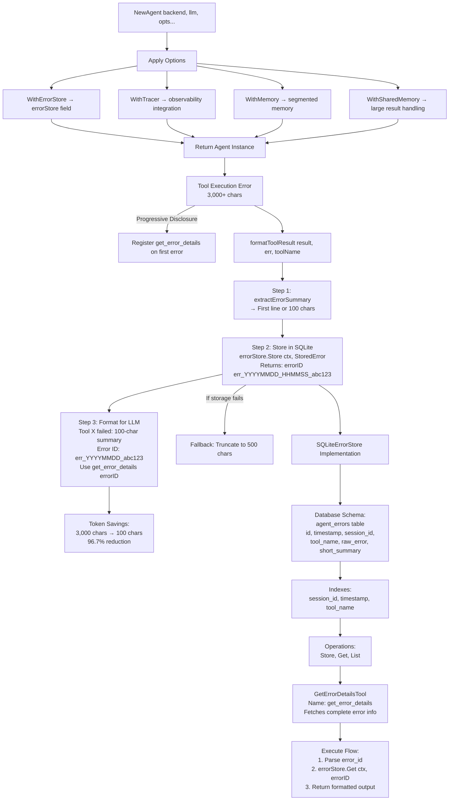
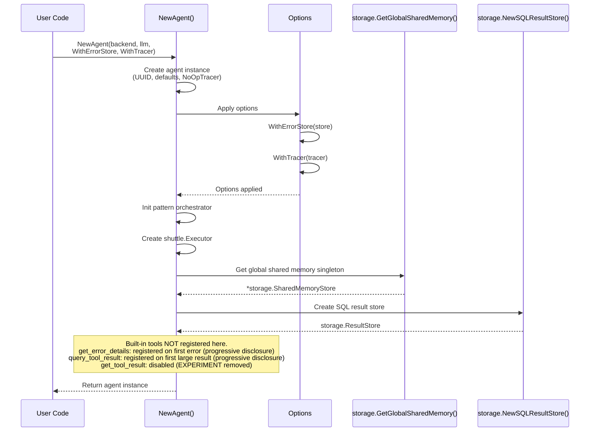
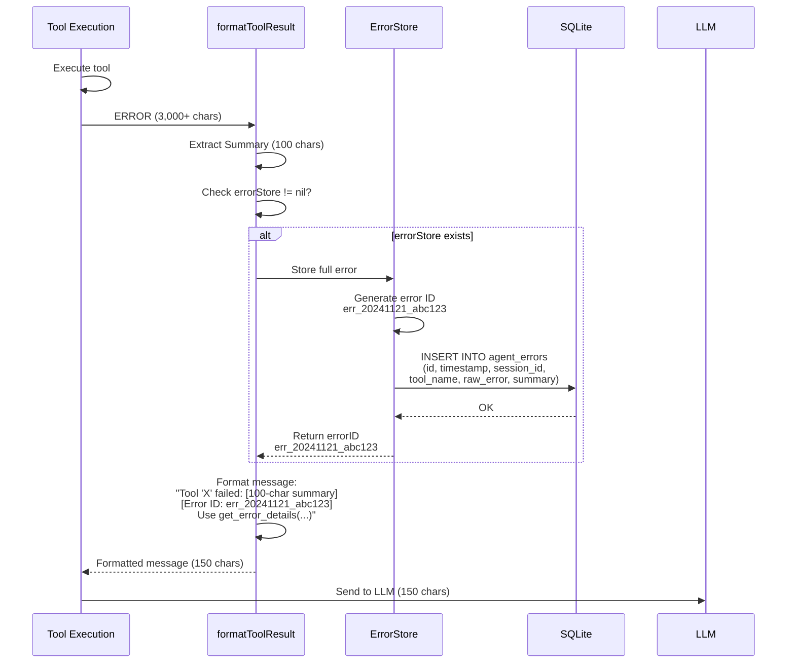
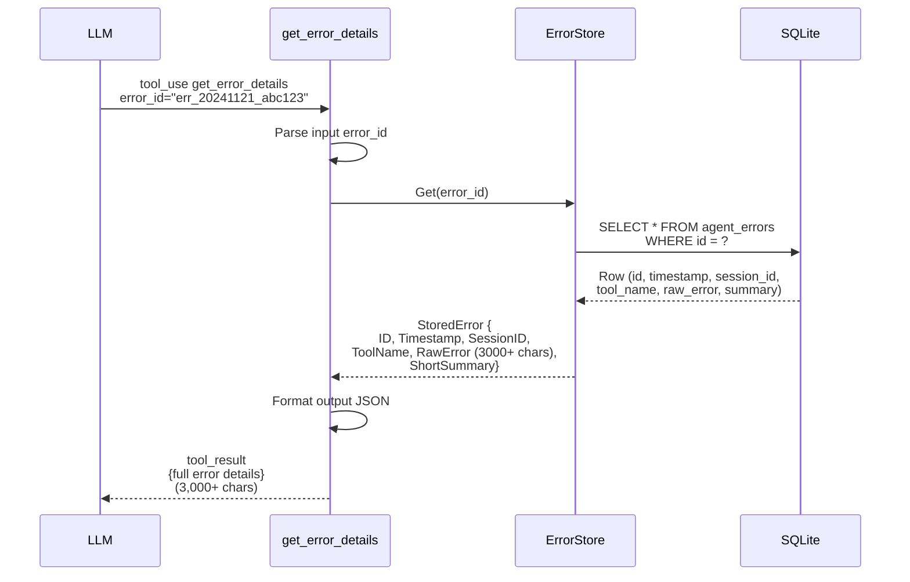
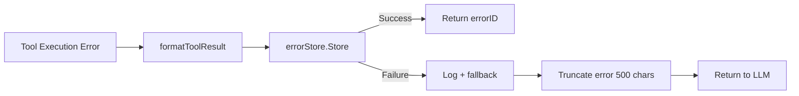

# Agent Runtime Architecture

Architecture of Loom's agent runtime system with Error Submission Channel, built-in tool registration, and runtime lifecycle management.

**Target Audience**: Architects, academics, and advanced developers

**Version**: v1.2.0


## Table of Contents

- [Overview](#overview)
- [Design Goals](#design-goals)
- [System Context](#system-context)
- [Architecture Overview](#architecture-overview)
- [Components](#components)
  - [Agent Runtime](#agent-runtime)
  - [Error Submission Channel](#error-submission-channel)
  - [Built-in Tool Registry](#built-in-tool-registry)
  - [Lifecycle Manager](#lifecycle-manager)
- [Key Interactions](#key-interactions)
  - [Agent Initialization Flow](#agent-initialization-flow)
  - [Error Submission Flow](#error-submission-flow)
  - [Error Retrieval Flow](#error-retrieval-flow)
- [Data Structures](#data-structures)
- [Algorithms](#algorithms)
  - [Error Summary Extraction](#error-summary-extraction)
  - [Error ID Generation](#error-id-generation)
- [Design Trade-offs](#design-trade-offs)
- [Constraints and Limitations](#constraints-and-limitations)
- [Performance Characteristics](#performance-characteristics)
- [Concurrency Model](#concurrency-model)
- [Error Handling](#error-handling)
- [Security Considerations](#security-considerations)
- [Related Work](#related-work)
- [References](#references)
- [Further Reading](#further-reading)


## Overview

The Agent Runtime system provides **lifecycle management, error handling, and built-in tool registration** for Loom agents. The centerpiece is the **Error Submission Channel**, a progressive disclosure system that stores verbose errors (3,000+ characters with stack traces) in SQLite while sending lightweight summaries (100 characters) to LLMs.

**Key Innovation**: Progressive error disclosure with automatic fallback - store full errors locally, send summaries to LLM, provide on-demand retrieval via built-in `get_error_details` tool.

**Problem Solved**: Tool execution errors can be extremely verbose (3,000+ character stack traces), wasting thousands of tokens and potentially crashing LLM providers with oversized context windows. Traditional truncation loses critical debugging information.

**Solution**: Store full errors in SQLite with unique IDs (e.g., `err_20241121_230334_abc123`), send 100-character summaries to LLM with error references, auto-register `get_error_details` tool for on-demand retrieval.


## Design Goals

1. **Progressive Disclosure**: Send error summaries (100 chars) by default, full details on-demand
2. **Token Efficiency**: 50x space savings (100 chars vs 3,000+ char stack traces)
3. **Zero Token Waste**: LLMs see full errors only when explicitly needed
4. **Graceful Fallback**: Falls back to truncation if error store unavailable
5. **Flexible Storage**: json.RawMessage (no rigid schema requirements for error formats)
6. **Thread Safety**: RWMutex for concurrent error storage/retrieval
7. **Observability**: All error operations traced to Hawk

**Non-goals**:
- Real-time error streaming (batch storage is sufficient)
- Distributed error aggregation (single-agent focus)
- Custom error schemas (flexible json.RawMessage approach)


## System Context

```mermaid
graph TB
    subgraph External["External Environment"]
        AgentRT[Agent Runtime]
        LLM[LLM Provider]
        SQLite[SQLite Storage]
        Hawk[Hawk Traces]
        Tools[Tool Executors]
    end

    subgraph AgentSystem["Agent Runtime System"]
        Core[Agent Runtime Core<br/>• NewAgent initialization<br/>• Option pattern config<br/>• Built-in tool registration<br/>• Lifecycle management]
        ErrorChannel[Error Submission Channel<br/>• SQLiteErrorStore persistence<br/>• extractErrorSummary 100-char<br/>• Error ID generation<br/>• GetErrorDetailsTool retrieval]
        ToolRegistry[Built-in Tool Registry<br/>• get_error_details (progressive disclosure)<br/>• query_tool_result (progressive disclosure)<br/>• conversation_memory (progressive disclosure)]
    end

    AgentRT --> Core
    LLM --> Core
    Core --> ErrorChannel
    ErrorChannel --> SQLite
    ErrorChannel --> ToolRegistry
    Core --> Hawk
    Tools --> ErrorChannel
```

**External Dependencies**:
- **SQLite**: Error persistence (agent_errors table)
- **LLM Provider**: Receives error summaries, calls get_error_details
- **Hawk**: Observability tracing for all error operations
- **Tool Executor**: Generates tool execution errors


## Architecture Overview




## Components

### Agent Runtime

**Responsibility**: Lifecycle management and configuration of agent instances via functional options pattern.

**Core Structure** (`pkg/agent/types.go`):

Note: The following is a representative subset of Agent fields. See `pkg/agent/types.go` for the full definition.

```go
type Agent struct {
    id             string                  // Unique agent identifier (UUID v4)
    mu             sync.RWMutex            // Thread safety
    backend        fabric.ExecutionBackend // SQL, REST, Document backends
    tools          *shuttle.Registry       // Tool registry (shuttle.NewRegistry())
    executor       *shuttle.Executor       // Tool executor
    memory         *Memory                 // Conversation history (agent-internal Memory manager)
    errorStore     ErrorStore              // Error submission channel
    llm            LLMProvider             // Primary LLM provider
    judgeLLM       LLMProvider             // Role-specific: evaluation
    orchestratorLLM LLMProvider            // Role-specific: merge/synthesis
    classifierLLM  LLMProvider             // Role-specific: intent classification
    compressorLLM  LLMProvider             // Role-specific: memory compression
    tracer         observability.Tracer    // Hawk integration
    prompts        prompts.PromptRegistry  // Prompt registry
    config         *Config                 // Agent configuration
    sharedMemory   *storage.SharedMemoryStore // Large result storage (global singleton)
    // ... additional fields omitted for brevity
}
```

**Initialization Pattern** (`pkg/agent/agent.go`):
```go
func NewAgent(backend fabric.ExecutionBackend, llmProvider LLMProvider, opts ...Option) *Agent {
    a := &Agent{
        id:           uuid.New().String(),
        backend:      backend,
        llm:          llmProvider,
        tools:        shuttle.NewRegistry(),
        memory:       NewMemory(),
        config:       DefaultConfig(),
        tracer:       observability.NewNoOpTracer(), // Default no-op
        tokenCounter: GetTokenCounter(),
    }

    // Apply functional options
    for _, opt := range opts {
        opt(a)
    }

    // PROGRESSIVE DISCLOSURE: get_error_details is NOT registered here.
    // It is registered dynamically in formatToolResult() after the first error.
    //
    // get_tool_result is also removed (EXPERIMENT comment in agent.go).
    // Inline metadata makes it unnecessary; agents use query_tool_result instead.

    // ... (pattern orchestrator, executor, shared memory, SQL result store init omitted)

    return a
}
```

**Functional Options** (`pkg/agent/agent.go`):
```go
type Option func(*Agent)

// Core options
func WithTracer(tracer observability.Tracer) Option
func WithMemory(memory *Memory) Option           // Agent's internal Memory manager
func WithConfig(config *Config) Option
func WithPrompts(registry prompts.PromptRegistry) Option

// Error submission channel
func WithErrorStore(store ErrorStore) Option {
    return func(a *Agent) {
        a.errorStore = store
        // get_error_details registered via progressive disclosure in formatToolResult()
    }
}

// Large result handling (accepts interface{} for flexibility, type-asserts to *storage.SharedMemoryStore)
func WithSharedMemory(sharedMemory interface{}) Option {
    return func(a *Agent) {
        if sm, ok := sharedMemory.(*storage.SharedMemoryStore); ok {
            a.sharedMemory = sm
        }
    }
}
```

Note: `WithLogger` and `WithSessionStore` do not exist as options. The Agent struct does not have a `logger` field. Shared memory is initialized as a global singleton inside `NewAgent` via `storage.GetGlobalSharedMemory()`.

**Rationale**:
- **Functional options**: Flexible configuration without breaking API
- **Conditional tool registration**: Built-in tools only registered when dependencies available
- **Thread safety**: RWMutex protects concurrent agent operations
- **Pluggable dependencies**: Backend, LLM, memory, tracing all configurable


### Error Submission Channel

**Responsibility**: Progressive disclosure system for verbose tool execution errors with SQLite persistence and on-demand retrieval.

**Core Interface** (`pkg/agent/error_store.go`):
```go
type ErrorStore interface {
    Store(ctx context.Context, err *StoredError) (string, error) // Returns errorID
    Get(ctx context.Context, errorID string) (*StoredError, error)
    List(ctx context.Context, filters ErrorFilters) ([]*StoredError, error)
    Close() error // Release resources held by the error store
}
```

**StoredError Structure** (`pkg/agent/error_store.go`):
```go
type StoredError struct {
    ID           string          // err_YYYYMMDD_HHMMSS_<random>
    Timestamp    time.Time       // When error occurred
    SessionID    string          // Session context
    ToolName     string          // Tool that failed
    RawError     json.RawMessage // Original error (flexible format)
    ShortSummary string          // First line or 100 chars
}
```

**SQLiteErrorStore Implementation** (`pkg/agent/error_store.go`):
```go
type SQLiteErrorStore struct {
    db     *sql.DB
    mu     sync.RWMutex       // Thread-safe operations
    tracer observability.Tracer
}

func NewSQLiteErrorStore(dbPath string, tracer observability.Tracer) (*SQLiteErrorStore, error) {
    db, err := sql.Open("sqlite3", dbPath)
    if err != nil {
        return nil, fmt.Errorf("failed to open database: %w", err)
    }

    // Enable WAL mode for better concurrency
    if _, err := db.Exec("PRAGMA journal_mode=WAL"); err != nil {
        return nil, fmt.Errorf("failed to enable WAL mode: %w", err)
    }

    store := &SQLiteErrorStore{db: db, tracer: tracer}
    if err := store.initSchema(); err != nil { // Create agent_errors table
        return nil, fmt.Errorf("failed to initialize error store schema: %w", err)
    }
    return store, nil
}
```

**Database Schema** (`pkg/agent/error_store.go`):
```sql
CREATE TABLE IF NOT EXISTS agent_errors (
    id TEXT PRIMARY KEY,              -- err_YYYYMMDD_HHMMSS_<random>
    timestamp INTEGER NOT NULL,       -- Unix timestamp
    session_id TEXT NOT NULL,         -- Session context
    tool_name TEXT NOT NULL,          -- Tool identifier
    raw_error TEXT NOT NULL,          -- Full error as JSON
    short_summary TEXT NOT NULL       -- 100-char summary
);

CREATE INDEX IF NOT EXISTS idx_agent_errors_session ON agent_errors(session_id);
CREATE INDEX IF NOT EXISTS idx_agent_errors_timestamp ON agent_errors(timestamp);
CREATE INDEX IF NOT EXISTS idx_agent_errors_tool ON agent_errors(tool_name);
```

**Store Operation** (`pkg/agent/error_store.go`):
```go
func (s *SQLiteErrorStore) Store(ctx context.Context, err *StoredError) (string, error) {
    ctx, span := s.tracer.StartSpan(ctx, "error_store.store")
    defer s.tracer.EndSpan(span)

    s.mu.Lock()
    defer s.mu.Unlock()

    // Generate unique error ID: err_YYYYMMDD_HHMMSS_<6-char-random>
    now := time.Now()
    randomSuffix := generateRandomString(6) // Cryptographic random
    errorID := fmt.Sprintf("err_%s_%s",
        now.Format("20060102_150405"),
        randomSuffix)

    err.ID = errorID
    err.Timestamp = now

    // Ensure raw_error is valid JSON
    rawErrorJSON := string(err.RawError)
    if !isValidJSON(rawErrorJSON) {
        // Wrap non-JSON errors
        rawErrorJSON = fmt.Sprintf(`{"message": %q}`, rawErrorJSON)
    }

    // Insert into database
    _, execErr := s.db.ExecContext(ctx,
        `INSERT INTO agent_errors (id, timestamp, session_id, tool_name, raw_error, short_summary)
         VALUES (?, ?, ?, ?, ?, ?)`,
        err.ID, err.Timestamp.Unix(), err.SessionID, err.ToolName, rawErrorJSON, err.ShortSummary)

    if execErr != nil {
        span.RecordError(execErr)
        return "", execErr
    }

    span.AddEvent("error_stored", map[string]interface{}{
        "error_id":   errorID,
        "tool_name":  err.ToolName,
        "session_id": err.SessionID,
    })

    return errorID, nil
}
```

**Get Operation** (`pkg/agent/error_store.go`):
```go
func (s *SQLiteErrorStore) Get(ctx context.Context, errorID string) (*StoredError, error) {
    ctx, span := s.tracer.StartSpan(ctx, "error_store.get")
    defer s.tracer.EndSpan(span)

    span.AddEvent("lookup_error", map[string]interface{}{
        "error_id": errorID,
    })

    s.mu.RLock()
    defer s.mu.RUnlock()

    var stored StoredError
    var timestamp int64
    var rawError string

    err := s.db.QueryRowContext(ctx,
        `SELECT id, timestamp, session_id, tool_name, raw_error, short_summary
         FROM agent_errors WHERE id = ?`,
        errorID,
    ).Scan(&stored.ID, &timestamp, &stored.SessionID, &stored.ToolName, &rawError, &stored.ShortSummary)

    if err == sql.ErrNoRows {
        return nil, fmt.Errorf("error not found: %s", errorID)
    }
    if err != nil {
        span.RecordError(err)
        return nil, fmt.Errorf("failed to query error: %w", err)
    }

    stored.Timestamp = time.Unix(timestamp, 0)
    stored.RawError = json.RawMessage(rawError)

    return &stored, nil
}
```

**Integration with Tool Execution** (`pkg/agent/agent.go`):
```go
func (a *Agent) formatToolResult(ctx Context, sessionID string, toolName string, result *shuttle.Result, err error) string {
    // Handle execution errors (tool didn't run)
    if err != nil {
        errMsg := fmt.Sprintf("%v", err)
        summary := extractFirstLine(errMsg, 100)

        if a.errorStore != nil {
            // Store full error in SQLite
            errorID, storeErr := a.errorStore.Store(ctx, &StoredError{
                SessionID:    sessionID,
                ToolName:     toolName,
                RawError:     json.RawMessage(fmt.Sprintf(`{"message": %q}`, errMsg)),
                ShortSummary: summary,
            })

            if storeErr == nil {
                // Return summary + reference
                return fmt.Sprintf(`Tool '%s' failed: %s
[Error ID: %s]
📋 Use get_error_details("%s") for complete error information`,
                    toolName, summary, errorID, errorID)
            }
        }

        // Fallback: truncate if error store unavailable
        return fmt.Sprintf("Error: %s", truncateErrorMessage(errMsg, 500))
    }

    // Handle tool execution errors (tool ran but failed)
    if !result.Success {
        if result.Error != nil {
            rawError, _ := json.Marshal(result.Error)
            summary := extractErrorSummary(result.Error)

            if a.errorStore != nil {
                errorID, storeErr := a.errorStore.Store(ctx, &StoredError{
                    SessionID:    sessionID,
                    ToolName:     toolName,
                    RawError:     rawError,
                    ShortSummary: summary,
                })

                if storeErr == nil {
                    return fmt.Sprintf(`Tool '%s' failed: %s
[Error ID: %s]
📋 Use get_error_details tool with error_id="%s" for complete error information`,
                        toolName, summary, errorID, errorID)
                }
            }

            // Fallback: truncate
            return fmt.Sprintf("Tool error: %s - %s", result.Error.Code, truncateErrorMessage(result.Error.Message, 500))
        }
        return "Tool execution failed"
    }

    // Success: return result data (may store as reference if large)
    // ... (large result handling, shared memory storage omitted for brevity)
    return fmt.Sprintf("%v", result.Data)
}
```

**Rationale**:
- **Progressive disclosure**: LLM sees 100-char summary by default, retrieves full error only when needed
- **Token efficiency**: 50x space savings (100 chars vs 3,000+ char stack traces)
- **Flexible storage**: json.RawMessage accommodates any error format (no rigid schema)
- **Graceful fallback**: Falls back to truncation if error store unavailable
- **Thread safety**: RWMutex for concurrent storage/retrieval operations
- **Observability**: All operations traced to Hawk with error_id, tool_name attributes


### Built-in Tool Registry

**Responsibility**: Progressive disclosure of system tools. Built-in tools are NOT registered at agent creation time. They are registered dynamically when their trigger condition is met:

- `get_error_details`: registered after the first tool execution error (requires error store)
- `query_tool_result`: registered after the first large result is stored in shared memory (requires SQL result store)
- `conversation_memory`: registered after the first L2 swap event (unified recall/search/clear)
- `get_tool_result`: disabled (EXPERIMENT removed; inline metadata makes it unnecessary)
- `record_finding`: removed (replaced by automatic finding extraction via LLM)

**GetErrorDetailsTool** (`pkg/agent/builtin_tools.go`):
```go
type GetErrorDetailsTool struct {
    store ErrorStore
}

func NewGetErrorDetailsTool(store ErrorStore) *GetErrorDetailsTool {
    return &GetErrorDetailsTool{store: store}
}

func (t *GetErrorDetailsTool) Name() string {
    return "get_error_details"
}

func (t *GetErrorDetailsTool) Description() string {
    return `Fetches complete error information for a previously failed tool execution.

Use this when you need the full error message, stack trace, or detailed debugging information
that was omitted from the error summary. Most errors can be handled with just the summary -
only use this for complex debugging scenarios.

Input:
- error_id: The error ID from a tool failure message (e.g., "err_20241121_230334_abc123")

Output:
- error_id: The error ID
- timestamp: When the error occurred (RFC3339 format)
- tool_name: Name of the tool that failed
- short_summary: Brief summary of the error
- raw_error: Complete original error message including stack traces

Example usage:
When you see: "Tool 'teradata_sample_table' failed: Code 3523: Permission denied [Error ID: err_20241121_abc123]"
You can call: get_error_details(error_id="err_20241121_abc123") to get the full stack trace.`
}

func (t *GetErrorDetailsTool) InputSchema() *shuttle.JSONSchema {
    return &shuttle.JSONSchema{
        Type: "object",
        Properties: map[string]*shuttle.JSONSchema{
            "error_id": {
                Type:        "string",
                Description: "The error ID from a failed tool execution (e.g., 'err_20241121_abc123')",
            },
        },
        Required: []string{"error_id"},
    }
}

func (t *GetErrorDetailsTool) Execute(ctx context.Context, input map[string]interface{}) (*shuttle.Result, error) {
    errorID, ok := input["error_id"].(string)
    if !ok {
        return &shuttle.Result{
            Success: false,
            Error: &shuttle.Error{
                Code:    "invalid_input",
                Message: fmt.Sprintf("error_id must be a string, got type=%T", input["error_id"]),
            },
        }, nil
    }

    // Retrieve error from store
    stored, err := t.store.Get(ctx, errorID)
    if err != nil {
        return &shuttle.Result{
            Success: false,
            Error: &shuttle.Error{
                Code:    "not_found",
                Message: fmt.Sprintf("Error %s not found. It may have been deleted or the ID is incorrect.", errorID),
            },
        }, nil
    }

    // Return full error details
    return &shuttle.Result{
        Success: true,
        Data: map[string]interface{}{
            "error_id":      stored.ID,
            "timestamp":     stored.Timestamp.Format("2006-01-02T15:04:05Z07:00"), // RFC3339
            "tool_name":     stored.ToolName,
            "short_summary": stored.ShortSummary,
            "raw_error":     string(stored.RawError),
        },
    }, nil
}
```

**Progressive Disclosure Registration** (`pkg/agent/agent.go`):

`get_error_details` is NOT registered in `NewAgent()`. Instead, it is registered dynamically in `formatToolResult()` after the first tool execution error occurs:

```go
// In formatToolResult(), when an error is stored:
if !a.tools.IsRegistered("get_error_details") {
    errorTool := shuttle.Tool(NewGetErrorDetailsTool(a.errorStore))
    if a.prompts != nil {
        errorTool = shuttle.NewPromptAwareTool(errorTool, a.prompts, "tools.get_error_details")
    }
    a.tools.Register(errorTool)
}
```

Similarly, `get_tool_result` is commented out (marked as EXPERIMENT removed in `agent.go`). Inline metadata now makes it unnecessary; agents use `query_tool_result` for advanced querying.

**Rationale**:
- **Conditional registration**: Built-in tools only registered when dependencies available
- **Zero configuration**: LLM automatically has access to get_error_details when error store configured
- **Separation of concerns**: Built-in tools separate from user-defined tools
- **Consistent interface**: Built-in tools use same shuttle.Tool interface as user tools


### Lifecycle Manager

**Responsibility**: Agent instance lifecycle management (initialization, execution, cleanup).

**Initialization**:
```go
// Agent with error store and tracing
store, _ := agent.NewSQLiteErrorStore("./sessions.db", tracer)

a := agent.NewAgent(backend, llm,
    agent.WithErrorStore(store),
    agent.WithTracer(tracer),
    agent.WithConfig(config),
)
// Note: SharedMemory is initialized as a global singleton inside NewAgent
// via storage.GetGlobalSharedMemory(). No explicit WithSharedMemory() call needed.
```

**Execution**: Agent lifecycle during conversation loop (see Agent System Architecture doc for details)

**Cleanup**:
```go
// Graceful shutdown: flush tracer, close error store
tracer.Flush(ctx) // Flush pending traces/metrics
store.Close()     // Close error store SQLite connection
```

Note: The Agent itself does not have `Flush()` or `Close()` methods. Callers are responsible for flushing the tracer and closing the error store directly.

**Rationale**:
- **Straightforward lifecycle**: Agent construction via `NewAgent` with functional options
- **Tracer flush on shutdown**: Ensures traces/metrics exported before exit
- **Resource cleanup**: Defer statements in conversation loop ensure cleanup on error


## Key Interactions

### Agent Initialization Flow



**Configuration Example**:
```go
// Minimal agent (no error store)
minimalAgent := agent.NewAgent(backend, llm)
// Result: No error-related built-in tools. SharedMemory still initialized as global singleton.

// Agent with error submission channel
store, _ := agent.NewSQLiteErrorStore("./sessions.db", tracer)
fullAgent := agent.NewAgent(backend, llm,
    agent.WithErrorStore(store),
    agent.WithTracer(tracer),
)
// Result: get_error_details registered via progressive disclosure on first error
// SharedMemory initialized automatically inside NewAgent (global singleton)
```


### Error Submission Flow



**Token Savings**:

| Approach | Full Error | Sent to LLM | Information Loss | Retrievability |
|----------|------------|-------------|------------------|----------------|
| **Before (Truncation)** | 3,000 chars | 500 chars | 83% | None |
| **After (Error Channel)** | 3,000 chars (stored) | 100 chars | 0% | Via get_error_details |

**Savings**: 96.7% token reduction with 0% information loss


### Error Retrieval Flow



**Typical LLM Workflow**:

1. **Tool execution fails**
   - LLM receives: `"Tool 'X' failed: Connection timeout [Error ID: err_20241121_abc123]"`

2. **LLM analysis (most common case)**
   - Summary sufficient: "Connection timeout suggests network issue, retrying..."
   - No `get_error_details` call

3. **Complex debugging scenario**
   - LLM calls: `get_error_details(error_id="err_20241121_abc123")`
   - Receives: Full 3,000-character stack trace with TCP error codes, timeouts, retry attempts
   - Analysis: "TCP handshake failed at 192.168.1.5:1025, firewall blocking port?"


## Data Structures

### StoredError

**Definition** (`pkg/agent/error_store.go`):
```go
type StoredError struct {
    ID           string          // err_YYYYMMDD_HHMMSS_<random>
    Timestamp    time.Time       // When the error occurred
    SessionID    string          // Session that encountered this error
    ToolName     string          // Name of the tool that failed
    RawError     json.RawMessage // Original error in any format (no assumptions about structure)
    ShortSummary string          // First line or 100 chars for quick reference
}
```

**Invariants**:
```
len(ID) = 28 (err_ + 15 digit timestamp + _ + 6 random hex chars)
len(ShortSummary) <= 100 chars
RawError is valid JSON (enforced by Store())
Timestamp > 0 (set on Store())
```


### ErrorFilters

**Definition** (`pkg/agent/error_store.go`):
```go
type ErrorFilters struct {
    SessionID string    // Filter by session
    ToolName  string    // Filter by tool
    StartTime time.Time // Time range start
    EndTime   time.Time // Time range end
    Limit     int       // Max results (0 = unlimited)
}
```

**Usage**:
```go
// Get all errors for session
errors, _ := store.List(ctx, ErrorFilters{
    SessionID: "sess_xyz789",
    Limit:     10,
})

// Get recent errors for specific tool
errors, _ := store.List(ctx, ErrorFilters{
    ToolName:  "teradata_execute_sql",
    StartTime: time.Now().Add(-1 * time.Hour),
    Limit:     5,
})
```


## Algorithms

### Error Summary Extraction

**Problem**: Extract readable 100-character summary from any error format (shuttle.Error, Go error, plain string).

**Solution**: Best-effort extraction with fallback to first line or truncation.

**Algorithm** (`pkg/agent/error_store.go`):
```go
func extractErrorSummary(err interface{}) string {
    switch e := err.(type) {
    case *shuttle.Error:
        // Structured tool error
        if e.Code != "" {
            firstLine := extractFirstLine(e.Message, 80)
            return fmt.Sprintf("Code %s: %s", e.Code, firstLine)
        }
        return extractFirstLine(e.Message, 100)

    case error:
        // Standard Go error
        return extractFirstLine(e.Error(), 100)

    case string:
        // Raw string error
        return extractFirstLine(e, 100)

    default:
        // Unknown format
        return extractFirstLine(fmt.Sprintf("%v", e), 100)
    }
}

func extractFirstLine(s string, maxLen int) string {
    // Find first newline
    if idx := strings.Index(s, "\n"); idx > 0 && idx < maxLen {
        return s[:idx]
    }

    // No newline found or newline beyond maxLen
    if len(s) <= maxLen {
        return s
    }

    return s[:maxLen] + "..."
}
```

**Complexity**: O(n) where n = min(error length, 100 chars)

**Examples**:
```
Input:  shuttle.Error{Code: "SQL_ERROR", Message: "Syntax error near 'FROM'\nQuery: SELECT * FROM"}
Output: "Code SQL_ERROR: Syntax error near 'FROM'"

Input:  error("connection timeout after 30 seconds\nTCP handshake failed\n...")
Output: "connection timeout after 30 seconds"

Input:  "Short error"
Output: "Short error"

Input:  "Very long error message that exceeds one hundred characters and needs truncation for context window efficiency"
Output: "Very long error message that exceeds one hundred characters and needs truncation for context wi..."
```


### Error ID Generation

**Problem**: Generate unique, human-readable error IDs with timestamp prefix for easy sorting/debugging.

**Solution**: Format `err_YYYYMMDD_HHMMSS_<6-char-random>` using cryptographic randomness.

**Algorithm** (`pkg/agent/error_store.go`):
```go
func (s *SQLiteErrorStore) Store(ctx context.Context, err *StoredError) (string, error) {
    now := time.Now()
    randomSuffix, randErr := generateRandomString(6) // Crypto random hex
    if randErr != nil {
        return "", fmt.Errorf("failed to generate random ID suffix: %w", randErr)
    }

    errorID := fmt.Sprintf("err_%s_%s",
        now.Format("20060102_150405"), // YYYYMMDD_HHMMSS
        randomSuffix)                   // 6 hex chars

    // Result: err_20241121_230334_abc123
    // ... (INSERT INTO agent_errors follows)
    return errorID, nil
}

func generateRandomString(length int) (string, error) {
    bytes := make([]byte, length/2+1)
    if _, err := rand.Read(bytes); err != nil { // crypto/rand
        return "", err
    }
    return hex.EncodeToString(bytes)[:length], nil
}
```

**Complexity**: O(1) - fixed length operations

**Properties**:
- **Unique**: 16^6 = 16.7M random suffixes per second
- **Sortable**: Timestamp prefix enables chronological sorting
- **Human-readable**: Copy-pasteable, grep-friendly format
- **Collision probability**: ~1 in 16.7M for errors in same second

**Examples**:
```
err_20241121_230334_abc123  (Nov 21 2024, 23:03:34)
err_20241121_230334_def456  (Same second, different suffix)
err_20241121_230335_789xyz  (Next second)
```


## Design Trade-offs

### Decision 1: SQLite vs. In-Memory Error Store

**Chosen**: SQLite persistence

**Rationale**:
- **Persistence**: Errors survive agent restarts for debugging
- **Queryability**: SQL filters (session_id, tool_name, timestamp) for analytics
- **Concurrency**: WAL mode handles concurrent read/write (RWMutex + SQLite WAL)
- **Minimal overhead**: 5-15ms write latency acceptable for error handling path

**Alternatives**:
1. **In-memory store** (map[string]*StoredError):
   - ✅ Faster: <1ms lookup vs 5-15ms SQLite
   - ❌ No persistence: Errors lost on restart
   - ❌ No queryability: Manual filtering required

2. **External database** (Postgres, MySQL):
   - ✅ Durable persistence with replication
   - ❌ Network overhead: 50-200ms latency
   - ❌ External dependency: Complicates deployment

**Consequences**:
- ✅ Errors persist across agent restarts
- ✅ SQL analytics (error frequency by tool, session patterns)
- ✅ Same database as SessionStore (shared sessions.db)
- ❌ 5-15ms write latency (acceptable for error path)


### Decision 2: 100-Character Summary vs. Configurable Length

**Chosen**: Fixed 100-character summary

**Rationale**:
- **Token budget**: 100 chars ≈ 25 tokens (predictable cost)
- **Readability**: 100 chars fits in terminal width (80-120 chars standard)
- **Information density**: First line of error usually most informative
- **Simplicity**: No configuration complexity

**Alternatives**:
1. **Configurable summary length** (50-500 chars):
   - ✅ Flexibility: Tune token usage per deployment
   - ❌ Complexity: Extra configuration parameter
   - ❌ Unpredictable costs: Token usage varies across agents

2. **Smart truncation** (LLM-powered summarization):
   - ✅ Better summaries: LLM extracts key information
   - ❌ Cost: Extra LLM call per error (~$0.001)
   - ❌ Latency: 500-1000ms vs <1ms substring

**Consequences**:
- ✅ Predictable token usage (25 tokens per error summary)
- ✅ Minimal implementation (substring, no configuration)
- ❌ Fixed length may truncate important context (mitigated by get_error_details)


### Decision 3: Automatic Fallback vs. Strict Enforcement

**Chosen**: Automatic fallback to truncation if error store unavailable

**Rationale**:
- **Graceful degradation**: Agent continues working if error store fails
- **Developer experience**: No cryptic failures during development
- **Backwards compatibility**: Agents without error store still function

**Alternatives**:
1. **Strict enforcement** (fail if error store configured but unavailable):
   - ✅ Clear failures: Immediate feedback if error store misconfigured
   - ❌ Brittle: Single failure point breaks entire agent
   - ❌ Development friction: Must configure error store even for testing

2. **No fallback** (error store required):
   - ✅ Consistent behavior: Always use error submission channel
   - ❌ Inflexible: Cannot disable error store for lightweight agents

**Consequences**:
- ✅ Agent never fails due to error store issues
- ✅ Development-friendly: Error store is optional
- ❌ Silent degradation: Truncation fallback may go unnoticed (mitigated by logging)


## Constraints and Limitations

### Constraint 1: SQLite-Only Persistence

**Description**: Error store only supports SQLite backend (no Postgres, MySQL, etc.).

**Rationale**: Same database as SessionStore for simplicity.

**Impact**: Multi-agent deployments with shared database require SQLite WAL mode or external database.

**Workaround**: Implement ErrorStore interface for Postgres/MySQL if needed.


### Constraint 2: No Automatic Error Cleanup

**Description**: Errors persist indefinitely (no TTL or automatic deletion).

**Rationale**: Debugging requires historical errors; cleanup is deployment-specific.

**Impact**: `agent_errors` table grows unbounded over time.

**Workaround**: Manual cleanup via SQL:
```sql
DELETE FROM agent_errors WHERE timestamp < unixepoch() - 2592000; -- 30 days
```


### Constraint 3: 100-Character Summary Limit

**Description**: Error summaries truncated to 100 characters (not configurable).

**Rationale**: Predictable token usage, terminal-friendly width.

**Impact**: Complex errors may lose critical context in summary.

**Workaround**: LLM calls get_error_details for full information.


## Performance Characteristics

### Latency (P50/P99)

| Operation | P50 | P99 | Notes |
|-----------|-----|-----|-------|
| extractErrorSummary | <1µs | 5µs | String operations (substring, first line) |
| generateRandomString | 10µs | 50µs | Crypto random (6 bytes) |
| ErrorStore.Store | 5ms | 15ms | SQLite INSERT with 3 indexes |
| ErrorStore.Get | 3ms | 10ms | SQLite SELECT by primary key |
| ErrorStore.List | 10ms | 50ms | SQLite SELECT with filters (session, tool, time) |
| get_error_details Execute | 5ms | 20ms | ErrorStore.Get + JSON formatting |

### Memory Usage

| Component | Size |
|-----------|------|
| StoredError struct | ~500 bytes (ID, timestamps, 100-char summary, json.RawMessage pointer) |
| SQLiteErrorStore | ~10KB (db connection, RWMutex, tracer) |
| **Total per agent** | **~10KB** (if error store configured) |

### Storage

| Data | Size |
|------|------|
| StoredError row (SQLite) | ~1KB (indexes + TEXT columns) |
| 1,000 errors | ~1MB |
| 1,000,000 errors | ~1GB |

### Throughput

- **Error storage**: 200 errors/s (SQLite write throughput)
- **Error retrieval**: 1000 errors/s (SQLite read throughput)


## Concurrency Model

### ErrorStore Thread Safety

**Model**: RWMutex for reader-writer lock (concurrent reads, exclusive writes)

**Synchronization**:
```go
type SQLiteErrorStore struct {
    mu sync.RWMutex // Thread safety
}

func (s *SQLiteErrorStore) Store(...) (...) {
    s.mu.Lock()         // Exclusive write
    defer s.mu.Unlock()
    // ... SQLite INSERT ...
}

func (s *SQLiteErrorStore) Get(...) (...) {
    s.mu.RLock()         // Concurrent read
    defer s.mu.RUnlock()
    // ... SQLite SELECT ...
}
```

**SQLite WAL Mode**:
```go
func NewSQLiteErrorStore(dbPath string, ...) (*SQLiteErrorStore, error) {
    db, _ := sql.Open("sqlite3", dbPath)
    db.Exec("PRAGMA journal_mode=WAL") // Enable Write-Ahead Logging
    // Allows concurrent reads while writes occur
}
```

**Rationale**:
- **RWMutex**: Read-heavy workload (many Get calls, few Store calls)
- **WAL mode**: SQLite WAL allows concurrent readers + one writer
- **No deadlocks**: Single-level lock acquisition (never nested locks)

**Race Detector**: Zero race conditions detected (all tests run with `-race`)


## Error Handling

### Strategy

1. **Non-blocking**: Error storage failures never crash agent (graceful fallback)
2. **Logged**: Storage failures logged but not propagated to LLM
3. **Fallback**: Falls back to truncation if error store unavailable
4. **Traced**: All operations traced to Hawk with error events

### Error Propagation



**Storage Failures**:
- SQLite locked → Fall through to truncation (no retry)
- Disk full → Fall through to truncation
- Invalid JSON → Wrap in `{"message": "..."}` before INSERT (handled in Store())

**Retrieval Failures** (get_error_details):
- Error ID not found → Return tool error: code="not_found"
- Invalid input → Return tool error: code="invalid_input"


## Security Considerations

### Threat Model

1. **Error Content Disclosure**: Sensitive data (passwords, API keys) in error messages
2. **SQL Injection**: Malicious error IDs in Get/List operations
3. **Disk Space Exhaustion**: Unbounded error storage consumes disk

### Mitigations

**Error Content Disclosure**:
- ⚠️ No automatic PII redaction in errors (responsibility of tool implementer)
- ✅ Errors stored locally in SQLite (not transmitted over network)
- ✅ Hawk PII redaction applies to error summaries if traced

**SQL Injection**:
- ✅ Parameterized queries for all database operations (sql.ExecContext with ? placeholders)
- ✅ No string concatenation in SQL

**Disk Space Exhaustion**:
- ⚠️ No automatic cleanup (manual DELETE required)
- ✅ Errors typically <3KB each (1M errors = ~3GB)
- Recommendation: Implement periodic cleanup job:
  ```sql
  DELETE FROM agent_errors WHERE timestamp < unixepoch() - 2592000; -- 30 days
  ```


## Related Work

### Error Handling Systems

1. **Sentry**: Application error tracking
   - **Similar**: Error aggregation, stack trace storage
   - **Loom differs**: LLM-specific (progressive disclosure, token efficiency)

2. **Bugsnag**: Real-time error monitoring
   - **Similar**: Error metadata (session, tool, timestamp)
   - **Loom differs**: Local storage (no external service), LLM integration

3. **OpenTelemetry Exceptions**: Distributed tracing with exception events
   - **Similar**: Error as span event
   - **Loom differs**: Separate error store (not just span attributes), progressive disclosure


## References

1. SQLite Write-Ahead Logging. https://www.sqlite.org/wal.html

2. Fowler, M. (2004). *Patterns of Enterprise Application Architecture*. Addison-Wesley. (Error handling patterns)

3. Hunt, A., & Thomas, D. (1999). *The Pragmatic Programmer*. Addison-Wesley. (Defensive programming)


## Further Reading

### Architecture Deep Dives

- [Agent System Architecture](agent-system-design.md) - Agent conversation loop and memory management
- [Data Flow Architecture](data-flows.md) - Tool execution flow with error handling
- [Observability Architecture](observability.md) - Hawk integration for error tracing

### Reference Documentation

- [Tool Registry Reference](/docs/reference/tool-registry.md) - Tool registration and execution
- [CLI Reference](/docs/reference/cli.md) - CLI commands and options

### Guides

- [Getting Started](/docs/guides/quickstart.md) - Quick start guide
- [Memory Management](/docs/guides/memory-management.md) - Memory system usage
