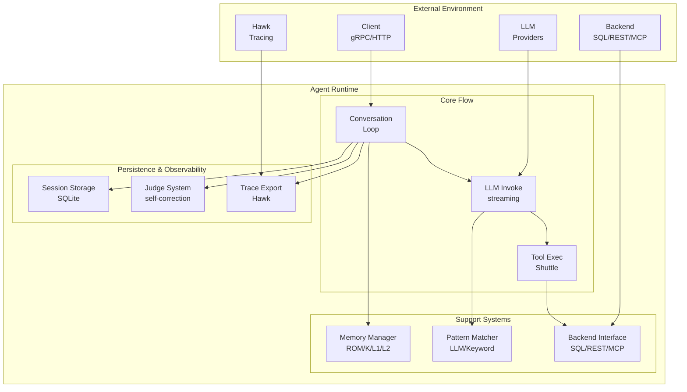

# Agent System Architecture

Detailed architecture of Loom's agent runtime - the conversation loop, segmented memory system, self-correction, and session persistence.

**Target Audience**: Architects, academics, and advanced developers

**Version**: v1.2.0


## Table of Contents

- [Overview](#overview)
- [Design Goals](#design-goals)
- [System Context](#system-context)
- [Architecture Overview](#architecture-overview)
- [Components](#components)
  - [Agent Core](#agent-core)
  - [Memory Controller](#memory-controller)
  - [Conversation Loop](#conversation-loop)
  - [Pattern Matcher](#pattern-matcher)
  - [Tool Executor Integration](#tool-executor-integration)
  - [Self-Correction (Judge)](#self-correction-judge)
  - [Session Persistence](#session-persistence)
- [Key Interactions](#key-interactions)
  - [Single Turn Execution](#single-turn-execution)
  - [Tool Execution Flow](#tool-execution-flow)
  - [Session Recovery](#session-recovery)
- [Data Structures](#data-structures)
  - [Agent Struct](#agent-struct)
  - [Session](#session)
  - [Message](#message)
  - [Segmented Memory](#segmented-memory)
- [Algorithms](#algorithms)
  - [Context Window Management](#context-window-management)
  - [Token Budget Calculation](#token-budget-calculation)
  - [Memory Eviction Policy](#memory-eviction-policy)
- [Design Trade-offs](#design-trade-offs)
- [Constraints and Limitations](#constraints-and-limitations)
- [Performance Characteristics](#performance-characteristics)
- [Concurrency Model](#concurrency-model)
- [Error Handling](#error-handling)
- [Security Considerations](#security-considerations)
- [Related Work](#related-work)
- [References](#references)
- [Further Reading](#further-reading)


## Overview

The Agent System is the core runtime for autonomous LLM-powered agent threads. It orchestrates a conversation loop that:
1. Maintains segmented memory across multiple turns
2. Matches user queries to domain-specific patterns
3. Invokes LLM providers with streaming support
4. Executes tools concurrently via the Shuttle system
5. Validates responses with judge-based self-correction
6. Persists session state for crash recovery

The agent is designed to be **backend-agnostic** (SQL, REST, documents), **LLM-agnostic** (Anthropic, Bedrock, Ollama, etc.), and **thread-safe** for concurrent session management.


## Design Goals

1. **Autonomy**: Agent drives conversation with minimal human intervention
2. **Memory Efficiency**: Bounded token usage via segmented memory (ROM/Kernel/L1/L2/Swap)
3. **Crash Recovery**: Session persistence enables recovery from any failure
4. **Observable**: Every decision traced to Hawk for debugging and evaluation
5. **Pluggable**: Swap backends, LLMs, tools, patterns without agent code changes

**Non-goals**:
- Real-time sub-second response (P50 latency ~1200ms)
- Multi-modal input/output beyond text + vision tools
- Goal-seeking autonomous agents (pattern-guided, not goal-driven)


## System Context



**External Interfaces**:
- **Client**: gRPC/HTTP requests via `Weave` and `StreamWeave` RPCs (maps to `Agent.Chat` and `Agent.ChatWithProgress`)
- **LLM Provider**: Streaming chat completions with tool calling
- **Backend**: Domain-specific operations (SQL queries, API calls, document retrieval)
- **Hawk**: Observability trace export with span metadata


## Architecture Overview

```
┌──────────────────────────────────────────────────────────────────────────────┐
│                           Agent Runtime                                      │
│                                                                              │
│  ┌────────────────────────────────────────────────────────────────────────┐  │
│  │                      Agent Core                             │          │  │
│  │                                                             │          │  │
│  │  • Backend (ExecutionBackend)    • LLM (LLMProvider)       │           │  │
│  │  • Tools (shuttle.Registry)      • Tracer (Hawk)           │           │  │
│  │  • Prompts (PromptRegistry)      • Config                  │           │  │
│  │  • Role LLMs (judge/classifier)  • Graph Memory (optional) │           │  │
│  └────────────────────────────────────────────────────────────────────────┘  │
│                              │                                               │
│                              ▼                                               │
│  ┌────────────────────────────────────────────────────────────────────────┐  │
│  │                   Memory Controller                         │          │  │
│  │                                                             │          │  │
│  │  ┌──────────────────────────────────────────────────────────────────┐  │  │
│  │  │          Segmented Memory System                  │     │           │  │
│  │  │                                                   │     │           │  │
│  │  │  ┌─────────────────────────────────────────┐     │     │            │  │
│  │  │  │ ROM (system prompt, immutable)           │     │     │            │  │
│  │  │  │ Never changes during session.           │     │     │            │  │
│  │  │  └─────────────────────────────────────────┘     │     │            │  │
│  │  │  ┌─────────────────────────────────────────┐     │     │            │  │
│  │  │  │ Kernel (tool results, schemas, findings)│     │     │            │  │
│  │  │  │ Working memory from tool executions.    │     │     │            │  │
│  │  │  │ LRU eviction for schemas (max 10).      │     │     │            │  │
│  │  │  └─────────────────────────────────────────┘     │     │            │  │
│  │  │  ┌─────────────────────────────────────────┐     │     │            │  │
│  │  │  │ L1 (recent messages, token-based limit) │     │     │            │  │
│  │  │  │ Sliding window with adaptive compression│     │     │            │  │
│  │  │  └─────────────────────────────────────────┘     │     │            │  │
│  │  │  ┌─────────────────────────────────────────┐     │     │            │  │
│  │  │  │ L2 (compressed summary string)          │     │     │            │  │
│  │  │  │ LLM-compressed history. Evicts to Swap. │     │     │            │  │
│  │  │  └─────────────────────────────────────────┘     │     │            │  │
│  │  │  ┌─────────────────────────────────────────┐     │     │            │  │
│  │  │  │ Swap (database-backed cold storage)     │     │     │            │  │
│  │  │  │ L2 snapshots archived to SessionStore.  │     │     │            │  │
│  │  │  └─────────────────────────────────────────┘     │     │            │  │
│  │  └──────────────────────────────────────────────────────────────────┘  │  │
│  │                                                             │          │  │
│  │  Sessions (map[string]*Session) ◀──▶ SessionStorage (SQLite/PG) │      │  │
│  └────────────────────────────────────────────────────────────────────────┘  │
│                              │                                               │
│                              ▼                                               │
│  ┌────────────────────────────────────────────────────────────────────────┐  │
│  │                   Conversation Loop                         │          │  │
│  │                                                             │          │  │
│  │  1. Load/Create Session                                    │           │  │
│  │  2. Match Patterns (LLM-based intent classification)        │           │  │
│  │  3. Build Context (ROM + L2 + patterns + skills + L1)      │           │  │
│  │  4. LLM Invoke (streaming)                                 │           │  │
│  │  5. Parse Tool Calls                                       │           │  │
│  │  6. Execute Tools (concurrent via Shuttle)                 │           │  │
│  │  7. Judge Validation (optional self-correction)            │           │  │
│  │  8. Persist Turn (session → SQLite)                        │           │  │
│  │  9. Return Response                                        │           │  │
│  └────────────────────────────────────────────────────────────────────────┘  │
│                              │                                               │
│                              ▼                                               │
│  ┌────────────────────────────────────────────────────────────────────────┐  │
│  │                Self-Correction (Judge)                      │          │  │
│  │                                                             │          │  │
│  │  ┌──────────────────────────────────────────────────────────────────┐  │  │
│  │  │  Judge Config    │──────────▶│    Judge LLM     │       │           │  │
│  │  │  (criteria)      │           │    (scoring)     │       │           │  │
│  │  └──────────────────────────────────────────────────────────────────┘  │  │
│  │                                          │                 │           │  │
│  │                                          ▼                 │           │  │
│  │  ┌──────────────────────────────────────────────────────────────────┐  │  │
│  │                              │   Aggregator     │          │           │  │
│  │                              │   (strategy)     │          │           │  │
│  │  └──────────────────────────────────────────────────────────────────┘  │  │
│  │                                       │                    │           │  │
│  │                                       ▼                    │           │  │
│  │                           Pass/Fail Decision               │           │  │
│  └────────────────────────────────────────────────────────────────────────┘  │
│                                                                              │
└──────────────────────────────────────────────────────────────────────────────┘
```


## Components

### Agent Core

**Responsibility**: Orchestrate all agent subsystems and expose the `Chat`/`ChatWithProgress` API.

**Fields** (from `pkg/agent/types.go`):
```go
type Agent struct {
    id                  string                         // Unique agent identifier (UUID v4)
    mu                  sync.RWMutex                   // Thread-safe field access
    backend             fabric.ExecutionBackend        // Domain operations
    tools               *shuttle.Registry              // Tool registry
    executor            *shuttle.Executor              // Tool executor
    permissionChecker   *shuttle.PermissionChecker     // Tool execution permissions
    memory              *Memory                        // Session manager
    errorStore          ErrorStore                     // Error submission channel
    llm                 LLMProvider                    // Primary LLM provider
    judgeLLM            LLMProvider                    // Role-specific: evaluation
    orchestratorLLM     LLMProvider                    // Role-specific: fork-join synthesis
    classifierLLM       LLMProvider                    // Role-specific: intent classification
    compressorLLM       LLMProvider                    // Role-specific: memory compression
    tracer              observability.Tracer           // Hawk tracer
    prompts             prompts.PromptRegistry         // Prompt management
    config              *Config                        // Agent config
    guardrails          *fabric.GuardrailEngine        // Optional guardrails
    circuitBreakers     *fabric.CircuitBreakerManager  // Optional circuit breakers
    orchestrator        *patterns.Orchestrator         // Pattern orchestration
    skillOrchestrator   *skills.Orchestrator           // Skill orchestration
    refStore            communication.ReferenceStore   // Agent-to-agent refs
    commPolicy          *communication.PolicyManager   // Communication policy
    messageQueue        *communication.MessageQueue    // Async message queue
    mcpClients          map[string]MCPClientRef        // MCP client tracking
    dynamicDiscovery    *DynamicToolDiscovery          // Lazy MCP tool loading
    sharedMemory        *storage.SharedMemoryStore     // Large data storage
    refTracker          *storage.SessionReferenceTracker // Shared memory cleanup
    sqlResultStore      storage.ResultStore            // Queryable SQL results
    tokenCounter        *TokenCounter                  // Token estimation
    providerPool        map[string]LLMProvider         // Named provider pool
    lazyToolSets        []lazyToolSet                  // Conditionally-registered tools
    graphMemoryStore    memory.GraphMemoryStore        // Graph-backed episodic memory
    graphMemoryConfig   *loomv1.GraphMemoryConfig      // Graph memory configuration
}
```

**Invariants**:
- `backend` and `llm` must be non-nil (injected via constructor)
- `tools` and `executor` always initialized (empty registry allowed)
- `memory` always initialized (in-memory or SQLite-backed)
- All optional fields (guardrails, circuitBreakers, etc.) nil-safe

**Interface**:
```go
func (a *Agent) Chat(ctx context.Context, sessionID string, userMessage string) (*Response, error)
func (a *Agent) ChatWithProgress(ctx context.Context, sessionID string, userMessage string, progressCallback ProgressCallback) (*Response, error)
```

Note: The gRPC service exposes `Weave` and `StreamWeave` RPCs (defined in `proto/loom/v1/loom.proto`), which the server layer translates to `Agent.Chat` and `Agent.ChatWithProgress` respectively.


### Memory Controller

**Responsibility**: Manage session lifecycle and segmented memory.

**Implementation** (`pkg/agent/memory.go`):
```go
type Memory struct {
    mu                   sync.RWMutex                   // Protects sessions map
    sessions             map[string]*Session            // In-memory session cache
    store                SessionStorage                 // Optional persistence (SQLite or PostgreSQL)
    sharedMemory         *storage.SharedMemoryStore     // Optional large data storage
    systemPromptFunc     SystemPromptFunc               // Dynamic system prompt
    tracer               observability.Tracer           // Optional tracer for observability
    logger               *zap.Logger                    // Structured logger for storage errors
    llmProvider          LLMProvider                    // Optional LLM for semantic search reranking
    maxContextTokens     int                            // Context window size
    reservedOutputTokens int                            // Output reservation
    compressionProfile   *CompressionProfile            // Compression behavior profile
    maxToolResults       int                            // Max tool results in kernel
    observers            map[string][]MemoryObserver    // Real-time cross-session observers
    observersMu          sync.RWMutex                   // Protects observers map
}
```

**Operations**:
- `GetOrCreateSession(ctx, sessionID)`: Load from cache → persistent store → create new
- `GetOrCreateSessionWithAgent(ctx, sessionID, agentID, parentSessionID)`: Same with agent metadata
- `PersistSession(ctx, session)`: Write session to persistent store (idempotent)
- `PersistMessage(ctx, sessionID, msg)`: Persist individual message
- `DeleteSession(sessionID)`: Remove from in-memory cache
- `ListSessions()`: Enumerate all in-memory sessions
- `AddMessage(ctx, sessionID, msg)`: Add message with observer notification
- `RegisterObserver(agentID, observer)`: Register real-time cross-session observer

**Concurrency**: `sync.RWMutex` protects `sessions` map for concurrent reads, exclusive writes.


### Conversation Loop

**Responsibility**: Turn-based conversation execution.

**Algorithm**:
```
1. Load Session
   ├─ Check in-memory cache                                                     
   ├─ If miss, load from SQLite                                                 
   └─ If not found, create new session with segmented memory                    

2. Match Patterns
   ├─ Classify user intent (LLM-based by default, keyword fallback)
   ├─ Score patterns against classified intent
   └─ Select top-K patterns (K=1 by default, configurable up to 5)

3. Build Context
   ├─ ROM: System prompt (immutable)
   ├─ L2: Summarized history (LLM-compressed)
   ├─ Pattern: Injected domain knowledge (if matched)
   ├─ Skills: Active skill instructions (if configured)
   ├─ Findings: Working memory from tool executions
   ├─ Promoted: Retrieved context from swap layer
   └─ L1: Recent messages (sliding window)

4. Check Token Budget
   ├─ Calculate total tokens across all layers
   ├─ If exceeds warning threshold, compress oldest L1 messages to L2
   ├─ If L2 exceeds maxL2Tokens, evict L2 to swap (database)
   └─ Adaptive batch sizes based on budget pressure (profile-dependent)                                                

5. LLM Invoke
   ├─ Format messages (system + history + user)                                 
   ├─ Stream completion with tool calling                                       
   └─ Parse assistant response and tool calls                                   

6. Execute Tools
   ├─ If no tool calls, skip to step 8                                          
   ├─ Validate tool calls (parameters, availability)                            
   ├─ Execute tools concurrently via Shuttle                                    
   └─ Aggregate results                                                         

7. Judge Validation (Optional)
   ├─ If judge configured, validate response                                    
   ├─ If score < threshold, retry with correction                               
   └─ Max 3 retry attempts                                                      

8. Persist Turn
   ├─ Append messages to session history                                        
   ├─ Update L1 (add new turn, evict if full)                                   
   ├─ Update L2 (summarize evicted L1 messages)                                 
   ├─ Write session to SQLite                                                   
   └─ Export trace to Hawk                                                      

9. Return Response
   └─ Return assistant message + tool results                                   
```

**Loop Termination**:
- Max turns reached (`config.MaxTurns`, default: 25)
- Max tool executions reached (`config.MaxToolExecutions`, default: 50)
- User explicitly requests completion
- Unrecoverable error (e.g., backend connection lost)


### Pattern Matcher

**Responsibility**: Select relevant domain patterns for user query.

**Algorithm**: LLM-Based Intent Classification (default) with Keyword Fallback
```
1. Preprocessing (pattern library load):
   ├─ Build pattern index (name, title, description, category, use cases)
   ├─ Store index as []PatternSummary
   └─ Store in atomic.Value for hot-reload

2. Query matching (LLM classifier, default):
   ├─ Send user message + pattern summaries to classifier LLM
   ├─ LLM selects best-fit pattern with confidence score
   └─ Return top-K patterns (K=1 by default, configurable up to 5)

2b. Query matching (keyword fallback, when UseLLMClassifier=false):
   ├─ Classify intent via defaultIntentClassifier (keyword lists + containsAny)
   ├─ Extract keywords from user message (split, lowercase, filter stop words)
   ├─ Score each pattern: category match (+0.5), keyword match rate (up to +0.5),
   │   name match (+0.2), title match (+0.1)
   ├─ Sort by score (descending)
   └─ Return top-K patterns (K=1)

3. Hot-reload (fsnotify):
   ├─ Detect file change event
   ├─ Reload YAML files
   ├─ Rebuild pattern index
   └─ Atomic swap (atomic.Store)
```

**Complexity**:
- Indexing: O(n) where n = pattern count
- Query (keyword): O(n x m) where m = keywords per pattern
- Query (LLM): One LLM call per turn (latency dominated by LLM inference)
- Space: O(n) for pattern summaries

**Performance**: <10ms for keyword matching over 104 patterns, 89-143ms hot-reload latency.

**See**: [Pattern System Architecture](pattern-system.md)


### Tool Executor Integration

**Responsibility**: Interface with Shuttle for concurrent tool execution.

**Integration**:
```go
// Agent calls Shuttle executor for each tool (single-tool API)
result, err := a.executor.Execute(ctx, toolName, params)

// Or use ExecuteWithTool for a specific tool instance
result, err := a.executor.ExecuteWithTool(ctx, tool, params)

// Concurrent execution: Agent spawns goroutines for multiple tool calls
// from a single LLM response, then aggregates results
for _, tc := range toolCalls {
    go func(call ToolCall) {
        result, err := a.executor.Execute(ctx, call.Name, call.Input)
        resultChan <- ToolExecution{ToolName: call.Name, Result: result, Error: err}
    }(tc)
}
```

**Error Handling**:
- Tool execution errors aggregated, not short-circuited
- Partial success: Some tools succeed, others fail
- Agent receives all results, decides whether to retry

**Timeout**: Per-tool timeout via `context.WithTimeout` (default: 30s).

**See**: Tool execution is handled by the Shuttle system in `pkg/shuttle/executor.go`


### Self-Correction (Judge)

**Responsibility**: Validate agent responses using multi-judge evaluation.

**Architecture**:
```
User Query ────▶ Agent Response                                                 
                      │                                                         
                      ▼
┌──────────────────────────────────────────────────────────────────────────────┐
              │  Judge System │                                                 
              │               │                                                 
              │  Judge 1 ─────┼──▶ Score 1                                      
              │  Judge 2 ─────┼──▶ Score 2                                      
              │  Judge N ─────┼──▶ Score N                                      
└──────────────────────────────────────────────────────────────────────────────┘
                      │                                                         
                      ▼
┌──────────────────────────────────────────────────────────────────────────────┐
              │  Aggregator   │                                                 
              │  (strategy)   │                                                 
└──────────────────────────────────────────────────────────────────────────────┘
                      │                                                         
                      ▼
              Pass (score ≥ threshold)
              Fail (score < threshold)
```

**Aggregation Strategies** (6 strategies, defined in proto as `AggregationStrategy`):
1. **WEIGHTED_AVERAGE**: Weighted average of all judge scores (default)
2. **ALL_MUST_PASS**: Strictest - every judge must pass (logical AND)
3. **MAJORITY_PASS**: Majority vote - pass if >50% of judges pass
4. **ANY_PASS**: Most lenient - any single judge can pass (logical OR)
5. **MIN_SCORE**: Use the minimum score across all judges
6. **MAX_SCORE**: Use the maximum score across all judges

**Retry Logic**:
```
attempt = 0
while attempt < max_retries:
    response = llm.invoke(context)
    score = judge.evaluate(response)
    if score >= threshold:
        return response
    attempt += 1
    context.append(correction_message)
return response  # Return last attempt even if failed
```

**Configuration**:
- Threshold: 0.0-1.0 (default: 0.7)
- Max retries: 1-10 (default: 3)
- Aggregation strategy: weighted_average, all_must_pass, majority_pass, any_pass, min_score, max_score

**See**: Judge implementation in `pkg/evals/judges/judge.go`, aggregator in `pkg/evals/judges/aggregator.go`


### Session Persistence

**Responsibility**: Crash recovery via SQLite session store.

**Schema** (`pkg/agent/session_store.go`):

The `SessionStore` (SQLite implementation of the `SessionStorage` interface) uses a normalized relational schema rather than serialized BLOBs. This enables FTS5 full-text search over message content and queryable tool execution history.

```sql
CREATE TABLE sessions (
    id TEXT PRIMARY KEY,
    name TEXT,
    agent_id TEXT,
    parent_session_id TEXT,
    context_json TEXT,
    created_at INTEGER NOT NULL,
    updated_at INTEGER NOT NULL,
    total_cost_usd REAL DEFAULT 0,
    total_tokens INTEGER DEFAULT 0,
    FOREIGN KEY (parent_session_id) REFERENCES sessions(id) ON DELETE SET NULL
);

CREATE TABLE messages (
    id INTEGER PRIMARY KEY AUTOINCREMENT,
    session_id TEXT NOT NULL,
    role TEXT NOT NULL,
    content TEXT,
    tool_calls_json TEXT,
    tool_use_id TEXT,
    tool_result_json TEXT,
    session_context TEXT DEFAULT 'direct',
    timestamp INTEGER NOT NULL,
    token_count INTEGER DEFAULT 0,
    cost_usd REAL DEFAULT 0,
    FOREIGN KEY (session_id) REFERENCES sessions(id) ON DELETE CASCADE
);

CREATE TABLE tool_executions (...);    -- Tool execution audit trail
CREATE TABLE memory_snapshots (...);   -- L2 summary archival (swap layer)
CREATE TABLE artifacts (...);          -- User/agent-generated files

-- FTS5 virtual table for semantic search (BM25 ranking)
CREATE VIRTUAL TABLE messages_fts5 USING fts5(
    message_id UNINDEXED, session_id UNINDEXED, role UNINDEXED,
    content, timestamp UNINDEXED,
    tokenize='porter unicode61'
);
```

**Operations** (via `SessionStorage` interface, `pkg/agent/session_storage.go`):
- `SaveSession(ctx, session)`: Upsert session metadata (idempotent, JSON context)
- `LoadSession(ctx, sessionID)`: Load session + all messages from relational tables
- `DeleteSession(ctx, sessionID)`: CASCADE delete session and all associated data
- `ListSessions(ctx)`: Enumerate all session IDs
- `SaveMessage(ctx, sessionID, msg)`: Persist individual message (FTS5 auto-indexed)
- `SearchMessages(ctx, sessionID, query, limit)`: BM25 full-text search via FTS5
- `SaveMemorySnapshot(ctx, sessionID, type, content, tokens)`: Archive L2 summaries to swap

**Persistence Timing**: Every turn persisted **before** returning response to client.

**Crash Recovery**:
```
1. Server crashes
2. Server restarts
3. Client sends request with existing sessionID
4. Agent calls memory.GetOrCreateSession(sessionID)
5. Memory loads from SQLite
6. Conversation resumes from last persisted turn
```

**Performance**: 1-5ms write, 12-28ms read (P50/P99).


## Key Interactions

### Single Turn Execution

```
Client         Agent          Memory       LLM          Shuttle      Backend
  │              │              │            │             │           │        
  ├─ Chat ──────▶│              │            │             │           │        
  │              ├─ GetOrCreate ▶│            │             │           │       
  │              │◀─ Session ───┤            │             │           │        
  │              │              │            │             │           │        
  │              ├─ MatchPattern│            │             │           │        
  │              ├─ BuildContext│            │             │           │        
  │              │              │            │             │           │        
  │              ├─ Invoke ─────┼───────────▶│             │           │        
  │              │◀─ Stream ────┼────────────┤             │           │        
  │              │              │            │             │           │        
  │              ├─ ParseTools ─┤            │             │           │        
  │              ├─ Execute ────┼────────────┼────────────▶│           │        
  │              │              │            │             ├─ Call ───▶│        
  │              │              │            │             │◀─ Result ─┤        
  │              │◀─ Results ───┼────────────┼─────────────┤           │        
  │              │              │            │             │           │        
  │              ├─ Persist ────▶│            │             │           │       
  │              │              │            │             │           │        
  │◀─ Response ──┤              │            │             │           │        
  │              │              │            │             │           │        
```

**Duration**: ~1200ms P50 (850ms LLM + 45ms tools + 3ms persist + overhead)


### Tool Execution Flow

```
Agent            Shuttle         Tool 1          Tool 2          Tool 3
  │                │               │               │               │            
  ├─ Execute ─────▶│               │               │               │            
  │                │               │               │               │            
  │                ├─ Spawn ──────▶│ (goroutine)   │               │            
  │                ├─ Spawn ───────┼──────────────▶│ (goroutine)   │            
  │                ├─ Spawn ───────┼───────────────┼──────────────▶│            
  │                │               │               │               │            
  │                │               ├─ Execute SQL ─┤               │            
  │                │               │◀─ Result ─────┤               │            
  │                │◀─ Result ─────┤               │               │            
  │                │               │               │               │            
  │                │               │               ├─ API call ────┤            
  │                │               │               │◀─ Result ─────┤            
  │                │◀─────────────Result ──────────┤               │            
  │                │               │               │               │            
  │                │               │               │               ├─ File read 
  │                │               │               │               │◀─ Result ──
  │                │◀─────────────Result ─────────────────────────┤             
  │                │               │               │               │            
  │◀─ All Results ─┤               │               │               │            
  │                │               │               │               │            
```

**Concurrency**: N goroutines for N tools, results aggregated via buffered channel.


### Session Recovery

```
t0: Normal Operation
─────────────────────                                                           
Client ───▶ Agent ───▶ SQLite                                                   
                │ write session                                                 
                ▼
             [crash]

t1: Server Restart
─────────────────────                                                           
Server starts
Agent initialized
Memory empty

t2: Client Reconnects
─────────────────────                                                           
Client ───▶ Agent (same sessionID)                                              
              │                                                                 
              ├─ memory.GetOrCreateSession(sessionID)                           
              ├─ Check in-memory cache: MISS                                    
              ├─ Load from SQLite: HIT                                          
              └─ Resume conversation                                            

t3: Continued Conversation
─────────────────────                                                           
Client ───▶ Agent (turn 42)                                                     
              │ conversation state intact                                       
              ▼ L1 has last 10 turns
            Success
```

**Recovery Time**: <50ms session load from SQLite.


## Data Structures

### Agent Struct

See [Agent Core](#agent-core) above for full struct definition.

**Invariants**:
- `backend != nil` (validated in constructor)
- `llm != nil` (validated in constructor)
- `memory != nil` (always initialized)
- `tools != nil` (empty registry allowed)
- `executor != nil` (created with tools registry)


### Session

**Definition** (`pkg/types/types.go`):
```go
type Session struct {
    mu              sync.RWMutex            // Thread-safe access
    ID              string                  // Unique session identifier
    Name            string                  // Human-readable name (optional)
    AgentID         string                  // Owning agent (for cross-session memory)
    ParentSessionID string                  // Coordinator session link (for sub-agents)
    UserID          string                  // User identity (for RLS multi-tenancy)
    Messages        []Message               // Full conversation history (flat)
    SegmentedMem    interface{}             // Tiered memory (ROM/Kernel/L1/L2/Swap)
    FailureTracker  interface{}             // Consecutive tool failure tracking
    Context         map[string]interface{}  // Session-level context
    CreatedAt       time.Time               // Session creation timestamp
    UpdatedAt       time.Time               // Last update timestamp
    TotalCostUSD    float64                 // Accumulated cost
    TotalTokens     int                     // Accumulated token usage
}
```

**Invariants**:
- `ID` must be non-empty
- `Messages` append-only (never deleted, only evicted from L1 to L2)
- `SegmentedMem` always initialized (even for empty sessions)
- `UpdatedAt` modified on every turn
- `SegmentedMem` is typed as `interface{}` to break import cycles between `pkg/types` and `pkg/agent`; at runtime it holds `*agent.SegmentedMemory`


### Message

**Definition** (`pkg/types/types.go`):
```go
type Message struct {
    ID             string           // Unique message identifier (from database)
    Role           string           // "system", "user", "assistant", "tool"
    Content        string           // Message text
    ContentBlocks  []ContentBlock   // Multi-modal content (text + images)
    ToolCalls      []ToolCall       // Optional tool calls (for assistant messages)
    ToolUseID      string           // Tool request ID (for tool role messages)
    ToolResult     *shuttle.Result  // Tool execution result (for tool role messages)
    SessionContext SessionContext   // Context: direct, coordinator, shared
    AgentID        string           // Which agent created this message
    UserID         string           // User identity (for RLS multi-tenancy)
    Timestamp      time.Time        // Message creation time
    TokenCount     int              // Token count for cost tracking
    CostUSD        float64          // Cost in USD for this message
}
```


### Segmented Memory

**Definition** (`pkg/agent/segmented_memory.go`):
```go
type SegmentedMemory struct {
    // ROM Layer (never changes during session)
    romContent         string                  // Static documentation/system prompt

    // Kernel Layer (changes per conversation)
    tools              []string                // Available tool names
    toolResults        []CachedToolResult      // Recent tool results (max 5)
    schemaCache        map[string]string       // LRU schema cache (max 10)
    findingsCache      map[string]Finding      // Verified findings (working memory)

    // L1 Cache (hot - recent messages)
    l1Messages         []Message               // Recent conversation (sliding window)

    // L2 Cache (warm - summarized history)
    l2Summary          string                  // Compressed summary of older conversation

    // Swap Layer (cold - database-backed long-term storage)
    sessionStore       SessionStorage          // Database for persistent storage
    swapEnabled        bool                    // Whether swap layer is configured

    // Token management
    tokenCounter       *TokenCounter           // Accurate token counting
    tokenBudget        *TokenBudget            // Token budget enforcement
    maxL1Tokens        int                     // Token-based L1 capacity
    compressionProfile CompressionProfile      // Adaptive compression thresholds

    mu                 sync.RWMutex
}
```

**Invariants**:
```
∀ t: tokens(ROM) + tokens(Kernel) + tokens(L1) + tokens(L2) ≤ MaxContextTokens - ReservedOutputTokens
∀ m ∈ L1: m.Timestamp > timestamps in L2 summary  (L1 newer than L2)
ROM (romContent) never mutated after initialization (immutable)
L2 evicts to Swap (database) when exceeding maxL2Tokens (default: 5000 tokens)
```


## Algorithms

### Context Window Management

**Problem**: LLM context windows are finite (200k tokens for Claude Sonnet 4.5). Conversations exceed this limit.

**Solution**: Segmented memory with tiered eviction and adaptive compression.

**Algorithm** (see `GetMessagesForLLM()` in `pkg/agent/segmented_memory.go`):
```
func GetMessagesForLLM() []Message:
    messages = []

    // ROM always included (immutable system prompt)
    messages += Message{role: "system", content: romContent}

    // L2 summary (compressed history, if exists)
    if l2Summary != "":
        messages += Message{role: "system", content: "Previous conversation summary: " + l2Summary}

    // Pattern content (if injected for this turn)
    if patternContent != "":
        messages += Message{role: "system", content: patternContent}

    // Skill content (if active skills injected)
    if skillContent != "":
        messages += Message{role: "system", content: skillContent}

    // Findings summary (working memory from tool executions)
    if findingsCache not empty:
        messages += Message{role: "system", content: findingsSummary}

    // Promoted context from swap (retrieved old messages)
    if promotedContext not empty:
        messages += promotedContext

    // L1 messages (recent conversation)
    messages += l1Messages

    return messages
```

**Complexity**: O(n) where n = total messages across all layers.


### Token Budget Calculation

**Problem**: Accurately estimate token count to prevent context overflow.

**Solution**: Use a built-in `TokenCounter` that estimates token count (character-based heuristic with message overhead).

**Algorithm**:
```
func CountTokens(messages []Message) int:
    total = 0
    for msg in messages:
        // Count message content tokens
        total += tokenizer.Count(msg.Content)

        // Count tool call tokens
        for tool in msg.ToolCalls:
            total += tokenizer.Count(tool.Name)
            total += tokenizer.Count(serialize(tool.Parameters))

        // Add overhead (role, timestamps, etc.)
        total += 4  // Approximate overhead per message

    return total
```

**Accuracy**: ±5% error margin (acceptable for budget management).


### Memory Eviction Policy

**Problem**: When L1 exceeds capacity, which messages to evict to L2?

**Solution**: Adaptive compression with profile-dependent thresholds and LLM summarization.

**Algorithm** (see `AddMessage()` in `pkg/agent/segmented_memory.go`):
```
func AddMessage(msg):
    l1Messages.append(msg)
    updateTokenCount()

    // Two compression triggers (profile-dependent):
    // 1. L1 token count exceeds maxL1Tokens
    // 2. Overall token budget exceeds warning threshold
    l1Tokens = countTokens(l1Messages)
    budgetUsage = tokenBudget.UsagePercentage()
    warningThreshold = compressionProfile.WarningThresholdPercent

    if (l1Tokens > maxL1Tokens || budgetUsage > warningThreshold)
       && len(l1Messages) > minL1Messages:

        // Adaptive batch sizing based on budget pressure
        if budgetUsage > criticalThreshold:
            batchSize = compressionProfile.CriticalBatchSize  // Aggressive
        elif budgetUsage > warningThreshold:
            batchSize = compressionProfile.WarningBatchSize    // Moderate
        else:
            batchSize = compressionProfile.NormalBatchSize     // Normal

        // Adjust boundary to avoid splitting tool_use/tool_result pairs
        batchSize = adjustCompressionBoundary(batchSize)

        // Compress oldest messages to L2
        evicted = l1Messages[:batchSize]
        l1Messages = l1Messages[batchSize:]

        // LLM-powered compression if available, otherwise heuristic fallback
        if compressor != nil && compressor.IsEnabled():
            summary = compressor.CompressMessages(evicted)
        else:
            summary = extractKeywords(evicted)  // Simple heuristic

        l2Summary += summary

        // If L2 exceeds maxL2Tokens and swap is enabled, evict to database
        if swapEnabled && countTokens(l2Summary) > maxL2Tokens:
            sessionStore.SaveMemorySnapshot(sessionID, "l2_summary", l2Summary)
            l2Summary = ""  // Clear and start fresh
```

**Compression Profiles** (defined in `pkg/agent/compression_profiles.go`):
- `data_intensive`: warning=50%, critical=70%, batches=2/4/6
- `balanced` (default): warning=60%, critical=75%, batches=3/5/7
- `conversational`: warning=70%, critical=85%, batches=4/6/8

**Eviction Frequency**: Depends on profile and message size; adaptive rather than fixed.


## Design Trade-offs

### Decision 1: Segmented Memory vs. Full History

**Chosen**: Segmented memory (ROM/Kernel/L1/L2/Swap)

**Alternatives**:
1. **Full history (no eviction)**:
   - ✅ Perfect recall
   - ❌ Unbounded token growth → rejected for cost

2. **Fixed sliding window (no L2)**:
   - ✅ Simple implementation
   - ❌ Loses all context beyond window → rejected for long conversations

3. **External RAG memory**:
   - ✅ Unbounded storage
   - ❌ Retrieval adds 100-500ms latency → rejected for real-time interaction

**Consequences**:
- ✅ Predictable token budget
- ✅ Long-term context via L2 summaries
- ❌ Lossy compression (summaries drop detail)
- ❌ Implementation complexity


### Decision 2: SQLite vs. Distributed Storage

**Chosen**: SQLite (embedded database)

**Alternatives**:
1. **Redis/Memcached**:
   - ✅ Fast in-memory access
   - ❌ No persistence (loses data on restart) → rejected

2. **PostgreSQL/MySQL**:
   - ✅ Relational features
   - ❌ External dependency, operational complexity → overkill

3. **etcd/Consul**:
   - ✅ Distributed consensus
   - ❌ High latency (10-50ms), complex → overkill for single-agent

**Consequences**:
- ✅ Embedded (no external database)
- ✅ ACID transactions, fast local I/O
- ❌ Single-writer bottleneck (mitigated by per-agent session files)


### Decision 3: Concurrent vs. Sequential Tool Execution

**Chosen**: Concurrent (goroutine per tool)

**Alternatives**:
1. **Sequential execution**:
   - ✅ Simpler implementation
   - ❌ High latency (3 tools × 100ms = 300ms) → rejected

2. **Worker pool**:
   - ✅ Bounded goroutines
   - ❌ Added complexity, no measurable benefit → unnecessary

**Consequences**:
- ✅ Parallel execution (3 tools × 100ms = 100ms P99)
- ❌ Race condition risk (mitigated with `-race` testing)
- ❌ Goroutine overhead (negligible for <100 tools)


## Constraints and Limitations

### Constraint 1: Token Budget

**Description**: Total context ≤ MaxContextTokens - ReservedOutputTokens

**Rationale**: LLM providers enforce context window limits.

**Impact**: Long conversations must evict old messages to L2.

**Workaround**: Increase MaxContextTokens or reduce ReservedOutputTokens.


### Constraint 2: Max Turns Per Session

**Description**: Default 25 turns before forced completion.

**Rationale**: Prevent runaway agents, control cost.

**Impact**: Very long conversations require session restart.

**Workaround**: Increase `config.MaxTurns` or use session chaining.


### Constraint 3: Single-Writer SQLite

**Description**: SQLite has single-writer concurrency (only one write transaction at a time).

**Rationale**: SQLite design for embedded use.

**Impact**: High-concurrency writes may serialize (negligible for <100 agents).

**Workaround**: Per-agent session files (one SQLite DB per agent).


## Performance Characteristics

### Latency

| Operation | P50 | P99 | Notes |
|-----------|-----|-----|-------|
| Session load | 12ms | 28ms | SQLite read + deserialization |
| Session persist | 3ms | 8ms | Serialization + SQLite write |
| Pattern match | 8ms | 15ms | Keyword matching over 104 patterns |
| LLM invoke | 850ms | 2100ms | Network + Claude Sonnet 4.5 generation |
| Tool execution | 45ms | 180ms | Backend-dependent (SQL query) |
| Judge evaluation | 920ms | 2300ms | LLM-based scoring |
| End-to-end turn | 1200ms | 3500ms | All steps combined |

### Throughput

- **Single agent**: ~50 turns/minute (limited by LLM latency)
- **Multi-agent server**: 1000+ concurrent agents (tested on 8-core CPU)

### Resource Usage

- **Memory**: ~5MB per agent (session + patterns + tools)
- **CPU**: <1% idle, 10-30% during LLM streaming
- **Disk**: ~1KB per turn (SQLite session storage)


## Concurrency Model

### Threading

- **One goroutine per agent conversation**: Agents run independently
- **One goroutine per tool**: Concurrent tool execution within agent
- **Single goroutine for pattern hot-reload**: Watches file system

### Synchronization

- **Memory.sessions**: Protected by `sync.RWMutex` (concurrent reads, exclusive writes)
- **Pattern index**: Atomic pointer swap (`atomic.Value`) for hot-reload
- **Tool results**: Buffered channel for aggregation

### Race Prevention

- All tests run with `-race` detector
- Zero race conditions (verified with 50-run stress tests)
- Immutable data structures (ROM, pattern index) reduce contention


## Error Handling

### Strategy

1. **Fail Fast**: Errors propagated immediately (no silent failures)
2. **Rich Context**: Every error includes span ID, session ID, turn number
3. **Idempotent Persist**: Session writes are idempotent for retry safety
4. **Circuit Breakers**: LLM providers have exponential backoff + circuit breaker

### Error Propagation

```
Backend Error ───▶ Tool Error ───▶ Agent Error ───▶ gRPC Error ───▶ Client      
      │                │               │                │                       
      ▼                ▼               ▼                ▼
   Span trace      Span trace      Span trace      Error code
   + metadata      + tool name     + session ID    + message
```

### Recovery Mechanisms

- **Session Persistence**: Recover from crashes via SQLite
- **Retry Logic**: LLM calls retry with exponential backoff (max 3 attempts)
- **Judge Self-Correction**: Invalid responses retried with corrections (max 3 attempts)


## Security Considerations

### Threat Model

1. **Prompt Injection**: Malicious user input steering agent
2. **Tool Abuse**: Agent executing unintended tool calls
3. **Data Exfiltration**: Agent leaking sensitive backend data

### Mitigations

**Prompt Injection**:
- User input isolated in `role: user` messages
- System prompt (ROM) immutable per session
- Judge validation detects anomalous outputs

**Tool Abuse**:
- Tool whitelisting per agent config
- Parameter validation before execution
- Read-only tools for untrusted agents

**Data Exfiltration**:
- Backend scoping (database, schema, table restrictions)
- Query validation before execution
- Trace export to Hawk for audit


## Related Work

### LLM Agent Runtimes

1. **LangChain Agents** (Python): Callback-based execution
   - Loom differs: Turn-based loop with explicit persistence

2. **AutoGPT** (Python): Goal-seeking autonomous agent
   - Loom differs: Pattern-guided, not goal-driven

3. **Semantic Kernel** (C#): Skill-based orchestration
   - Loom differs: YAML patterns, Go concurrency

### Memory Systems

1. **MemGPT** (Berkeley): Virtual context management
   - Similar: Tiered memory (main, archival)
   - Loom differs: ROM/Kernel split, hot-reload patterns

2. **LangChain Memory**: Simple conversation buffer
   - Loom differs: Segmented memory with L2 summarization


## References

1. Wei, J., Wang, X., Schuurmans, D., et al. (2022). *Chain-of-thought prompting elicits reasoning in large language models*. NeurIPS 2022.

2. Packer, C., et al. (2023). *MemGPT: Towards LLMs as Operating Systems*. arXiv:2310.08560.

3. Shinn, N., et al. (2023). *Reflexion: Language Agents with Verbal Reinforcement Learning*. arXiv:2303.11366.


## Further Reading

### Architecture
- [Memory Systems Architecture](memory-systems.md) - Segmented memory deep dive
- [Pattern System Architecture](pattern-system.md) - Intent classification and hot-reload
- [Judge System Architecture](judge-system.md) - Self-correction and evaluation
- [Loom System Architecture](loom-system-architecture.md) - Overall system design
- [Observability Architecture](observability.md) - Hawk tracing and metrics

### Reference
- [Agent Configuration Reference](/docs/reference/agent-configuration.md) - Complete config options
- [Tool Registry Reference](/docs/reference/tool-registry.md) - Tool registration and execution
- [Self-Correction Reference](/docs/reference/self-correction.md) - Judge configuration

### Guides
- [Getting Started](/docs/guides/quickstart.md) - Quick start guide
- [Memory Management](/docs/guides/memory-management.md) - Memory system usage
