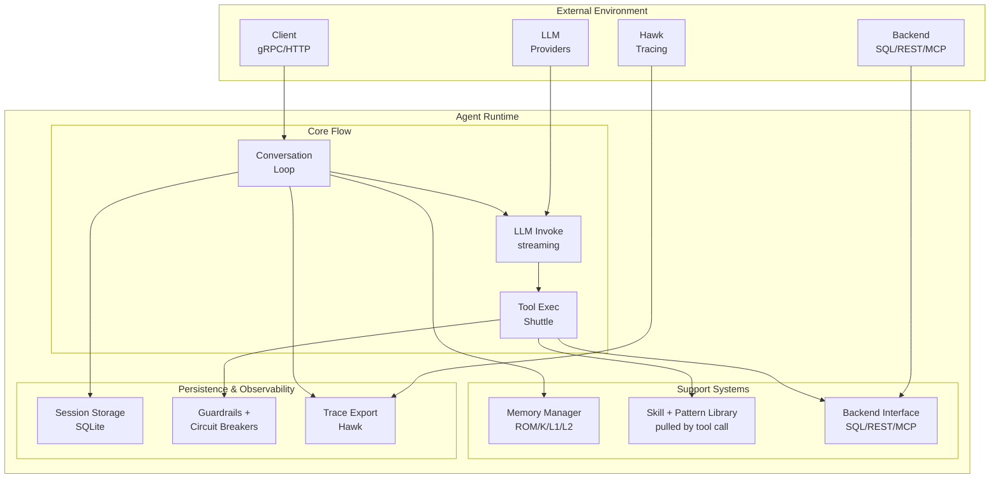

# Agent System Architecture

Detailed architecture of Loom's agent runtime - the conversation loop, segmented memory system, self-correction, and session persistence.

**Target Audience**: Architects, academics, and advanced developers

**Version**: v1.3.0


## Table of Contents

- [Overview](#overview)
- [Design Goals](#design-goals)
- [System Context](#system-context)
- [Architecture Overview](#architecture-overview)
- [Components](#components)
  - [Agent Core](#agent-core)
  - [Memory Controller](#memory-controller)
  - [Conversation Loop](#conversation-loop)
  - [Pattern and Skill Access](#pattern-and-skill-access)
  - [Tool Executor Integration](#tool-executor-integration)
  - [Self-Correction](#self-correction)
  - [Session Persistence](#session-persistence)
- [Key Interactions](#key-interactions)
  - [Single Turn Execution](#single-turn-execution)
  - [Tool Execution Flow](#tool-execution-flow)
  - [Session Recovery](#session-recovery)
- [Data Structures](#data-structures)
  - [Agent Struct](#agent-struct)
  - [Session](#session)
  - [Message](#message)
  - [Segmented Memory](#segmented-memory)
- [Algorithms](#algorithms)
  - [Context Window Management](#context-window-management)
  - [Token Budget Calculation](#token-budget-calculation)
  - [Memory Eviction Policy](#memory-eviction-policy)
- [Context Observability](#context-observability)
- [Design Trade-offs](#design-trade-offs)
- [Constraints and Limitations](#constraints-and-limitations)
- [Performance Characteristics](#performance-characteristics)
- [Concurrency Model](#concurrency-model)
- [Error Handling](#error-handling)
- [Security Considerations](#security-considerations)
- [Related Work](#related-work)
- [References](#references)
- [Further Reading](#further-reading)


## Overview

The Agent System is the core runtime for autonomous LLM-powered agent threads. It orchestrates a conversation loop that:
1. Maintains segmented memory across multiple turns
2. Compiles the provider context from that memory on every call
3. Invokes LLM providers with streaming support
4. Executes the model's tool calls in order via the Shuttle system
5. Isolates tool failures with guardrails and circuit breakers
6. Persists session state for crash recovery

Domain knowledge is not pushed into the context. Skills and patterns are pulled by the model through the `manage_skills` and `load_pattern` tools, and arrive as ordinary conversation messages.

The agent is designed to be **backend-agnostic** (SQL, REST, documents), **LLM-agnostic** (Anthropic, Bedrock, Ollama, etc.), and **thread-safe** for concurrent session management.


## Design Goals

1. **Autonomy**: Agent drives conversation with minimal human intervention
2. **Memory Efficiency**: Bounded token usage via segmented memory (ROM/Kernel/L1/L2/Swap)
3. **Crash Recovery**: Session persistence enables recovery from any failure
4. **Observable**: Turn and tool spans exported to Hawk; the exact compiled context capturable to a local debug sink
5. **Pluggable**: Swap backends, LLMs, tools, patterns without agent code changes

**Non-goals**:
- Real-time sub-second response (P50 latency ~1200ms)
- Multi-modal input/output beyond text + vision tools
- Goal-seeking autonomous agents (tool-driven, not goal-driven)


## System Context


```mermaid
graph TB
    subgraph External["External Environment"]
        Client[Client<br/>gRPC/HTTP]
        LLM[LLM<br/>Providers]
        Backend[Backend<br/>SQL/REST/MCP]
        Hawk[Hawk<br/>Tracing]
    end

    subgraph AgentRuntime["Agent Runtime"]
        subgraph Core["Core Flow"]
            ConvLoop[Conversation<br/>Loop]
            LLMInvoke[LLM Invoke<br/>streaming]
            ToolExec[Tool Exec<br/>Shuttle]
        end

        subgraph Support["Support Systems"]
            Memory[Memory Manager<br/>ROM/K/L1/L2]
            Library[Skill + Pattern Library<br/>pulled by tool call]
            BackendIf[Backend Interface<br/>SQL/REST/MCP]
        end

        subgraph Persistence["Persistence & Observability"]
            Session[Session Storage<br/>SQLite]
            Guard[Guardrails +<br/>Circuit Breakers]
            Trace[Trace Export<br/>Hawk]
        end

        ConvLoop --> LLMInvoke --> ToolExec
        ConvLoop --> Memory
        ToolExec --> Library
        ToolExec --> BackendIf
        ToolExec --> Guard
        ConvLoop --> Session
        ConvLoop --> Trace
    end

    Client --> ConvLoop
    LLM --> LLMInvoke
    Backend --> BackendIf
    Hawk --> Trace
```

**External Interfaces**:
- **Client**: gRPC/HTTP requests via `Weave` and `StreamWeave` RPCs (maps to `Agent.Chat` and `Agent.ChatWithProgress`)
- **LLM Provider**: Streaming chat completions with tool calling
- **Backend**: Domain-specific operations (SQL queries, API calls, document retrieval)
- **Hawk**: Observability trace export with span metadata


## Architecture Overview

```
┌──────────────────────────────────────────────────────────────────────────────┐
│                           Agent Runtime                                      │
│                                                                              │
│  ┌────────────────────────────────────────────────────────────────────────┐  │
│  │                      Agent Core                             │          │  │
│  │                                                             │          │  │
│  │  • Backend (ExecutionBackend)    • LLM (LLMProvider)       │           │  │
│  │  • Tools (shuttle.Registry)      • Tracer (Hawk)           │           │  │
│  │  • Prompts (PromptRegistry)      • Config                  │           │  │
│  │  • Role LLMs (judge/classifier)  • Graph Memory (optional) │           │  │
│  └────────────────────────────────────────────────────────────────────────┘  │
│                              │                                               │
│                              ▼                                               │
│  ┌────────────────────────────────────────────────────────────────────────┐  │
│  │                   Memory Controller                         │          │  │
│  │                                                             │          │  │
│  │  ┌──────────────────────────────────────────────────────────────────┐  │  │
│  │  │          Segmented Memory System                  │     │           │  │
│  │  │                                                   │     │           │  │
│  │  │  ┌─────────────────────────────────────────┐     │     │            │  │
│  │  │  │ ROM (system prompt, immutable)           │     │     │            │  │
│  │  │  │ Never changes during session.           │     │     │            │  │
│  │  │  └─────────────────────────────────────────┘     │     │            │  │
│  │  │  ┌─────────────────────────────────────────┐     │     │            │  │
│  │  │  │ Kernel (tool results, schema cache)     │     │     │            │  │
│  │  │  │ Working memory from tool executions.    │     │     │            │  │
│  │  │  │ LRU eviction for schemas (max 10).      │     │     │            │  │
│  │  │  └─────────────────────────────────────────┘     │     │            │  │
│  │  │  ┌─────────────────────────────────────────┐     │     │            │  │
│  │  │  │ L1 (recent messages, token-based limit) │     │     │            │  │
│  │  │  │ Sliding window with adaptive compression│     │     │            │  │
│  │  │  └─────────────────────────────────────────┘     │     │            │  │
│  │  │  ┌─────────────────────────────────────────┐     │     │            │  │
│  │  │  │ L2 (compressed summary string)          │     │     │            │  │
│  │  │  │ LLM-compressed history. Evicts to Swap. │     │     │            │  │
│  │  │  └─────────────────────────────────────────┘     │     │            │  │
│  │  │  ┌─────────────────────────────────────────┐     │     │            │  │
│  │  │  │ Swap (database-backed cold storage)     │     │     │            │  │
│  │  │  │ L2 snapshots archived to SessionStore.  │     │     │            │  │
│  │  │  └─────────────────────────────────────────┘     │     │            │  │
│  │  └──────────────────────────────────────────────────────────────────┘  │  │
│  │                                                             │          │  │
│  │  Sessions (map[string]*Session) ◀──▶ SessionStorage (SQLite/PG) │      │  │
│  └────────────────────────────────────────────────────────────────────────┘  │
│                              │                                               │
│                              ▼                                               │
│  ┌────────────────────────────────────────────────────────────────────────┐  │
│  │                   Conversation Loop                         │          │  │
│  │                                                             │          │  │
│  │  1. Load/Create Session                                    │           │  │
│  │  2. Enforce Token Budget (compress L1 → L2 when over)      │           │  │
│  │  3. Compile Context (ROM + L2 + promoted + L1)             │           │  │
│  │  4. Project Advertised Tools (per session)                 │           │  │
│  │  5. LLM Invoke (streaming)                                 │           │  │
│  │  6. Parse Tool Calls                                       │           │  │
│  │  7. Execute Tools (in call order via Shuttle)              │           │  │
│  │  8. Persist Turn (session → SQLite)                        │           │  │
│  │  9. Return Response                                        │           │  │
│  └────────────────────────────────────────────────────────────────────────┘  │
│                              │                                               │
│                              ▼                                               │
│  ┌────────────────────────────────────────────────────────────────────────┐  │
│  │            Self-Correction (per tool execution)              │          │  │
│  │                                                             │          │  │
│  │  ┌──────────────────────────────────────────────────────────────────┐  │  │
│  │  │  Circuit Breaker │──────────▶│  Tool Executor   │       │           │  │
│  │  │  (per tool name) │           │  (Shuttle)       │       │           │  │
│  │  └──────────────────────────────────────────────────────────────────┘  │  │
│  │                                          │                 │           │  │
│  │                                          ▼                 │           │  │
│  │  ┌──────────────────────────────────────────────────────────────────┐  │  │
│  │                              │   Guardrails     │          │           │  │
│  │                              │  (error record)  │          │           │  │
│  │  └──────────────────────────────────────────────────────────────────┘  │  │
│  │                                       │                    │           │  │
│  │                                       ▼                    │           │  │
│  │                   Error analysis for the next turn         │           │  │
│  └────────────────────────────────────────────────────────────────────────┘  │
│                                                                              │
└──────────────────────────────────────────────────────────────────────────────┘
```


## Components

### Agent Core

**Responsibility**: Orchestrate all agent subsystems and expose the `Chat`/`ChatWithProgress` API.

**Fields** (representative subset of `pkg/agent/types.go`; see that file for the full definition):
```go
type Agent struct {
    id                  string                         // Unique agent identifier (UUID v4)
    mu                  sync.RWMutex                   // Thread-safe field access
    backend             fabric.ExecutionBackend        // Domain operations
    tools               *shuttle.Registry              // Tool registry
    executor            *shuttle.Executor              // Tool executor
    permissionChecker   *shuttle.PermissionChecker     // Tool execution permissions
    memory              *Memory                        // Session manager
    errorStore          ErrorStore                     // Error submission channel
    llm                 LLMProvider                    // Primary LLM provider
    judgeLLM            LLMProvider                    // Role-specific: evaluation
    orchestratorLLM     LLMProvider                    // Role-specific: fork-join synthesis
    classifierLLM       LLMProvider                    // Role-specific: intent classification
    compressorLLM       LLMProvider                    // Role-specific: memory compression
    tracer              observability.Tracer           // Hawk tracer
    prompts             prompts.PromptRegistry         // Prompt management
    config              *Config                        // Agent config
    guardrails          *fabric.GuardrailEngine        // Optional guardrails
    circuitBreakers     *fabric.CircuitBreakerManager  // Optional circuit breakers
    orchestrator        *patterns.Orchestrator         // Pattern orchestration
    skillOrchestrator   *skills.Orchestrator           // Skill orchestration
    refStore            communication.ReferenceStore   // Agent-to-agent refs
    commPolicy          *communication.PolicyManager   // Communication policy
    messageQueue        *communication.MessageQueue    // Async message queue
    mcpClients          map[string]MCPClientRef        // MCP client tracking
    dynamicDiscovery    *DynamicToolDiscovery          // Lazy MCP tool loading
    sharedMemory        *storage.SharedMemoryStore     // Large data storage
    refTracker          *storage.SessionReferenceTracker // Shared memory cleanup
    sqlResultStore      storage.ResultStore            // Queryable SQL results
    tokenCounter        *TokenCounter                  // Token estimation
    providerPool        map[string]LLMProvider         // Named provider pool
    lazyToolSets        []lazyToolSet                  // Conditionally-registered tools
    graphMemoryStore    memory.GraphMemoryStore        // Graph-backed episodic memory
    graphMemoryConfig   *loomv1.GraphMemoryConfig      // Graph memory configuration
    sessionToolLedger   map[string]map[string]bool     // sessionID → tools that session's events registered
    scopedToolNames     map[string]bool                // Union of session-scoped names across sessions
    baseToolNames       map[string]bool                // Always-advertised set, frozen before any event
    contextDump         *contextDumper                 // Debug-only context sink (nil unless enabled)
    ctxDebug            *contextDebug                  // Per-mutation debug carrier (no-op when off)
}
```

**Invariants**:
- `backend` and `llm` must be non-nil (injected via constructor)
- `tools` and `executor` always initialized (empty registry allowed)
- `memory` always initialized (in-memory or SQLite-backed)
- All optional fields (guardrails, circuitBreakers, etc.) nil-safe

**Interface**:
```go
func (a *Agent) Chat(ctx context.Context, sessionID string, userMessage string) (*Response, error)
func (a *Agent) ChatWithProgress(ctx context.Context, sessionID string, userMessage string, progressCallback ProgressCallback) (*Response, error)
```

Note: The gRPC service exposes `Weave` and `StreamWeave` RPCs (defined in `proto/loom/v1/loom.proto`), which the server layer translates to `Agent.Chat` and `Agent.ChatWithProgress` respectively.


### Memory Controller

**Responsibility**: Manage session lifecycle and segmented memory.

**Implementation** (`pkg/agent/memory.go`):
```go
type Memory struct {
    mu                   sync.RWMutex                   // Protects sessions map
    sessions             map[string]*Session            // In-memory session cache
    store                SessionStorage                 // Optional persistence (SQLite or PostgreSQL)
    sharedMemory         *storage.SharedMemoryStore     // Optional large data storage
    systemPromptFunc     SystemPromptFunc               // Dynamic system prompt
    tracer               observability.Tracer           // Optional tracer for observability
    logger               *zap.Logger                    // Structured logger for storage errors
    llmProvider          LLMProvider                    // Optional LLM for semantic search reranking
    maxContextTokens     int                            // Context window size
    reservedOutputTokens int                            // Output reservation
    compressionProfile   *CompressionProfile            // Compression behavior profile
    compressor           MemoryCompressor               // LLM compactor for L2 (nil = heuristic)
    maxToolResults       int                            // Max tool results in kernel
    observers            map[string][]MemoryObserver    // Real-time cross-session observers
    observersMu          sync.RWMutex                   // Protects observers map

    // Restore re-fire hooks, set by the agent layer. After a restart replay the
    // restore walk calls these to rebuild a session's runtime state from its
    // durable messages. A nil hook disables that re-fire.
    restoreActivateSkill          func(sessionID, skillName string) // re-activate a loaded skill + its required tools
    restoreRegisterDisclosureTool func(sessionID, toolName string)  // re-advertise a first-need disclosure tool

    ctxDebug             *contextDebug                  // Per-mutation debug carrier (no-op when off)
}
```

**Operations**:
- `GetOrCreateSession(ctx, sessionID)`: Load from cache → persistent store → create new
- `GetOrCreateSessionWithAgent(ctx, sessionID, agentID, parentSessionID)`: Same with agent metadata
- `PersistSession(ctx, session)`: Write session to persistent store (idempotent)
- `PersistMessage(ctx, sessionID, msg)`: Persist individual message
- `DeleteSession(sessionID)`: Remove from in-memory cache
- `ListSessions()`: Enumerate all in-memory sessions
- `AddMessage(ctx, sessionID, msg)`: Add message with observer notification
- `RegisterObserver(agentID, observer)`: Register real-time cross-session observer

**Concurrency**: `sync.RWMutex` protects `sessions` map for concurrent reads, exclusive writes.


### Conversation Loop

**Responsibility**: Turn-based conversation execution.

**Algorithm**:
```
1. Load Session
   ├─ Check in-memory cache                                                     
   ├─ If miss, load from SQLite                                                 
   └─ If not found, create new session with segmented memory                    

2. Freeze Base Tool Set
   ├─ Capture the always-advertised tool names, once per agent
   └─ Promote lazy tool sets whose trigger matches the user message (global)

3. Check Token Budget
   ├─ Calculate total tokens across all layers
   ├─ If usage exceeds the enforcement threshold, compress oldest L1 into L2
   ├─ If L2 exceeds maxL2Tokens, evict L2 to swap (database)
   └─ Adaptive batch sizes based on budget pressure (profile-dependent)                                                

4. Compile Context (GetMessagesForLLM)
   ├─ ROM: System prompt (immutable, includes the static skill menu)
   ├─ L2: Summarized history as a "Previous conversation summary" system message
   ├─ Promoted: Messages retrieved from swap, behind a system header
   └─ L1: Recent messages (sliding window)

5. Project Advertised Tools
   ├─ Every registered tool that is base, plus this session's ledger entries
   ├─ Remove skill-excluded and permission-hidden tools
   └─ Re-derived per provider call, so a mid-turn registration surfaces at once

6. LLM Invoke
   ├─ Stream completion with tool calling                                       
   └─ Parse assistant response and tool calls                                   

7. Execute Tools
   ├─ If no tool calls, finish the turn                                         
   ├─ Execute in call order via Shuttle, behind circuit breaker + guardrails    
   ├─ Reuse the cached result for a duplicate call within the same turn         
   ├─ Render each result into a tool message (offload if at/over the threshold) 
   └─ Append buffered text_body sidecars as user messages after the batch       

8. Persist Turn
   ├─ Append messages to session history                                        
   ├─ Update L1 (add new turn, compress oldest into L2 under budget pressure)   
   ├─ Write session to SQLite                                                   
   └─ Export trace to Hawk                                                      

9. Return Response
   └─ Return assistant message + tool results                                   
```

**Loop Termination**:
- Max turns reached (`config.MaxTurns`, default: 25)
- Max tool executions reached (`config.MaxToolExecutions`, default: 50)
- User explicitly requests completion
- Unrecoverable error (e.g., backend connection lost)


### Pattern and Skill Access

**Responsibility**: Deliver domain knowledge to the model on demand, as conversation content.

Neither skills nor patterns are injected into the compiled context. Both are pulled by the model through tools, so their cost is visible in the conversation and they are subject to the same size and compaction rules as any other tool output.

**Skills** (`manage_skills`, registered at construction whenever a skill orchestrator is wired):
```
1. Session creation:
   └─ ROM carries a static menu of the agent's bound skills — name and
      description only, rendered once, so ROM stays byte-stable per session

2. manage_skills(list):
   └─ Returns the library annotated with this session's active set, as JSON

3. manage_skills(load, name):
   ├─ Activates the skill for this session (pinned)
   ├─ Wires the skill's required tools into THIS session's advertised set
   ├─ tool_result payload is a short confirmation: "Skill loaded: <name>"
   └─ The skill body (plus any pattern references) is returned as a
      text_body sidecar, which the loop appends as a Role="user" message
      after every tool_result in the batch is in place
```

**Patterns** (`load_pattern`, registered at construction whenever a pattern library is configured):
```
1. Library load:
   ├─ Parse pattern YAML files
   └─ Optional fsnotify hot-reload rebuilds the library in place

2. load_pattern(reference):
   ├─ Reference comes from a skill's pattern references, surfaced by
   │   manage_skills(load)
   ├─ Library.Load(reference) → Pattern.FormatForLLM()
   ├─ Content is returned as ordinary string tool-result data
   └─ Unknown reference returns an error result; no content enters context
```

`PatternConfig.Enabled` and the `WithPatternInjection` option remain in the config surface but no longer gate any injection path.

**Performance**: 89-143ms pattern hot-reload latency.

**See**: [Pattern System Architecture](pattern-system.md), [Skills System Architecture](skills-system.md)


### Tool Executor Integration

**Responsibility**: Interface with Shuttle for tool execution.

**Integration**:
```go
// Agent calls the Shuttle executor for each tool (single-tool API)
result, err := a.executor.Execute(ctx, toolName, params)

// Or ExecuteWithTool for a specific tool instance
result, err := a.executor.ExecuteWithTool(ctx, tool, params)

// The agent walks a response's tool calls in order. Each result is rendered
// and appended before the next call runs, so tool_use↔tool_result adjacency
// holds and a later call can see an earlier one's effect.
for _, tc := range toolCalls {
    result, err := a.executeToolWithSelfCorrection(ctx, tc.Name, tc.Input, session.ID)
    session.AddMessage(ctx, toolMessage(tc, result, err))
}
```

**Error Handling**:
- Tool execution errors are recorded as results, not short-circuited
- Partial success: some tools succeed, others fail; the model sees both
- A failure is rendered as an error reference (see [Agent Runtime Architecture](agent-runtime.md))

**Result rendering**: A string result is rendered verbatim; a composite result is marshalled to JSON. Go `%v` map syntax never reaches the model.

**Large results**: One byte threshold governs both offload sites — the agent's `formatToolResult` and the executor's `handleLargeResult`. Default 64 KiB (`storage.DefaultSharedMemoryThreshold`), overridable per agent. Strictly below it, the result stays inline; at or above it, the payload is stored and replaced by a reference plus an inline metadata summary. Three tools are exempt and always enter whole: `manage_skills`, `get_tool_result`, `query_tool_result`.

**See**: Tool execution is handled by the Shuttle system in `pkg/shuttle/executor.go`


### Self-Correction

**Responsibility**: Contain tool failures inside the conversation loop, and score responses out of band.

**In the loop** (`executeToolWithSelfCorrection` in `pkg/agent/agent.go`): every tool call is wrapped by an optional per-tool circuit breaker and an optional guardrail engine. A success clears the session's error record; a failure is classified into an `ErrorAnalysisInfo` and handed to the guardrail engine, which shapes what the next turn sees. There is no response-scoring or retry-with-correction step inside the loop.

**Out of band** (`pkg/evals/judges`): judge-based evaluation runs in the evals runner and the judge gRPC service over recorded agent responses. The conversation loop never calls a judge; `judgeLLM` on the Agent is the role-specific provider those callers resolve.

**Judge architecture**:
```
Recorded Response                                                               
                      │                                                         
                      ▼
┌──────────────────────────────────────────────────────────────────────────────┐
              │  Judge System │                                                 
              │               │                                                 
              │  Judge 1 ─────┼──▶ Score 1                                      
              │  Judge 2 ─────┼──▶ Score 2                                      
              │  Judge N ─────┼──▶ Score N                                      
└──────────────────────────────────────────────────────────────────────────────┘
                      │                                                         
                      ▼
┌──────────────────────────────────────────────────────────────────────────────┐
              │  Aggregator   │                                                 
              │  (strategy)   │                                                 
└──────────────────────────────────────────────────────────────────────────────┘
                      │                                                         
                      ▼
              Pass (score ≥ threshold)
              Fail (score < threshold)
```

**Aggregation Strategies** (6 strategies, defined in proto as `AggregationStrategy`):
1. **WEIGHTED_AVERAGE**: Weighted average of all judge scores (default)
2. **ALL_MUST_PASS**: Strictest - every judge must pass (logical AND)
3. **MAJORITY_PASS**: Majority vote - pass if >50% of judges pass
4. **ANY_PASS**: Most lenient - any single judge can pass (logical OR)
5. **MIN_SCORE**: Use the minimum score across all judges
6. **MAX_SCORE**: Use the maximum score across all judges

**Configuration**:
- Threshold: 0.0-1.0 (default: 0.7)
- Aggregation strategy: weighted_average, all_must_pass, majority_pass, any_pass, min_score, max_score

**See**: Judge implementation in `pkg/evals/judges/judge.go`, aggregator in `pkg/evals/judges/aggregator.go`, and [Judge System Architecture](judge-system.md)


### Session Persistence

**Responsibility**: Crash recovery via SQLite session store.

**Schema** (`pkg/agent/session_store.go`):

The `SessionStore` (SQLite implementation of the `SessionStorage` interface) uses a normalized relational schema rather than serialized BLOBs. This enables FTS5 full-text search over message content and queryable tool execution history.

```sql
CREATE TABLE sessions (
    id TEXT PRIMARY KEY,
    name TEXT,
    agent_id TEXT,
    parent_session_id TEXT,
    context_json TEXT,
    created_at INTEGER NOT NULL,
    updated_at INTEGER NOT NULL,
    total_cost_usd REAL DEFAULT 0,
    total_tokens INTEGER DEFAULT 0,
    FOREIGN KEY (parent_session_id) REFERENCES sessions(id) ON DELETE SET NULL
);

CREATE TABLE messages (
    id INTEGER PRIMARY KEY AUTOINCREMENT,
    session_id TEXT NOT NULL,
    role TEXT NOT NULL,
    content TEXT,
    tool_calls_json TEXT,
    tool_use_id TEXT,
    tool_result_json TEXT,
    session_context TEXT DEFAULT 'direct',
    timestamp INTEGER NOT NULL,
    token_count INTEGER DEFAULT 0,
    cost_usd REAL DEFAULT 0,
    FOREIGN KEY (session_id) REFERENCES sessions(id) ON DELETE CASCADE
);

CREATE TABLE tool_executions (...);    -- Tool execution audit trail
CREATE TABLE memory_snapshots (...);   -- L2 summary archival (swap layer)
CREATE TABLE artifacts (...);          -- User/agent-generated files

-- FTS5 virtual table for semantic search (BM25 ranking)
CREATE VIRTUAL TABLE messages_fts5 USING fts5(
    message_id UNINDEXED, session_id UNINDEXED, role UNINDEXED,
    content, timestamp UNINDEXED,
    tokenize='porter unicode61'
);
```

**Operations** (via `SessionStorage` interface, `pkg/agent/session_storage.go`):
- `SaveSession(ctx, session)`: Upsert session metadata (idempotent, JSON context)
- `LoadSession(ctx, sessionID)`: Load session + all messages from relational tables
- `DeleteSession(ctx, sessionID)`: CASCADE delete session and all associated data
- `ListSessions(ctx)`: Enumerate all session IDs
- `SaveMessage(ctx, sessionID, msg)`: Persist individual message (FTS5 auto-indexed)
- `SearchMessages(ctx, sessionID, query, limit)`: BM25 full-text search via FTS5
- `SaveMemorySnapshot(ctx, sessionID, type, content, tokens)`: Archive L2 summaries to swap

**Persistence Timing**: Every turn persisted **before** returning response to client.

**Crash Recovery**:
```
1. Server crashes
2. Server restarts
3. Client sends request with existing sessionID
4. Agent calls memory.GetOrCreateSession(sessionID)
5. Memory loads from SQLite
6. Conversation resumes from last persisted turn
```

**Performance**: 1-5ms write, 12-28ms read (P50/P99).


## Key Interactions

### Single Turn Execution

```
Client         Agent          Memory       LLM          Shuttle      Backend
  │              │              │            │             │           │        
  ├─ Chat ──────▶│              │            │             │           │        
  │              ├─ GetOrCreate ▶│            │             │           │       
  │              │◀─ Session ───┤            │             │           │        
  │              │              │            │             │           │        
  │              ├─ Compile ────┤            │             │           │        
  │              ├─ Advertise ──┤            │             │           │        
  │              │              │            │             │           │        
  │              ├─ Invoke ─────┼───────────▶│             │           │        
  │              │◀─ Stream ────┼────────────┤             │           │        
  │              │              │            │             │           │        
  │              ├─ ParseTools ─┤            │             │           │        
  │              ├─ Execute ────┼────────────┼────────────▶│           │        
  │              │              │            │             ├─ Call ───▶│        
  │              │              │            │             │◀─ Result ─┤        
  │              │◀─ Results ───┼────────────┼─────────────┤           │        
  │              │              │            │             │           │        
  │              ├─ Persist ────▶│            │             │           │       
  │              │              │            │             │           │        
  │◀─ Response ──┤              │            │             │           │        
  │              │              │            │             │           │        
```

**Duration**: ~1200ms P50 (850ms LLM + 45ms tools + 3ms persist + overhead)


### Tool Execution Flow

```
Agent            Shuttle         Tool 1          Tool 2          Tool 3
  │                │               │               │               │            
  ├─ Execute 1 ───▶│               │               │               │            
  │                ├─ Call ───────▶│               │               │            
  │                │               ├─ Execute SQL ─┤               │            
  │                │◀─ Result ─────┤               │               │            
  │◀─ Result ──────┤               │               │               │            
  ├─ Append tool message                                           │            
  │                │               │               │               │            
  ├─ Execute 2 ───▶│               │               │               │            
  │                ├─ Call ────────┼──────────────▶│               │            
  │                │               │               ├─ API call ────┤            
  │                │◀─────────────Result ──────────┤               │            
  │◀─ Result ──────┤               │               │               │            
  ├─ Append tool message                                           │            
  │                │               │               │               │            
  ├─ Execute 3 ───▶│               │               │               │            
  │                ├─ Call ────────┼───────────────┼──────────────▶│            
  │                │               │               │               ├─ File read 
  │                │◀─────────────Result ─────────────────────────┤             
  │◀─ Result ──────┤               │               │               │            
  ├─ Append tool message, then drain buffered sidecars             │            
  │                │               │               │               │            
```

**Ordering**: One call at a time, in the order the model emitted them. A duplicate call within the same turn reuses the first result instead of re-executing. Any `text_body` sidecars produced during the batch are appended after every tool message is in place, so tool_use↔tool_result adjacency is preserved.


### Session Recovery

```
t0: Normal Operation
─────────────────────                                                           
Client ───▶ Agent ───▶ SQLite                                                   
                │ write session                                                 
                ▼
             [crash]

t1: Server Restart
─────────────────────                                                           
Server starts
Agent initialized
Memory empty

t2: Client Reconnects
─────────────────────                                                           
Client ───▶ Agent (same sessionID)                                              
              │                                                                 
              ├─ memory.GetOrCreateSession(sessionID)                           
              ├─ Check in-memory cache: MISS                                    
              ├─ Load from SQLite: HIT                                          
              └─ Resume conversation                                            

t3: Continued Conversation
─────────────────────                                                           
Client ───▶ Agent (turn 42)                                                     
              │ conversation state intact                                       
              ▼ L1 has last 10 turns
            Success
```

**Recovery Time**: <50ms session load from SQLite.


## Data Structures

### Agent Struct

See [Agent Core](#agent-core) above for full struct definition.

**Invariants**:
- `backend != nil` (validated in constructor)
- `llm != nil` (validated in constructor)
- `memory != nil` (always initialized)
- `tools != nil` (empty registry allowed)
- `executor != nil` (created with tools registry)


### Session

**Definition** (`pkg/types/types.go`):
```go
type Session struct {
    mu              sync.RWMutex            // Thread-safe access
    ID              string                  // Unique session identifier
    Name            string                  // Human-readable name (optional)
    AgentID         string                  // Owning agent (for cross-session memory)
    ParentSessionID string                  // Coordinator session link (for sub-agents)
    UserID          string                  // User identity (for RLS multi-tenancy)
    Messages        []Message               // Full conversation history (flat)
    SegmentedMem    interface{}             // Tiered memory (ROM/Kernel/L1/L2/Swap)
    FailureTracker  interface{}             // Consecutive tool failure tracking
    Context         map[string]interface{}  // Session-level context
    CreatedAt       time.Time               // Session creation timestamp
    UpdatedAt       time.Time               // Last update timestamp
    TotalCostUSD    float64                 // Accumulated cost
    TotalTokens     int                     // Accumulated token usage
}
```

**Invariants**:
- `ID` must be non-empty
- `Messages` append-only (never deleted, only evicted from L1 to L2)
- `SegmentedMem` always initialized (even for empty sessions)
- `UpdatedAt` modified on every turn
- `SegmentedMem` is typed as `interface{}` to break import cycles between `pkg/types` and `pkg/agent`; at runtime it holds `*agent.SegmentedMemory`


### Message

**Definition** (`pkg/types/types.go`):
```go
type Message struct {
    ID             string           // Unique message identifier (from database)
    Role           string           // "system", "user", "assistant", "tool"
    Content        string           // Message text
    ContentBlocks  []ContentBlock   // Multi-modal content (text + images)
    ToolCalls      []ToolCall       // Optional tool calls (for assistant messages)
    ToolUseID      string           // Tool request ID (for tool role messages)
    ToolResult     *shuttle.Result  // Tool execution result (for tool role messages)
    SessionContext SessionContext   // Context: direct, coordinator, shared
    AgentID        string           // Which agent created this message
    UserID         string           // User identity (for RLS multi-tenancy)
    Timestamp      time.Time        // Message creation time
    TokenCount     int              // Token count for cost tracking
    CostUSD        float64          // Cost in USD for this message
}
```


### Segmented Memory

**Definition** (`pkg/agent/segmented_memory.go`):
```go
type SegmentedMemory struct {
    // ROM Layer (never changes during session)
    romContent         string                  // Static documentation/system prompt

    // Kernel Layer (changes per conversation)
    tools              []string                // Available tool names
    toolResults        []CachedToolResult      // Recent tool results (constructor keeps the last 5)
    schemaCache        map[string]string       // LRU schema cache (max 10)
    schemaAccessLog    map[string]time.Time    // LRU tracking for the schema cache

    // L1 Cache (hot - recent messages)
    l1Messages         []Message               // Recent conversation (sliding window)

    // L2 Cache (warm - summarized history)
    l2Summary          string                  // Compressed summary of older conversation

    // Swap Layer (cold - database-backed long-term storage)
    sessionStore       SessionStorage          // Database for persistent storage
    sessionID          string                  // Session identifier for swap operations
    swapEnabled        bool                    // Whether swap layer is configured
    maxL2Tokens        int                     // L2 ceiling before eviction to swap
    promotedContext    []Message               // Messages retrieved from swap into context

    // Token management
    tokenCounter       *TokenCounter           // Accurate token counting
    tokenBudget        *TokenBudget            // Token budget enforcement
    maxL1Tokens        int                     // Profile L1 target, reported in stats only
    compressionProfile CompressionProfile      // Adaptive compression thresholds

    // Observability
    ctxDebug           *contextDebug           // Per-mutation debug carrier (no-op when off)

    mu                 sync.RWMutex
}
```

The kernel layer holds tool names, the most recent tool result and the schema cache. It is used by `GetContextWindow()`, which renders a single flattened context string for callers that want one; it is not part of the message list `GetMessagesForLLM()` compiles for the provider.

**Invariants**:
```
∀ t: tokens(ROM) + tokens(Kernel) + tokens(L1) + tokens(L2) ≤ MaxContextTokens - ReservedOutputTokens
∀ m ∈ L1: m.Timestamp > timestamps in L2 summary  (L1 newer than L2)
ROM (romContent) never mutated after initialization (immutable)
L2 evicts to Swap (database) when exceeding maxL2Tokens (default: 5000 tokens)
```


## Algorithms

### Context Window Management

**Problem**: LLM context windows are finite (200k tokens for Claude Sonnet 4.5). Conversations exceed this limit.

**Solution**: Segmented memory with tiered eviction and adaptive compression.

**Algorithm** (see `GetMessagesForLLM()` in `pkg/agent/segmented_memory.go`):
```
func GetMessagesForLLM() []Message:
    messages = []

    // ROM (immutable system prompt, including the static skill menu)
    if romContent != "":
        messages += Message{role: "system", content: romContent}

    // L2 summary (compressed history, if exists)
    if l2Summary != "":
        messages += Message{role: "system", content: "Previous conversation summary: " + l2Summary}

    // Promoted context from swap (retrieved old messages, behind a header)
    if promotedContext not empty:
        messages += Message{role: "system",
                            content: "Retrieved conversation history (N messages):"}
        messages += promotedContext

    // L1 messages (recent conversation)
    messages += l1Messages

    return messages
```

These four channels are the whole of the compiled context. There is no skill block, no pattern block and no findings block. Skill bodies and pattern content enter as ordinary L1 messages when the model loads them. The findings channel is retired: there is no findings cache, no extractor and no `record_finding` tool, and the `EnableFindingExtraction`, `ExtractionCadence` and `MaxFindings` config fields — which survive on the config and proto surface — drive nothing.

**Complexity**: O(n) where n = total messages across all layers.


### Token Budget Calculation

**Problem**: Accurately estimate token count to prevent context overflow.

**Solution**: Use a built-in `TokenCounter` that estimates token count (character-based heuristic with message overhead).

**Algorithm**:
```
func EstimateMessagesTokens(messages []Message) int:
    total = 0
    for msg in messages:
        // Per-message overhead (role + formatting)
        total += 10

        // Message text — already the rendered form the model receives,
        // including the rendered form of any tool result
        total += tokenizer.Count(msg.Content)

        // Tool-call blocks, when the message carries them
        if len(msg.ToolCalls) > 0:
            total += tokenizer.Count(serialize(msg.ToolCalls))

        // msg.ToolResult is the raw record kept for restore and telemetry.
        // It is never dispatched, so it carries no token weight.

    return total
```

Accounting follows dispatch: only what is actually sent to the provider is counted. A large result that was offloaded by reference contributes the tokens of its inline summary, not of the stored payload.

**Accuracy**: ±5% error margin (acceptable for budget management).


### Memory Eviction Policy

**Problem**: When L1 exceeds capacity, which messages to evict to L2?

**Solution**: Adaptive compression with profile-dependent thresholds and LLM summarization.

**Algorithm** (see `AddMessage()` in `pkg/agent/segmented_memory.go`):
```
func AddMessage(msg):
    l1Messages.append(msg)

    // Incremental L1 update: count only the new message (overhead + text +
    // tool-call blocks), then refresh the total from the per-layer caches
    cachedL1Tokens += estimateMessageTokens(msg)
    updateTokenCount()

    // Single compression trigger: overall budget usage against the profile's
    // warning threshold. maxL1Tokens is a reported target, not a gate.
    budgetUsage = tokenBudget.UsagePercentage()
    warningThreshold = compressionProfile.WarningThresholdPercent

    if budgetUsage > warningThreshold && len(l1Messages) > minL1Messages:

        // Adaptive batch sizing based on budget pressure
        if budgetUsage > criticalThreshold:
            batchSize = compressionProfile.CriticalBatchSize  // Aggressive
        else:
            batchSize = compressionProfile.WarningBatchSize   // Moderate
        batchSize = min(batchSize, len(l1Messages) - minL1Messages)

        // evictL1Prefix pins the active user message and adjusts the
        // boundary so tool_use/tool_result pairs are never split
        evicted = evictL1Prefix(batchSize)

        // LLM-powered compression if available, otherwise heuristic fallback
        if compressor != nil && compressor.IsEnabled():
            summary = compressor.CompressMessages(evicted)
        else:
            summary = summarizeMessages(evicted)  // Simple heuristic

        l2Summary += summary

        // If L2 exceeds maxL2Tokens and swap is enabled, evict to database
        if swapEnabled && countTokens(l2Summary) > maxL2Tokens:
            evictL2ToSwap()  // SaveMemorySnapshot, then clear L2
```

**Compression Profiles** (defined in `pkg/agent/compression_profiles.go`):
- `data_intensive`: warning=50%, critical=70%, batches=2/4/6
- `balanced` (default): warning=60%, critical=75%, batches=3/5/7
- `conversational`: warning=70%, critical=85%, batches=4/6/8

**Eviction Frequency**: Depends on profile and message size; adaptive rather than fixed.


## Context Observability

The exact `(messages, tools)` pair handed to the provider is capturable for offline inspection. One switch — `Config.Debug.ContextDump` or the `LOOM_DEBUG_CONTEXT_DUMP` environment variable — turns on both:

- **Context dump**: one JSON record per provider call (session id, per-session turn number, the compiled messages, and the advertised tools projected to name, description and input schema), appended to a per-run file under `LOOM_DEBUG_DIR` or the OS temp directory.
- **Mutation debug logs**: one zap Debug line per context mutation — skill load, compaction, large-result offload, per-session tool assembly, restore re-fire — tagged with session id and in-flight turn.

The switch is off by default. The dump record is deliberately un-redacted, so it is written only to the local per-run file, mode 0600 — never to the tracer and never to the logger. A sink failure is logged and swallowed; it never disturbs the provider call.


## Design Trade-offs

### Decision 1: Segmented Memory vs. Full History

**Chosen**: Segmented memory (ROM/Kernel/L1/L2/Swap)

**Alternatives**:
1. **Full history (no eviction)**:
   - ✅ Perfect recall
   - ❌ Unbounded token growth → rejected for cost

2. **Fixed sliding window (no L2)**:
   - ✅ Simple implementation
   - ❌ Loses all context beyond window → rejected for long conversations

3. **External RAG memory**:
   - ✅ Unbounded storage
   - ❌ Retrieval adds 100-500ms latency → rejected for real-time interaction

**Consequences**:
- ✅ Predictable token budget
- ✅ Long-term context via L2 summaries
- ❌ Lossy compression (summaries drop detail)
- ❌ Implementation complexity


### Decision 2: SQLite vs. Distributed Storage

**Chosen**: SQLite (embedded database)

**Alternatives**:
1. **Redis/Memcached**:
   - ✅ Fast in-memory access
   - ❌ No persistence (loses data on restart) → rejected

2. **PostgreSQL/MySQL**:
   - ✅ Relational features
   - ❌ External dependency, operational complexity → overkill

3. **etcd/Consul**:
   - ✅ Distributed consensus
   - ❌ High latency (10-50ms), complex → overkill for single-agent

**Consequences**:
- ✅ Embedded (no external database)
- ✅ ACID transactions, fast local I/O
- ❌ Single-writer bottleneck (mitigated by per-agent session files)


### Decision 3: Sequential Tool Execution Within a Turn

**Chosen**: Sequential, in the order the model emitted the calls

**Rationale**: The conversation record is the product of the turn, not just the results. Executing in order lets each result be rendered and appended before the next call runs, which keeps tool_use↔tool_result adjacency intact for providers that require it, keeps `text_body` sidecars placeable after the batch, and lets a later call in the same response observe an earlier one's effect.

**Alternatives**:
1. **Concurrent execution (goroutine per call)**:
   - ✅ Lower wall-clock latency for independent calls
   - ❌ Result ordering becomes non-deterministic, breaking message adjacency → rejected
   - ❌ A later call can no longer depend on an earlier one in the same response → rejected

2. **Worker pool**:
   - ✅ Bounded goroutines
   - ❌ Same ordering problem, plus added complexity → unnecessary

**Consequences**:
- ✅ Deterministic message order, safe for provider pairing rules
- ✅ Per-turn deduplication is trivially correct (an identical repeat reuses the cached result)
- ❌ Latency is the sum of the calls in a turn, not the maximum


## Constraints and Limitations

### Constraint 1: Token Budget

**Description**: Total context ≤ MaxContextTokens - ReservedOutputTokens

**Rationale**: LLM providers enforce context window limits.

**Impact**: Long conversations must evict old messages to L2.

**Workaround**: Increase MaxContextTokens or reduce ReservedOutputTokens.


### Constraint 2: Max Turns Per Session

**Description**: Default 25 turns before forced completion.

**Rationale**: Prevent runaway agents, control cost.

**Impact**: Very long conversations require session restart.

**Workaround**: Increase `config.MaxTurns` or use session chaining.


### Constraint 3: Single-Writer SQLite

**Description**: SQLite has single-writer concurrency (only one write transaction at a time).

**Rationale**: SQLite design for embedded use.

**Impact**: High-concurrency writes may serialize (negligible for <100 agents).

**Workaround**: Per-agent session files (one SQLite DB per agent).


## Performance Characteristics

### Latency

| Operation | P50 | P99 | Notes |
|-----------|-----|-----|-------|
| Session load | 12ms | 28ms | SQLite read + deserialization |
| Session persist | 3ms | 8ms | Serialization + SQLite write |
| LLM invoke | 850ms | 2100ms | Network + Claude Sonnet 4.5 generation |
| Tool execution | 45ms | 180ms | Backend-dependent (SQL query) |
| End-to-end turn | 1200ms | 3500ms | All steps combined |

### Throughput

- **Single agent**: ~50 turns/minute (limited by LLM latency)
- **Multi-agent server**: 1000+ concurrent agents (tested on 8-core CPU)

### Resource Usage

- **Memory**: ~5MB per agent (session + patterns + tools)
- **CPU**: <1% idle, 10-30% during LLM streaming
- **Disk**: ~1KB per turn (SQLite session storage)


## Concurrency Model

### Threading

- **One goroutine per agent conversation**: Agents run independently; tool calls within a turn run on that goroutine, in order
- **Background goroutines for graph-memory extraction**: Fired on cadence, tracked by a WaitGroup
- **Single goroutine for pattern hot-reload**: Watches file system

### Synchronization

- **Memory.sessions**: Protected by `sync.RWMutex` (concurrent reads, exclusive writes)
- **SegmentedMemory**: `sync.RWMutex` per session; the compiled message list is built under a read lock
- **Agent tool ledgers**: `a.mu` guards the base, scoped and per-session tool name sets

### Race Prevention

- All tests run with `-race` detector
- Zero race conditions (verified with 50-run stress tests)
- Immutable data structures (ROM, pattern index) reduce contention


## Error Handling

### Strategy

1. **Fail Fast**: Errors propagated immediately (no silent failures)
2. **Rich Context**: Every error includes span ID, session ID, turn number
3. **Idempotent Persist**: Session writes are idempotent for retry safety
4. **Circuit Breakers**: LLM providers have exponential backoff + circuit breaker

### Error Propagation

```
Backend Error ───▶ Tool Error ───▶ Agent Error ───▶ gRPC Error ───▶ Client      
      │                │               │                │                       
      ▼                ▼               ▼                ▼
   Span trace      Span trace      Span trace      Error code
   + metadata      + tool name     + session ID    + message
```

### Recovery Mechanisms

- **Session Persistence**: Recover from crashes via SQLite
- **Retry Logic**: LLM calls retry with exponential backoff (max 3 attempts)
- **Circuit Breakers**: A tool whose breaker is open is refused rather than executed, isolating the failure from the rest of the turn
- **Self-Healing**: When `EnableSelfHealing` is set, a recovery orchestrator aggressively trims context or drops a tool from the advertised set before an error propagates to the caller


## Security Considerations

### Threat Model

1. **Prompt Injection**: Malicious user input steering agent
2. **Tool Abuse**: Agent executing unintended tool calls
3. **Data Exfiltration**: Agent leaking sensitive backend data

### Mitigations

**Prompt Injection**:
- User input isolated in `role: user` messages
- System prompt (ROM) immutable per session
- Skill and pattern content enters only through an explicit tool call, never by silent injection

**Tool Abuse**:
- Tool whitelisting per agent config
- Parameter validation before execution
- Read-only tools for untrusted agents

**Data Exfiltration**:
- Backend scoping (database, schema, table restrictions)
- Query validation before execution
- Trace export to Hawk for audit


## Related Work

### LLM Agent Runtimes

1. **LangChain Agents** (Python): Callback-based execution
   - Loom differs: Turn-based loop with explicit persistence

2. **AutoGPT** (Python): Goal-seeking autonomous agent
   - Loom differs: Tool-driven, not goal-driven

3. **Semantic Kernel** (C#): Skill-based orchestration
   - Loom differs: Skills and patterns pulled by the model on demand, Go concurrency

### Memory Systems

1. **MemGPT** (Berkeley): Virtual context management
   - Similar: Tiered memory (main, archival)
   - Loom differs: ROM/Kernel split, hot-reload patterns

2. **LangChain Memory**: Simple conversation buffer
   - Loom differs: Segmented memory with L2 summarization


## References

1. Wei, J., Wang, X., Schuurmans, D., et al. (2022). *Chain-of-thought prompting elicits reasoning in large language models*. NeurIPS 2022.

2. Packer, C., et al. (2023). *MemGPT: Towards LLMs as Operating Systems*. arXiv:2310.08560.

3. Shinn, N., et al. (2023). *Reflexion: Language Agents with Verbal Reinforcement Learning*. arXiv:2303.11366.


## Further Reading

### Architecture
- [Memory Systems Architecture](memory-systems.md) - Segmented memory deep dive
- [Pattern System Architecture](pattern-system.md) - Pattern library, references and hot-reload
- [Skills System Architecture](skills-system.md) - Skill binding, the menu and manage_skills
- [Judge System Architecture](judge-system.md) - Multi-judge evaluation, out of band
- [Loom System Architecture](loom-system-architecture.md) - Overall system design
- [Observability Architecture](observability.md) - Hawk tracing and metrics

### Reference
- [Agent Configuration Reference](/docs/reference/agent-configuration.md) - Complete config options
- [Tool Registry Reference](/docs/reference/tool-registry.md) - Tool registration and execution
- [Self-Correction Reference](/docs/reference/self-correction.md) - Judge configuration

### Guides
- [Getting Started](/docs/guides/quickstart.md) - Quick start guide
- [Memory Management](/docs/guides/memory-management.md) - Memory system usage
