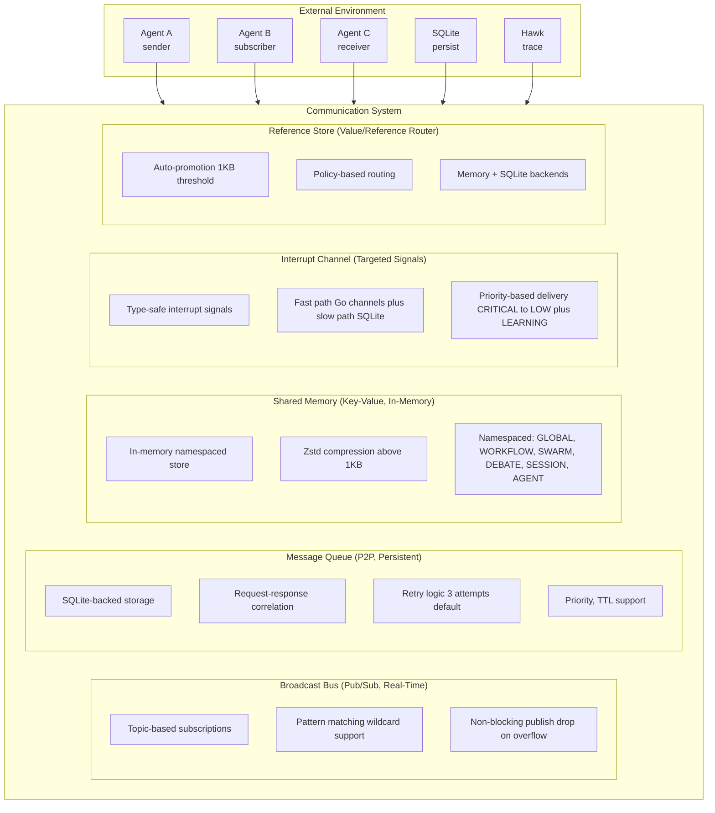

# Communication System Architecture

Architecture of Loom's quad-modal communication system for agent-to-agent messaging with intelligent routing between value and reference semantics.

**Status**: ✅ Implemented (all four channels operational with tests)

**Target Audience**: Architects, academics, and advanced developers

**Version**: v1.2.0


## Table of Contents

- [Overview](#overview)
- [Design Goals](#design-goals)
- [System Context](#system-context)
- [Architecture Overview](#architecture-overview)
- [Components](#components)
  - [Broadcast Bus (Pub/Sub)](#broadcast-bus-pubsub)
  - [Message Queue (P2P)](#message-queue-p2p)
  - [Shared Memory (Key-Value)](#shared-memory-key-value)
  - [Reference Store](#reference-store)
  - [Policy Manager](#policy-manager)
  - [Interrupt System](#interrupt-system)
- [Key Interactions](#key-interactions)
  - [Value vs Reference Semantics](#value-vs-reference-semantics)
  - [Auto-Promotion Flow](#auto-promotion-flow)
  - [Pub/Sub Pattern Matching](#pubsub-pattern-matching)
- [Data Structures](#data-structures)
- [Algorithms](#algorithms)
  - [Topic Pattern Matching](#topic-pattern-matching)
  - [Auto-Promotion Decision](#auto-promotion-decision)
  - [Message Delivery](#message-delivery)
- [Design Trade-offs](#design-trade-offs)
- [Constraints and Limitations](#constraints-and-limitations)
- [Performance Characteristics](#performance-characteristics)
- [Concurrency Model](#concurrency-model)
- [Error Handling](#error-handling)
- [Security Considerations](#security-considerations)
- [Related Work](#related-work)
- [References](#references)
- [Further Reading](#further-reading)


## Overview

The Communication System enables **efficient agent-to-agent messaging** with four complementary modes:

1. **Broadcast Bus**: Topic-based pub/sub for real-time events and coordination
2. **Message Queue**: Persistent P2P messaging with offline support and retries
3. **Shared Memory**: In-memory namespaced key-value store with zstd compression (>1KB threshold)
4. **Interrupt Channel**: Targeted, guaranteed signal delivery with type-safe enums

The system intelligently routes messages using **value semantics** (inline data) or **reference semantics** (stored data with reference ID) based on payload size and message type.

**Key Innovation**: Quad-modal communication with three-tier routing strategy that optimizes for both small ephemeral messages and large persistent data.


## Design Goals

1. **Efficient Large Payloads**: Pass 10MB+ datasets without overwhelming message bus
2. **Zero-Copy Sharing**: Multi-agent workflows share data via references, not copies
3. **Flexible Semantics**: Choose between value (inline) and reference (stored) per message type
4. **Real-Time Coordination**: Sub-millisecond pub/sub for event notifications
5. **Persistent Messaging**: SQLite-backed queue for offline agents and retries
6. **Observable**: Every message traced to Hawk with delivery guarantees

**Non-goals**:
- Distributed consensus (single-process multi-agent server only)
- Exactly-once delivery (at-most-once for bus, at-least-once for queue)
- Message ordering across topics (order guaranteed per topic/queue only)


## System Context



**External Dependencies**:
- **Agents**: Message producers and consumers
- **SQLite**: Persistent storage for queue and references
- **Hawk**: Observability tracing


## Architecture Overview

```
┌──────────────────────────────────────────────────────────────────────────────┐
│                    Communication System                                      │
│                                                                              │
│  ┌────────────────────────────────────────────────────────────────────────┐  │
│  │                  Broadcast Bus                               │         │  │
│  │                                                              │         │  │
│  │  Topics (map[string]*TopicBroadcaster)                       │         │  │
│  │    ├─ "workflow.start" → [agent1, agent2]                   │          │  │
│  │    ├─ "workflow.*.complete" → [agent3]  (wildcard)          │          │  │
│  │    └─ "agent.status" → [monitor]                            │          │  │
│  │                                                              │         │  │
│  │  Subscribers (map[string]*Subscription)                      │         │  │
│  │    ├─ Filter support (key-value predicates)                 │          │  │
│  │    ├─ Buffered channels (100 default)                       │          │  │
│  │    └─ Non-blocking delivery (drop on full buffer)           │          │  │
│  │                                                              │         │  │
│  │  Metrics (atomic counters):                                 │          │  │
│  │    - totalPublished, totalDelivered, totalDropped           │          │  │
│  └────────────────────────────────────────────────────────────────────────┘  │
│                                                                              │
│  ┌────────────────────────────────────────────────────────────────────────┐  │
│  │                  Message Queue                               │         │  │
│  │                                                              │         │  │
│  │  SQLite Storage:                                             │         │  │
│  │    - message_queue table (id, to/from, payload_json, status)│          │  │
│  │    - Indexes: (to_agent, status), (correlation_id)          │          │  │
│  │                                                              │         │  │
│  │  Queue Management:                                           │         │  │
│  │    ├─ Priority queue (high/normal/low)                      │          │  │
│  │    ├─ TTL cleanup (expired messages purged on dequeue)       │          │  │
│  │    ├─ Retry logic (dequeue count, max 3 default)            │          │  │
│  │    └─ Correlation IDs (request-response pairing)            │          │  │
│  │                                                              │         │  │
│  │  Delivery Guarantees:                                        │         │  │
│  │    - At-least-once (messages persisted before ACK)          │          │  │
│  │    - Retry 3 times (configurable)                           │          │  │
│  │    - Offline support (queued until agent available)         │          │  │
│  └────────────────────────────────────────────────────────────────────────┘  │
│                                                                              │
│  ┌────────────────────────────────────────────────────────────────────────┐  │
│  │                  Shared Memory                               │         │  │
│  │                                                              │         │  │
│  │  Namespaces (Scope):                                         │         │  │
│  │    - GLOBAL:   Shared across all agents                     │          │  │
│  │    - WORKFLOW: Scoped to workflow ID                        │          │  │
│  │    - SWARM:    Scoped to swarm ID                           │          │  │
│  │    - DEBATE:   Scoped to debate ID                          │          │  │
│  │    - SESSION:  Scoped to session ID                         │          │  │
│  │    - AGENT:    Scoped to agent ID (auto-prefixed keys)     │          │  │
│  │                                                              │         │  │
│  │  In-Memory Store:                                            │         │  │
│  │    - Per-namespace map: namespace → key → SharedMemoryValue │          │  │
│  │    - Zstd compression (>1KB auto-compress)                  │          │  │
│  │    - SHA-256 checksums (integrity)                          │          │  │
│  │    - Optimistic concurrency control (version field)         │          │  │
│  │    - Watch support (per-namespace watchers)                 │          │  │
│  │    - Per-namespace statistics (atomic counters)             │          │  │
│  └────────────────────────────────────────────────────────────────────────┘  │
│                                                                              │
│  ┌────────────────────────────────────────────────────────────────────────┐  │
│  │              Reference Store + Policy Manager                │         │  │
│  │                                                              │         │  │
│  │  Three-Tier Routing:                                         │         │  │
│  │  ┌──────────────────────────────────────────────────────────────────┐  │  │
│  │    │ Tier 1: Always Reference                │              │          │  │
│  │    │ (session_state, workflow_context)       │              │          │  │
│  │    │ → Always stored in SQLite/Memory        │              │          │  │
│  │  └──────────────────────────────────────────────────────────────────┘  │  │
│  │                     ▼                                        │         │  │
│  │  ┌──────────────────────────────────────────────────────────────────┐  │  │
│  │    │ Tier 2: Auto-Promote (1KB threshold)  │              │           │  │
│  │    │ (tool_result, general)                  │              │          │  │
│  │    │ Small: inline | Large: reference        │              │          │  │
│  │  └──────────────────────────────────────────────────────────────────┘  │  │
│  │                     ▼                                        │         │  │
│  │  ┌──────────────────────────────────────────────────────────────────┐  │  │
│  │    │ Tier 3: Always Value                    │              │          │  │
│  │    │ (control, ack, status)                  │              │          │  │
│  │    │ → Always passed inline                  │              │          │  │
│  │  └──────────────────────────────────────────────────────────────────┘  │  │
│  │                                                              │         │  │
│  │  Backends:                                                   │         │  │
│  │    - MemoryStore (TTL + ref-count GC, 5 min default)        │          │  │
│  │    - SQLiteStore (ref-count + expiry GC, 5 min default)     │          │  │
│  │    - RedisStore (planned for distributed)                   │          │  │
│  └────────────────────────────────────────────────────────────────────────┘  │
│                                                                              │
│  ┌────────────────────────────────────────────────────────────────────────┐  │
│  │           Interrupt Channel (4th channel, quad-modal)       │         │  │
│  │                                                              │         │  │
│  │  InterruptChannel:                                           │         │  │
│  │    - Targeted signal delivery to specific agents            │          │  │
│  │    - Broadcast to all handlers for a signal                 │          │  │
│  │    - Type-safe InterruptSignal enums (compile-time safe)    │          │  │
│  │    - Hawk integration for tracing (spans + metrics)         │          │  │
│  │                                                              │         │  │
│  │  Fast Path (Router):                                         │         │  │
│  │    - Go channels with priority-based buffer sizes           │          │  │
│  │    - CRITICAL/HIGH: 10,000 buffer                           │          │  │
│  │    - NORMAL: 1,000 buffer, LOW: 100 buffer                  │          │  │
│  │                                                              │         │  │
│  │  Slow Path (PersistentQueue):                                │         │  │
│  │    - SQLite-backed queue for CRITICAL signals               │          │  │
│  │    - Guaranteed delivery (retry until delivered)             │          │  │
│  │                                                              │         │  │
│  │  Signal Priorities:                                          │         │  │
│  │    - 0-9 CRITICAL: EmergencyStop, SystemShutdown,           │          │  │
│  │      ThresholdCritical, DatabaseDown, SecurityBreach         │          │  │
│  │    - 10-19 HIGH: ThresholdHigh, AlertSecurity,              │          │  │
│  │      AlertError, ResourceExhausted                          │          │  │
│  │    - 20-29 NORMAL: Wakeup, GracefulShutdown,               │          │  │
│  │      HealthCheck, ConfigReload                              │          │  │
│  │    - 30-39 LOW: MetricsCollection, LogRotation              │          │  │
│  │    - 40-49 LEARNING (NORMAL priority): LearningAnalyze,     │          │  │
│  │      LearningOptimize, LearningABTest, LearningProposal,   │          │  │
│  │      LearningValidate, LearningExport, LearningSync         │          │  │
│  │    - 1000+ CUSTOM: User-defined signals                     │          │  │
│  └────────────────────────────────────────────────────────────────────────┘  │
└──────────────────────────────────────────────────────────────────────────────┘
```


## Components

### Broadcast Bus (Pub/Sub)

**Responsibility**: Real-time event notifications via topic-based pub/sub.

**Core Structure** (`pkg/communication/bus.go:48`):
```go
type MessageBus struct {
    mu              sync.RWMutex
    topics          map[string]*TopicBroadcaster
    subscriptions   map[string]*Subscription
    refStore        ReferenceStore
    policy          *PolicyManager
    tracer          observability.Tracer
    logger          *zap.Logger
    totalPublished  atomic.Int64
    totalDelivered  atomic.Int64
    totalDropped    atomic.Int64
    closed          atomic.Bool
}
```

**Pub/Sub Pattern**:
```
Publisher ───▶ Topic ───▶ Subscriber A                                          
                     ├───▶ Subscriber B                                         
                     └───▶ Subscriber C                                         
```

**Topic Patterns** (wildcard support via Go's `path.Match`):
- `workflow.start` - Exact match
- `workflow.*` - Wildcard matches any sequence of non-Separator characters (matches `workflow.start`, `workflow.complete`, AND `workflow.step.1`)

Note: `path.Match` uses `/` as its separator, not `.`. Since Loom topics use `.` as a separator, `*` effectively matches any characters including `.` within a single `path.Match` call. This means `workflow.*` matches `workflow.step.1` (which may be surprising). Multi-segment `**` wildcards are NOT supported by `path.Match`.

**Subscription Filters** (`proto/loom/v1/bus.proto:48-61`):
```go
filter := &loomv1.SubscriptionFilter{
    FromAgents: []string{"agent-a", "agent-b"},   // Only messages from these agents
    Metadata: map[string]string{                   // All must match (AND logic)
        "workflow_id": "wf-123",
        "priority":    "high",
    },
}
```

The `SubscriptionFilter` proto message (`bus.proto:49`) has four fields: `from_agents` (repeated string), `min_size` (int64), `max_size` (int64), and `metadata` (map). All filter conditions are AND-ed together. Note: the current `matchesFilter()` implementation only evaluates `from_agents` and `metadata`; `min_size` and `max_size` are defined in the proto but not yet enforced in filtering logic.

**Delivery Guarantees**:
- **Non-blocking**: Publish never blocks on slow subscribers
- **Drop on overflow**: If subscriber buffer full (100 messages), message dropped
- **No persistence**: Messages not persisted (use Queue for reliable delivery)
- **At-most-once**: Each subscriber receives message once (if available)

**Rationale**:
- **Real-time coordination**: Sub-millisecond latency for events
- **No backpressure**: Publishers never blocked by slow consumers
- **Ephemeral**: Events are transient (use Queue for important messages)


### Message Queue (P2P)

**Responsibility**: Persistent point-to-point messaging with offline support and retries.

**Core Structure** (`pkg/communication/queue.go:83`):
```go
type MessageQueue struct {
    mu sync.RWMutex

    // Per-agent queues (agent ID → queue of messages)
    queues map[string][]*QueueMessage

    // In-flight messages (message ID → message) for acknowledgment tracking
    inFlight map[string]*QueueMessage

    // Response waiting (correlation ID → response channel) for request-response pattern
    pendingResponses map[string]chan *QueueMessage

    // Event-driven notifications (agent ID → notification channel)
    notificationChannels map[string]chan struct{}

    // Persistent storage
    db     *sql.DB
    dbPath string

    // Dependencies
    tracer observability.Tracer
    logger *zap.Logger

    // Statistics (atomic counters)
    totalEnqueued atomic.Int64
    totalDequeued atomic.Int64
    totalAcked    atomic.Int64
    totalFailed   atomic.Int64
    totalExpired  atomic.Int64

    // Lifecycle
    closed atomic.Bool
}
```

**SQLite Schema** (table name: `message_queue`):
```sql
CREATE TABLE IF NOT EXISTS message_queue (
    id              TEXT PRIMARY KEY,
    to_agent        TEXT NOT NULL,
    from_agent      TEXT NOT NULL,
    message_type    TEXT NOT NULL,
    payload_json    TEXT NOT NULL,
    metadata_json   TEXT,
    correlation_id  TEXT,
    priority        INTEGER DEFAULT 0,
    enqueued_at     INTEGER NOT NULL,
    expires_at      INTEGER NOT NULL,
    dequeue_count   INTEGER DEFAULT 0,
    max_retries     INTEGER DEFAULT 3,
    status          INTEGER DEFAULT 0,
    created_at      INTEGER NOT NULL,
    updated_at      INTEGER NOT NULL
);

CREATE INDEX IF NOT EXISTS idx_to_agent ON message_queue(to_agent, status);
CREATE INDEX IF NOT EXISTS idx_status ON message_queue(status);
CREATE INDEX IF NOT EXISTS idx_expires_at ON message_queue(expires_at);
CREATE INDEX IF NOT EXISTS idx_correlation_id ON message_queue(correlation_id);
```

**Message States** (integer enum `QueueMessageStatus`):
- `0 (Pending)`: Queued, awaiting delivery
- `1 (InFlight)`: Dequeued, awaiting acknowledgment
- `2 (Acked)`: Successfully processed by agent
- `3 (Failed)`: Max retries exceeded
- `4 (Expired)`: TTL exceeded

**Delivery Flow**:
```
Enqueue(msg) ───▶ Persist to SQLite ───▶ Add to in-memory queue
                                              │
                                              ▼
                                        Notify agent via channel
                                              │
                                              ▼
                                        Agent calls Dequeue()
                                              │
                                              ▼
                                    Message marked InFlight
                                              │
                                     ┌────────┴────────┐
                                     ▼                  ▼
                              Acknowledge()        Requeue()
                              (mark Acked)     (back to Pending)
```

**Retry Logic** (dequeue count tracking):
```
Dequeue 1: Immediate delivery attempt → Ack or Requeue
Dequeue 2: Immediate delivery attempt → Ack or Requeue
Dequeue 3: Immediate delivery attempt → Ack or mark as Failed
(Default MaxRetries = 3, configurable per message)
```

Messages are requeued to Pending state on failure. No explicit backoff delay is applied between retries in the MessageQueue. The queue relies on the consumer (agent) to Acknowledge or Requeue messages after processing.

**Request-Response Correlation**:

The `SendAndReceive` method handles correlation automatically:
```go
// Agent A sends request and blocks waiting for response
responsePayload, err := queue.SendAndReceive(
    ctx, "agent-a", "agent-b", "query",
    requestPayload, metadata, 30, // 30s timeout
)
```

Internally, `SendAndReceive` generates a unique `CorrelationID` (format: `corr-{fromAgent}-{timestamp}`), creates a buffered response channel, and blocks until a response message with the same CorrelationID arrives or the timeout elapses. The responding agent's reply is routed to the waiting channel by the `Enqueue` method when it detects a matching CorrelationID.

**Rationale**:
- **Persistent**: Messages survive server restart
- **Reliable**: At-least-once delivery with retries
- **Offline support**: Messages queued until agent available
- **Request-response**: Correlation IDs enable RPC-style interaction


### Shared Memory (Key-Value)

**Responsibility**: Namespaced in-memory key-value store for zero-copy agent state sharing with optimistic concurrency control.

**Core Structure** (`pkg/communication/shared_memory.go:49`):
```go
type SharedMemoryStore struct {
    mu sync.RWMutex

    // Per-namespace storage: namespace → key → value
    data map[loomv1.SharedMemoryNamespace]map[string]*loomv1.SharedMemoryValue

    // Per-namespace statistics
    stats map[loomv1.SharedMemoryNamespace]*SharedMemoryNamespaceStats

    // Watchers: namespace → watcher list
    watchers map[loomv1.SharedMemoryNamespace][]*SharedMemoryWatcher

    // Dependencies
    tracer observability.Tracer
    logger *zap.Logger

    // Compression encoder/decoder (reusable, thread-safe)
    encoder *zstd.Encoder
    decoder *zstd.Decoder

    // Lifecycle
    closed atomic.Bool
}
```

**Namespaces** (proto enum `SharedMemoryNamespace`):
- `GLOBAL` - Shared across all agents
- `WORKFLOW` - Scoped to workflow instance
- `SWARM` - Scoped to agent swarm
- `DEBATE` - Scoped to debate session
- `SESSION` - Scoped to user session
- `AGENT` - Scoped to agent instance (keys auto-prefixed with `agent:{agentID}:`)

**Key Scoping** (for AGENT namespace):
```
Format: agent:{agent_id}:{key}

Examples:
  agent:agent-a:my_data       (auto-prefixed, isolated per agent)
```
Other namespaces use keys directly without scoping.

**Storage Model**:
```
┌──────────────────────────────────────────────────────────────────────────────┐
│   In-Memory Store (per-namespace maps)                                       │
│                                                                              │
│   Fast access (<1ms)                                                         │
│   Zstd compression (>1KB auto-compress)                                      │
│   SHA-256 checksums                                                          │
│   Optimistic concurrency control (version field)                             │
│   Watch support (per-namespace watchers)                                     │
│   Per-namespace statistics (atomic counters)                                 │
└──────────────────────────────────────────────────────────────────────────────┘
```

Note: The current implementation is in-memory only. There is no disk tier or LRU eviction. All data lives in the per-namespace maps and is lost on process restart.

**Compression** (>1KB auto-compress with zstd, `CompressionThreshold = 1024`):
- Only compresses if the compressed result is smaller than the original
- Decompression is transparent on Get (always returns decompressed data)

**Rationale**:
- **Shared state**: Agents share data via namespaced keys without message passing
- **Concurrency safety**: Optimistic concurrency control via version fields
- **Integrity**: SHA-256 checksums detect corruption
- **Reactivity**: Watchers enable event-driven responses to state changes
- **Isolation**: AGENT namespace auto-scopes keys to prevent cross-agent access


### Reference Store

**Responsibility**: Route messages between value (inline) and reference (stored) semantics.

**Three-Tier Routing**:
```
Message Type ───▶ Policy Lookup ───▶ Tier Assignment                            
                                          │                                     
┌──────────────────────────────────────────────────────────────────────────────┐
                   │                      │                      │              
                   ▼                      ▼                      ▼
┌──────────────────────────────────────────────────────────────────────────────┐
           │ Tier 1:      │      │ Tier 2:      │      │ Tier 3:      │         
           │ Always Ref   │      │ Auto-Promote │      │ Always Value │         
           │              │      │              │      │              │         
           │ session_state│      │ tool_result  │      │ control      │         
           │ workflow_ctx │      │ general      │      │ ack          │         
└──────────────────────────────────────────────────────────────────────────────┘
                   │                      │                      │              
                   ▼                      ▼                      ▼
            Store in DB         Size > 1KB?              Inline value
            Return ref ID       Yes: ref, No: value
```

**ReferenceStore Interface** (`pkg/communication/store.go:24`):
```go
type ReferenceStore interface {
    Store(ctx context.Context, data []byte, opts StoreOptions) (*loomv1.Reference, error)
    Resolve(ctx context.Context, ref *loomv1.Reference) ([]byte, error)
    Retain(ctx context.Context, refID string) error   // Increment ref count
    Release(ctx context.Context, refID string) error   // Decrement ref count (may trigger GC)
    List(ctx context.Context) ([]*loomv1.Reference, error)
    Stats(ctx context.Context) (*StoreStats, error)
    Close() error
}
```

**Implementations**:
1. **MemoryStore**: In-memory with TTL + reference-count GC (5 min default GC interval)
2. **SQLiteStore**: Persistent with reference counting + expiry GC (5 min default GC interval)
3. **RedisStore**: 📋 Planned for distributed deployments

**Policy Factory Functions** (actual functions in `policy.go`):
```go
// Session state (Tier 1: Always Reference)
policy := NewSessionStatePolicy()

// Workflow context (Tier 1: Always Reference)
policy := NewWorkflowContextPolicy()

// Control messages (Tier 3: Always Value)
policy := NewControlMessagePolicy()

// Tool result (Tier 2: Auto-Promote, custom threshold)
policy := NewToolResultPolicy(1024)  // 1KB threshold

// Default policy (Tier 2: Auto-Promote, 1KB threshold)
policy := DefaultPolicy()
```


### Policy Manager

**Responsibility**: Determine routing strategy (value vs reference) per message type.

**Core Structure** (`pkg/communication/policy.go`):
```go
type PolicyManager struct {
    defaultPolicy *loomv1.CommunicationPolicy
    policies      map[string]*loomv1.CommunicationPolicy
}
```

Note: `PolicyManager` has no mutex because policies are typically set at initialization time before concurrent use. `CommunicationPolicy` is a protobuf message defined in `communication.proto` with fields: `tier` (CommunicationTier enum), `message_type`, `auto_promote` (AutoPromoteConfig), and `overrides`.

**Decision Algorithm** (`ShouldUseReference`):
```go
func (pm *PolicyManager) ShouldUseReference(messageType string, payloadSize int64) bool {
    policy := pm.GetPolicy(messageType)

    // Check for policy override first
    if override, ok := policy.Overrides[messageType]; ok {
        return override.Type == loomv1.PolicyOverride_OVERRIDE_TYPE_FORCE_REFERENCE
    }

    switch policy.Tier {
    case COMMUNICATION_TIER_ALWAYS_VALUE:
        return false
    case COMMUNICATION_TIER_ALWAYS_REFERENCE:
        return true
    case COMMUNICATION_TIER_AUTO_PROMOTE:
        if policy.AutoPromote != nil && policy.AutoPromote.Enabled {
            return payloadSize > policy.AutoPromote.ThresholdBytes
        }
        return payloadSize > 1024 // Fallback: 1KB
    default:
        return false
    }
}
```


### Interrupt System

**Responsibility**: Priority-based agent interruption with type-safe signal enums and two-path delivery (fast Go channels + slow persistent SQLite queue).

**Core Structures**:

`InterruptChannel` (`pkg/communication/interrupt/channel.go:72`):
```go
type InterruptChannel struct {
    ctx    context.Context
    cancel context.CancelFunc
    router *Router             // Fast-path delivery via Go channels
    queue  *PersistentQueue    // Slow-path delivery for CRITICAL signals
    mu       sync.RWMutex
    handlers map[string]map[InterruptSignal]*HandlerRegistration
    tracer   observability.Tracer
}
```

`Router` (`pkg/communication/interrupt/router.go:51`):
```go
type Router struct {
    ctx    context.Context
    cancel context.CancelFunc
    mu      sync.RWMutex
    entries map[string]map[InterruptSignal]*routerEntry // agentID -> signal -> entry
    wg      sync.WaitGroup
    tracer  observability.Tracer
}
```

Each registered handler gets a dedicated channel with a priority-appropriate buffer size. Background goroutines process each handler's queue.

**Signal Types** (type-safe `InterruptSignal` enum in `signals.go`):
- `SignalEmergencyStop` (0): Halt all operations
- `SignalSystemShutdown` (1): Graceful system-wide shutdown
- `SignalThresholdCritical` (2): Critical threshold breach
- `SignalDatabaseDown` (3): Database unavailability
- `SignalSecurityBreach` (4): Confirmed security incident
- `SignalWakeup` (20): Wake dormant agent
- `SignalConfigReload` (23): Hot-reload configuration
- `SignalLearningAnalyze` (40) through `SignalLearningSync` (46): Learning triggers

**Two-Path Delivery**:
```
Send(signal, target, payload)
    │
    ├─ Fast Path: Go channel (non-blocking send)
    │   ├─ Delivered? → Done
    │   └─ Buffer full?
    │       ├─ CRITICAL signal → Fall back to Slow Path
    │       └─ Non-critical → Drop (return error)
    │
    └─ Slow Path: PersistentQueue (SQLite)
        ├─ Enqueue to SQLite
        ├─ Background retry loop (100ms poll, exponential backoff)
        └─ Max 50 retries, then mark as failed
```

**Buffer Sizes by Priority**:
- `CRITICAL` (0-9): 10,000 buffer
- `HIGH` (10-19): 10,000 buffer
- `NORMAL` (20-29): 1,000 buffer
- `LOW` (30-39): 100 buffer

Note: Judge system integration is not directly wired. Interrupts can be sent from any component, including a Judge evaluator, via the `Send()` / `Broadcast()` methods.


## Key Interactions

### Value vs Reference Semantics

```
Agent Send        Policy Manager    Reference Store    Agent Receive
  │                     │                  │                │                   
  ├─ Send(data, type) ─▶│                  │                │                   
  │                     ├─ Lookup policy   │                │                   
  │                     ├─ Check size      │                │                   
  │                     │                  │                │                   
  │  (Small message, value semantics)      │                │                   
  │                     ├─ Return VALUE    │                │                   
  │◀─ Message(value) ───┤                  │                │                   
  │                     │                  │                │                   
  ├─ Publish/Enqueue ───┼──────────────────┼───────────────▶│                   
  │  (inline value)     │                  │                ├─ Receive(msg)     
  │                     │                  │                ├─ Extract value    
  │                     │                  │                │                   
  │                     │                  │                │                   
  │  (Large message, reference semantics)  │                │                   
  │                     ├─ Store(data) ────▶│                │                  
  │                     │◀─ ref_id ─────────┤                │                  
  │◀─ Message(ref) ─────┤                  │                │                   
  │                     │                  │                │                   
  ├─ Publish/Enqueue ───┼──────────────────┼───────────────▶│                   
  │  (ref_id only)      │                  │                ├─ Receive(msg)     
  │                     │                  │                ├─ Resolve(ref) ─▶│ 
  │                     │                  │◀─ data ─────────┤                  
  │                     │                  │                │                   
```

**Token Optimization**:
```
Before (value): 10K-row SQL result = 1.3MB JSON = ~15,000 tokens
After (reference): ref_id = "ref_abc123" = ~50 tokens
Savings: 99.67%
```


### Auto-Promotion Flow

```
Send(data, "tool_result") ───▶ Policy: AUTO_PROMOTE (1KB threshold)            
                                   │                                            
                                   ├─ Serialize data → JSON                     
                                   ├─ Check size: len(JSON)                     
                                   │                                            
                                   ├─ Size < 1KB?                              
                                   │   ├─ Yes: Return VALUE message             
                                   │   │       (inline JSON)                    
                                   │   │                                        
                                   │   └─ No: Store in ReferenceStore           
                                   │         │                                  
                                   │         ├─ Write to SQLite/Memory          
                                   │         ├─ Generate ref_id                 
                                   │         └─ Return REFERENCE message        
                                   │               (ref_id only)                
                                   │                                            
                                   ▼
                            Message with payload
```

**Size Determination**:
The caller provides `payloadSize int64` directly to `PolicyManager.ShouldUseReference()`. There is no separate `calculateSize` function; size is computed by the caller from the serialized payload length.


### Pub/Sub Pattern Matching

Pattern matching uses Go's `path.Match()` function (not a custom implementation). Since `path.Match` uses `/` as its separator (not `.`), `*` matches any characters including `.` in dot-separated topics. Multi-segment `**` wildcards are NOT supported by `path.Match`.

```
Subscribe("workflow.*") ───▶ Pattern: workflow.{any_chars}
                                │
                                ▼
                         Incoming topics:
                            ├─ "workflow.start" ✓ (match)
                            ├─ "workflow.complete" ✓ (match)
                            ├─ "workflow.step.1" ✓ (match, * crosses dots)
                            └─ "agent.status" ✗ (no match, different prefix)
```

**Matching Algorithm** (`pkg/communication/bus.go:461`):
```go
func matchesTopicPattern(pattern, topic string) bool {
    // Exact match
    if pattern == topic {
        return true
    }

    // Wildcard match using path.Match semantics
    matched, err := path.Match(pattern, topic)
    if err != nil {
        return false
    }
    return matched
}
```


## Data Structures

### BusMessage

**Definition** (`proto/loom/v1/bus.proto`):
```protobuf
message BusMessage {
  string id = 1;                      // Unique message ID for tracking
  string topic = 2;                   // Topic name
  string from_agent = 3;              // Source agent ID
  MessagePayload payload = 4;         // Value or reference (via MessagePayload oneof)
  map<string, string> metadata = 5;   // Arbitrary key/value for filtering
  int64 timestamp = 6;                // Publish timestamp (Unix milliseconds)
  int32 ttl_seconds = 7;              // TTL (0 = no expiry)
}
```

`MessagePayload` is defined in `communication.proto` and contains a `oneof data { bytes value = 1; Reference reference = 2; }` plus `PayloadMetadata`.

### QueueMessage

**Definition** (Go struct in `pkg/communication/queue.go:54`, not a proto message):
```go
type QueueMessage struct {
    ID            string
    ToAgent       string
    FromAgent     string
    MessageType   string
    Payload       *loomv1.MessagePayload  // Value or reference via proto oneof
    Metadata      map[string]string
    CorrelationID string                  // Request-response pairing
    Priority      int32                   // Higher = more urgent
    EnqueuedAt    time.Time
    ExpiresAt     time.Time
    DequeueCount  int32
    MaxRetries    int32                   // Default: 3
    Status        QueueMessageStatus      // Integer enum (Pending/InFlight/Acked/Failed/Expired)
}
```

### Reference

**Definition** (`proto/loom/v1/communication.proto:89`):
```protobuf
message Reference {
  string id = 1;                      // Unique reference identifier (SHA-256 of data)
  ReferenceType type = 2;             // SESSION_STATE, WORKFLOW_CONTEXT, TOOL_RESULT, etc.
  ReferenceStore store = 3;           // MEMORY, SQLITE, or REDIS
  int64 created_at = 4;               // Unix seconds
  int64 expires_at = 5;               // Unix seconds (0 = never expires)
}

enum ReferenceStore {
  REFERENCE_STORE_UNSPECIFIED = 0;
  REFERENCE_STORE_MEMORY = 1;
  REFERENCE_STORE_SQLITE = 2;
  REFERENCE_STORE_REDIS = 3;
}
```

Note: Size, checksum, compression, and content type metadata live in the separate `PayloadMetadata` message on the `MessagePayload` envelope, not on the `Reference` itself.


## Algorithms

### Topic Pattern Matching

**Problem**: Match incoming topic against wildcard patterns efficiently.

**Solution**: Delegate to Go's `path.Match()` which uses `/` as separator. Since Loom topics use `.` separators, `*` crosses dot boundaries.

**Algorithm**:
```
Input: pattern="workflow.*", topic="workflow.start"
→ path.Match("workflow.*", "workflow.start") = true ✓

Input: pattern="workflow.*", topic="workflow.step.1"
→ path.Match("workflow.*", "workflow.step.1") = true ✓
   (* crosses dots because . is not a path separator for path.Match)

Input: pattern="workflow.*", topic="agent.status"
→ path.Match("workflow.*", "agent.status") = false ✗
   (prefix "workflow." does not match "agent.")
```

**Complexity**: O(n) where n = len(pattern) + len(topic) (path.Match is linear)


### Auto-Promotion Decision

**Problem**: Decide whether to inline data or store as reference.

**Solution**: Three-tier policy with size threshold.

**Algorithm** (maps to `PolicyManager.ShouldUseReference` in `policy.go`):
```go
func (pm *PolicyManager) ShouldUseReference(messageType string, payloadSize int64) bool {
    policy := pm.GetPolicy(messageType)

    // Check override first
    if override, ok := policy.Overrides[messageType]; ok {
        return override.Type == OVERRIDE_TYPE_FORCE_REFERENCE
    }

    switch policy.Tier {
    case ALWAYS_VALUE:
        return false
    case ALWAYS_REFERENCE:
        return true
    case AUTO_PROMOTE:
        if policy.AutoPromote != nil && policy.AutoPromote.Enabled {
            return payloadSize > policy.AutoPromote.ThresholdBytes
        }
        return payloadSize > 1024  // Fallback 1KB
    default:
        return false
    }
}
```

**Default Thresholds**:
- Tier 1 (Always Reference): N/A (always stored)
- Tier 2 (Auto-Promote): 1KB
- Tier 3 (Always Value): N/A (never stored)


### Message Delivery

**Problem**: Deliver messages to subscribers without blocking publisher.

**Solution**: Non-blocking channel send with drop on overflow.

**Algorithm** (inline in `MessageBus.Publish`, not a separate function):
```go
// Inside Publish(), for each matching subscription:
select {
case subscription.channel <- msg:
    delivered++
default:
    // Channel full - drop message to avoid blocking publisher
    dropped++
}
```

**Rationale**: Publisher never blocks on slow subscriber (prevents cascading failures).


## Design Trade-offs

### Decision 1: Non-Blocking Pub/Sub vs. Reliable Delivery

**Chosen**: Non-blocking pub/sub (drop on overflow)

**Rationale**:
- **No backpressure**: Fast publishers not slowed by slow subscribers
- **Bounded memory**: Buffer size limits memory usage per subscriber
- **Cascading failure prevention**: One slow subscriber doesn't affect others

**Alternatives**:
1. **Blocking publish** (wait for all subscribers):
   - ✅ Guaranteed delivery
   - ❌ Publishers blocked by slowest subscriber
   - ❌ Cascading failures

2. **Persistent pub/sub** (store all messages):
   - ✅ No message loss
   - ❌ Unbounded memory growth
   - ❌ Complex GC logic

**Consequences**:
- ✅ Fast, predictable pub/sub latency
- ✅ No cascading failures
- ❌ At-most-once delivery (messages may be dropped)
- ❌ Use Queue for important messages

**Mitigation**: Use Message Queue for reliable delivery (at-least-once with retries).


### Decision 2: SQLite Queue vs. In-Memory Queue

**Chosen**: SQLite-backed queue with persistence

**Rationale**:
- **Crash recovery**: Messages survive server restart
- **Offline agents**: Messages queued until agent available
- **Audit trail**: Full message history for debugging

**Alternatives**:
1. **In-memory queue only**:
   - ✅ Faster (no disk I/O)
   - ❌ Messages lost on restart
   - ❌ No offline support

2. **Redis/RabbitMQ**:
   - ✅ Distributed queuing
   - ❌ External dependency
   - ❌ Deployment complexity

**Consequences**:
- ✅ Reliable, persistent messaging
- ✅ Offline agent support
- ✅ No external dependencies
- ❌ Disk I/O latency (5-15ms write)
- ❌ Single-process only (no distribution)


### Decision 3: Three-Tier Routing vs. Single Threshold

**Chosen**: Three-tier routing (Always Ref / Auto-Promote / Always Value)

**Rationale**:
- **Flexibility**: Different message types have different needs
- **Optimization**: Small control messages always inline (no storage overhead)
- **Safety**: Session state always persistent (no data loss)

**Alternatives**:
1. **Single threshold** (e.g., always auto-promote at 1KB):
   - ✅ Simpler implementation
   - ❌ Cannot enforce "always reference" for session state
   - ❌ Wastes storage on small ephemeral messages

2. **Two-tier** (Value or Reference only):
   - ✅ Simpler decision logic
   - ❌ No auto-promotion (manual threshold checks everywhere)

**Consequences**:
- ✅ Per-message-type optimization
- ✅ Enforce data persistence for critical types
- ✅ Avoid storage overhead for ephemeral messages
- ❌ More complex policy configuration
- ❌ Three code paths to test


## Constraints and Limitations

### Constraint 1: Single-Process Only

**Description**: Message Queue and Shared Memory do not support distributed agents

**Impact**: All agents must run in same process (multi-agent server)

**Workaround**: Future RedisStore implementation for distributed deployments


### Constraint 2: At-Most-Once Pub/Sub

**Description**: Broadcast Bus drops messages if subscriber buffer full

**Impact**: Events may be lost if subscriber slow

**Workaround**: Use Message Queue for reliable delivery


### Constraint 3: Reference GC Interval

**Description**: Both MemoryStore and SQLiteStore run periodic GC (default 5 minute interval)

**Impact**: Expired or zero-refcount references accumulate between GC runs

**Workaround**: Tune GC interval via constructor parameter for shorter accumulation windows


## Performance Characteristics

### Latency (P50/P99)

| Operation | P50 | P99 | Notes |
|-----------|-----|-----|-------|
| Bus publish | <1ms | 2ms | In-memory, non-blocking |
| Bus subscribe | <1ms | 2ms | Map insert |
| Queue send (SQLite) | 5ms | 15ms | Disk write + fsync |
| Queue receive | 3ms | 8ms | SQLite read |
| Shared mem write | <1ms | 5ms | In-memory map |
| Shared mem read | <1ms | 2ms | Map lookup |
| Reference store (memory) | <1ms | 5ms | In-memory |
| Reference store (SQLite) | 5ms | 15ms | Database write |
| Reference resolve (memory) | <1ms | 2ms | Map lookup |
| Reference resolve (SQLite) | 3ms | 8ms | Database read |

### Memory Usage

| Component | Size |
|-----------|------|
| Broadcast Bus (1000 subscribers) | ~500KB (channels + metadata) |
| Message Queue (1000 messages) | ~10MB (SQLite + indexes) |
| Shared Memory (in-memory) | Unbounded (no configurable limit) |
| Reference Store (memory) | Proportional to stored data (separate from Shared Memory) |
| Reference Store (SQLite) | ~5MB per 1000 refs |

### Throughput

- **Bus publish**: 100,000+ msg/s (in-memory)
- **Queue send**: 1,000 msg/s (SQLite bound)
- **Shared memory write**: 10,000+ writes/s (in-memory)


## Concurrency Model

### Broadcast Bus

**Model**: RWMutex protects topics map, atomic counters for metrics

**Readers**: Concurrent publishes (RLock)
**Writers**: Subscribe/unsubscribe (Lock)

**Delivery**: Non-blocking channel send (drop on full)


### Message Queue

**Model**: SQLite persistence + in-memory per-agent queues + event-driven notification channels

**Write Path**: Persist to SQLite, then add to in-memory queue and notify via channel
**Read Path**: Priority-based dequeue from in-memory queue (highest priority first)

**Event-Driven**: Agents register notification channels (`chan struct{}`) for immediate wakeup when messages arrive. No polling goroutines.


### Shared Memory

**Model**: RWMutex protects per-namespace maps, zstd encoder/decoder are thread-safe

**In-Memory Store**: RWMutex (concurrent reads, exclusive writes)
**Optimistic Concurrency**: Version field on each value; writes with `expected_version` fail on conflict
**Watchers**: Notified under write lock (non-blocking channel send, drop on full)


## Error Handling

### Strategy

1. **Graceful Degradation**: If ReferenceStore unavailable, fall back to inline value
2. **Retry Logic**: Message Queue retries failed deliveries (3 attempts)
3. **Drop Non-Critical**: Broadcast Bus drops overflow messages (log warning)
4. **Fail Fast**: Invalid references return error immediately

### Error Propagation

```
Reference Resolve Failure ───▶ Return Error ───▶ Agent handles                  
                                    │                                           
                                    ▼
                              Log + Trace to Hawk


Queue Delivery Failure ───▶ Requeue (up to 3 attempts) ───▶ Mark as failed
                                │                                │
                                ▼                                ▼
                          Re-enter Pending               Log + update status


Bus Publish Overflow ───▶ Drop Message ───▶ Increment totalDropped              
                               │                                                
                               ▼
                          Log Warning
```


## Security Considerations

### Threat Model

1. **Unauthorized Reference Access**: Agent accesses reference from different namespace
2. **Message Injection**: Malicious agent sends fake messages
3. **Resource Exhaustion**: Agent fills queue/memory with large messages

### Mitigations

**Unauthorized Access**:
- Shared Memory: Namespace scoping (WORKFLOW, SWARM, SESSION, AGENT)
- AGENT namespace: Keys auto-prefixed with `agent:{agentID}:` to prevent cross-agent access
- Reference IDs are SHA-256 content hashes (no namespace prefix; access control is not enforced on ReferenceStore)
- Validation on SharedMemoryStore operations (namespace + agent scoping)

**Message Injection**:
- Agent ID validation (from_agent must match authenticated agent)
- Signature/MAC for critical messages (future)

**Resource Exhaustion**:
- Message TTL (default 24 hours, expired messages purged on dequeue)
- Reference GC (MemoryStore: periodic TTL + ref-count GC; SQLiteStore: periodic expired + zero-refcount cleanup)
- Shared memory has no built-in size limits (unbounded in-memory maps)
- Bus subscriber buffer limits (default 100 messages, drop on overflow)


## Related Work

### Message Passing Systems

1. **Akka** (Scala): Actor-based messaging
   - **Similar**: Pub/sub, P2P messaging
   - **Loom differs**: Value/reference routing, tiered storage

2. **RabbitMQ**: Message broker
   - **Similar**: Queue-based messaging, persistence
   - **Loom differs**: Embedded (no separate broker), auto-promotion

3. **Redis Pub/Sub**: In-memory pub/sub
   - **Similar**: Topic-based subscriptions
   - **Loom differs**: Reference semantics, integrated with Queue/Shared Memory

### Reference Passing

1. **Apache Arrow Flight**: Zero-copy data transfer
   - **Similar**: Reference-based large data passing
   - **Loom differs**: Automatic value/reference decision, tiered storage

2. **Cap'n Proto**: Serialization with capability-based references
   - **Similar**: Reference semantics for large structures
   - **Loom differs**: Runtime decision (not compile-time), policy-based


## References

1. Akka Documentation. Actor Model and Message Passing. https://doc.akka.io/docs/akka/current/typed/actors.html

2. RabbitMQ Patterns. Message Queue Patterns and Best Practices. https://www.rabbitmq.com/getstarted.html

3. Gregor Hohpe & Bobby Woolf (2003). *Enterprise Integration Patterns*. Addison-Wesley. (Pub/Sub, Message Queue patterns)


## Further Reading

### Architecture Deep Dives

- [Multi-Agent Orchestration](multi-agent.md) - Workflow patterns using quad-modal communication
- [Memory System Architecture](memory-systems.md) - Shared Memory integration
- [Loom System Architecture](loom-system-architecture.md) - Overall system design

### Reference Documentation

- [Agent Configuration Reference](/docs/reference/agent-configuration.md) - Communication configuration

### Guides

- [Getting Started](/docs/guides/quickstart.md) - Quick start guide

Note: `/docs/reference/communication-api.md` and `/docs/guides/multi-agent-communication.md` do not yet exist.
