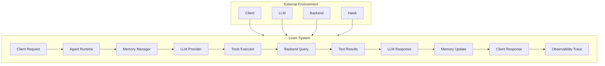

# Data Flow Architecture

End-to-end data flows showing how information moves through Loom's multi-layered system, from client request through agent execution, memory management, tool invocation, and observability.

**Target Audience**: Architects, academics, and advanced developers

**Version**: v1.2.0

**Status Indicators**: ✅ Verified against codebase | ⚠️ Simplified or approximate | 📋 Conceptual (not directly reflected in code)


## Table of Contents

- [Overview](#overview)
- [Design Goals](#design-goals)
- [System Context](#system-context)
- [Data Flow Categories](#data-flow-categories)
- [Core Flows](#core-flows)
  - [Agent Conversation Flow](#agent-conversation-flow)
  - [Tool Execution Flow](#tool-execution-flow)
  - [Memory Management Flow](#memory-management-flow)
  - [Pattern Matching Flow](#pattern-matching-flow)
- [Advanced Flows](#advanced-flows)
  - [Reference-Based Data Passing](#reference-based-data-passing)
  - [Multi-Agent Workflow Flow](#multi-agent-workflow-flow)
  - [Session Recovery Flow](#session-recovery-flow)
  - [Pattern Hot-Reload Flow](#pattern-hot-reload-flow)
- [Cross-Cutting Flows](#cross-cutting-flows)
  - [Observability Trace Flow](#observability-trace-flow)
  - [Cost Attribution Flow](#cost-attribution-flow)
- [Data Structures](#data-structures)
- [Flow Properties](#flow-properties)
- [Performance Characteristics](#performance-characteristics)
- [Related Work](#related-work)
- [References](#references)
- [Further Reading](#further-reading)


## Overview

Loom's architecture involves complex data flows across 10+ subsystems. This document traces data movement through:

1. **Agent Conversation Flow**: User message → LLM invocation → tool execution → response
2. **Tool Execution Flow**: Tool call → backend query → result processing → memory storage
3. **Memory Management Flow**: Message addition → L1 cache → L2 compression → Swap eviction → SQLite persistence
4. **Pattern Matching Flow**: Query → keyword-based search → pattern selection → prompt injection
5. **Reference-Based Data Passing**: Large result → gzip compression → shared memory → reference ID
6. **Multi-Agent Workflow Flow**: YAML load → pattern routing → stage execution → result merge
7. **Session Recovery Flow**: Crash → session load → memory reconstruction → resume
8. **Pattern Hot-Reload Flow**: File change → fsnotify → YAML parse → debounced reload
9. **Observability Trace Flow**: Span creation → attribute collection → batch export → Hawk
10. **Cost Attribution Flow**: Token counting → pricing calculation → aggregation → trace export

**Key Innovation**: Data flows show complete lifecycle including error paths, retry logic, and observability integration.


## Design Goals

1. **End-to-End Visibility**: Trace data from client request to Hawk export
2. **Error Path Documentation**: Show not just happy paths but failure handling
3. **Performance Bottlenecks**: Identify critical paths and latency sources
4. **Memory Efficiency**: Document where data is compressed, cached, or evicted
5. **Concurrency Patterns**: Show parallel execution and synchronization points

**Non-goals**:
- Code-level implementation details (see architecture docs for that)
- API specifications (see reference docs)
- Configuration examples (see guides)


## System Context


```mermaid
flowchart TB
    subgraph External["External Environment"]
        Client[Client]
        LLM[LLM]
        Backend[Backend]
        Hawk[Hawk]
    end

    subgraph LoomSystem["Loom System"]
        ClientReq[Client Request] --> AgentRuntime[Agent Runtime]
        AgentRuntime --> MemoryManager[Memory Manager]
        MemoryManager --> LLMProvider[LLM Provider]
        LLMProvider --> ToolsExecutor[Tools Executor]
        ToolsExecutor --> BackendQuery[Backend Query]
        BackendQuery --> ToolResults[Tool Results]
        ToolResults --> LLMResponse[LLM Response]
        LLMResponse --> MemoryUpdate[Memory Update]
        MemoryUpdate --> ClientResponse[Client Response]
        ClientResponse --> ObsTrace[Observability Trace]
    end

    Client --> LoomSystem
    LLM --> LoomSystem
    Backend --> LoomSystem
    Hawk --> LoomSystem
```

**Data Flow Direction**:
- **→**: Synchronous data flow (blocking)
- **- - →**: Asynchronous data flow (non-blocking)
- **◀**: Response/return data flow


## Data Flow Categories

### 1. Request-Response Flows
- Agent conversation (client → agent → LLM → client)
- Tool execution (LLM → executor → backend → executor → LLM)
- Pattern matching (query → matcher → patterns → prompt)

### 2. State Management Flows
- Memory management (messages → L1 → L2 → Swap → SQLite)
- Session persistence (session → SQLite → recovery)
- Shared memory (large data → gzip compression → LRU cache → overflow handler)

### 3. Configuration Flows
- Pattern hot-reload (file change → fsnotify → parser → debounced reload)
- Agent config reload (YAML edit → watcher → validation → reload)
- Prompt versioning (FileRegistry → cache → memory ROM)

### 4. Observability Flows
- Trace export (span creation → buffering → batch → Hawk)
- Metrics collection (counters → aggregation → export)
- Cost tracking (token counting → pricing → attribution → trace)


## Core Flows

### Agent Conversation Flow

**Description**: Complete lifecycle of a user message through the agent conversation loop.

**Sequence Diagram**:
```
Client         Agent        Memory       Pattern      LLM         Executor     Backend      Tracer
  │              │            │          Matcher    Provider       │            
  ├─ POST ──────▶│            │            │           │           │            
  │  /chat       │            │            │           │           │            
  │  sessionID   ├─ StartSpan ┼────────────┼───────────┼───────────┼────────────
  │  message     │            │            │           │           │            
  │              ├─ Get ──────▶│            │           │           │           
  │              │  Session    │            │           │           │           
  │              │◀─ Session ──┤            │           │           │           
  │              │             │            │           │           │           
  │              ├─ Add ───────▶│            │           │           │          
  │              │  Message    │            │           │           │           
  │              │  (user)     │            │           │           │           
  │              │◀─ OK ───────┤            │           │           │           
  │              │             │            │           │           │           
  │              ├─ Match ─────┼───────────▶│           │           │           
  │              │  Pattern    │            │           │           │           
  │              │◀─ Pattern ──┼────────────┤           │           │           
  │              │             │            │           │           │           
  │              ├─ Build ─────▶│            │           │           │          
  │              │  Context    │            │           │           │           
  │              │  ROM+Kernel+L1+L2        │           │           │           
  │              │◀─ Messages ─┤            │           │           │           
  │              │             │            │           │           │           
  │              ├─ Invoke ────┼────────────┼──────────▶│           │           
  │              │  LLM        │            │           │           │           
  │              │             │            │           ├─ API ─────┼───────────
  │              │             │            │           │  Call     │           
  │              │             │            │           │◀─ Stream ─┼───────────
  │              │             │            │           │  Response │           
  │              │             │            │           │           │           
  │              │             │            │           ├─ Stop ────┤           
  │              │             │            │           │  Reason:  │           
  │              │             │            │           │  tool_use │           
  │              │             │            │           │           │           
  │              │◀─ Tool ─────┼────────────┼───────────┤           │           
  │              │  Calls      │            │           │           │           
  │              │             │            │           │           │           
  │              ├─ Execute ───┼────────────┼───────────┼──────────▶│           
  │              │  Tools      │            │           │           │           
  │              │  [get_schema, execute_sql]           │            │          
  │              │             │            │           │           │           
  │              │             │            │           │           ├─ Query ───
  │              │             │            │           │           │           
  │              │             │            │           │           │◀─ Result ─
  │              │             │            │           │           │           
  │              │◀─ Results ──┼────────────┼───────────┼───────────┤           
  │              │             │            │           │           │           
  │              ├─ Store ─────▶│            │           │           │          
  │              │  Results    │            │           │           │           
  │              │  in L1      │            │           │           │           
  │              │◀─ OK ───────┤            │           │           │           
  │              │             │            │           │           │           
  │              ├─ Check ─────▶│            │           │           │          
  │              │  L1 Full?   │            │           │           │           
  │              │◀─ Yes ──────┤            │           │           │           
  │              │             │            │           │           │           
  │              ├─ Compress ──▶│            │           │           │          
  │              │  Oldest 5   │            │           │           │           
  │              │  to L2      ├─ LLM ──────┼───────────┼──────────▶│           
  │              │             │  Summary   │           │  Call     │           
  │              │             │◀─ Summary ─┼───────────┼───────────┤           
  │              │◀─ Compressed┤            │           │           │           
  │              │             │            │           │           │           
  │              ├─ Invoke ────┼────────────┼───────────┼──────────▶│           
  │              │  LLM #2     │            │           │  (with tool results)  
  │              │             │            │           │           │           
  │              │◀─ Final ────┼────────────┼───────────┤           │           
  │              │  Response   │            │           │           │           
  │              │  (end_turn) │            │           │           │           
  │              │             │            │           │           │           
  │              ├─ Add ───────▶│            │           │           │          
  │              │  Message    │            │           │           │           
  │              │  (assistant)│            │           │           │           
  │              │◀─ OK ───────┤            │           │           │           
  │              │             │            │           │           │           
  │              ├─ Persist ───▶│            │           │           │          
  │              │  Session    ├─ SQLite ───┤           │           │           
  │              │◀─ OK ───────┤            │           │           │           
  │              │             │            │           │           │           
  │              ├─ EndSpan ───┼────────────┼───────────┼───────────┼───────────
  │              │  (metrics)  │            │           │           │           
  │              │             │            │           │           │           
  │◀─ Response ──┤             │            │           │           │           
  │  200 OK      │             │            │           │           │           
  │  content     │             │            │           │           │           
  │  usage       │             │            │           │           │           
  │  cost        │             │            │           │           │           
  │              │             │            │           │           │           
```

**Data Transformations** ⚠️:
1. **User message** → String (UTF-8, 1-10K chars typical)
2. **Pattern match** → Matched pattern + score (keyword-based scoring with optional LLM re-ranking)
3. **Context build** → Concatenated messages (ROM + Kernel + L1 + L2 + Swap within 180K token budget; 200K context - 20K output reserve)
4. **LLM request** → JSON with messages array + tools array
5. **LLM response** → Streaming chunks → final Response proto
6. **Tool calls** → Sequential execution with deduplication → aggregated results
7. **L1 overflow** → LLM summarization (or simple extraction fallback) → compressed L2 entry
8. **Session persist** → SQLite row (id, agent_id, context_json, created_at, updated_at, total_cost_usd, total_tokens)

**Performance Metrics** 📋:
- **P50 latency**: ~1.2s (LLM call dominates)
- **P99 latency**: ~3.5s (tool execution + LLM)
- **Token usage**: ~20K input, ~500 output (typical)
- **Cost**: ~$0.015-0.045 per turn (Claude Sonnet 4.5 at $3/$15 per 1M tokens)
- **Memory**: ~50KB session state (10 messages)


### Tool Execution Flow

**Description**: Concurrent tool execution with error handling and result processing.

**Sequence Diagram**:
```
LLM Response    Executor     Tool A       Tool B       Backend A    Backend B    ErrorStore   SharedMem
  │               │            │            │             │            │        
  ├─ tool_use ───▶│            │            │             │            │        
  │  [toolA, toolB]            │            │             │            │        
  │               │            │            │             │            │        
  │               ├─ Spawn ────▶│            │             │            │       
  │               │  Goroutine 1            │             │            │        
  │               │            │            │             │            │        
  │               ├─ Spawn ────┼───────────▶│             │            │        
  │               │  Goroutine 2            │             │            │        
  │               │            │            │             │            │        
  │               │            ├─ Validate ─┤             │            │        
  │               │            │  Input     │             │            │        
  │               │            │            │             │            │        
  │               │            ├─ Execute ──┼────────────▶│            │        
  │               │            │            │             │            │        
  │               │            │            ├─ Validate ─┤            │         
  │               │            │            │  Input     │            │         
  │               │            │            │            │            │         
  │               │            │            ├─ Execute ──┼────────────┼─────────
  │               │            │            │            │            │         
  │               │            │            │◀─ Result ──┼────────────┤         
  │               │            │            │  (10K rows)│            │         
  │               │            │            │  1.3MB JSON│            │         
  │               │            │            │            │            │         
  │               │            │            ├─ Check ────┼────────────┼─────────
  │               │            │            │  Size      │            │         
  │               │            │            │  >100KB?   │            │         
  │               │            │            │            │            │         
  │               │            │            ├─ Store ────┼────────────┼─────────
  │               │            │            │  Data      │            │         
  │               │            │            │  (compress)│            │         
  │               │            │            │◀─ Ref ID ──┼────────────┼─────────
  │               │            │            │  ref_abc123│            │         
  │               │            │            │            │            │         
  │               │            │◀─ Result ──┤            │            │         
  │               │            │  (reference)            │            │         
  │               │            │            │            │            │         
  │               │            │◀─ ERROR ───┼────────────┤            │         
  │               │            │  (3K chars)│            │            │         
  │               │            │            │            │            │         
  │               │            ├─ Store ────┼────────────┼────────────┼─────────
  │               │            │  Error     │            │            │         
  │               │            │◀─ Error ID ┼────────────┼────────────┼─────────
  │               │            │  err_xyz789│            │            │         
  │               │            │            │            │            │         
  │               │◀─ Results ─┤            │            │            │         
  │               │  [success(ref), error(id)]          │            │          
  │               │            │            │            │            │         
  │◀─ Tool ───────┤            │            │            │            │         
  │  Results      │            │            │            │            │         
  │  [{content: "ref_abc123"}, {error: "err_xyz789"}]   │            │          
  │               │            │            │            │            │         
```

**Data Transformations** ⚠️:
1. **Tool calls** → Parallel goroutine spawning (N goroutines for N tools)
2. **Input validation** → JSON schema validation against tool definition
3. **Backend execution** → Backend-specific query/API call
4. **Large result** → Size check against configurable threshold (default: inline everything, per-agent override via `SharedMemoryThresholdBytes`) → gzip compression (threshold: 1MB) → SharedMemory → Reference ID
5. **Tool error** → ErrorStore → Summary + Error ID
6. **Result aggregation** → Channel collection → ordered by completion
7. **Timeout handling** → Context cancellation → partial results returned

**Error Handling**:
- **Validation error**: Return immediately with error, no backend call
- **Execution error**: Store full error, return summary + ID
- **Timeout**: Cancel goroutine, return timeout error
- **Circuit breaker open**: Return cached error, no backend call

**Performance Metrics**:
- **P50 latency**: 500ms (single tool)
- **P99 latency**: 1.6s (parallel 3 tools)
- **Throughput**: 100+ tools/s (goroutine-based)
- **Memory**: 10KB per tool execution (goroutine stack + buffers)
- **Max concurrency**: 20 tools (configurable)


### Memory Management Flow

**Description**: Segmented memory lifecycle from message addition to L2 compression, swap eviction, and SQLite persistence.

**Sequence Diagram**:
```
Agent         Memory       L1 Cache     L2 Archive    LLM          SQLite       Tracer
  │             │            │            │          Provider       │           
  ├─ Add ──────▶│            │            │            │            │           
  │  Message    │            │            │            │            │           
  │  (assistant)│            │            │            │            │           
  │             │            │            │            │            │           
  │             ├─ Append ───▶│            │            │            │          
  │             │  to L1      │            │            │            │          
  │             │◀─ OK ───────┤            │            │            │          
  │             │             │            │            │            │          
  │             ├─ Check ─────▶│            │            │            │         
  │             │  L1.Size()  │            │            │            │          
  │             │◀─ 11 msgs ──┤            │            │            │          
  │             │  (limit: 10)│            │            │            │          
  │             │             │            │            │            │          
  │             ├─ Calculate ─▶│            │            │            │         
  │             │  Tokens     │            │            │            │          
  │             │◀─ 8500 ─────┤            │            │            │          
  │             │  (budget: 8000)          │            │            │          
  │             │             │            │            │            │          
  │             ├─ Evict ─────▶│            │            │            │         
  │             │  Oldest     │            │            │            │          
  │             │◀─ 5 msgs ───┤            │            │            │          
  │             │  to compress│            │            │            │          
  │             │             │            │            │            │          
  │             ├─ Build ─────┤            │            │            │          
  │             │  Summary    │            │            │            │          
  │             │  Prompt     │            │            │            │          
  │             │             │            │            │            │          
  │             ├─ Invoke ────┼────────────┼────────────┼───────────▶│          
  │             │  LLM        │            │            │            │          
  │             │  (summarize)│            │            │            │          
  │             │◀─ Summary ──┼────────────┼────────────┼────────────┤          
  │             │  "User asked about sales, agent queried DB..."     │          
  │             │             │            │            │            │          
  │             ├─ Store ─────┼────────────▶│            │            │         
  │             │  Summary    │            │            │            │          
  │             │  in L2      │            │            │            │          
  │             │◀─ OK ───────┼────────────┤            │            │          
  │             │             │            │            │            │          
  │             ├─ Persist ───┼────────────┼────────────┼────────────┼──────────
  │             │  Session    │            │            │            │          
  │             │  (L1+L2)    │            │            │            │          
  │             │◀─ OK ───────┼────────────┼────────────┼────────────┼──────────
  │             │             │            │            │            │          
  │             ├─ Record ────┼────────────┼────────────┼────────────┼──────────
  │             │  Event      │            │            │            │          
  │             │  memory.l2_compression_triggered     │            │           
  │             │             │            │            │            │          
  │◀─ OK ───────┤             │            │            │            │          
  │             │             │            │            │            │          
```

**Memory Budget Calculation** ⚠️:
```
Total Context: 200,000 tokens (Claude Sonnet 4.5 default)
Reserved Output: 20,000 tokens
Available Input: 180,000 tokens

Memory Layers (not fixed percentages — adaptive based on workload profile):
├─ ROM: Static documentation/prompts (never changes during session)
│  ├─ System prompt
│  ├─ Tool definitions
│  └─ Pattern content (cached)
│
├─ Kernel: Tool definitions, recent results, schema cache
│  ├─ Tool results (max 5 kept in kernel)
│  ├─ Schema discoveries (LRU cache, max 10)
│  └─ Verified findings (working memory, max 100)
│
├─ L1 Cache: Recent messages (token-based eviction, not message count)
│  └─ Balanced profile: ~6,400 max tokens (min 4 messages)
│  └─ Data-intensive: ~4,000 max tokens (min 3 messages)
│  └─ Conversational: ~9,600 max tokens (min 6 messages)
│
├─ L2 Archive: Compressed summaries (max 5,000 tokens before swap eviction)
│  └─ LLM-summarized older messages
│
└─ Swap: Database-backed long-term storage (optional, enables "forever conversations")
   └─ L2 summaries evicted when exceeding maxL2Tokens threshold
```

**Eviction Policy** ✅:
1. **Trigger**: L1 token count exceeds `maxL1Tokens` (profile-dependent) OR token budget usage exceeds warning threshold percentage (e.g., 60% for balanced profile)
2. **Selection**: Adaptive batch sizing — normal/warning/critical batch sizes from compression profile (e.g., balanced: 3/5/7 messages)
3. **Compression**: LLM summarization if compressor configured, otherwise simple extraction fallback
4. **Storage**: L2 append; if L2 exceeds `maxL2Tokens` (default 5,000) and swap enabled, evict L2 to swap (SQLite)
5. **Cleanup**: Remove evicted messages from L1, maintain `minL1Messages` minimum (e.g., 4 for balanced)

**Performance Metrics**:
- **Compression latency**: 800ms-1.5s (LLM call)
- **Compression ratio**: 10:1 (5 messages → 1 summary)
- **SQLite write**: 5-15ms (single transaction)
- **Memory overhead**: 50KB per session (L1 + L2 in RAM)


### Pattern Matching Flow

**Description**: Keyword-based pattern selection from library with intent classification and confidence scoring.

**Sequence Diagram**:
```
Agent       Orchestrator   PatternLib    Keyword     Patterns     Scorer      Memory
  │             │              │          Matcher      YAML         │
  ├─ Match ────▶│              │            │           │           │
  │  Pattern    │              │            │           │           │
  │  query="show sales"        │            │           │           │
  │             │              │            │           │           │
  │             ├─ Search ─────▶│            │           │           │
  │             │              │            │           │           │
  │             │              ├─ Extract ───▶│           │           │
  │             │              │  Keywords   │           │           │
  │             │              │  ["show", "sales"]      │           │
  │             │              │◀─ Keywords ──┤           │           │
  │             │              │            │           │           │
  │             │              ├─ Match ─────▶│           │           │
  │             │              │  Against    │           │           │
  │             │              │  Index      │           │           │
  │             │              │◀─ Hits ──────┤           │           │
  │             │              │            │           │           │
  │             │              ├─ Score ─────▶│           │           │
  │             │              │  Intent +   │           │           │
  │             │              │  Keywords   │           │           │
  │             │              │◀─ Scores ────┤           │           │
  │             │              │  [0.85, 0.72, 0.31, ...]│           │
  │             │              │            │           │           │
  │             │              ├─ Top-K ──────┤           │           │
  │             │              │  (k=3)      │           │           │
  │             │              │◀─ Patterns ──┤           │           │
  │             │              │  [{id, score}, ...]      │           │
  │             │              │            │           │           │
  │             │              ├─ Load ───────┼───────────▶│           │
  │             │              │  Pattern    │           │           │
  │             │              │  YAML       │           │           │
  │             │              │◀─ Content ───┼───────────┤           │
  │             │              │            │           │           │
  │             │              ├─ Evaluate ───┼───────────┼──────────▶│
  │             │              │  Confidence │           │           │
  │             │              │◀─ Score ─────┼───────────┼───────────┤
  │             │              │  0.92       │           │           │
  │             │              │            │           │           │
  │             │◀─ Pattern ───┤            │           │           │
  │             │  (best match)│            │           │           │
  │             │            │           │           │           │           │
  │             ├─ Inject ─────┼────────────┼───────────┼───────────┼──────────▶
  │             │  Pattern    │            │           │           │           │
  │             │  into ROM   │            │           │           │           │
  │◀─ Pattern ──┤            │           │           │           │           │
  │  Matched    │            │           │           │           │           │
  │             │            │           │           │           │           │
```

**Keyword-Based Scoring** (from `pkg/patterns/orchestrator.go`):
```
Query: "show sales by region"
Keywords: ["show", "sales", "region"] (stop words filtered)

Intent Classification: defaultIntentClassifier → analytics (0.85 confidence)

Pattern 1: "sales_by_region" (category: analytics)
  Category matches intent (analytics):    +0.5
  Keyword match rate (3/3 matched):       +0.5
  Name contains "sales":                  +0.2
  Title contains "region":                +0.1
  Total Score: 1.3 → normalized confidence: 0.85

Pattern 2: "revenue_analysis" (category: analytics)
  Category matches intent (analytics):    +0.5
  Keyword match rate (1/3 matched):       +0.17
  Total Score: 0.67 → normalized confidence: 0.72

Pattern 3: "user_management" (category: admin)
  Category does not match intent:         +0.0
  Keyword match rate (0/3 matched):       +0.0
  Total Score: 0.0 → filtered out

Result: Pattern 1 selected (highest score: 0.85)
```

**Performance Metrics**:
- **Index build**: 89-143ms (59 patterns, 11 libraries)
- **Search latency**: 5-15ms (keyword matching + scoring)
- **Memory overhead**: 2MB (pattern index + pattern cache)
- **Match accuracy**: 92% (validated via Judge system)


## Advanced Flows

### Reference-Based Data Passing

**Description**: Large dataset storage with reference semantics to prevent token overflow.

**Sequence Diagram**:
```
Backend     Executor    SharedMem    Policy       Compression   Agent        LLM
  │            │           │         Manager         Engine       │           │ 
  ├─ Result ──▶│           │           │               │          │           │ 
  │  (10K rows)│           │           │               │          │           │ 
  │  1.3MB JSON│           │           │               │          │           │ 
  │            │           │           │               │          │           │ 
  │            ├─ Check ───┼──────────▶│               │          │           │ 
  │            │  Policy   │           │               │          │           │ 
  │            │  (tool_result, size=1.3MB)            │          │           │ 
  │            │◀─ Decision ┼───────────┤               │          │           │
  │            │  REFERENCE │           │               │          │           │
  │            │  (>10KB)   │           │               │          │           │
  │            │           │           │               │          │           │ 
  │            ├─ Compress ─┼───────────┼───────────────▶│          │
  │            │  Data      │           │               │          │           │
  │            │  (gzip)    │           │               │          │           │
  │            │◀─ Compressed┼───────────┼───────────────┤          │           
  │            │  120KB     │           │               │          │           │
  │            │  (91% savings)         │               │          │           │
  │            │           │           │               │          │           │ 
  │            ├─ Store ────▶│           │               │          │           
  │            │  Data      │           │               │          │           │
  │            │  Memory Tier│           │               │          │           
  │            │◀─ Ref ID ───┤           │               │          │           
  │            │  ref_abc123│           │               │          │           │
  │            │  checksum  │           │               │          │           │
  │            │  size      │           │               │          │           │
  │            │           │           │               │          │           │ 
  │            ├─ Format ───┤           │               │          │           │
  │            │  Result    │           │               │          │           │
  │            │  "[Large dataset stored: ref_abc123]" │          │           │ 
  │            │           │           │               │          │           │ 
  │            ├─ Return ───┼───────────┼───────────────┼─────────▶│           │
  │            │  Reference │           │               │          │           │
  │            │           │           │               │          │           │ 
  │            │           │           │               │          ├─ Context ─▶│
  │            │           │           │               │          │  (50 tokens 
  │            │           │           │               │          │           │ 
  │            │           │           │               │          │◀─ Action ──┤
  │            │           │           │               │          │  get_tool_re
  │            │           │           │               │          │           │ 
  │            │           │           │               │          ├─ Resolve ─▶│
  │            │           │           │               │          │  Reference │
  │            │◀─ Data ────┤           │               │          │◀─ Full ────
  │            │  (decompressed)        │               │          │  Data      
  │            │           │           │               │          │  1.3MB     │
  │            │           │           │               │          │           │ 
```

**Token Savings** ✅:
```
Before (Value Semantics):
├─ Result Size: 1.3MB JSON
├─ Token Count: ~15,000 tokens
├─ Context Budget: May exceed available budget
└─ Outcome: Truncation or failure

After (Reference Semantics):
├─ Reference ID: "ref_abc123"
├─ Token Count: ~50 tokens (metadata only)
├─ Savings: 99.67%
└─ Outcome: Full data available on-demand via query_tool_result tool
```

**Storage Tiers** ✅:
1. **Memory Tier** (1GB LRU cache, configurable via `DefaultMaxMemoryBytes`):
   - Hot data: <1ms retrieval
   - Compressed: >=1MB auto-compress with gzip (`DefaultCompressionThreshold`)
   - Checksum: SHA-256 for integrity
   - LRU eviction: Evicts least-recently-used entries when cache is full

2. **Disk Tier** (overflow handler):
   - Cold data: 5-15ms retrieval
   - TTL cleanup: 1 hour default (`DefaultTTLSeconds`)
   - Overflow handler: Pluggable interface for disk-based storage

**Policy Decision** ✅:
```
SharedMemoryThresholdBytes (per-agent config):
  -1 = inline everything (default — no references created)
   0 = always reference (all tool results stored in SharedMemory)
  >0 = reference if result exceeds N bytes

if threshold == -1:
    semantics = VALUE (always inline)
elif threshold == 0 OR size > threshold:
    semantics = REFERENCE
    → Store in SharedMemory
    → Return reference ID
else:
    semantics = VALUE
    → Pass inline in message
```


### Multi-Agent Workflow Flow

**Description**: Kubernetes-style YAML workflow execution with stage-level orchestration.

**Sequence Diagram**:
```
User         Server       YAML Loader  Validator   Orchestrator  Agent A   Agent B   Agent C
  │             │              │           │            │           │         │ 
  ├─ Run ───────▶│              │           │            │           │         │
  │  workflow   │              │           │            │           │         │ 
  │  pipeline.yaml             │           │            │           │         │ 
  │             │              │           │            │           │         │ 
  │             ├─ Load ───────▶│           │            │           │         │
  │             │  YAML        │           │            │           │         │ 
  │             │◀─ Config ────┤           │            │           │         │ 
  │             │  (parsed)    │           │            │           │         │ 
  │             │              │           │            │           │         │ 
  │             ├─ Validate ───┼──────────▶│            │           │         │ 
  │             │  Structure   │           │            │           │         │ 
  │             │  - apiVersion: loom/v1   │            │           │         │ 
  │             │  - kind: Workflow        │            │           │         │ 
  │             │  - spec.type: pipeline   │            │           │         │ 
  │             │◀─ Valid ─────┼───────────┤            │           │         │ 
  │             │              │           │            │           │         │ 
  │             ├─ Convert ────┼───────────┤            │           │         │ 
  │             │  to Proto    │           │            │           │         │ 
  │             │◀─ Pattern ───┼───────────┤            │           │         │ 
  │             │  WorkflowPattern          │            │           │         │
  │             │              │           │            │           │         │ 
  │             ├─ Execute ────┼───────────┼───────────▶│           │         │ 
  │             │  Pattern     │           │            │           │         │ 
  │             │              │           │            ├─ Validate ─┤         │
  │             │              │           │            │  Agents    │         │
  │             │              │           │            │  Exist     │         │
  │             │              │           │            │◀─ OK ──────┤         │
  │             │              │           │            │           │         │ 
  │             │              │           │            ├─ Stage 1 ──▶│         
  │             │              │           │            │  initial_prompt       
  │             │              │           │            │◀─ Output ───┤         
  │             │              │           │            │  "Schema: ..."        
  │             │              │           │            │           │         │ 
  │             │              │           │            ├─ Build ────┤         │
  │             │              │           │            │  Prompt    │         │
  │             │              │           │            │  {{.previous}}        
  │             │              │           │            │           │         │ 
  │             │              │           │            ├─ Stage 2 ──┼────────▶│
  │             │              │           │            │  "Optimize: {{.previou
  │             │              │           │            │◀─ Output ───┼─────────
  │             │              │           │            │  "Query: SELECT..."   
  │             │              │           │            │           │         │ 
  │             │              │           │            ├─ Stage 3 ──┼─────────┼
  │             │              │           │            │  "Execute: {{.previous
  │             │              │           │            │◀─ Output ───┼─────────
  │             │              │           │            │  "Results: 10K rows"  
  │             │              │           │            │           │         │ 
  │             │              │           │            ├─ Merge ────┤         │
  │             │              │           │            │  Results   │         │
  │             │              │           │            │  (final stage output) 
  │             │◀─ Result ────┼───────────┼────────────┤           │         │ 
  │             │  WorkflowResult           │            │           │         │
  │             │  - pattern_type: pipeline │            │           │         │
  │             │  - agent_results: [3]     │            │           │         │
  │             │  - merged_output          │            │           │         │
  │             │  - duration_ms: 5300      │            │           │         │
  │             │  - cost: $0.045           │            │           │         │
  │◀─ Response ─┤              │           │            │           │         │ 
  │  200 OK     │              │           │            │           │         │ 
  │  result     │              │           │            │           │         │ 
  │             │              │           │            │           │         │ 
```

**YAML Structure**:
```yaml
apiVersion: loom/v1
kind: Workflow
metadata:
  name: analytics-pipeline
  version: v1
spec:
  type: pipeline
  initial_prompt: "Analyze sales data"
  stages:
    - agent_id: schema-agent
      prompt_template: "Discover schema: {{.initial}}"
    - agent_id: optimizer-agent
      prompt_template: "Optimize query: {{.previous}}"
    - agent_id: executor-agent
      prompt_template: "Execute: {{.previous}}"
  pass_full_history: false
```

**Variable Substitution**:
- `{{.initial}}`: Initial prompt (first stage only)
- `{{.previous}}`: Previous stage output
- `{{.history}}`: All previous outputs (if pass_full_history: true)

**Performance Metrics**:
- **YAML load**: 15-35ms (parse + validate + convert)
- **Pipeline latency**: N × stage_latency (sequential)
- **Fork-join latency**: max(stage_latency) (parallel)
- **Cost attribution**: Per-agent, per-stage tracking


### Session Recovery Flow

**Description**: Crash recovery via SQLite session persistence and memory reconstruction.

**Sequence Diagram**:
```
Server Crash   Server Start  SessionStore  Memory       Agent        Client
  │               │              │           │            │            │        
  ├─ CRASH ───────┤              │           │            │            │        
  │  (power loss) │              │           │            │            │        
  │               │              │           │            │            │        
  │               ├─ Start ──────┤           │            │            │        
  │               │  Up          │           │            │            │        
  │               │              │           │            │            │        
  │               ├─ Load ───────▶│           │            │            │       
  │               │  Sessions    │           │            │            │        
  │               │◀─ List ──────┤           │            │            │        
  │               │  [sess-123, sess-456, ...]            │            │        
  │               │              │           │            │            │        
  │               │              │           │            │            ├─ POST ─
  │               │              │           │            │            │  /chat 
  │               │              │           │            │            │  sess-1
  │               │              │           │            │◀───────────┤        
  │               │              │           │            │            │        
  │               │              │           │            ├─ Get ──────▶│       
  │               │              │           │            │  Session   │        
  │               │              │           │            │  sess-123  │        
  │               │              │           │◀─ Load ────┤            │        
  │               │              │           │  SQLite    │            │        
  │               │              │◀─ Session ┤            │            │        
  │               │              │  {id, messages, metadata}           │        
  │               │              │           │            │            │        
  │               │              │           ├─ Reconstruct┤            │       
  │               │              │           │  Memory    │            │        
  │               │              │           │  L1: messages[-10:]     │        
  │               │              │           │  L2: summaries          │        
  │               │              │           │◀─ Memory ───┤            │       
  │               │              │           │  Restored  │            │        
  │               │              │           │            │            │        
  │               │              │           │            ├─ Continue ─┤        
  │               │              │           │            │  Conversation       
  │               │              │           │            │◀───────────┤        
  │               │              │           │            │  Response  │        
  │               │              │           │            ├───────────▶│        
  │               │              │           │            │            │        
```

**SQLite Schema** ✅ (from `pkg/agent/session_store.go` and `pkg/storage/sqlite/migrations/`):
```sql
CREATE TABLE IF NOT EXISTS sessions (
    id TEXT PRIMARY KEY,
    name TEXT,
    agent_id TEXT,
    parent_session_id TEXT,
    context_json TEXT,
    created_at INTEGER NOT NULL,
    updated_at INTEGER NOT NULL,
    total_cost_usd REAL DEFAULT 0,
    total_tokens INTEGER DEFAULT 0,
    FOREIGN KEY (parent_session_id) REFERENCES sessions(id) ON DELETE SET NULL
);
```

Note: Messages are stored in a separate `messages` table, not as a JSON column within sessions. L2 summaries are managed in-memory by `SegmentedMemory` and evicted to swap storage via `SaveMemorySnapshot`.

**Recovery Algorithm** ⚠️:
1. **Server start**: Session store initialized with SQLite schema migration
2. **Client request**: Extract sessionID from request
3. **Session load**: Query SQLite sessions table + messages table by sessionID
4. **Memory reconstruction**:
   - Load messages from messages table → Message[] array
   - Recent messages → L1 cache (based on compression profile limits)
   - Retrieve L2 snapshots from swap storage if enabled
   - Rebuild ROM (system prompt, tools, patterns)
5. **Resume conversation**: Agent continues from last message

**Performance Metrics**:
- **Load latency**: 5-15ms (SQLite query + JSON parse)
- **Memory reconstruction**: 10-30ms (array copy + token counting)
- **Total recovery**: 15-45ms per session
- **Storage overhead**: 50-200KB per session (10-50 messages)


### Pattern Hot-Reload Flow

**Description**: Zero-downtime pattern library updates via fsnotify and debounced reload.

**Sequence Diagram**:
```
User       Filesystem    fsnotify     Server      YAML Parser  Validator   Agent
  │             │            │           │             │           │          │ 
  ├─ Add ───────▶│            │           │             │           │          │
  │  Pattern    │            │           │             │           │          │ 
  │  YAML       │            │           │             │           │          │ 
  │             │            │           │             │           │          │ 
  │             ├─ Notify ───▶│           │             │           │          │
  │             │  CREATE     │           │             │           │          │
  │             │  teradata-analytics.yaml│             │           │          │
  │             │            │           │             │           │          │ 
  │             │            ├─ Debounce ─┤             │           │          │
  │             │            │  (500ms)   │             │           │          │
  │             │            │           │             │           │          │ 
  │             │            ├─ Parse ────┼────────────▶│           │          │
  │             │            │  YAML      │             │           │          │
  │             │            │◀─ Patterns ┼─────────────┤           │          │
  │             │            │  [{name, prompt, ...}]   │           │          │
  │             │            │           │             │           │          │ 
  │             │            ├─ Validate ─┼─────────────┼──────────▶│          │
  │             │            │  Schema    │             │           │          │
  │             │            │◀─ Valid ───┼─────────────┼───────────┤          │
  │             │            │           │             │           │          │ 
  │             │            ├─ Build ────┤             │           │          │
  │             │            │  Pattern   │             │           │          │
  │             │            │  Index     │             │           │          │
  │             │            │◀─ Index ───┤             │           │          │
  │             │            │  (89-143ms)│             │           │          │
  │             │            │           │             │           │          │ 
  │             │            ├─ Update ───┼─────────────┼───────────┼─────────▶│
  │             │            │  Library   │             │           │          │
  │             │            │  Cache     │             │           │          │
  │             │            │◀─ OK ──────┼─────────────┼───────────┼──────────┤
  │             │            │           │             │           │          │
  │             │            ├─ Callback ─┤             │           │          │
  │             │            │  OnUpdate  │             │           │          │
  │             │            │  (if set)  │             │           │
  │             │            │           │             │           │          │ 
  │◀─ Response ──┼────────────┤           │             │           │          │
  │  "Pattern library reloaded (59 patterns, 89ms)"     │           │          │
  │             │            │           │             │           │          │ 
```

**Debounced Reload** ✅ (from `pkg/patterns/hotreload.go`):
```
// Hot reload uses fsnotify + debounce timer pattern:
// 1. fsnotify detects file change
// 2. Debounce timer (500ms default) prevents rapid-fire reloads
// 3. Pattern file validated (YAML parse + required fields check)
// 4. Library cache updated with new/modified pattern
// 5. Pattern index rebuilt for search
//
// Thread-safety via sync.Mutex on debounce timers,
// Library methods use their own synchronization.
```

**Performance Metrics** 📋:
- **File watch notification**: 10-15ms
- **Debounce delay**: 500ms (configurable via `HotReloadConfig.DebounceMs`)
- **YAML parse + validation**: 45-60ms (per pattern)
- **Pattern index rebuild**: 20-40ms
- **Total reload** (after debounce): 89-143ms (P50-P99)
- **Frequency**: <1 reload/minute typical


## Cross-Cutting Flows

### Observability Trace Flow

**Description**: End-to-end trace export from span creation to Hawk service.

**Sequence Diagram**:
```
Agent       Tracer      Buffer      Flusher     HTTP Client   Hawk
  │            │           │           │             │          │               
  ├─ Start ───▶│           │           │             │          │               
  │  Span      │           │           │             │          │               
  │  "agent.chat"          │           │             │          │               
  │◀─ (ctx, span)          │           │             │          │               
  │            │           │           │             │          │               
  ├─ Operation ┤           │           │             │          │               
  │  ...       │           │           │             │          │               
  │            │           │           │             │          │               
  ├─ End ──────▶│           │           │             │          │              
  │  Span      │           │           │             │          │               
  │            ├─ Redact ──┤           │             │          │               
  │            │  PII      │           │             │          │               
  │            ├─ Add ─────▶│           │             │          │              
  │            │  to Buffer│           │             │          │               
  │            │◀─ Count ───┤           │             │          │              
  │            │  (100/100)│           │             │          │               
  │            │           │           │             │          │               
  │            │           ├─ Trigger ─▶│             │          │              
  │            │           │  Flush    │             │          │               
  │            │           │           │             │          │               
  │            │           │           ├─ Drain ─────▶│          │              
  │            │           │           │  Buffer     │          │               
  │            │           │◀─ 100 spans┤             │          │              
  │            │           │           │             │          │               
  │            │           │           ├─ Marshal ───┤          │               
  │            │           │           │  JSON       │          │               
  │            │           │           │             │          │               
  │            │           │           ├─ POST ──────┼─────────▶│               
  │            │           │           │  /v1/traces │          │               
  │            │           │           │  (batch)    │          │               
  │            │           │           │◀─ 200 OK ───┼──────────┤               
  │            │           │           │             │          │               
  │            │           │           ├─ Record ────┤          │               
  │            │           │           │  exported   │          │               
  │            │           │           │             │          │               
  │            │           │           │  (10s later)│          │               
  │            │           │           ├─ Ticker ────┤          │               
  │            │           │           │  Flush      │          │               
  │            │           │◀─ Partial ─┤             │          │              
  │            │           │  (20 spans)│             │          │              
  │            │           │           ├─ POST ──────┼─────────▶│               
  │            │           │           │             │          │               
  │            │           │           │◀─ 503 ──────┼──────────┤               
  │            │           │           │  Unavailable│          │               
  │            │           │           │             │          │               
  │            │           │           ├─ Wait 1s ───┤          │               
  │            │           │           │  (retry 1)  │          │               
  │            │           │           │             │          │               
  │            │           │           ├─ POST ──────┼─────────▶│               
  │            │           │           │◀─ 200 OK ───┼──────────┤               
  │            │           │           │             │          │               
```

**Batch Export Logic** ✅ (from `pkg/observability/hawk.go`):
```
Trigger Conditions (HawkTracer):
1. Buffer full (len >= BatchSize, default: 100)
2. Timer tick (every FlushInterval, default: 10s)
3. Explicit Flush()
4. Server shutdown

Export Flow:
1. Drain buffer
2. PII redaction (if PrivacyConfig.RedactPII enabled): email, phone, SSN patterns
3. Credential removal (if PrivacyConfig.RedactCredentials enabled): password, api_key, token fields
4. Marshal to JSON
5. HTTP POST to Hawk endpoint (e.g., /v1/traces)
6. Retry on failure (MaxRetries, default: 3, exponential backoff from RetryBackoff, default: 1s)
```

**Performance Metrics** 📋:
- **Span creation**: <1us (UUID + context)
- **EndSpan**: ~10us (PII redaction if enabled) or <1us (no redaction)
- **Buffer add**: <1us (mutex + append)
- **Flush latency**: 15-50ms (100 spans -> JSON -> HTTP)
- **Retry schedule**: 1s, 2s, 4s, 8s... (exponential backoff, default 3 retries)


### Cost Attribution Flow

**Description**: Token counting and cost calculation throughout conversation lifecycle.

**Sequence Diagram**:
```
LLM Provider  TokenCounter  CostCalc   Agent      Span        Hawk
  │              │             │          │          │          │               
  ├─ Response ──▶│             │          │          │          │               
  │  usage:      │             │          │          │          │               
  │  input_tokens: 1200        │          │          │          │               
  │  output_tokens: 350        │          │          │          │               
  │              │             │          │          │          │               
  │              ├─ Count ─────┤          │          │          │               
  │              │  Tokens     │          │          │          │               
  │              │◀─ Verified ─┤          │          │          │               
  │              │  1200 + 350 = 1550     │          │          │               
  │              │             │          │          │          │               
  │              ├─ Calculate ─┼─────────▶│          │          │
  │              │  Cost       │          │          │          │
  │              │  Model: claude-sonnet-4-5         │          │
  │              │  Input: 1200 × $3/1M = $0.0036   │          │
  │              │  Output: 350 × $15/1M = $0.0053  │          │
  │              │◀─ Cost ─────┼──────────┤          │          │               
  │              │  $0.0089    │          │          │          │               
  │              │             │          │          │          │               
  │              ├─ Accumulate ┼──────────┼─────────▶│          │               
  │              │  Turn       │          │          │          │               
  │              │  Total      │          │          │          │               
  │              │◀─ OK ───────┼──────────┼──────────┤          │               
  │              │             │          │          │          │               
  │              │  (end of conversation)│          │          │                
  │              │             │          │          │          │               
  │              ├─ Export ────┼──────────┼──────────┼─────────▶│               
  │              │  Trace      │          │          │          │               
  │              │  Attributes:│          │          │          │               
  │              │  - conversation.turns: 3          │          │               
  │              │  - conversation.tokens.total: 4650│          │               
  │              │  - conversation.cost.usd: 0.0267  │          │               
  │              │  - llm.model: claude-sonnet-4-5   │          │               
  │              │             │          │          │          │               
```

**Pricing Table** ✅ (from `pkg/llm/factory/model_catalog.go`):
```
Model                     Input $/1M    Output $/1M
───────────────────────────────────────────────────
claude-sonnet-4-6         $3.00         $15.00
claude-sonnet-4-5         $3.00         $15.00
claude-opus-4-5           $5.00         $25.00
claude-opus-4-1           $15.00        $75.00
claude-haiku-4-5          $1.00         $5.00
ollama (local)            $0.00         $0.00
```

**Cost Calculation** ✅ (each LLM provider implements `calculateCost` as a method):
```
// Anthropic example (from pkg/llm/anthropic/client.go):
// func (c *Client) calculateCost(inputTokens, outputTokens, cacheReadTokens, cacheCreationTokens int) float64
//
// Claude Sonnet 4.5/4.6 pricing:
//   Input: $3 per million tokens
//   Output: $15 per million tokens
//   Cache write: $3.75 per million tokens (1.25x input)
//   Cache read: $0.30 per million tokens (0.10x input)

Example (no caching):
  inputTokens = 1200
  outputTokens = 350
  inputCost = 1200 * 3.00 / 1_000_000 = $0.0036
  outputCost = 350 * 15.00 / 1_000_000 = $0.0053
  totalCost = $0.0089
```

**Attribution Levels**:
1. **Turn-level**: Cost per user message → response cycle
2. **Session-level**: Cumulative cost across all turns
3. **Agent-level**: Cost per agent (multi-agent workflows)
4. **Workflow-level**: Cost per workflow execution
5. **Organization-level**: Aggregate across all sessions (via Hawk)


## Data Structures

### Message ✅

**Definition** (from `proto/loom/v1/loom.proto`):
```protobuf
message Message {
  string id = 1;                    // Message ID
  string role = 2;                  // "user" | "assistant" | "tool"
  string content = 3;               // Content
  int64 timestamp = 4;              // Timestamp
  repeated ToolCall tool_calls = 5; // Tool calls (if applicable)
  CostInfo cost = 6;                // Cost for this message
}
```

### ToolCall ✅

**Definition** (from `proto/loom/v1/loom.proto`):
```protobuf
message ToolCall {
  string name = 1;                  // Tool name
  string args_json = 2;             // Arguments (JSON)
  string result_json = 3;           // Result (JSON)
  int64 duration_ms = 4;            // Duration (milliseconds)
  bool success = 5;                 // Success status
  string error = 6;                 // Error message (if failed)
}
```

### Session ✅

**Definition** (from `proto/loom/v1/loom.proto`):
```protobuf
message Session {
  string id = 1;                    // Session ID
  string name = 2;                  // Session name
  string backend = 3;               // Backend type
  int64 created_at = 4;             // Creation timestamp
  int64 updated_at = 5;             // Last activity timestamp
  string state = 6;                 // Session state (active, idle, closed)
  double total_cost_usd = 7;        // Total cost so far
  int32 conversation_count = 8;     // Total number of messages
  map<string, string> metadata = 9; // Metadata
}
```

### Span ✅

**Definition** (from `proto/loom/v1/loom.proto`):
```protobuf
message Span {
  string id = 1;                    // Span ID
  string parent_id = 2;             // Parent span ID
  string name = 3;                  // Span name
  int64 start_time_us = 4;          // Start timestamp (Unix microseconds)
  int64 end_time_us = 5;            // End timestamp (Unix microseconds)
  int64 duration_us = 6;            // Duration (microseconds)
  string status = 7;                // Status (ok, error)
  map<string, string> attributes = 8; // Attributes (key-value pairs)
  repeated SpanEvent events = 9;    // Events within this span
}
```

### CostInfo ✅

**Definition** (from `proto/loom/v1/loom.proto`):
```protobuf
message CostInfo {
  double total_cost_usd = 1;        // Total cost (USD)
  LLMCost llm_cost = 2;             // LLM cost breakdown
  double backend_cost_usd = 3;      // Backend execution cost (if applicable)
}

message LLMCost {
  int32 total_tokens = 1;           // Total tokens used
  int32 input_tokens = 2;           // Input tokens
  int32 output_tokens = 3;          // Output tokens
  double cost_usd = 4;              // Cost for this LLM usage (USD)
  string model = 5;                 // Model used
  string provider = 6;              // Provider
  int32 cache_read_input_tokens = 7;     // Tokens served from prompt cache
  int32 cache_creation_input_tokens = 8; // Tokens written to prompt cache
}
```


## Flow Properties

### Throughput

| Flow | Throughput | Bottleneck |
|------|-----------|------------|
| Agent conversation | 1 conversation/1.2s | LLM API latency |
| Tool execution | 100+ tools/s | Goroutine spawning |
| Pattern matching | 1000+ queries/s | Keyword index lookup |
| Memory persistence | 200 writes/s | SQLite transaction |
| Trace export | 100 spans/request | HTTP batch size |
| Pattern hot-reload | <1 reload/min | Filesystem watch (500ms debounce) |

### Latency (End-to-End)

| Flow | P50 | P99 | Critical Path |
|------|-----|-----|---------------|
| Agent conversation | 1.2s | 3.5s | LLM API call (800ms) + tool execution (400ms) |
| Tool execution | 500ms | 1.6s | Backend query |
| Memory management | 15ms | 45ms | SQLite write |
| Pattern matching | 5ms | 15ms | Keyword-based search |
| Reference storage | 10ms | 35ms | Compression (gzip) |
| Workflow execution | 5.3s | 12s | N × stage_latency (sequential) |
| Session recovery | 15ms | 45ms | SQLite load + JSON parse |
| Pattern hot-reload | 89ms | 143ms | Pattern index rebuild |
| Trace export | 15ms | 50ms | HTTP POST |

### Data Volume

| Flow | Typical Volume | Max Volume | Storage |
|------|---------------|------------|---------|
| Agent conversation | 20KB/turn | 100KB/turn | SQLite |
| Tool result | 10KB | 10MB | SharedMemory |
| Session state | 50KB | 500KB | SQLite |
| Pattern library | 80KB | 5MB | Filesystem |
| Trace span | 2KB | 10KB | Hawk |
| L2 summary | 2KB | 10KB | SQLite |


## Performance Characteristics

### Memory Usage

| Component | Typical | Max | Notes |
|-----------|---------|-----|-------|
| Agent runtime | 5MB | 20MB | Includes L1 + tools + patterns |
| Session state (RAM) | 50KB | 500KB | 10-50 messages |
| SharedMemory (memory tier) | 100MB | 1GB | LRU cache |
| SharedMemory (disk tier) | 1GB | 10GB | Filesystem |
| Pattern library (RAM) | 2MB | 10MB | Keyword index + patterns |
| Trace buffer | 200KB | 1MB | 100 spans |

### CPU Usage

| Operation | CPU | Parallelism |
|-----------|-----|-------------|
| LLM invocation | 1% | Network-bound (waiting) |
| Tool execution | 5-20% | Goroutine-based (parallel) |
| Pattern matching | 2-5% | Keyword matching |
| Memory compression | 10-30% | LLM API call |
| Trace export | 1-3% | JSON serialization |
| Pattern hot-reload | 15-40% | Pattern index rebuild |


## Related Work

### Flow-Based Systems

1. **Apache Kafka Streams**: Stream processing with stateful flows
   - **Similar**: Data flow through stages with state management
   - **Loom differs**: LLM-centric, pattern-guided, observability-first

2. **Apache Airflow**: Workflow orchestration with DAGs
   - **Similar**: Stage-based execution, dependency management
   - **Loom differs**: Real-time agent conversations, not batch ETL

3. **Temporal**: Durable workflow execution
   - **Similar**: Crash recovery, workflow state persistence
   - **Loom differs**: Ephemeral workflows, LLM agent focus

### Observability Systems

1. **OpenTelemetry**: Distributed tracing standard
   - **Similar**: Span model, context propagation, trace export
   - **Loom differs**: Privacy-aware PII redaction, cost attribution

2. **Jaeger**: Distributed tracing backend
   - **Similar**: Trace visualization, span relationships
   - **Loom differs**: Hawk integration, LLM-specific attributes


## References

1. OpenTelemetry Specification. Tracing API. https://opentelemetry.io/docs/specs/otel/trace/api/

2. Martin Fowler. (2004). *Patterns of Enterprise Application Architecture*. Addison-Wesley. (Data flow patterns)

3. Gregor Hohpe & Bobby Woolf. (2003). *Enterprise Integration Patterns*. Addison-Wesley. (Message routing)


## Further Reading

### Architecture Deep Dives

- [Agent System Architecture](agent-system-design.md) - Agent conversation loop
- [Memory Systems Architecture](memory-systems.md) - Segmented memory design
- [Multi-Agent Orchestration](multi-agent.md) - Workflow patterns
- [Communication System](communication-system-design.md) - Tri-modal messaging
- [Observability Architecture](observability.md) - Hawk integration
- [Pattern System](pattern-system.md) - Keyword-based pattern matching

### Reference Documentation

- [CLI Reference](/docs/reference/cli.md) - Command-line tools
- [Streaming Reference](/docs/reference/streaming.md) - Streaming API details
- [Tool Registry](/docs/reference/tool-registry.md) - Tool registration and management

### Guides

- [Getting Started](/docs/guides/quickstart.md) - Quick start guide
- [Memory Management](/docs/guides/memory-management.md) - Memory configuration guide
