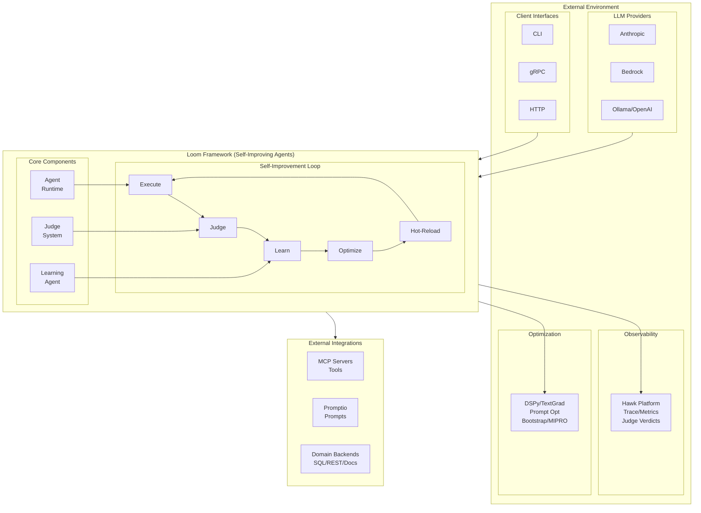
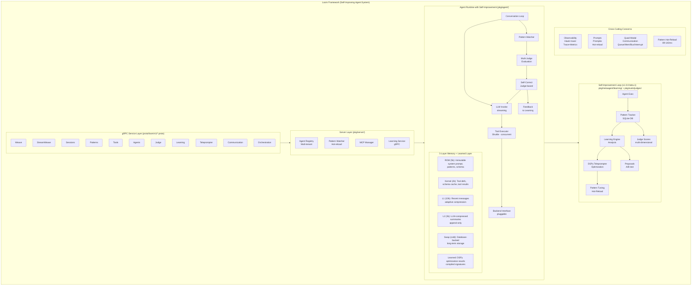
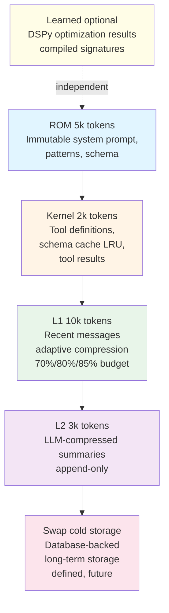
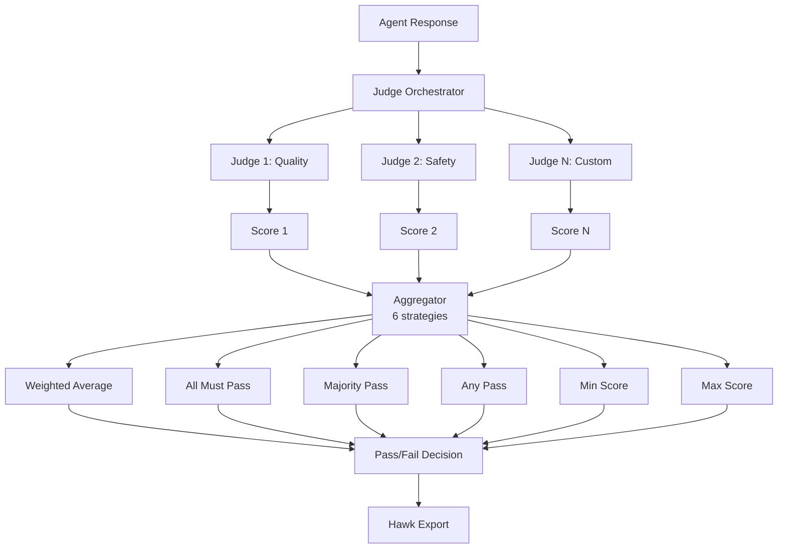
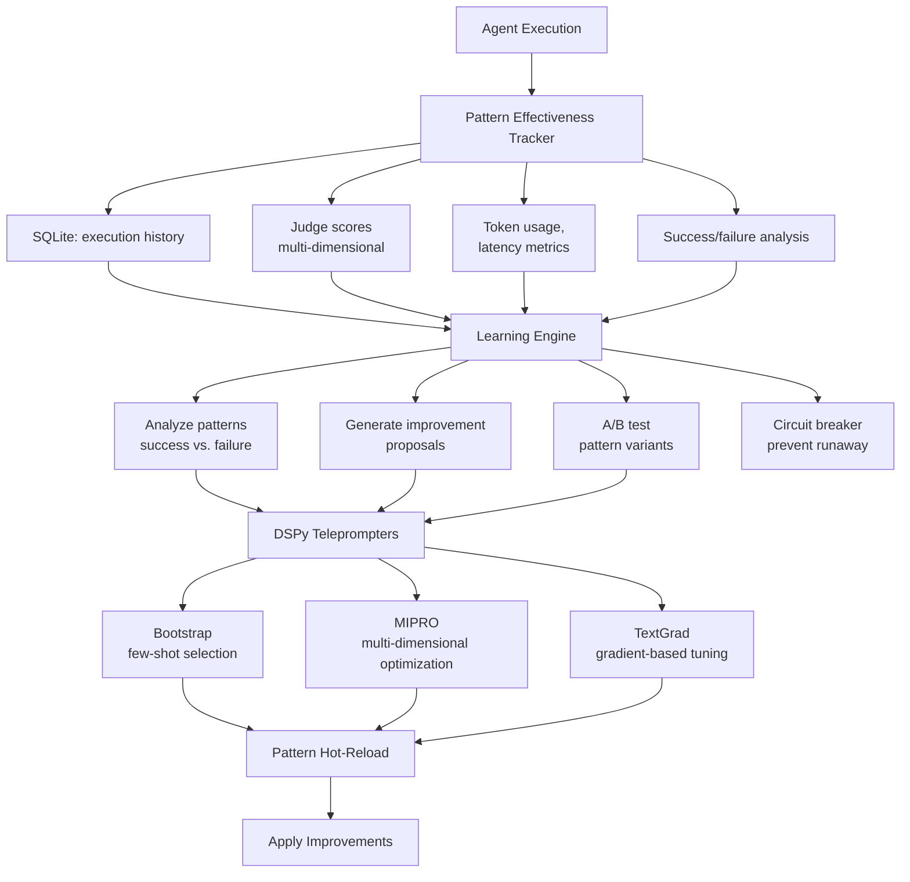
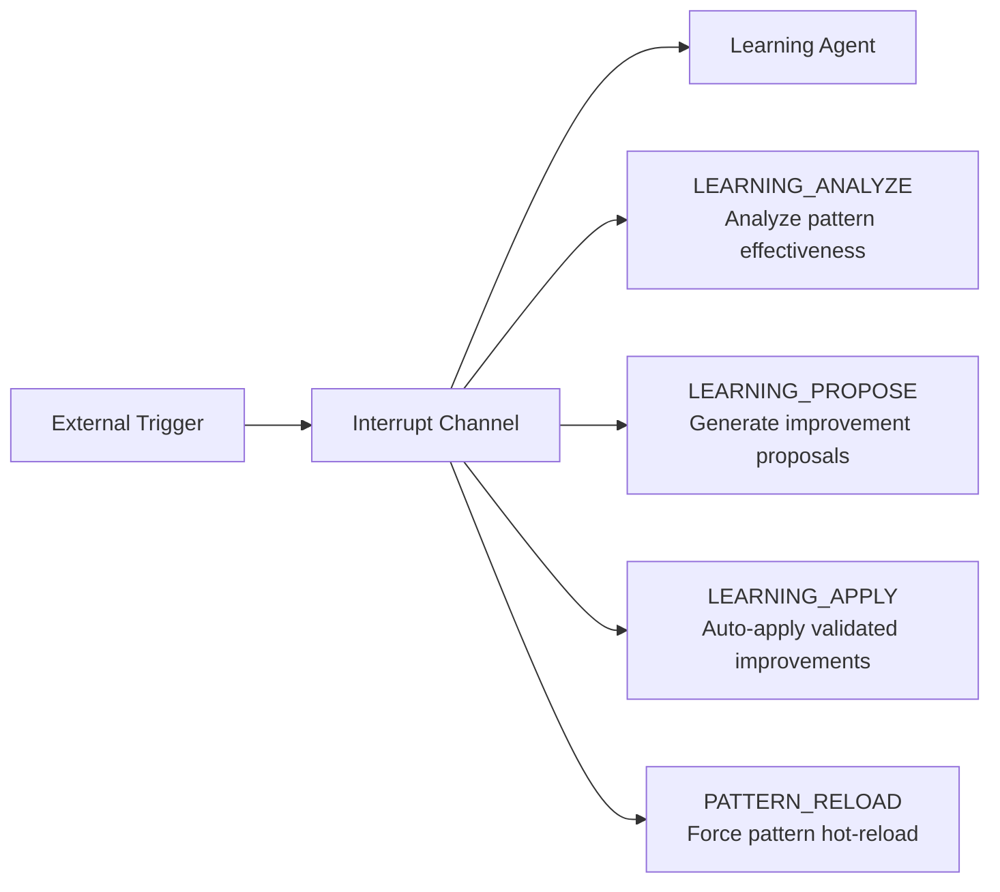
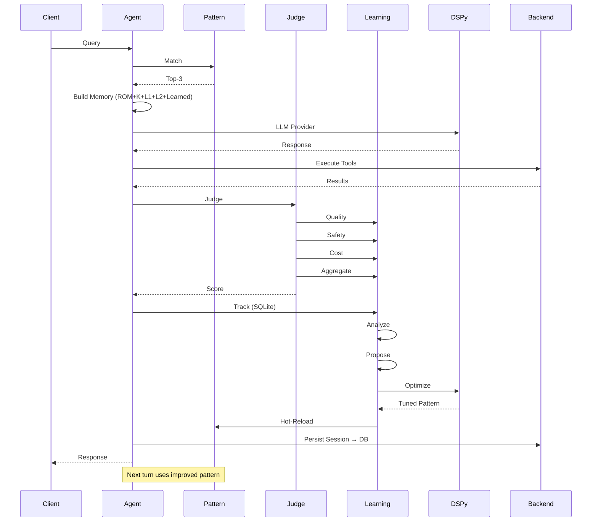

# Loom System Architecture

Architectural overview of Loom - a Go framework for building **self-improving** autonomous LLM agent threads with pattern-guided learning, multi-judge evaluation, DSPy optimization, multi-agent orchestration, and observability.

**Target Audience**: Architects, academics, and advanced developers seeking deep understanding of Loom's design.

**Version**: v1.0.0


## Table of Contents

- [Design Philosophy](#design-philosophy)
- [System Context](#system-context)
- [High-Level Architecture](#high-level-architecture)
- [Core Subsystems Overview](#core-subsystems-overview)
- [Self-Improvement Architecture](#self-improvement-architecture)
- [Key Design Decisions](#key-design-decisions)
- [Data Flow: Self-Improving Agent Execution](#data-flow-self-improving-agent-execution)
- [Performance Characteristics](#performance-characteristics)
- [Concurrency Model](#concurrency-model)
- [Security Considerations](#security-considerations)
- [Technology Stack Rationale](#technology-stack-rationale)
- [Evolution and Extensibility](#evolution-and-extensibility)
- [Related Work](#related-work)
- [References](#references)
- [Further Reading](#further-reading)


## Design Philosophy

Loom is built on **six** core principles:

1. **Proto-First**: All APIs defined in Protocol Buffers first, implementation follows
2. **Pattern-Guided Learning**: Domain knowledge encoded as reusable YAML patterns with continuous improvement
3. **Self-Improving Agents**: Multi-judge evaluation, DSPy optimization, and autonomous pattern tuning
4. **Observability by Design**: Every operation traced with span IDs, enabling debugging and evaluation
5. **Pluggable Architecture**: Backends, LLMs, tools, patterns, and judges are swappable via clean interfaces
6. **Crash-Only Design**: No graceful shutdown complexity, agents recover from crashes via session persistence

**Key Innovation in v1.0.0-beta.1**: Self-improvement capabilities through judge evaluation, learning agents, and DSPy teleprompters form a closed feedback loop for continuous optimization.


## System Context



**External Dependencies**:
- **LLM Providers**: Anthropic Claude, AWS Bedrock, Ollama, OpenAI, Azure OpenAI, Mistral, Gemini, HuggingFace
- **Hawk**: Evaluation and observability platform (trace export, metrics, cost tracking, judge verdict export)
- **Promptio**: Prompt management service (versioning, A/B testing, hot-reload, template management)
- **DSPy**: Declarative prompt optimization framework (Bootstrap, MIPRO, TextGrad teleprompters)
- **MCP Servers**: Model Context Protocol servers for dynamic tool discovery (vantage-mcp for Teradata, GitHub, filesystem, etc.)
- **Domain Backends**: SQL databases (PostgreSQL, Teradata, SQLite), REST APIs, document stores, file systems


## High-Level Architecture




## Core Subsystems Overview

Loom consists of **14 major subsystems** working together to enable self-improving autonomous agents:

### 1. Agent Runtime (`pkg/agent/`)
**Purpose**: Core conversation loop with segmented memory and session persistence.

**Key Features**:
- Turn-based LLM interaction with streaming support
- 5-layer segmented memory (ROM/Kernel/L1/L2/Swap) + optional Learned layer
- Pattern-guided domain knowledge injection
- Judge-based self-correction
- Crash recovery via SQLite session persistence

**See**: [Agent System Architecture](agent-system-design.md)


### 2. 5-Layer Memory System (`pkg/agent/segmented_memory.go`)
**Purpose**: Tiered memory hierarchy for efficient context window management.

**Architecture**:


**Key Features**:
- Adaptive compression triggers (70%, 80%, 85% token budget)
- Tool pair preservation (tool_use/tool_result never split)
- LRU schema cache (max 10 schemas)
- Database-backed tool results (max 1 in memory)
- Token budget enforcement (200K context, 20K output reserve)

**See**: [Memory System Architecture](memory-system-design.md)


### 3. Judge Evaluation System (`pkg/evals/judges/`)
**Purpose**: Multi-judge evaluation with streaming, retry, and circuit breakers.

**Architecture**:


**Aggregation Strategies** (6 available):
1. **Weighted Average**: Weight judges by importance (quality:0.5, safety:0.3, cost:0.2)
2. **All Must Pass**: All judges must approve (strict, AND logic)
3. **Majority Pass**: Majority consensus required (democratic)
4. **Any Pass**: At least one judge approves (lenient, OR logic)
5. **Min Score**: Take minimum score (pessimistic)
6. **Max Score**: Take maximum score (optimistic)

**Key Features**:
- Real-time streaming progress updates (Phase 11)
- Exponential backoff retry with circuit breakers (Phase 7)
- Multi-dimensional scoring (quality, safety, performance, cost)
- Hawk verdict export for analysis (Phase 9)
- DSPy integration for judge optimization
- 89% test coverage

**See**: [Judge Evaluation System Architecture](judge-evaluation-system.md)


### 4. Learning Agent System (`pkg/metaagent/learning/`)
**Purpose**: Self-improving agents with pattern effectiveness tracking and autonomous tuning.

**Architecture**:


**Autonomy Levels** (3 modes):
- `AutonomyManual` (0): Require human approval for all improvements
- `AutonomyHumanApproval` (1): Apply improvements after human approval
- `AutonomyFull` (2): Auto-apply with circuit breaker (library-only, no YAML)

**Key Features**:
- Pattern effectiveness tracking (SQLite-backed)
- Multi-dimensional judge integration (quality, safety, cost)
- A/B testing of pattern variants
- Interrupt-driven learning triggers (LEARNING_ANALYZE, LEARNING_PROPOSE, LEARNING_APPLY)
- Circuit breaker to prevent runaway improvements
- Auto-apply with validation (Phase 10)

**See**: [Learning Agent Architecture](learning-agent-design.md)


### 5. DSPy/Teleprompter Integration (`pkg/metaagent/teleprompter/`)
**Purpose**: Prompt optimization via DSPy teleprompters with multi-judge metrics.

**Teleprompter Algorithms** (3 optimizers):

1. **Bootstrap Few-Shot**
   - Selects best demonstration examples
   - Uses judge scores to rank examples
   - Fast convergence (few iterations)

2. **MIPRO** (Multi-metric Information Propagation Optimization)
   - Multi-dimensional optimization (Phase 4)
   - Optimizes across multiple judge dimensions simultaneously
   - Weighted combination of metrics (quality, safety, cost)
   - Bayesian optimization strategy

3. **TextGrad** (Gradient-based)
   - JudgeGradientEngine for backward pass
   - Text-based gradient descent on prompts
   - Judge feedback → gradient signals
   - Iterative refinement with learning rate

**Key Features**:
- MultiJudgeMetric: DSPy metric using Loom's judge system
- Dimension weights: Configure importance of each judge
- Compilation management: Versioned pattern compilation with rollback
- CLI integration: `looms teleprompter bootstrap/mipro/textgrad`
- Gradient auto-apply with validation (Phase 10)

**See**: [DSPy/Teleprompter Architecture](dspy-teleprompter-design.md)


### 6. Tool System (`pkg/shuttle/`)
**Purpose**: Dynamic tool registration and concurrent execution with timeout handling.

**Key Features**:
- Thread-safe tool registry (`sync.Map`)
- Concurrent tool execution (one goroutine per tool)
- Result aggregation via buffered channels
- MCP dynamic tool discovery
- Per-tool timeout handling via context cancellation

**See**: [Tool System Architecture](tool-system-design.md)


#### 6.1. Tool Parameter Optimization (`pkg/shuttle/executor.go`)

**Purpose**: Prevent LLM output token limit errors and context window bloat by optimizing large tool parameters.

**Problem**: Agents generating massive tool parameters (e.g., `file_write(content="<50MB>")`) cause:
1. **Circuit breaker failures**: LLM providers reject outputs exceeding max_tokens (4K-16K)
2. **Context accumulation**: Large parameters bloat conversation history across turns

**Two-Tier Solution**:

**Tier 1: Schema Hard Limits (Prevention)**
- 50KB max content per `file_write` call
- Schema validation with `WithLength()` constraint
- Clear error messages guide incremental writing
- Stops output token limit errors at source

**Tier 2: Executor Optimization (Context Accumulation)**
```
┌─────────────────────────────────────────────────────────────────┐
│                    Tool Execution Pipeline                       │
│                                                                  │
│  Agent Call                                                      │
│       │                                                          │
│       ▼                                                          │
│  ┌──────────────────┐                                           │
│  │ Normalize Params │                                           │
│  └────────┬─────────┘                                           │
│           │                                                      │
│           ▼                                                      │
│  ┌──────────────────────────────────┐                           │
│  │  handleLargeParameters()         │                           │
│  │  • estimateValueSize()           │                           │
│  │  • if size > 2.5KB:              │                           │
│  │    - store in SharedMemoryStore  │                           │
│  │    - replace with DataReference  │                           │
│  └────────┬─────────────────────────┘                           │
│           │                                                      │
│           ▼                                                      │
│  ┌──────────────────────────────────┐                           │
│  │  dereferenceLargeParameters()    │                           │
│  │  • detect DataReference objects  │                           │
│  │  • retrieve from shared memory   │                           │
│  │  • deserialize to original type  │                           │
│  └────────┬─────────────────────────┘                           │
│           │                                                      │
│           ▼                                                      │
│  ┌──────────────────┐                                           │
│  │  tool.Execute()  │ ← Tool receives full dereferenced params │
│  └────────┬─────────┘                                           │
│           │                                                      │
│           ▼                                                      │
│  Tool Result                                                     │
└─────────────────────────────────────────────────────────────────┘
```

**Key Properties**:
- **Universal**: Works for ALL tools (builtin + MCP servers) without code changes
- **Transparent**: Tools always receive dereferenced full data
- **Threshold**: 2.5KB (same as output handling for consistency)
- **Type-safe**: DataReference objects prevent string collision issues

**Performance**:
- **Token savings**: 20-30% on calls with large parameters
- **Storage latency**: <5ms for store + retrieve (in-memory)
- **Zero race conditions**: Verified with 50-iteration `-race` tests

**Design Trade-offs**:

**Chosen Approach**: Auto-storage with transparent dereferencing

**Rationale**:
- Prevents both immediate failures (Tier 1) and long-term bloat (Tier 2)
- No tool code changes needed (universal compatibility)
- MCP servers work without awareness of optimization

**Alternative 1: Parameter Size Limits Only**
- ✅ Simple implementation
- ❌ Doesn't solve context accumulation across turns
- Rejected: Incomplete solution

**Alternative 2: String Reference Markers** (e.g., `{{ref:id}}`)
- ✅ Simple serialization
- ❌ Risk of collision with legitimate string parameters
- Rejected: Type-safe DataReference objects eliminate collision risk

**Alternative 3: Require Tool Awareness**
- ✅ Explicit control
- ❌ Breaks MCP servers, requires all tools to change
- Rejected: Universal compatibility is critical

**Invariants**:
1. `estimateValueSize(v) > threshold ⇒ stored in shared memory`
2. `tool.Execute()` always receives dereferenced full data
3. Storage failures fallback gracefully (degraded but functional)


### 7. Pattern System (`pkg/patterns/`)
**Purpose**: Domain knowledge library with hot-reload and semantic search.

**Key Features**:
- 94 YAML patterns across 17 domains
- TF-IDF cosine similarity for pattern relevance ranking
- Hot-reload with 89-143ms latency (fsnotify-based)
- A/B testing support with variant selection strategies
- Atomic pointer swap for zero-downtime reload

**See**: [Pattern System Architecture](pattern-library-design.md)


### 8. Orchestration (`pkg/orchestration/`)
**Purpose**: Multi-agent workflow coordination with 9 execution patterns.

**Workflow Patterns** (9 total):
1. **Pipeline**: Sequential execution with output chaining
2. **Parallel**: Independent concurrent execution
3. **Fork-Join**: Parallel execution with result merging
4. **Debate**: Multi-agent argumentation with moderator
5. **Conditional**: Dynamic routing based on agent decisions
6. **Swarm**: Collaborative problem-solving with shared memory
7. **Pair Programming**: Two agents collaborate on code (from `pkg/collaboration/`)
8. **Teacher-Student**: Knowledge transfer pattern (from `pkg/collaboration/`)
9. **Iterative**: Loop-based refinement workflow

**Key Features**:
- Kubernetes-style YAML specifications
- Declarative workflow definitions
- Support for collaboration patterns (Teacher-Student, Pair Programming)
- Iterative workflow for refinement loops

**See**: [Orchestration Architecture](orchestration-design.md)


### 9. Quad-Modal Communication System (`pkg/communication/`)
**Purpose**: Four communication modes for inter-agent coordination and learning triggers.

**Communication Modes**:
```mermaid
graph TB
    subgraph QuadModal["Quad-Modal Communication System"]
        AgentA[Agent A]
        AgentB[Agent B]

        subgraph Mode1["1. Message Queue (Event-Driven)"]
            SendMsg[send_message<br/>ordered, FIFO]
            AutoInject[auto-inject<br/>via Chat()]
        end

        subgraph Mode2["2. Shared Memory"]
            Write[write key, data]
            Storage[Storage]
            Read[read key<br/>zero-copy, tiered]
        end

        subgraph Mode3["3. Broadcast Bus (Event-Driven)"]
            Publish[publish topic]
            AutoSubscribe[auto-subscribe<br/>auto-inject]
        end

        subgraph Mode4["4. Interrupt Channel"]
            LearningAnalyze[LEARNING_ANALYZE]
            LearningPropose[LEARNING_PROPOSE]
            LearningApply[LEARNING_APPLY]
            PatternReload[PATTERN_RELOAD<br/>async triggers]
        end

        AgentA -->|send| SendMsg
        SendMsg -->|notify| AutoInject
        AutoInject --> AgentB

        AgentA --> Write
        Write --> Storage
        Storage --> Read
        Read --> AgentB

        AgentA -->|publish| Publish
        Publish -->|auto-notify| AutoSubscribe
        AutoSubscribe --> AgentB

        AgentA --> LearningAnalyze
        LearningAnalyze --> AgentB
        AgentA --> LearningPropose
        LearningPropose --> AgentB
        AgentA --> LearningApply
        LearningApply --> AgentB
        AgentA --> PatternReload
        PatternReload --> AgentB
    end
```

**Shared Memory Tiers**:
- **Memory tier**: Fast in-memory cache (hot data)
- **Disk tier**: Persistent storage for large datasets
- **Token savings**: Store large tool results outside context window
- **Reference-based**: Context contains only keys, not full data

**Key Features**:
- **Message Queue**: Ordered point-to-point messaging (FIFO guarantees)
- **Shared Memory**: Key-value store with tiered storage (memory → disk), zero-copy data sharing
- **Broadcast Bus**: Pub/sub event distribution with topic routing
- **Interrupt Channel**: Async learning triggers (LEARNING_ANALYZE, LEARNING_PROPOSE, LEARNING_APPLY, PATTERN_RELOAD)
- Integration with agent memory (prevents context overflow)
- Supports scheduled learning (cron), event-driven learning (error spikes), and human-triggered learning (CLI)

**See**: [Communication System Architecture](communication-system-design.md)


### 10. Observability (`pkg/observability/`)
**Purpose**: Distributed tracing, metrics, and cost tracking integrated with Hawk platform.

**Key Features**:
- Hawk Tracer: Span-based tracing with automatic LLM cost calculation
- Span Context: Distributed trace propagation across agent calls
- Event Export: Real-time streaming of trace events to Hawk
- Metrics: Token usage, latency, tool execution counts
- Judge verdict export (Phase 9)

**See**: [Observability Architecture](observability-system-design.md)


### 11. Prompt Management (`pkg/prompts/`)
**Purpose**: Integration with Promptio for versioned, A/B-testable prompt templates.

**Key Features**:
- Promptio Client: gRPC client for prompt retrieval with caching
- Local Cache: LRU cache for prompt templates (5-minute TTL, 99.9% hit rate)
- Variable Interpolation: Template variable substitution with type checking
- Hot-Reload: Prompt updates without agent restart

**See**: [Prompt Management Integration](prompt-integration-design.md)


### 12. MCP Integration (`pkg/mcp/`)
**Purpose**: Model Context Protocol client for dynamic tool discovery from external servers.

**Key Features**:
- MCP Client: stdio-based protocol implementation (JSON-RPC 2.0)
- Tool Discovery: Dynamic tool schema introspection
- Lifecycle Management: MCP server startup, health checks, graceful shutdown
- No-Code Configuration: YAML-based MCP server registration
- Coverage: 50-92% across modules

**See**: [MCP Integration Architecture](mcp-protocol-design.md)


### 13. Backend Interface (`pkg/fabric/`)
**Purpose**: Pluggable abstraction for domain-specific operations (SQL, REST, documents).

**Interface Design**:
```go
type ExecutionBackend interface {
    Execute(ctx context.Context, request *Request) (*Result, error)
    Schema(ctx context.Context) (*SchemaInfo, error)
    Validate(ctx context.Context, query string) error
}
```

**Implementations**: File backend, SQL backends (via MCP), REST API backends (via MCP)

**See**: [Backend Interface Design](backend-interface-design.md)


### 14. Server (`pkg/server/`)
**Purpose**: Multi-tenant agent registry, pattern hot-reload, gRPC/HTTP gateway.

**Key Features**:
- Agent Registry: Concurrent-safe multi-tenant agent storage
- Pattern Watcher: File system watcher for hot-reload (fsnotify)
- gRPC Server: LoomService implementation with streaming support
- HTTP Gateway: grpc-gateway-based HTTP/JSON API
- Learning Service: gRPC service for learning agent operations

**See**: [Server Architecture](server-design.md)


## Self-Improvement Architecture

The **self-improvement loop** is the key architectural innovation in v1.0.0-beta.1, connecting agent execution, judge evaluation, learning analysis, and DSPy optimization into a closed feedback system.

### Self-Improvement Data Flow

```mermaid
graph TB
    subgraph SelfImprovementLoop["Self-Improvement Closed Loop"]
        subgraph Step1["1. Agent Execution"]
            UserQuery[User Query]
            PatternMatch[Pattern Match]
            LLM[LLM]
            Response1[Response]

            UserQuery --> PatternMatch
            PatternMatch --> LLM
            LLM --> Response1
        end

        subgraph Step2["2. Judge Evaluation (Multi-Dimensional)"]
            Response2[Response]
            QualityJudge[Quality Judge]
            SafetyJudge[Safety Judge]
            CostJudge[Cost Judge]
            Score1[Score 1]
            Score2[Score 2]
            Score3[Score 3]
            Aggregator2[Aggregator<br/>weighted: 0.5/0.3/0.2]
            FinalScore[Final Score]

            Response2 --> QualityJudge
            Response2 --> SafetyJudge
            Response2 --> CostJudge
            QualityJudge --> Score1
            SafetyJudge --> Score2
            CostJudge --> Score3
            Score1 --> Aggregator2
            Score2 --> Aggregator2
            Score3 --> Aggregator2
            Aggregator2 --> FinalScore
        end

        subgraph Step3["3. Pattern Effectiveness Tracking"]
            SQLiteDB[SQLite DB:<br/>- pattern_id, judge_scores, tokens, latency<br/>- success/failure analysis<br/>- A/B test results]
        end

        subgraph Step4["4. Learning Engine Analysis"]
            Identify[Identify:<br/>Low-performing patterns]
            Analyze[Analyze:<br/>Success vs. failure patterns]
            Propose[Propose:<br/>Improvements A/B test variants]
            CircuitBreaker4[Circuit Breaker:<br/>Prevent runaway changes]

            Identify --> Analyze
            Analyze --> Propose
            Propose --> CircuitBreaker4
        end

        subgraph Step5["5. DSPy Teleprompter Optimization"]
            Bootstrap5[Bootstrap:<br/>Select best demonstrations]
            MIPRO5[MIPRO:<br/>Multi-dimensional Bayesian optimization]
            TextGrad5[TextGrad:<br/>Gradient-based prompt tuning]
            MultiJudgeMetric[Multi-Judge Metric]
            OptSignal[Optimization Signal]

            Bootstrap5 --> MultiJudgeMetric
            MIPRO5 --> MultiJudgeMetric
            TextGrad5 --> MultiJudgeMetric
            MultiJudgeMetric --> OptSignal
        end

        subgraph Step6["6. Pattern Hot-Reload (89-143ms)"]
            OptimizedPattern[Optimized Pattern]
            YAMLFile[YAML File]
            AtomicSwap[Atomic Swap]
            Validation[Validation:<br/>Compilation check,<br/>rollback support]

            OptimizedPattern --> YAMLFile
            YAMLFile --> AtomicSwap
            AtomicSwap --> Validation
        end

        ImprovedPattern[Improved Pattern Applied]

        Response1 --> Response2
        FinalScore --> SQLiteDB
        SQLiteDB --> Identify
        CircuitBreaker4 --> Bootstrap5
        OptSignal --> OptimizedPattern
        Validation --> ImprovedPattern
        ImprovedPattern -.->|Feedback Loop| UserQuery
    end
```



### Autonomy Levels

The learning agent supports **three autonomy levels**:

1. **Manual** (AutonomyManual = 0):
   - Human approval required for all improvements
   - System generates proposals only
   - Operator reviews and applies manually

2. **Human-Approval** (AutonomyHumanApproval = 1):
   - System generates and proposes improvements
   - Human approves/rejects each proposal
   - Approved improvements applied automatically

3. **Full Autonomy** (AutonomyFull = 2):
   - System generates, validates, and applies improvements automatically
   - Circuit breaker prevents runaway changes
   - Library-only (not available via YAML configuration)
   - Rollback support if degradation detected

### Interrupt-Driven Learning

Learning can be triggered **asynchronously** via interrupt signals:



**Use Cases**:
- Scheduled learning (cron-triggered analysis)
- Event-driven learning (error rate spike → analyze)
- Human-triggered learning (operator request via CLI)
- Cross-agent learning (agent A success → notify agent B)


## Key Design Decisions

### Decision 1: 5-Layer Memory + Learned Layer

**Chosen Approach**: Five-layer segmented memory (ROM/Kernel/L1/L2/Swap) plus optional Learned layer

**Rationale**:
- **ROM**: Immutable system prompt, patterns, schema (never changes)
- **Kernel**: Tool definitions, schema cache (LRU), tool results (database-backed, max 1 in memory)
- **L1**: Recent messages with adaptive compression (70%/80%/85% budget triggers)
- **L2**: LLM-compressed summaries (append-only, token-efficient)
- **Swap**: Database-backed long-term storage (defined, future implementation)
- **Learned**: DSPy optimization results (compiled signatures, demonstrations)

**Alternatives Considered**:
- **4 layers only**: Missing Swap and Learned → rejected, incomplete architecture
- **Full history**: Unbounded token growth → rejected for cost
- **RAG memory**: 100-500ms retrieval latency → rejected for real-time interaction

**Consequences**: Lossy L2 compression, implementation complexity, but bounded tokens with long-term context.

**See**: [Memory System Architecture](memory-system-design.md)


### Decision 2: Multi-Judge Evaluation with 6 Aggregation Strategies

**Chosen Approach**: Judge orchestrator with pluggable aggregation strategies

**Rationale**:
- **Multi-dimensional evaluation**: Quality, safety, performance, cost evaluated independently
- **Flexible aggregation**: Different use cases need different strategies (strict vs. lenient)
- **Observable**: All judge scores exported to Hawk for analysis
- **Retry/Circuit Breaker**: Handle failing judges gracefully

**Alternatives Considered**:
- **Single judge**: No multi-dimensional view → rejected
- **Fixed aggregation**: Can't adapt to different requirements → rejected

**Consequences**: Increased complexity, but comprehensive evaluation and flexibility.

**See**: [Judge Evaluation System](judge-evaluation-system.md)


### Decision 3: DSPy Integration for Optimization

**Chosen Approach**: Integrate DSPy teleprompters with multi-judge metrics

**Rationale**:
- **Declarative**: DSPy's declarative approach aligns with pattern-guided philosophy
- **Multi-metric**: MIPRO supports multi-dimensional optimization
- **Gradient-based**: TextGrad enables fine-grained tuning
- **Proven**: DSPy battle-tested in research (Stanford)

**Alternatives Considered**:
- **Manual tuning**: Not scalable → rejected
- **Reinforcement learning**: High sample complexity → rejected
- **Fine-tuning models**: Expensive, vendor lock-in → rejected

**Consequences**: DSPy dependency, but powerful optimization capabilities.

**See**: [DSPy/Teleprompter Architecture](dspy-teleprompter-design.md)


### Decision 4: Pattern Hot-Reload with Atomic Swap

**Chosen Approach**: fsnotify-based file watcher with atomic pointer swap

**Rationale**:
- **Zero downtime**: Atomic swap ensures no partial updates visible
- **Fast**: 89-143ms reload latency acceptable
- **Observable**: Reload events traced to Hawk

**Alternatives Considered**:
- **Server restart**: Downtime unacceptable → rejected
- **Versioned patterns**: Added complexity → not needed

**Consequences**: fsnotify dependency, but enables continuous improvement without restarts.

**See**: [Pattern System Architecture](pattern-library-design.md)


### Decision 5: Quad-Modal Communication for Multi-Agent Coordination and Learning

**Chosen Approach**: Four communication modes (Queue, Shared Memory, Broadcast Bus, Interrupt Channel)

**Rationale**:
- **Queue**: Ordered point-to-point for request/response patterns (FIFO guarantees)
- **Shared Memory**: Zero-copy large data sharing (prevents context overflow, tiered memory→disk)
- **Broadcast Bus**: Pub/sub for event-driven coordination (topic routing)
- **Interrupt Channel**: Async learning triggers (LEARNING_ANALYZE, LEARNING_PROPOSE, LEARNING_APPLY, PATTERN_RELOAD)
- **Flexible**: Different patterns need different communication primitives; interrupt channel enables self-improvement loop

**Alternatives Considered**:
- **Single channel**: Too restrictive, can't handle different communication patterns → rejected
- **Actor model**: Added complexity, unnecessary overhead → overkill for our use case
- **Polling-based learning**: Would require constant checking, inefficient → rejected for interrupt-driven

**Consequences**: Four systems to maintain, but covers all multi-agent coordination AND self-improvement needs. Interrupt channel enables async learning triggers without polling overhead.

**See**: [Communication System Architecture](communication-system-design.md)


## Data Flow: Self-Improving Agent Execution

**Complete flow including self-improvement feedback loop**:



**Key Properties**:
1. **Judge feedback loop**: Every response evaluated, scores tracked
2. **Async learning**: Pattern analysis happens in background
3. **Hot-reload apply**: Improvements applied without restart
4. **Observable**: All steps traced to Hawk
5. **Crash recovery**: Session persisted before returning response


## Performance Characteristics

### Latency Budget (P50/P99)

| Operation | P50 | P99 | Notes |
|-----------|-----|-----|-------|
| Pattern matching | 8ms | 15ms | TF-IDF over 65 patterns |
| Pattern hot-reload | 89ms | 143ms | File watch + index rebuild + atomic swap |
| Session load | 12ms | 28ms | SQLite read + deserialization |
| Session persist | 3ms | 8ms | Serialization + SQLite write |
| LLM call (Claude Sonnet 4.5) | 850ms | 2100ms | Network + generation |
| Tool execution (SQL) | 45ms | 180ms | Backend-dependent |
| Judge evaluation (3 judges) | 2760ms | 6900ms | 3 × LLM calls in parallel |
| Learning analysis | 200ms | 500ms | SQLite query + analysis |
| DSPy optimization (Bootstrap) | 30s | 90s | Multiple LLM calls (offline) |
| End-to-end turn (no judge) | 1200ms | 3500ms | LLM + tools + persist |
| End-to-end turn (with judge) | 3960ms | 10400ms | + judge evaluation |

**Scaling**: Horizontal scaling via multi-agent server, vertical scaling via Go concurrency (tested to 1000 concurrent agents).


## Concurrency Model

### Agent Runtime
- **Model**: One goroutine per agent conversation loop
- **Synchronization**: Channel-based communication for tool results
- **Safety**: All tests run with `-race` detector, zero race conditions

### Judge Evaluation
- **Model**: Concurrent judge execution (N goroutines for N judges)
- **Synchronization**: WaitGroup for result aggregation
- **Retry**: Per-judge exponential backoff with circuit breakers
- **Timeout**: Per-judge timeout via `context.WithTimeout`

### Learning Agent
- **Model**: Single goroutine for analysis loop
- **Synchronization**: Mutex-protected pattern tracker (SQLite writes)
- **Interrupt-driven**: Async triggers via interrupt channel
- **Circuit Breaker**: Thread-safe state machine

### Tool Execution
- **Model**: One goroutine per tool
- **Synchronization**: Shared error channel, context cancellation
- **Timeout**: Per-tool timeout via `context.WithTimeout` (default: 30s)

### Pattern Hot-Reload
- **Model**: Single goroutine watches file system (fsnotify)
- **Synchronization**: Atomic pointer swap for pattern index (`atomic.Value`)
- **Consistency**: Read-copy-update pattern ensures no partial updates visible

**Testing**: 50-run race detection tests on all concurrent code paths. Zero race conditions in v1.0.0-beta.1.


## Security Considerations

### Threat Model

**Threats**:
1. **Prompt Injection**: Malicious user input steering agent behavior
2. **Tool Abuse**: Agent executing unintended tool calls
3. **Data Exfiltration**: Agent leaking sensitive backend data
4. **Denial of Service**: Resource exhaustion via long-running agents
5. **Judge Manipulation**: Adversarial inputs to bypass judge evaluation
6. **Learning Poisoning**: Malicious feedback corrupting pattern learning

### Mitigations

**Prompt Injection**:
- User input isolated in dedicated message role
- System prompt (ROM) immutable per session
- Judge validation can detect anomalous outputs

**Tool Abuse**:
- Tool whitelisting per agent configuration
- Parameter validation before tool execution
- Read-only tools for untrusted agents

**Data Exfiltration**:
- Backend scoping (database, schema, table restrictions)
- Query validation before execution
- Trace export to Hawk for audit

**Denial of Service**:
- Per-agent timeout (default: 5 minutes)
- Max turns per session (default: 25)
- Rate limiting at server level

**Judge Manipulation**:
- Multiple independent judges (harder to fool all)
- Aggregation strategies (all-must-pass for critical systems)
- Hawk export for offline analysis

**Learning Poisoning**:
- Circuit breaker limits impact of bad feedback
- Human approval modes (Manual, HumanApproval)
- Rollback support for degraded patterns

**Trust Boundaries**:
- **Trusted**: Agent configuration, pattern library, backend schema, judge definitions
- **Untrusted**: User messages, LLM outputs, tool execution results, judge scores


## Technology Stack Rationale

### Go
**Chosen for**: Native concurrency (goroutines, channels), strong type system, fast compilation, excellent HTTP/gRPC libraries

**Trade-offs**: No REPL, verbose error handling


### Protocol Buffers + gRPC
**Chosen for**: Type-safe API contracts, efficient serialization, native streaming, multi-language client generation

**Trade-offs**: Proto toolchain complexity, HTTP gateway adds 2-5ms latency


### SQLite for Session Storage and Learning Data
**Chosen for**: Embedded (no external database), ACID transactions, fast local I/O (1-5ms writes), simple backup

**Trade-offs**: Single-writer bottleneck (mitigated by per-agent session files)


### TF-IDF for Pattern Matching
**Chosen for**: Fast (O(n log n) indexing, O(log n) query), interpretable cosine similarity scores, no model training required

**Trade-offs**: Keyword-based, misses semantic similarity

**Future**: Hybrid TF-IDF + embedding similarity


### DSPy for Optimization
**Chosen for**: Declarative prompt optimization, multi-metric support, proven in research, extensible teleprompter architecture

**Trade-offs**: External dependency, optimization is offline (not real-time)


## Evolution and Extensibility

### Stable APIs (v1.0.0)

- `proto/loom/v1/loom.proto`: gRPC service definitions
- `proto/loom/v1/orchestration.proto`: Workflow specifications
- `proto/loom/v1/agent_config.proto`: Agent configuration
- `proto/loom/v1/learning.proto`: Learning agent service (NEW)

**Guarantee**: No breaking changes in v1.x.y releases (validated via `buf breaking`).


### Extension Points

1. **Custom Backends**: Implement `ExecutionBackend` interface
2. **Custom Tools**: Implement `Tool` interface and register via `RegisterTool`
3. **Custom Patterns**: Add YAML files to pattern library directory
4. **Custom LLM Providers**: Implement `LLMProvider` interface
5. **Custom Judges**: Implement judge agents with specific criteria (NEW)
6. **Custom Teleprompters**: Extend DSPy teleprompter architecture (NEW)
7. **MCP Servers**: Any MCP-compliant server can provide tools


### Migration Strategy

**v0.x → v1.0**:
- Configuration schema changes flagged with warnings
- Old fields deprecated for 2 minor versions before removal
- Migration scripts provided for session database schema changes
- Learning agent features opt-in (backward compatible)

**v1.x → v2.0** (future):
- Breaking changes batched into major versions
- Coexistence period with v1/v2 APIs running side-by-side


## Related Work

### LLM Agent Frameworks

1. **LangChain** (Python): General-purpose, large API surface, callback-based
   - Loom differs: Narrower focus (agent threads), proto-first, Go concurrency, self-improving loop
2. **AutoGPT** (Python): Autonomous agent, goal-driven
   - Loom differs: Pattern-guided vs. goal-seeking, multi-judge evaluation
3. **AgentGPT** (TypeScript): Web-based agent playground
   - Loom differs: Framework for production use, observability integration, learning capabilities

### Pattern-Based Systems

1. **Semantic Kernel** (Microsoft, C#): Skill-based AI orchestration
   - Loom differs: YAML patterns vs. C# skills, TF-IDF vs. planner, learning loop
2. **Dust** (TypeScript): API-first LLM orchestration with "apps"
   - Loom differs: Proto-first, Go, agent runtime vs. workflow engine

### Prompt Optimization

1. **DSPy** (Stanford): Declarative prompt programming framework
   - Loom integrates: DSPy as optimization engine, multi-judge metrics
2. **Prompt flow** (Microsoft): Visual prompt engineering
   - Loom differs: YAML patterns, hot-reload, learning-driven optimization

### Observability

1. **LangSmith**: LangChain-specific tracing
   - Loom differs: Framework-agnostic (Hawk), distributed tracing semantics, judge verdicts
2. **Helicone**: LLM observability proxy
   - Loom differs: Agent-level tracing, not just LLM proxy


## References

1. Salton, G., Wong, A., & Yang, C. S. (1975). *A vector space model for automatic indexing*. Communications of the ACM, 18(11), 613-620.

2. Wei, J., Wang, X., Schuurmans, D., et al. (2022). *Chain-of-thought prompting elicits reasoning in large language models*. NeurIPS 2022.

3. Khattab, O., Singhvi, A., Maheshwari, P., et al. (2023). *DSPy: Compiling declarative language model calls into self-improving pipelines*. ICLR 2024.

4. Model Context Protocol (MCP) Specification. Anthropic. https://modelcontextprotocol.io/

5. Hewitt, C., Bishop, P., & Steiger, R. (1973). *A universal modular actor formalism for artificial intelligence*. IJCAI 1973.

6. Packer, C., et al. (2023). *MemGPT: Towards LLMs as Operating Systems*. arXiv:2310.08560.

7. Shinn, N., et al. (2023). *Reflexion: Language Agents with Verbal Reinforcement Learning*. arXiv:2303.11366.


## Further Reading

### Architecture Deep Dives

**Self-Improvement Systems** (NEW):
- [Memory System Architecture](memory-system-design.md) - 5-layer segmented memory + Learned layer
- [Judge Evaluation System](judge-evaluation-system.md) - Multi-judge with 6 aggregation strategies
- [Learning Agent Architecture](learning-agent-design.md) - Pattern tuning and autonomous improvement
- [DSPy/Teleprompter Architecture](dspy-teleprompter-design.md) - Bootstrap, MIPRO, TextGrad optimizers
- [Communication System Architecture](communication-system-design.md) - Quad-modal inter-agent communication with interrupt channel

**Core Runtime Systems**:
- [Agent System Architecture](agent-system-design.md) - Conversation loop and session persistence
- [Tool System Architecture](tool-system-design.md) - Shuttle concurrent execution
- [Pattern System Architecture](pattern-library-design.md) - Pattern library and hot-reload
- [Orchestration Architecture](orchestration-design.md) - 9 workflow patterns
- [Observability Architecture](observability-system-design.md) - Hawk integration and tracing
- [MCP Integration Architecture](mcp-protocol-design.md) - Model Context Protocol
- [Backend Interface Design](backend-interface-design.md) - ExecutionBackend abstraction
- [Server Architecture](server-design.md) - Multi-tenant server

### Reference Documentation
- [CLI Reference](/docs/reference/cli.md) - Command-line interface
- [API Reference](/docs/reference/api.md) - gRPC and HTTP APIs
- [Agent Configuration Reference](/docs/reference/agent-configuration.md) - Complete config options
- [Judge CLI Guide](/docs/guides/judge_cli_guide.md) - Judge evaluation commands (NEW)
- [Learning Agent Guide](/docs/guides/learning-agent-guide.md) - Pattern tuning guide (NEW)

### Guides
- [Getting Started](/docs/guides/quickstart.md) - Quick start guide
- [Multi-Judge Evaluation](/docs/guides/multi-judge-evaluation.md) - Judge system usage (NEW)
- [Judge-DSPy Integration](/docs/guides/judge-dspy-integration.md) - DSPy with judges (NEW)
- [Integration Guides](/docs/guides/integration/) - Hawk, Promptio, MCP
- [LLM Provider Guides](/docs/guides/llm-providers/) - Provider-specific setup

### Implementation Notes
- [ARCHITECTURE_GAPS_ANALYSIS.md](/ARCHITECTURE_GAPS_ANALYSIS.md) - Complete gap analysis (internal)
