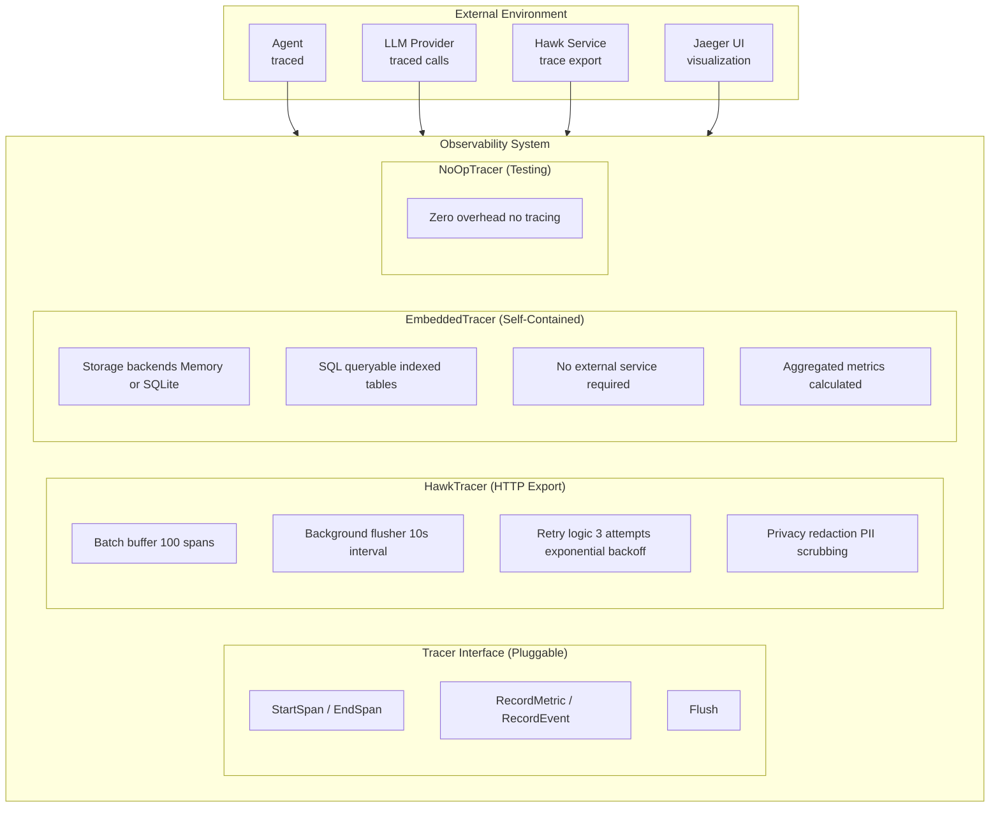

# Observability Architecture

Comprehensive architecture of Loom's observability system with distributed tracing, metrics collection, privacy-aware PII redaction, and Hawk integration.

**Target Audience**: Architects, academics, and advanced developers

**Version**: v1.0.0-beta.1


## Table of Contents

- [Overview](#overview)
- [Design Goals](#design-goals)
- [System Context](#system-context)
- [Architecture Overview](#architecture-overview)
- [Components](#components)
  - [Tracer Interface](#tracer-interface)
  - [Span Lifecycle](#span-lifecycle)
  - [Hawk Tracer](#hawk-tracer)
  - [Embedded Hawk](#embedded-hawk)
  - [NoOp Tracer](#noop-tracer)
  - [Privacy Redaction](#privacy-redaction)
  - [Trace Buffer](#trace-buffer)
  - [Retry Logic](#retry-logic)
- [Key Interactions](#key-interactions)
  - [Span Creation and Propagation](#span-creation-and-propagation)
  - [Batch Export Flow](#batch-export-flow)
  - [Privacy Redaction Flow](#privacy-redaction-flow)
- [Data Structures](#data-structures)
- [Algorithms](#algorithms)
  - [Context Propagation](#context-propagation)
  - [PII Redaction](#pii-redaction)
  - [Exponential Backoff](#exponential-backoff)
- [Design Trade-offs](#design-trade-offs)
- [Constraints and Limitations](#constraints-and-limitations)
- [Performance Characteristics](#performance-characteristics)
- [Concurrency Model](#concurrency-model)
- [Error Handling](#error-handling)
- [Security Considerations](#security-considerations)
- [Related Work](#related-work)
- [References](#references)
- [Further Reading](#further-reading)


## Overview

The Observability System instruments **every operation in Loom** with distributed tracing and metrics:
- LLM API calls (tokens, cost, latency)
- Tool executions (parameters, results, errors)
- Pattern selections (match score, confidence)
- Full conversation flows (multi-turn context)
- Multi-agent workflows (inter-agent communication)

Traces can be stored in three modes:
1. **Embedded**: Self-contained in-process storage (memory or SQLite) with no external dependencies
2. **Service**: HTTP export to Hawk or other observability services
3. **None**: Zero-overhead no-op tracer

**Key Innovation**: Self-contained embedded observability with SQLite persistence, privacy-aware tracing with automatic PII redaction, and pluggable storage backends.


## Design Goals

1. **Universal Instrumentation**: Every operation traced (LLM, tool, pattern, conversation)
2. **Privacy by Default**: Automatic PII redaction with whitelist overrides
3. **Zero External Dependencies**: Embedded mode works out-of-the-box with no external services
4. **Flexible Storage**: Pluggable backends (memory, SQLite, HTTP export)
5. **Low Latency**: Batched async export (non-blocking operation)
6. **Reliable Export**: Retry failed exports with exponential backoff (service mode)
7. **Context Propagation**: Parent-child span relationships via context
8. **SQL Queryable**: Persistent traces with indexed SQLite storage

**Non-goals**:
- Real-time query UI (use SQL queries for embedded, Hawk/Jaeger for service mode)
- Custom sampling (all spans exported, filter at destination)
- Distributed tracing across processes (single-process multi-agent server only)


## System Context



**External Dependencies**:
- **Hawk Service**: Trace export via HTTP (optional, can use embedded)
- **LLM Providers**: Traced API calls for cost/token tracking
- **Agent Runtime**: Instrumentation points throughout execution


## Architecture Overview

```
┌──────────────────────────────────────────────────────────────────────────────┐
│                    Observability System                                      │
│                                                                              │
│  ┌────────────────────────────────────────────────────────────────────────┐  │
│  │                  Tracer Interface                            │         │  │
│  │                                                              │         │  │
│  │  StartSpan(ctx, name, ...opts) → (ctx, *Span)               │          │  │
│  │  EndSpan(span) → calculate duration, redact, buffer         │          │  │
│  │  RecordMetric(name, value, labels)                          │          │  │
│  │  RecordEvent(ctx, name, attrs)                              │          │  │
│  │  Flush(ctx) → export buffered spans                         │          │  │
│  └────────────────────────────────────────────────────────────────────────┘  │
│                            ▲                                                 │
│                            │ implements                                      │
│  ┌────────────────────────────────────────────────────────────────────────┐  │
│            │               │               │                  │              │
│            ▼               ▼               ▼                  ▼              │
│  ┌────────────────────────────────────────────────────────────────────────┐  │
│  │  HawkTracer   │  │ EmbeddedHawk │  │ NoOpTracer│  │ OTLPTracer │       │  │
│  │   (HTTP)      │  │   (SQLite)   │  │  (Noop)  │  │  (future)  │        │  │
│  └────────────────────────────────────────────────────────────────────────┘  │
│          │                 │                                                 │
│          ▼                 ▼                                                 │
│  ┌────────────────────────────────────────────────────────────────────────┐  │
│  │           Span Lifecycle (HawkTracer detail)                 │         │  │
│  │                                                              │         │  │
│  │  1. StartSpan                                                │         │  │
│  │     ├─ Generate TraceID, SpanID                              │         │  │
│  │     ├─ Link to parent (via context)                          │         │  │
│  │     ├─ Apply SpanOptions                                     │         │  │
│  │     └─ Store in context                                      │         │  │
│  │                                                              │         │  │
│  │  2. Operation Execution (user code)                          │         │  │
│  │     ├─ span.SetAttribute(key, value)                         │         │  │
│  │     ├─ span.AddEvent(name, attrs)                            │         │  │
│  │     └─ span.RecordError(err)                                 │         │  │
│  │                                                              │         │  │
│  │  3. EndSpan                                                  │         │  │
│  │     ├─ Calculate duration                                    │         │  │
│  │     ├─ Privacy redaction                                     │         │  │
│  │     │   ├─ Remove credentials (password, api_key, token)     │         │  │
│  │     │   ├─ Redact PII (email, phone, SSN, credit card)       │         │  │
│  │     │   └─ Allowlist bypass (session.id, llm.model, etc.)    │         │  │
│  │     ├─ Buffer span                                           │         │  │
│  │     └─ Trigger flush if buffer full                          │         │  │
│  │                                                              │         │  │
│  │  4. Background Flusher (goroutine)                           │         │  │
│  │     ├─ Ticker (10s interval)                                 │         │  │
│  │     ├─ Drain buffer                                          │         │  │
│  │     ├─ Marshal to JSON                                       │         │  │
│  │     ├─ HTTP POST to Hawk                                     │         │  │
│  │     └─ Retry with exponential backoff                        │         │  │
│  │         ├─ Attempt 1: Immediate                              │         │  │
│  │         ├─ Attempt 2: 1s delay                               │         │  │
│  │         ├─ Attempt 3: 2s delay                               │         │  │
│  │         └─ Attempt 4: 4s delay → fail                        │         │  │
│  └────────────────────────────────────────────────────────────────────────┘  │
│                                                                              │
│  ┌────────────────────────────────────────────────────────────────────────┐  │
│  │                  Trace Buffer (Thread-Safe)                  │         │  │
│  │                                                              │         │  │
│  │  mu sync.Mutex                                               │         │  │
│  │  spans []*Span (capacity: 100 default)                      │          │  │
│  │                                                              │         │  │
│  │  Methods:                                                    │         │  │
│  │    add(span)       → append with lock                        │         │  │
│  │    shouldFlush()   → len(spans) >= capacity                  │         │  │
│  │    drain()         → swap with empty, return old             │         │  │
│  └────────────────────────────────────────────────────────────────────────┘  │
└──────────────────────────────────────────────────────────────────────────────┘
```


## Components

### Tracer Interface

**Responsibility**: Unified API for instrumenting operations with distributed tracing.

**Core Interface** (`pkg/observability/interface.go:11`):
```go
type Tracer interface {
    StartSpan(ctx context.Context, name string, opts ...SpanOption) (context.Context, *Span)
    EndSpan(span *Span)
    RecordMetric(name string, value float64, labels map[string]string)
    RecordEvent(ctx context.Context, name string, attributes map[string]interface{})
    Flush(ctx context.Context) error
}
```

**Thread Safety**: All methods can be called concurrently from multiple goroutines.

**Context Propagation**:
```go
// Context carries span through call stack
ctx, span := tracer.StartSpan(ctx, "llm.completion")
defer tracer.EndSpan(span)

// Child operations inherit trace
ctx2, child := tracer.StartSpan(ctx, "tool.execute")
defer tracer.EndSpan(child)
// child.ParentID == span.SpanID automatically
```

**Rationale**:
- **Pluggable**: Multiple implementations (Hawk, Embedded, NoOp, future OTLP)
- **Context-based**: Parent-child relationships via Go context (no manual linking)
- **Defer-friendly**: EndSpan designed for defer pattern


### Span Lifecycle

**Responsibility**: Represent a single unit of work with timing, metadata, and parent-child relationships.

**Core Structure** (`pkg/observability/types.go:59`):
```go
type Span struct {
    // Identifiers
    TraceID  string // Shared across entire trace tree
    SpanID   string // Unique for this span
    ParentID string // Links to parent span (empty for root)

    // Metadata
    Name       string                 // Operation name (e.g., "llm.completion")
    Attributes map[string]interface{} // Key-value pairs

    // Timing
    StartTime time.Time
    EndTime   time.Time
    Duration  time.Duration // Calculated on EndSpan

    // Events and status
    Events []Event  // Timestamped log entries
    Status Status   // OK, Error, Unset
}
```

**Span Tree Example**:
```
Trace: abc123
├─ Span: conversation (root, ParentID="")                                       
│  ├─ Span: llm.completion (ParentID=conversation.SpanID)                      │
│  ├─ Span: tool.execute (ParentID=conversation.SpanID)                        │
│                                                                              │
│  └─ Span: pattern.match (ParentID=conversation.SpanID)                       │
```

**State Transitions**:
```
Created (StartSpan) → Running (user code) → Ended (EndSpan) → Exported (Flush)
```

**Invariants**:
```
∀ span: span.EndTime > span.StartTime
∀ span: span.Duration = span.EndTime - span.StartTime
∀ child span: child.TraceID = parent.TraceID
∀ child span: child.ParentID = parent.SpanID
```


### Hawk Tracer

**Responsibility**: Export traces to Hawk service via HTTP with batching, retry, and privacy redaction.

**Core Structure** (`pkg/observability/hawk.go:64`):
```go
type HawkTracer struct {
    config HawkConfig
    buffer *traceBuffer       // Buffered spans (100 default)
    client *http.Client       // HTTP client
    stopCh chan struct{}      // Shutdown signal
    wg     sync.WaitGroup     // Background flusher lifecycle
}
```

**Configuration**:
```go
type HawkConfig struct {
    Endpoint      string        // "http://localhost:8080/v1/traces"
    APIKey        string        // Authentication
    BatchSize     int           // 100 (spans per batch)
    FlushInterval time.Duration // 10s (auto-flush interval)
    MaxRetries    int           // 3 attempts
    RetryBackoff  time.Duration // 1s (doubles each retry)
    Privacy       PrivacyConfig // PII redaction rules
    HTTPClient    *http.Client  // Custom transport
}
```

**Batch Export Flow**:
```
Span 1 ──┐                                                                      
Span 2 ──┼──▶ Buffer (100 capacity) ──▶ Drain ──▶ JSON ──▶ HTTP POST ──▶ Hawk   
...      │                             (every 10s)                              
Span N ──┘                                                                      
```

**Trigger Conditions**:
1. **Buffer full**: len(spans) >= 100 → async flush
2. **Timer tick**: Every 10s → background flush
3. **Explicit flush**: tracer.Flush(ctx) → immediate flush
4. **Shutdown**: tracer.Close() → final flush

**Rationale**:
- **Batching reduces network overhead**: 100 spans per request vs 100 requests
- **Async export**: EndSpan never blocks on network I/O
- **Background flusher**: Periodic export even if buffer not full


### Embedded Tracer

**Responsibility**: In-process trace storage with pluggable backends (memory or SQLite).

**Core Structure** (`pkg/observability/embedded.go:45`):
```go
type EmbeddedTracer struct {
    storage storage.Storage // Pluggable storage backend
    config  *EmbeddedConfig
    logger  *zap.Logger
    mu      sync.RWMutex
}

type EmbeddedConfig struct {
    StorageType   string        // "memory" or "sqlite"
    SQLitePath    string        // Path for SQLite database
    FlushInterval time.Duration // Metric calculation interval
    Logger        *zap.Logger
}
```

**Storage Backends**:

1. **Memory Storage** (`pkg/observability/storage/memory.go:20`):
```go
type MemoryStorage struct {
    mu             sync.RWMutex
    maxTraces      int
    evals          map[string]*Eval
    runs           map[string]*EvalRun
    runsByEval     map[string][]string
    metrics        map[string]*EvalMetrics
}
```

2. **SQLite Storage** (`pkg/observability/storage/sqlite.go:30`):
```sql
CREATE TABLE evals (
    id TEXT PRIMARY KEY,
    name TEXT NOT NULL,
    suite TEXT NOT NULL,
    status TEXT NOT NULL,
    created_at INTEGER NOT NULL,
    updated_at INTEGER NOT NULL
);

CREATE TABLE eval_runs (
    id TEXT PRIMARY KEY,
    eval_id TEXT NOT NULL,
    query TEXT,
    model TEXT,
    response TEXT,
    execution_time_ms INTEGER NOT NULL,
    token_count INTEGER NOT NULL,
    success INTEGER NOT NULL,
    session_id TEXT,
    timestamp INTEGER NOT NULL,
    FOREIGN KEY (eval_id) REFERENCES evals(id)
);

CREATE TABLE eval_metrics (
    eval_id TEXT PRIMARY KEY,
    total_runs INTEGER NOT NULL,
    successful_runs INTEGER NOT NULL,
    failed_runs INTEGER NOT NULL,
    success_rate REAL NOT NULL,
    avg_execution_time_ms REAL NOT NULL,
    total_tokens INTEGER NOT NULL,
    FOREIGN KEY (eval_id) REFERENCES evals(id)
);
```

**Rationale**:
- **Zero external dependencies**: No external services required
- **Pluggable backends**: Memory for dev, SQLite for production
- **SQL queryable**: Standard SQL queries for trace analysis
- **Persistent**: SQLite traces survive server restart
- **Aggregated metrics**: Pre-calculated success rates, avg execution time

**Status**: ✅ Implemented (v1.0.2)


### NoOp Tracer

**Responsibility**: Zero-overhead tracing for testing (no export, no storage).

**Core Structure** (`pkg/observability/noop.go:11`):
```go
type NoOpTracer struct{}

func (t *NoOpTracer) StartSpan(ctx context.Context, name string, opts ...SpanOption) (context.Context, *Span) {
    // Create minimal span for context propagation
    span := &Span{
        TraceID:    uuid.New().String(),
        SpanID:     uuid.New().String(),
        Name:       name,
        StartTime:  time.Now(),
        Attributes: make(map[string]interface{}),
    }
    // Link to parent (same as real tracer)
    if parent := SpanFromContext(ctx); parent != nil {
        span.TraceID = parent.TraceID
        span.ParentID = parent.SpanID
    }
    return ContextWithSpan(ctx, span), span
}

func (t *NoOpTracer) EndSpan(span *Span) {
    span.EndTime = time.Now()
    span.Duration = span.EndTime.Sub(span.StartTime)
    // No export, no storage
}

func (t *NoOpTracer) RecordMetric(name string, value float64, labels map[string]string) {}
func (t *NoOpTracer) RecordEvent(ctx context.Context, name string, attributes map[string]interface{}) {}
func (t *NoOpTracer) Flush(ctx context.Context) error { return nil }
```

**Rationale**:
- **Testing**: Unit tests don't need external Hawk service
- **Zero overhead**: No network I/O, no serialization, no buffer
- **Context propagation still works**: Spans still linked, just not exported


### Privacy Redaction

**Responsibility**: Remove sensitive data (credentials, PII) from spans before export.

**Configuration** (`pkg/observability/hawk.go:50`):
```go
type PrivacyConfig struct {
    RedactCredentials bool     // Remove password, api_key, token
    RedactPII         bool     // Remove email, phone, SSN, credit card
    AllowedAttributes []string // Whitelist (bypass redaction)
}
```

**Credential Patterns** (exact key match):
```go
credentialKeys := []string{
    "password", "api_key", "token", "secret", "authorization",
    "access_token", "refresh_token", "bearer", "apikey",
    "client_secret", "private_key", "ssh_key", "aws_secret",
}
// Also: substring match on keys containing "password", "secret", "token"
```

**PII Patterns** (regex-based value redaction):
```go
emailPattern      := `[a-zA-Z0-9._%+-]+@[a-zA-Z0-9.-]+\.[a-zA-Z]{2,}`
phonePattern      := `\b\d{3}[-.]?\d{3}[-.]?\d{4}\b`
ssnPattern        := `\b\d{3}-\d{2}-\d{4}\b`
creditCardPattern := `\b\d{4}[-\s]?\d{4}[-\s]?\d{4}[-\s]?\d{4}\b`
```

**Redaction Examples**:
```
Before: {"email": "user@example.com", "phone": "555-123-4567"}
After:  {"email": "[EMAIL_REDACTED]", "phone": "[PHONE_REDACTED]"}

Before: {"api_key": "sk-1234567890"}
After:  {} // Entire attribute removed

Before: {"session.id": "sess_abc123"} (in allowlist)
After:  {"session.id": "sess_abc123"} // Not redacted
```

**Algorithm** (`pkg/observability/hawk.go:320`):
```go
func (t *HawkTracer) redact(span *Span) *Span {
    allowed := make(map[string]bool)
    for _, key := range t.config.Privacy.AllowedAttributes {
        allowed[key] = true
    }

    // 1. Remove credential keys (entire attribute)
    if t.config.Privacy.RedactCredentials {
        for _, key := range credentialKeys {
            if !allowed[key] {
                delete(span.Attributes, key)
            }
        }
    }

    // 2. Redact PII patterns from string values
    if t.config.Privacy.RedactPII {
        for key, value := range span.Attributes {
            if allowed[key] {
                continue
            }
            if strVal, ok := value.(string); ok {
                redacted := strVal
                redacted = emailPattern.ReplaceAllString(redacted, "[EMAIL_REDACTED]")
                redacted = phonePattern.ReplaceAllString(redacted, "[PHONE_REDACTED]")
                redacted = ssnPattern.ReplaceAllString(redacted, "[SSN_REDACTED]")
                redacted = creditCardPattern.ReplaceAllString(redacted, "[CARD_REDACTED]")
                if redacted != strVal {
                    span.Attributes[key] = redacted
                }
            }
        }
    }

    return span
}
```

**Rationale**:
- **Privacy by default**: PII/credentials never leave the agent
- **Debugging utility preserved**: Non-sensitive metadata still exported
- **Allowlist override**: Critical attributes (session.id, llm.model) never redacted


### Trace Buffer

**Responsibility**: Thread-safe buffer for spans awaiting export.

**Core Structure** (`pkg/observability/hawk.go:417`):
```go
type traceBuffer struct {
    mu       sync.Mutex
    spans    []*Span
    capacity int // 100 default
}

func (b *traceBuffer) add(span *Span) {
    b.mu.Lock()
    defer b.mu.Unlock()
    b.spans = append(b.spans, span)
}

func (b *traceBuffer) shouldFlush() bool {
    b.mu.Lock()
    defer b.mu.Unlock()
    return len(b.spans) >= b.capacity
}

func (b *traceBuffer) drain() []*Span {
    b.mu.Lock()
    defer b.mu.Unlock()
    spans := b.spans
    b.spans = make([]*Span, 0, b.capacity) // Reset with capacity
    return spans
}
```

**Invariants**:
```
∀ t: len(buffer.spans) ≤ buffer.capacity (at steady state)
drain() is atomic (no partial reads)
```

**Rationale**:
- **Mutex simplicity**: Simple lock vs lock-free queue (99% overhead in lock-free queue)
- **Capacity reservation**: Pre-allocate to avoid repeated malloc
- **Atomic drain**: Return old buffer, create new (no incremental flushing)


### Retry Logic

**Responsibility**: Retry failed HTTP exports with exponential backoff.

**Configuration**:
```go
MaxRetries:   3     // Total 4 attempts (initial + 3 retries)
RetryBackoff: 1s    // Initial delay (doubles each retry)
```

**Backoff Schedule**:
```
Attempt 1: Immediate
Attempt 2: 1s delay
Attempt 3: 2s delay
Attempt 4: 4s delay
→ Fail (all retries exhausted)
```

**Algorithm** (`pkg/observability/hawk.go:223`):
```go
func (t *HawkTracer) flushNow() error {
    spans := t.buffer.drain()
    payload, _ := json.Marshal(spans)

    var lastErr error
    backoff := t.config.RetryBackoff

    for attempt := 0; attempt <= t.config.MaxRetries; attempt++ {
        req, _ := http.NewRequest("POST", t.config.Endpoint, bytes.NewReader(payload))
        req.Header.Set("Content-Type", "application/json")
        req.Header.Set("Authorization", "Bearer "+t.config.APIKey)

        resp, err := t.client.Do(req)
        if err == nil && (resp.StatusCode == 200 || resp.StatusCode == 202) {
            return nil // Success
        }

        lastErr = err
        if attempt < t.config.MaxRetries {
            time.Sleep(backoff)
            backoff *= 2 // Exponential backoff
        }
    }

    return fmt.Errorf("hawk export failed after %d attempts: %w", t.config.MaxRetries+1, lastErr)
}
```

**Non-Retryable Errors**:
- 400 Bad Request → Immediate failure (malformed payload)
- 401 Unauthorized → Immediate failure (invalid API key)
- 403 Forbidden → Immediate failure (permission denied)

**Retryable Errors**:
- 500 Internal Server Error → Retry
- 502 Bad Gateway → Retry
- 503 Service Unavailable → Retry
- Network timeouts → Retry

**Rationale**:
- **Transient failures**: Network blips, temporary Hawk downtime
- **Exponential backoff**: Avoid overwhelming failing service
- **Limited retries**: Fail fast rather than infinite retry


## Key Interactions

### Span Creation and Propagation

```
Agent Code         Tracer           Context         Span Tree
  │                  │                 │                │                       
  ├─ StartSpan(ctx)─▶│                 │                │                       
  │                  ├─ Generate IDs   │                │                       
  │                  ├─ Check parent ──▶│                │                      
  │                  │◀─ parent span ──┤                │                       
  │                  ├─ Link parent ───┼───────────────▶│                       
  │                  │  (TraceID, ParentID)             │                       
  │                  ├─ Store in ctx ──▶│                │                      
  │◀─ (ctx, span) ───┤                 │                │                       
  │                  │                 │                │                       
  ├─ Operation      │                 │                │                        
  ├─ span.SetAttribute("llm.model", "claude")          │                        
  ├─ span.AddEvent("request_sent", {...})              │                        
  │                  │                 │                │                       
  ├─ Child StartSpan(ctx) ────────────▶│                │                       
  │                  ├─ Extract parent ─┤                │                      
  │                  ├─ Link parent ────┼───────────────▶│                      
  │◀─ (ctx2, child)──┤                 │                │                       
  │                  │                 │                │                       
  ├─ Child operation │                 │                │                       
  ├─ child.EndSpan() │                 │                │                       
  │                  ├─ Calculate duration              │                       
  │                  ├─ Redact PII                      │                       
  │                  ├─ Buffer span                     │                       
  │                  │                 │                │                       
  ├─ parent.EndSpan()│                 │                │                       
  │                  ├─ Calculate duration              │                       
  │                  ├─ Redact PII                      │                       
  │                  ├─ Buffer span                     │                       
  │                  │                 │                │                       
```

**Context Propagation Invariant**:
```
∀ operation: parent_span = SpanFromContext(ctx)
           → child.TraceID = parent.TraceID
           → child.ParentID = parent.SpanID
```


### Batch Export Flow

```
Agent Goroutine    Tracer Buffer    Background Flusher    Hawk Service
  │                    │                   │                    │               
  ├─ EndSpan(span) ───▶│                   │                    │               
  │                    ├─ append(span)     │                    │               
  │                    ├─ len >= 100?      │                    │               
  │                    ├─ Yes: trigger ────▶│                    │              
  │                    │                   │                    │               
  │                    │                   ├─ drain() ─────────▶│               
  │                    │◀─ empty buffer ───┤                    │               
  │                    │                   │                    │               
  │                    │                   ├─ Marshal JSON      │               
  │                    │                   ├─ HTTP POST ────────▶│              
  │                    │                   │◀─ 200 OK ──────────┤               
  │                    │                   │                    │               
  │                    │                   │  (10s passes)      │               
  │                    │                   │                    │               
  ├─ EndSpan(span) ───▶│                   │                    │               
  │                    ├─ append(span)     │                    │               
  │  ...               │  ...              │                    │               
  │                    │                   ├─ Ticker tick       │               
  │                    │                   ├─ drain() ─────────▶│               
  │                    │◀─ partial batch ──┤                    │               
  │                    │                   ├─ Marshal JSON      │               
  │                    │                   ├─ HTTP POST ────────▶│              
  │                    │                   │◀─ 503 Unavailable ─┤               
  │                    │                   ├─ Wait 1s (retry 1) │               
  │                    │                   ├─ HTTP POST ────────▶│              
  │                    │                   │◀─ 200 OK ──────────┤               
  │                    │                   │                    │               
```

**Flush Triggers**:
1. Buffer full (len >= 100)
2. Timer tick (10s)
3. Explicit Flush()
4. Shutdown


### Privacy Redaction Flow

```
EndSpan(span)     Redactor        PII Patterns     Buffer
  │                  │                  │             │                         
  ├─ span.EndTime ───┤                  │             │                         
  ├─ span.Duration   │                  │             │                         
  │                  │                  │             │                         
  ├─ redact(span) ───▶│                  │             │                        
  │                  ├─ Check config    │             │                         
  │                  │  RedactCredentials? RedactPII? │                         
  │                  │                  │             │                         
  │                  ├─ Credential keys │             │                         
  │                  │  (password, api_key, token)    │                         
  │                  ├─ delete(span.Attributes[key])  │                         
  │                  │                  │             │                         
  │                  ├─ PII patterns ───▶│             │                        
  │                  │                  ├─ email regex │                        
  │                  │                  ├─ phone regex │                        
  │                  │                  ├─ SSN regex   │                        
  │                  │                  └─ card regex  │                        
  │                  │                  │             │                         
  │                  ├─ For each attribute:           │                         
  │                  │   if string value:             │                         
  │                  │     apply regex replacements   │                         
  │                  │                  │             │                         
  │                  ├─ Allowlist check │             │                         
  │                  │  (session.id, llm.model bypass)│                         
  │                  │                  │             │                         
  │◀─ redacted span ─┤                  │             │                         
  │                  │                  │             │                         
  ├─ buffer.add(span) ────────────────────────────────▶│                        
  │                  │                  │             │                         
```

**Example**:
```
Before redaction:
  Attributes: {
    "user.email": "alice@example.com",
    "api_key": "sk-abc123",
    "session.id": "sess_xyz789",
    "message": "Contact me at bob@test.com or 555-1234"
  }

After redaction:
  Attributes: {
    "session.id": "sess_xyz789",  // Allowlisted
    "message": "Contact me at [EMAIL_REDACTED] or [PHONE_REDACTED]"
  }
  // user.email removed (PII)
  // api_key removed (credential)
```


## Data Structures

### Span

**Definition** (`pkg/observability/types.go:59`):
```go
type Span struct {
    // Identifiers
    TraceID  string // abc-123-def (shared across trace tree)
    SpanID   string // span-456-ghi (unique per span)
    ParentID string // Empty for root, parent.SpanID for children

    // Metadata
    Name       string                 // "llm.completion", "tool.execute"
    Attributes map[string]interface{} // Key-value pairs

    // Timing
    StartTime time.Time     // Set on StartSpan
    EndTime   time.Time     // Set on EndSpan
    Duration  time.Duration // EndTime - StartTime

    // Events and status
    Events []Event // Timestamped log entries
    Status Status  // OK, Error, Unset
}
```

**Invariants**:
```
span.Duration = span.EndTime - span.StartTime
∀ child: child.TraceID = parent.TraceID
∀ child: child.ParentID = parent.SpanID
```


### Event

**Definition** (`pkg/observability/types.go:52`):
```go
type Event struct {
    Timestamp  time.Time
    Name       string
    Attributes map[string]interface{}
}
```

**Usage**: Timestamped log entries within a span (e.g., "request_sent", "response_received", "retry_attempt").


### Status

**Definition** (`pkg/observability/types.go:21`):
```go
type StatusCode int

const (
    StatusUnset StatusCode = iota // Default (not explicitly set)
    StatusOK                      // Success
    StatusError                   // Error occurred
)

type Status struct {
    Code    StatusCode
    Message string // Optional error message
}
```


## Algorithms

### Context Propagation

**Problem**: Link child spans to parent without manual ID passing.

**Solution**: Store span in context, extract on child creation.

**Algorithm**:
```go
func (t *HawkTracer) StartSpan(ctx context.Context, name string, opts ...SpanOption) (context.Context, *Span) {
    span := &Span{
        TraceID: uuid.New().String(),
        SpanID:  uuid.New().String(),
        Name:    name,
        StartTime: time.Now(),
    }

    // Link to parent if exists
    if parent := SpanFromContext(ctx); parent != nil {
        span.TraceID = parent.TraceID
        span.ParentID = parent.SpanID
    }

    // Store span in context for children
    ctx = ContextWithSpan(ctx, span)
    return ctx, span
}
```

**Complexity**: O(1) context lookup and assignment

**Rationale**: Go's context.Context idiom for implicit propagation


### PII Redaction

**Problem**: Remove sensitive data (email, phone, SSN, credit card) from span attributes.

**Solution**: Regex-based pattern matching with replacement.

**Algorithm**:
```go
func redactPII(span *Span) *Span {
    for key, value := range span.Attributes {
        if strVal, ok := value.(string); ok {
            redacted := strVal
            redacted = emailPattern.ReplaceAllString(redacted, "[EMAIL_REDACTED]")
            redacted = phonePattern.ReplaceAllString(redacted, "[PHONE_REDACTED]")
            redacted = ssnPattern.ReplaceAllString(redacted, "[SSN_REDACTED]")
            redacted = creditCardPattern.ReplaceAllString(redacted, "[CARD_REDACTED]")
            if redacted != strVal {
                span.Attributes[key] = redacted
            }
        }
    }
    return span
}
```

**Complexity**: O(n × p) where n = attribute count, p = pattern count (4 patterns)

**Regex Patterns**:
```go
emailPattern      := `[a-zA-Z0-9._%+-]+@[a-zA-Z0-9.-]+\.[a-zA-Z]{2,}`
phonePattern      := `\b\d{3}[-.]?\d{3}[-.]?\d{4}\b`
ssnPattern        := `\b\d{3}-\d{2}-\d{4}\b`
creditCardPattern := `\b\d{4}[-\s]?\d{4}[-\s]?\d{4}[-\s]?\d{4}\b`
```

**False Positives/Negatives**:
- ✅ US phone numbers (555-123-4567)
- ✅ US SSN (123-45-6789)
- ✅ Credit cards (1234-5678-9012-3456)
- ❌ International phone formats (not covered)
- ❌ European ID numbers (not covered)


### Exponential Backoff

**Problem**: Retry failed HTTP exports without overwhelming failing service.

**Solution**: Exponential backoff with doubling delay.

**Algorithm**:
```go
backoff := 1 * time.Second
for attempt := 0; attempt <= maxRetries; attempt++ {
    resp, err := client.Do(req)
    if err == nil && resp.StatusCode == 200 {
        return nil // Success
    }

    if attempt < maxRetries {
        time.Sleep(backoff)
        backoff *= 2 // Double the delay
    }
}
return errors.New("all retries exhausted")
```

**Schedule**:
```
Attempt 0: Immediate (0s delay)
Attempt 1: 1s delay
Attempt 2: 2s delay
Attempt 3: 4s delay
Total time: 7s (max)
```

**Complexity**: O(k) where k = retry count

**Jitter**: Not currently implemented (would add random variation to prevent thundering herd)

**Rationale**:
- **Exponential**: Gives service time to recover
- **Limited retries**: Fail fast rather than infinite loop
- **Predictable max time**: 7s worst case


## Design Trade-offs

### Decision 1: Batched Export vs. Real-Time

**Chosen**: Batched export (100 spans per HTTP request)

**Rationale**:
- **Network efficiency**: 100 spans per request vs 100 requests
- **Agent latency**: EndSpan never blocks on network I/O
- **Hawk load**: Fewer HTTP requests to handle

**Alternatives**:
1. **Real-time export** (send each span immediately):
   - ✅ Lower memory usage (no buffer)
   - ✅ Immediate visibility in Hawk
   - ❌ High network overhead (100 requests vs 1)
   - ❌ EndSpan blocks on network I/O (unacceptable latency)

2. **Streaming export** (HTTP/2 streaming):
   - ✅ Low latency, efficient network usage
   - ❌ More complex implementation (connection management)
   - ❌ Hawk API doesn't support streaming yet

**Consequences**:
- ✅ Agent never blocked by tracing overhead
- ✅ Network efficient
- ❌ Up to 10s delay before spans visible in Hawk (FlushInterval)
- ❌ Memory usage: 100 spans × ~2KB = ~200KB buffer


### Decision 2: Automatic PII Redaction vs. Manual

**Chosen**: Automatic PII redaction with opt-in allowlist

**Rationale**:
- **Privacy by default**: Sensitive data never leaves agent
- **Regulatory compliance**: GDPR, CCPA, HIPAA
- **User safety**: Prevent accidental exposure

**Alternatives**:
1. **Manual redaction only** (developers must redact):
   - ✅ No false positives (developers know what's sensitive)
   - ❌ Easy to forget (security risk)
   - ❌ Every developer must learn redaction patterns

2. **No redaction** (export everything):
   - ✅ Maximum debugging utility
   - ❌ Unacceptable privacy risk
   - ❌ Regulatory violations

3. **Server-side redaction** (Hawk redacts):
   - ✅ Centralized policy
   - ❌ PII already transmitted over network (violation)
   - ❌ Hawk must implement redaction

**Consequences**:
- ✅ Privacy by default
- ✅ Allowlist for critical attributes (session.id, llm.model)
- ❌ False positives (email-like strings redacted)
- ❌ Performance cost: ~10µs per span for regex matching


### Decision 3: Self-Contained Storage vs. External Only

**Chosen**: Pluggable tracer (Embedded, Service, NoOp) with self-contained storage

**Rationale**:
- **Zero dependencies**: Embedded mode works without any external services
- **Development workflow**: No setup required for local development
- **Testing**: Zero overhead (NoOp)
- **Production flexibility**: Choose embedded (single server) or service (multi-server)
- **No vendor lock-in**: Storage interface allows multiple backends

**Alternatives**:
1. **External service only**:
   - ✅ Simpler implementation (one code path)
   - ❌ Requires external service for local development
   - ❌ Complex onboarding (setup service first)
   - ❌ Network dependency for all tracing

2. **Embedded only (no service export)**:
   - ✅ Self-contained
   - ❌ No centralized trace aggregation for production
   - ❌ Limited multi-server support

3. **Hawk SDK dependency for embedded**:
   - ✅ Less code to maintain
   - ❌ External dependency requirement
   - ❌ Can't build without Hawk SDK access
   - ❌ Vendor lock-in

**Consequences**:
- ✅ Works out-of-the-box (embedded mode requires no setup)
- ✅ Flexible deployment (choose mode per environment)
- ✅ Easy onboarding (no external services to configure)
- ✅ Production-ready (service mode for multi-server)
- ✅ SQL queryable (embedded SQLite storage)
- ❌ More code to maintain (storage layer + 3 tracer implementations)
- ❌ Limited to single-server for embedded mode


## Constraints and Limitations

### Constraint 1: Single-Process Tracing Only

**Description**: Traces do not span multiple processes (no distributed tracing across services)

**Rationale**: Loom is a single-process multi-agent server

**Impact**: Cannot trace requests across microservices or remote agents

**Workaround**: Export TraceID/SpanID as HTTP headers for manual correlation


### Constraint 2: Regex-Based PII Detection

**Description**: PII redaction uses regex patterns (US-centric: phone, SSN, credit card)

**Limitations**:
- ❌ International phone formats not covered
- ❌ European ID numbers not covered
- ❌ Context-dependent PII (names, addresses) not detected

**Workaround**: Manual redaction via allowlist + custom patterns


### Constraint 3: No Sampling

**Description**: All spans exported (no probabilistic sampling)

**Rationale**: Sampling decision should be at destination (Hawk), not source (agent)

**Impact**: High span volume if agent is very active

**Workaround**: Hawk-side filtering/sampling


### Constraint 4: HTTP-Only Export

**Description**: Only HTTP export supported (no gRPC, no OTLP native)

**Impact**: Cannot export to gRPC-only backends

**Workaround**: HTTP/gRPC gateway, or implement OTLP tracer

**Status**: OTLPTracer planned (📋)


### Constraint 5: 10s Flush Latency

**Description**: Buffered spans may take up to 10s to appear in Hawk

**Rationale**: FlushInterval = 10s for network efficiency

**Impact**: Not suitable for real-time dashboards

**Workaround**: Reduce FlushInterval (at cost of more HTTP requests)


## Performance Characteristics

### Latency (P50/P99)

| Operation | P50 | P99 | Notes |
|-----------|-----|-----|-------|
| StartSpan | <1µs | 5µs | UUID generation, context assignment |
| EndSpan (no redaction) | <1µs | 5µs | Duration calculation, buffer append |
| EndSpan (with PII redaction) | 10µs | 50µs | Regex matching on attributes |
| Buffer flush (100 spans) | 15ms | 50ms | JSON marshal + HTTP POST |
| Retry (1 attempt) | 1s | 1s | Fixed backoff |
| Retry (3 attempts) | 7s | 7s | 1s + 2s + 4s |

### Memory Usage

| Component | Size |
|-----------|------|
| Span struct | ~500 bytes (with 10 attributes) |
| Trace buffer (100 spans) | ~50KB |
| HawkTracer overhead | ~10KB (buffer, client, goroutine) |
| **Total per tracer** | **~60KB** |

### Throughput

- **Span creation**: 1M+ spans/s (in-memory only, no export)
- **Batch export**: 100 spans per request, 10s interval → ~10 spans/s sustained
- **Burst capacity**: 100 spans buffered, handles 1000 spans/s burst for 0.1s


## Concurrency Model

### Tracer Thread Safety

**Model**: All Tracer methods are thread-safe (can be called from multiple goroutines)

**Synchronization**:
- `traceBuffer.mu`: Mutex protects span append and drain
- `http.Client`: Thread-safe by design (connection pooling)
- Context propagation: No shared state (each goroutine has own context)

**Background Flusher Goroutine**:
```go
func (t *HawkTracer) backgroundFlush() {
    ticker := time.NewTicker(t.config.FlushInterval)
    defer ticker.Stop()

    for {
        select {
        case <-ticker.C:
            _ = t.flushNow()
        case <-t.stopCh:
            return
        }
    }
}
```

**Lifecycle**:
1. `NewHawkTracer()` → start background flusher goroutine
2. `tracer.Close()` → signal stopCh, wait for goroutine to exit, final flush
3. `wg.Wait()` → ensure goroutine exited before returning

**Race Detector**: Zero race conditions detected (all tests run with `-race`)


## Error Handling

### Strategy

1. **Non-blocking**: Tracing errors never crash agent (best-effort)
2. **Logged**: Export failures logged but not propagated
3. **Retried**: Transient failures retried with exponential backoff
4. **Eventual consistency**: Spans may be lost if all retries fail (acceptable)

### Error Propagation

```
Export Failure ───▶ Log Error ───▶ Retry (3 attempts) ───▶ Drop Span            
                       │                                       │                
                       ▼                                       ▼
                 Trace to Hawk                            Metric: export_failed
                 (if possible)
```

**Non-Critical Failures**:
- PII redaction regex error → Skip redaction, log warning
- JSON marshal error → Drop span, log error
- Network timeout → Retry

**Critical Failures** (propagated):
- Invalid Hawk endpoint → Return error on NewHawkTracer()
- nil config → Return error on NewHawkTracer()


## Security Considerations

### Threat Model

1. **PII Leakage**: Sensitive data (email, phone, SSN) exported to Hawk
2. **Credential Exposure**: API keys, passwords exported in span attributes
3. **MITM Attack**: Traces intercepted over unencrypted HTTP

### Mitigations

**PII Leakage**:
- ✅ Automatic PII redaction (email, phone, SSN, credit card patterns)
- ✅ Credential removal (password, api_key, token, secret keys)
- ✅ Allowlist for non-sensitive attributes (session.id, llm.model)
- ❌ Not foolproof (context-dependent PII not detected)

**Credential Exposure**:
- ✅ Credential keys removed entirely (not just redacted)
- ✅ Substring matching (any key containing "password", "secret", "token")
- ✅ Allowlist bypass for intentional sensitive attributes

**MITM Attack**:
- ✅ HTTPS recommended for Hawk endpoint (HTTPClient supports TLS)
- ✅ API key authentication (Bearer token in Authorization header)
- ❌ HTTP allowed (user responsibility to use HTTPS in production)

**Recommendations**:
1. Always use HTTPS for Hawk endpoint in production
2. Review allowlist before adding attributes
3. Audit spans in development to catch false negatives


## Related Work

### Distributed Tracing Systems

1. **OpenTelemetry**: Standard for distributed tracing
   - **Similar**: Tracer interface, span lifecycle, context propagation
   - **Loom differs**: Privacy redaction, Hawk-specific export format

2. **Jaeger**: Open-source tracing backend
   - **Similar**: Span model, HTTP/gRPC export
   - **Loom differs**: Batched export, embedded mode

3. **AWS X-Ray**: AWS-native tracing
   - **Similar**: Segment/subsegment model (equivalent to span/child span)
   - **Loom differs**: Backend-agnostic, privacy redaction

### Privacy-Aware Tracing

1. **DataDog APM**: Commercial APM with PII scrubbing
   - **Similar**: Automatic PII redaction
   - **Loom differs**: Open design, regex patterns documented

2. **Honeycomb**: Observability with sampling
   - **Similar**: High-cardinality attributes
   - **Loom differs**: No sampling (export all spans)


## References

1. OpenTelemetry Specification. Tracing API. https://opentelemetry.io/docs/specs/otel/trace/api/

2. Sigelman, B. H., et al. (2010). *Dapper, a Large-Scale Distributed Systems Tracing Infrastructure*. Google Technical Report.

3. GDPR Article 32. Security of Processing. https://gdpr-info.eu/art-32-gdpr/

4. OWASP. Logging Cheat Sheet. https://cheatsheetseries.owasp.org/cheatsheets/Logging_Cheat_Sheet.html


## Further Reading

### Architecture Deep Dives

- [Agent System Architecture](agent-system-design.md) - Instrumentation points in conversation loop
- [Pattern System Architecture](pattern-system.md) - Pattern matching tracing
- [Communication System Architecture](communication-system-design.md) - Multi-agent message tracing
- [Loom System Architecture](loom-system-architecture.md) - Overall system design

### Reference Documentation

- [Observability API Reference](/docs/reference/observability-api.md) - Tracer interface details
- [Hawk Integration Guide](/docs/guides/integration/observability.md) - Setting up Hawk

### Guides

- [Getting Started](/docs/guides/quickstart.md) - Quick start guide
- [Observability Best Practices](/docs/guides/observability-best-practices.md) - Using tracing effectively
