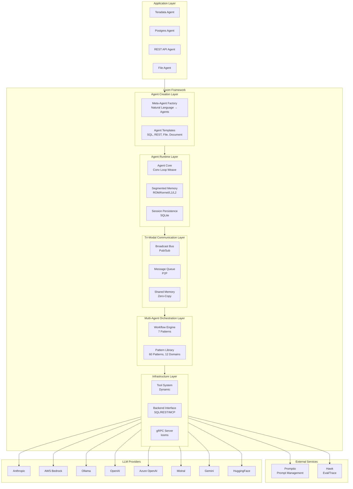

# Loom Framework Architecture

## Overview

Loom is an LLM agent framework with natural language agent generation, autonomous agents, pattern hot-reload, multi-agent orchestration, and observability.

### Core Capabilities

- **Natural language agent generation**: Create working agents from plain English requirements
- **Multi-agent workflow composer**: Automatically detects collaboration needs and generates multi-agent workflows
- **Pattern hot-reload**: Update agent capabilities at runtime without downtime
- **Segmented memory**: ROM/Kernel/L1/L2 architecture with LLM-powered compression
- **Error submission channel**: Progressive disclosure (100-char summaries with full errors on demand)
- **Shared memory**: Tiered storage (Memory to Disk) for large data with token savings
- **Multi-agent workflows**: Orchestration patterns using Kubernetes-style YAML
- **Multi-domain agents**: SQL databases, REST APIs, document processing, MCP tools
- **Pattern-as-a-Service**: Domain knowledge encoded in YAML, hot-reloadable
- **Self-correction loops**: Automatic error detection and retry with fixes
- **Observability**: Every decision, LLM call, and tool execution traced
- **Prompt management**: Version-controlled prompts with A/B testing and hot-reload
- **Multi-provider LLM**: Anthropic, AWS Bedrock, Ollama, OpenAI, Azure OpenAI, Mistral, Gemini, HuggingFace
- **MCP support**: Full Model Context Protocol implementation

### System Context

### Architecture Layers

**Application Layer**: Domain-specific agents built on Loom (Teradata, Postgres, REST API, File agents)

**Agent Creation Layer**:
- Meta-Agent Factory: Natural language → working agents
- Agent Templates: Reusable patterns for SQL, REST, File, Document backends

**Agent Runtime Layer**:
- Agent Core: Conversation loop with turn management
- Segmented Memory: ROM/Kernel/L1/L2 architecture with LLM compression
- Session Persistence: SQLite-backed session recovery

**Tri-Modal Communication Layer**:
- Broadcast Bus: Pub/Sub events for agent coordination
- Message Queue: Point-to-point persistent messages
- Shared Memory: Zero-copy data sharing with memory+disk tiers

**Multi-Agent Orchestration Layer**:
- Workflow Engine: 7 patterns (pipeline, fork-join, parallel, conditional, debate, swarm, iterative)
- Pattern Library: 60 patterns across 12 domains (SQL, Teradata, Postgres, REST, etc.)

**Infrastructure Layer**:
- Tool System: Dynamic tool registration and execution
- Backend Interface: Pluggable SQL/REST/File/MCP backends
- gRPC Server: Multi-agent server (looms) with HTTP gateway

**External Dependencies**:
- Promptio: Version-controlled prompt management
- LLM Providers: Multi-provider support (Anthropic, Bedrock, Ollama, OpenAI, Azure, Mistral, Gemini)
- Hawk: Evaluation platform and distributed tracing

---

## Architecture Components

Detailed documentation for each architectural component:

### Core Systems

- **[Agent Runtime](./agent-runtime)** - Conversation loop, segmented memory (ROM/Kernel/L1/L2), and error submission channel
- **[Memory Systems](./memory-systems)** - Shared memory with tiered storage for large datasets
- **[Meta-Agent System](./meta-agent)** - Natural language agent creation and workflow composer

### Multi-Agent Coordination

- **[Multi-Agent Orchestration](./multi-agent)** - Workflow patterns and tri-modal communication (broadcast, queue, shared memory)
- **[Pattern System](./pattern-system)** - Pattern hot-reload and 60-pattern library across 12 domains

### Integration & Operations

- **[Integration Layer](./integration)** - Pluggable backends, tool system, and TRANSCEND integration
- **[Observability](./observability)** - Hawk integration, tracing, and LLM retry logic
- **[Docker Backend](./docker-backend)** - Containerized code execution with distributed tracing

### Reference

- **[Data Flows](./data-flows)** - Example data flows showing component interactions
- **[Project Structure & Configuration](./project-structure)** - Directory layout, configuration examples, and design decisions

---

## Quick Navigation

**Getting Started:**
- [Quickstart Guide](../guides/quickstart) - Get started in 5 minutes
- [Features Guide](../guides/features) - Complete feature list

**Integration Guides:**
- [LLM Providers](../reference/llm-providers) - Anthropic, Bedrock, Ollama setup
- [MCP Integration](../integration/mcp-readme) - Model Context Protocol
- [Observability Setup](../integration/observability) - Hawk integration details
- [Prompt Management](../integration/prompt-management) - Promptio integration

**Examples:**
- [Examples Overview](../../../examples/README.md) - YAML configuration examples
- [Configuration Templates](../../../examples/reference/) - Agent, workflow, and pattern templates
- [D&D Adventure](../../../examples/03-advanced/dnd-adventure/README.md) - Multi-agent game example
- [Transcend Example](../../../examples/02-production-ready/transcend/README.md) - Production configuration

---

## Key Design Principles

1. **Proto First**: All APIs defined in proto, buf-generated, type-safe
2. **Pattern-Guided**: Domain knowledge in YAML, not hardcoded prompts
3. **Observable by Default**: Every operation traced to Hawk
4. **Zero Downtime**: Pattern hot-reload, config updates without restarts
5. **Race-Free**: All tests run with `-race` detector (0 race conditions)
6. **Memory Efficient**: Segmented memory + shared memory for large datasets
7. **Multi-Provider**: Works with Anthropic, Bedrock, Ollama, OpenAI, etc.
8. **Pluggable**: Backends, tools, and patterns are all pluggable
9. **Self-Correcting**: Automatic error detection and retry with fixes
10. **Learning**: Meta-agent learns from deployment metrics to improve

---

## Related Projects

- **[Hawk](https://github.com/Teradata-TIO/hawk)** - Evaluation platform for LLM agents
- **[Promptio](https://github.com/Teradata-TIO/promptio)** - Version-controlled prompt management
