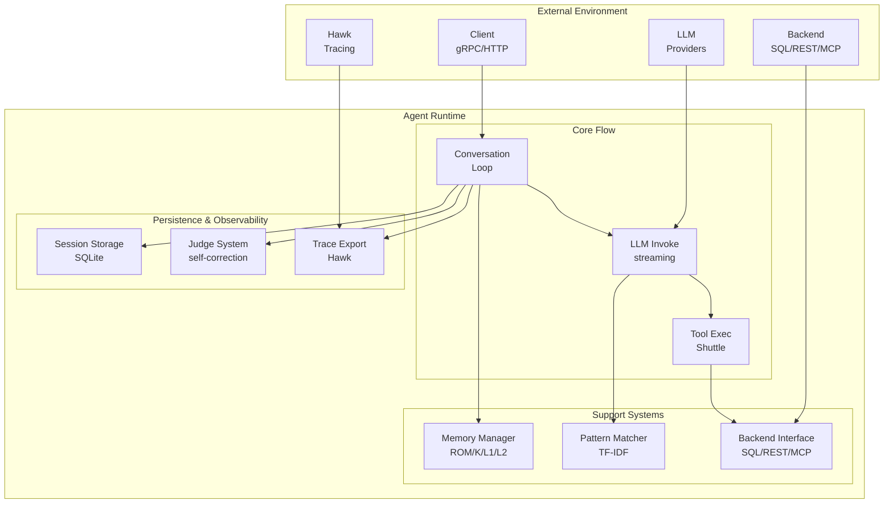

# Agent System Architecture

Detailed architecture of Loom's agent runtime - the conversation loop, segmented memory system, self-correction, and session persistence.

**Target Audience**: Architects, academics, and advanced developers

**Version**: v1.0.0-beta.1

---

## Table of Contents

- [Overview](#overview)
- [Design Goals](#design-goals)
- [System Context](#system-context)
- [Architecture Overview](#architecture-overview)
- [Components](#components)
  - [Agent Core](#agent-core)
  - [Memory Controller](#memory-controller)
  - [Conversation Loop](#conversation-loop)
  - [Pattern Matcher](#pattern-matcher)
  - [Tool Executor Integration](#tool-executor-integration)
  - [Self-Correction (Judge)](#self-correction-judge)
  - [Session Persistence](#session-persistence)
- [Key Interactions](#key-interactions)
  - [Single Turn Execution](#single-turn-execution)
  - [Tool Execution Flow](#tool-execution-flow)
  - [Session Recovery](#session-recovery)
- [Data Structures](#data-structures)
  - [Agent Struct](#agent-struct)
  - [Session](#session)
  - [Message](#message)
  - [Segmented Memory](#segmented-memory)
- [Algorithms](#algorithms)
  - [Context Window Management](#context-window-management)
  - [Token Budget Calculation](#token-budget-calculation)
  - [Memory Eviction Policy](#memory-eviction-policy)
- [Design Trade-offs](#design-trade-offs)
- [Constraints and Limitations](#constraints-and-limitations)
- [Performance Characteristics](#performance-characteristics)
- [Concurrency Model](#concurrency-model)
- [Error Handling](#error-handling)
- [Security Considerations](#security-considerations)
- [Related Work](#related-work)
- [References](#references)
- [Further Reading](#further-reading)

---

## Overview

The Agent System is the core runtime for autonomous LLM-powered agent threads. It orchestrates a conversation loop that:
1. Maintains segmented memory across multiple turns
2. Matches user queries to domain-specific patterns
3. Invokes LLM providers with streaming support
4. Executes tools concurrently via the Shuttle system
5. Validates responses with judge-based self-correction
6. Persists session state for crash recovery

The agent is designed to be **backend-agnostic** (SQL, REST, documents), **LLM-agnostic** (Anthropic, Bedrock, Ollama, etc.), and **thread-safe** for concurrent session management.

---

## Design Goals

1. **Autonomy**: Agent drives conversation with minimal human intervention
2. **Memory Efficiency**: Bounded token usage via segmented memory (ROM/Kernel/L1/L2)
3. **Crash Recovery**: Session persistence enables recovery from any failure
4. **Observable**: Every decision traced to Hawk for debugging and evaluation
5. **Pluggable**: Swap backends, LLMs, tools, patterns without agent code changes

**Non-goals**:
- Real-time sub-second response (P50 latency ~1200ms)
- Multi-modal input/output beyond text + vision tools
- Goal-seeking autonomous agents (pattern-guided, not goal-driven)

---

## System Context



**External Interfaces**:
- **Client**: gRPC/HTTP requests via `Weave` and `StreamWeave` RPCs
- **LLM Provider**: Streaming chat completions with tool calling
- **Backend**: Domain-specific operations (SQL queries, API calls, document retrieval)
- **Hawk**: Observability trace export with span metadata

---

## Architecture Overview

```
┌──────────────────────────────────────────────────────────────────────────────┐
│                           Agent Runtime                                      │
│                                                                              │
│  ┌────────────────────────────────────────────────────────────────────────┐  │
│  │                      Agent Core                             │          │  │
│  │                                                             │          │  │
│  │  • Backend (ExecutionBackend)    • LLM (LLMProvider)       │           │  │
│  │  • Tools (shuttle.Registry)      • Tracer (Hawk)           │           │  │
│  │  • Prompts (PromptRegistry)      • Config                  │           │  │
│  └────────────────────────────────────────────────────────────────────────┘  │
│                              │                                               │
│                              ▼                                               │
│  ┌────────────────────────────────────────────────────────────────────────┐  │
│  │                   Memory Controller                         │          │  │
│  │                                                             │          │  │
│  │  ┌──────────────────────────────────────────────────────────────────┐  │  │
│  │  │          Segmented Memory System                  │     │           │  │
│  │  │                                                   │     │           │  │
│  │  │  ┌─────────────────────────────────────────┐     │     │            │  │
│  │  │  │ ROM (5k tokens)                         │     │     │            │  │
│  │  │  │ Immutable: system prompt, patterns,     │     │     │            │  │
│  │  │  │ backend schema. Never changes.          │     │     │            │  │
│  │  │  └─────────────────────────────────────────┘     │     │            │  │
│  │  │  ┌─────────────────────────────────────────┐     │     │            │  │
│  │  │  │ Kernel (2k tokens)                      │     │     │            │  │
│  │  │  │ Session context: user identity, goals,  │     │     │            │  │
│  │  │  │ preferences. Updated on user request.   │     │     │            │  │
│  │  │  └─────────────────────────────────────────┘     │     │            │  │
│  │  │  ┌─────────────────────────────────────────┐     │     │            │  │
│  │  │  │ L1 (10k tokens)                         │     │     │            │  │
│  │  │  │ Recent conversation (sliding window).   │     │     │            │  │
│  │  │  │ Last N turns, FIFO eviction.            │     │     │            │  │
│  │  │  └─────────────────────────────────────────┘     │     │            │  │
│  │  │  ┌─────────────────────────────────────────┐     │     │            │  │
│  │  │  │ L2 (3k tokens)                          │     │     │            │  │
│  │  │  │ Compressed summaries of old turns.      │     │     │            │  │
│  │  │  │ LLM-generated, long-term context.       │     │     │            │  │
│  │  │  └─────────────────────────────────────────┘     │     │            │  │
│  │  └──────────────────────────────────────────────────────────────────┘  │  │
│  │                                                             │          │  │
│  │  Sessions (map[string]*Session) ◀──▶ SessionStore (SQLite) │           │  │
│  └────────────────────────────────────────────────────────────────────────┘  │
│                              │                                               │
│                              ▼                                               │
│  ┌────────────────────────────────────────────────────────────────────────┐  │
│  │                   Conversation Loop                         │          │  │
│  │                                                             │          │  │
│  │  1. Load/Create Session                                    │           │  │
│  │  2. Match Patterns (TF-IDF cosine similarity)              │           │  │
│  │  3. Build Context (ROM + Kernel + L1 + L2 + msg)           │           │  │
│  │  4. LLM Invoke (streaming)                                 │           │  │
│  │  5. Parse Tool Calls                                       │           │  │
│  │  6. Execute Tools (concurrent via Shuttle)                 │           │  │
│  │  7. Judge Validation (optional self-correction)            │           │  │
│  │  8. Persist Turn (session → SQLite)                        │           │  │
│  │  9. Return Response                                        │           │  │
│  └────────────────────────────────────────────────────────────────────────┘  │
│                              │                                               │
│                              ▼                                               │
│  ┌────────────────────────────────────────────────────────────────────────┐  │
│  │                Self-Correction (Judge)                      │          │  │
│  │                                                             │          │  │
│  │  ┌──────────────────────────────────────────────────────────────────┐  │  │
│  │  │  Judge Config    │──────────▶│    Judge LLM     │       │           │  │
│  │  │  (criteria)      │           │    (scoring)     │       │           │  │
│  │  └──────────────────────────────────────────────────────────────────┘  │  │
│  │                                          │                 │           │  │
│  │                                          ▼                 │           │  │
│  │  ┌──────────────────────────────────────────────────────────────────┐  │  │
│  │                              │   Aggregator     │          │           │  │
│  │                              │   (strategy)     │          │           │  │
│  │  └──────────────────────────────────────────────────────────────────┘  │  │
│  │                                       │                    │           │  │
│  │                                       ▼                    │           │  │
│  │                           Pass/Fail Decision               │           │  │
│  └────────────────────────────────────────────────────────────────────────┘  │
│                                                                              │
└──────────────────────────────────────────────────────────────────────────────┘
```

---

## Components

### Agent Core

**Responsibility**: Orchestrate all agent subsystems and expose the `Weave` API.

**Fields** (from `pkg/agent/types.go:26`):
```go
type Agent struct {
    backend             fabric.ExecutionBackend        // Domain operations
    tools               *shuttle.Registry              // Tool registry
    executor            *shuttle.Executor              // Tool executor
    memory              *Memory                        // Session manager
    errorStore          ErrorStore                     // Error submission channel
    llm                 LLMProvider                    // LLM provider
    tracer              observability.Tracer           // Hawk tracer
    prompts             prompts.PromptRegistry         // Prompt management
    config              *Config                        // Agent config
    guardrails          *fabric.GuardrailEngine       // Optional guardrails
    circuitBreakers     *fabric.CircuitBreakerManager // Optional circuit breakers
    orchestrator        *patterns.Orchestrator         // Pattern orchestration
    refStore            communication.ReferenceStore   // Agent-to-agent refs
    commPolicy          *communication.PolicyManager   // Communication policy
    messageQueue        *communication.MessageQueue    // Async message queue
    mcpClients          map[string]MCPClientRef       // MCP client tracking
    dynamicDiscovery    *DynamicToolDiscovery         // Lazy MCP tool loading
    sharedMemory        *storage.SharedMemoryStore     // Large data storage
    tokenCounter        *TokenCounter                  // Token estimation
}
```

**Invariants**:
- `backend` and `llm` must be non-nil (injected via constructor)
- `tools` and `executor` always initialized (empty registry allowed)
- `memory` always initialized (in-memory or SQLite-backed)
- All optional fields (guardrails, circuitBreakers, etc.) nil-safe

**Interface**:
```go
func (a *Agent) Weave(ctx context.Context, sessionID, message string) (*Response, error)
func (a *Agent) StreamWeave(ctx context.Context, sessionID, message string, callback ProgressCallback) error
func (a *Agent) Close() error
```

---

### Memory Controller

**Responsibility**: Manage session lifecycle and segmented memory.

**Implementation** (`pkg/agent/memory.go:17`):
```go
type Memory struct {
    mu                   sync.RWMutex                   // Protects sessions map
    sessions             map[string]*Session            // In-memory session cache
    store                *SessionStore                  // Optional SQLite persistence
    sharedMemory         *storage.SharedMemoryStore    // Optional large data storage
    systemPromptFunc     SystemPromptFunc              // Dynamic system prompt
    maxContextTokens     int                           // Context window size
    reservedOutputTokens int                           // Output reservation
}
```

**Operations**:
- `GetOrCreateSession(sessionID)`: Load from cache → SQLite → create new
- `Persist(session)`: Write session to SQLite (idempotent)
- `Delete(sessionID)`: Remove from cache and SQLite
- `ListSessions()`: Enumerate all sessions

**Concurrency**: `sync.RWMutex` protects `sessions` map for concurrent reads, exclusive writes.

---

### Conversation Loop

**Responsibility**: Turn-based conversation execution.

**Algorithm**:
```
1. Load Session
   ├─ Check in-memory cache                                                     
   ├─ If miss, load from SQLite                                                 
   └─ If not found, create new session with segmented memory                    

2. Match Patterns
   ├─ Extract keywords from user message                                        
   ├─ TF-IDF cosine similarity against pattern library                          
   └─ Select top-K patterns (K=3 by default)                                    

3. Build Context
   ├─ ROM: System prompt + patterns + backend schema                            
   ├─ Kernel: Session context (user info, goals)                                
   ├─ L1: Recent N turns (FIFO window)                                          
   ├─ L2: Summarized history (LLM-compressed)                                   
   └─ Current message                                                           

4. Check Token Budget
   ├─ Calculate total tokens: ROM + Kernel + L1 + L2 + msg                      
   ├─ If exceeds limit, evict oldest L1 message                                 
   └─ Repeat until within budget                                                

5. LLM Invoke
   ├─ Format messages (system + history + user)                                 
   ├─ Stream completion with tool calling                                       
   └─ Parse assistant response and tool calls                                   

6. Execute Tools
   ├─ If no tool calls, skip to step 8                                          
   ├─ Validate tool calls (parameters, availability)                            
   ├─ Execute tools concurrently via Shuttle                                    
   └─ Aggregate results                                                         

7. Judge Validation (Optional)
   ├─ If judge configured, validate response                                    
   ├─ If score < threshold, retry with correction                               
   └─ Max 3 retry attempts                                                      

8. Persist Turn
   ├─ Append messages to session history                                        
   ├─ Update L1 (add new turn, evict if full)                                   
   ├─ Update L2 (summarize evicted L1 messages)                                 
   ├─ Write session to SQLite                                                   
   └─ Export trace to Hawk                                                      

9. Return Response
   └─ Return assistant message + tool results                                   
```

**Loop Termination**:
- Max turns reached (`config.MaxTurns`, default: 25)
- Max tool executions reached (`config.MaxToolExecutions`, default: 50)
- User explicitly requests completion
- Unrecoverable error (e.g., backend connection lost)

---

### Pattern Matcher

**Responsibility**: Select relevant domain patterns for user query.

**Algorithm**: TF-IDF Cosine Similarity
```
1. Preprocessing (pattern library load):
   ├─ Tokenize pattern descriptions                                             
   ├─ Build TF-IDF index (term frequency-inverse document frequency)            
   └─ Store in atomic.Value for hot-reload                                      

2. Query matching:
   ├─ Tokenize user message                                                     
   ├─ Convert to TF-IDF vector                                                  
   ├─ Compute cosine similarity with all pattern vectors                        
   ├─ Sort by similarity score (descending)                                     
   └─ Return top-K patterns (K=3)                                               

3. Hot-reload (fsnotify):
   ├─ Detect file change event                                                  
   ├─ Reload YAML files                                                         
   ├─ Rebuild TF-IDF index                                                      
   └─ Atomic swap (atomic.Store)                                                
```

**Complexity**:
- Indexing: O(n log n) where n = pattern count
- Query: O(log n) for top-K selection
- Space: O(v × n) where v = vocabulary size

**Performance**: <10ms for 65 patterns, 89-143ms hot-reload latency.

**See**: [Pattern System Architecture](pattern-library-design.md)

---

### Tool Executor Integration

**Responsibility**: Interface with Shuttle for concurrent tool execution.

**Integration**:
```go
// Agent calls Shuttle executor
results, err := a.executor.ExecuteTools(ctx, toolCalls, session)

// Shuttle spawns goroutines
for each tool in toolCalls {
    go func(tool) {
        result := tool.Execute(ctx, params)
        resultChan <- result
    }(tool)
}

// Aggregate results
for i := 0; i < len(toolCalls); i++ {
    result := <-resultChan
    results = append(results, result)
}
```

**Error Handling**:
- Tool execution errors aggregated, not short-circuited
- Partial success: Some tools succeed, others fail
- Agent receives all results, decides whether to retry

**Timeout**: Per-tool timeout via `context.WithTimeout` (default: 30s).

**See**: [Tool System Architecture](tool-system-design.md)

---

### Self-Correction (Judge)

**Responsibility**: Validate agent responses using multi-judge evaluation.

**Architecture**:
```
User Query ────▶ Agent Response                                                 
                      │                                                         
                      ▼
┌──────────────────────────────────────────────────────────────────────────────┐
              │  Judge System │                                                 
              │               │                                                 
              │  Judge 1 ─────┼──▶ Score 1                                      
              │  Judge 2 ─────┼──▶ Score 2                                      
              │  Judge N ─────┼──▶ Score N                                      
└──────────────────────────────────────────────────────────────────────────────┘
                      │                                                         
                      ▼
┌──────────────────────────────────────────────────────────────────────────────┐
              │  Aggregator   │                                                 
              │  (strategy)   │                                                 
└──────────────────────────────────────────────────────────────────────────────┘
                      │                                                         
                      ▼
              Pass (score ≥ threshold)
              Fail (score < threshold)
```

**Aggregation Strategies** (6 strategies):
1. **Mean**: Average of all judge scores
2. **Median**: Middle value (robust to outliers)
3. **Min**: Strictest judge wins (all must pass)
4. **Max**: Most lenient judge wins (any can pass)
5. **Weighted**: Weighted average (judge-specific weights)
6. **Vote**: Majority vote (pass if >50% pass)

**Retry Logic**:
```
attempt = 0
while attempt < max_retries:
    response = llm.invoke(context)
    score = judge.evaluate(response)
    if score >= threshold:
        return response
    attempt += 1
    context.append(correction_message)
return response  # Return last attempt even if failed
```

**Configuration**:
- Threshold: 0.0-1.0 (default: 0.7)
- Max retries: 1-10 (default: 3)
- Aggregation strategy: mean, median, min, max, weighted, vote

**See**: Judge implementation in `pkg/evals/judge.go`

---

### Session Persistence

**Responsibility**: Crash recovery via SQLite session store.

**Schema** (`pkg/agent/session_store.go`):
```sql
CREATE TABLE sessions (
    id TEXT PRIMARY KEY,
    data BLOB NOT NULL,                -- Serialized session (protobuf)
    created_at INTEGER NOT NULL,
    updated_at INTEGER NOT NULL
);

CREATE INDEX idx_updated_at ON sessions(updated_at);
```

**Operations**:
- `SaveSession(ctx, session)`: Upsert session (idempotent)
- `LoadSession(ctx, sessionID)`: Deserialize from BLOB
- `DeleteSession(ctx, sessionID)`: Remove session
- `ListSessions(ctx)`: Enumerate all session IDs

**Persistence Timing**: Every turn persisted **before** returning response to client.

**Crash Recovery**:
```
1. Server crashes
2. Server restarts
3. Client sends request with existing sessionID
4. Agent calls memory.GetOrCreateSession(sessionID)
5. Memory loads from SQLite
6. Conversation resumes from last persisted turn
```

**Performance**: 1-5ms write, 12-28ms read (P50/P99).

---

## Key Interactions

### Single Turn Execution

```
Client         Agent          Memory       LLM          Shuttle      Backend
  │              │              │            │             │           │        
  ├─ Weave ─────▶│              │            │             │           │        
  │              ├─ GetOrCreate ▶│            │             │           │       
  │              │◀─ Session ───┤            │             │           │        
  │              │              │            │             │           │        
  │              ├─ MatchPattern│            │             │           │        
  │              ├─ BuildContext│            │             │           │        
  │              │              │            │             │           │        
  │              ├─ Invoke ─────┼───────────▶│             │           │        
  │              │◀─ Stream ────┼────────────┤             │           │        
  │              │              │            │             │           │        
  │              ├─ ParseTools ─┤            │             │           │        
  │              ├─ Execute ────┼────────────┼────────────▶│           │        
  │              │              │            │             ├─ Call ───▶│        
  │              │              │            │             │◀─ Result ─┤        
  │              │◀─ Results ───┼────────────┼─────────────┤           │        
  │              │              │            │             │           │        
  │              ├─ Persist ────▶│            │             │           │       
  │              │              │            │             │           │        
  │◀─ Response ──┤              │            │             │           │        
  │              │              │            │             │           │        
```

**Duration**: ~1200ms P50 (850ms LLM + 45ms tools + 3ms persist + overhead)

---

### Tool Execution Flow

```
Agent            Shuttle         Tool 1          Tool 2          Tool 3
  │                │               │               │               │            
  ├─ Execute ─────▶│               │               │               │            
  │                │               │               │               │            
  │                ├─ Spawn ──────▶│ (goroutine)   │               │            
  │                ├─ Spawn ───────┼──────────────▶│ (goroutine)   │            
  │                ├─ Spawn ───────┼───────────────┼──────────────▶│            
  │                │               │               │               │            
  │                │               ├─ Execute SQL ─┤               │            
  │                │               │◀─ Result ─────┤               │            
  │                │◀─ Result ─────┤               │               │            
  │                │               │               │               │            
  │                │               │               ├─ API call ────┤            
  │                │               │               │◀─ Result ─────┤            
  │                │◀─────────────Result ──────────┤               │            
  │                │               │               │               │            
  │                │               │               │               ├─ File read 
  │                │               │               │               │◀─ Result ──
  │                │◀─────────────Result ─────────────────────────┤             
  │                │               │               │               │            
  │◀─ All Results ─┤               │               │               │            
  │                │               │               │               │            
```

**Concurrency**: N goroutines for N tools, results aggregated via buffered channel.

---

### Session Recovery

```
t0: Normal Operation
─────────────────────                                                           
Client ───▶ Agent ───▶ SQLite                                                   
                │ write session                                                 
                ▼
             [crash]

t1: Server Restart
─────────────────────                                                           
Server starts
Agent initialized
Memory empty

t2: Client Reconnects
─────────────────────                                                           
Client ───▶ Agent (same sessionID)                                              
              │                                                                 
              ├─ memory.GetOrCreateSession(sessionID)                           
              ├─ Check in-memory cache: MISS                                    
              ├─ Load from SQLite: HIT                                          
              └─ Resume conversation                                            

t3: Continued Conversation
─────────────────────                                                           
Client ───▶ Agent (turn 42)                                                     
              │ conversation state intact                                       
              ▼ L1 has last 10 turns
            Success
```

**Recovery Time**: <50ms session load from SQLite.

---

## Data Structures

### Agent Struct

See [Agent Core](#agent-core) above for full struct definition.

**Invariants**:
- `backend != nil` (validated in constructor)
- `llm != nil` (validated in constructor)
- `memory != nil` (always initialized)
- `tools != nil` (empty registry allowed)
- `executor != nil` (created with tools registry)

---

### Session

**Definition** (`pkg/types/session.go`):
```go
type Session struct {
    ID           string                 // Unique session identifier
    Messages     []Message              // Full conversation history
    Context      map[string]interface{} // Session-level context
    SegmentedMem *SegmentedMemory      // Tiered memory (ROM/Kernel/L1/L2)
    SharedMemRef *SharedMemoryRef       // Reference to shared memory store
    CreatedAt    time.Time              // Session creation timestamp
    UpdatedAt    time.Time              // Last update timestamp
}
```

**Invariants**:
- `ID` must be non-empty
- `Messages` append-only (never deleted, only evicted from L1 → L2)
- `SegmentedMem` always initialized (even for empty sessions)
- `UpdatedAt` modified on every turn

---

### Message

**Definition** (`pkg/types/message.go`):
```go
type Message struct {
    Role    string     // "system", "user", "assistant", "tool"
    Content string     // Message text
    ToolCalls []ToolCall // Optional tool calls (for assistant messages)
    Timestamp time.Time // Message creation time
}
```

---

### Segmented Memory

**Definition** (`pkg/agent/segmented_memory.go`):
```go
type SegmentedMemory struct {
    ROM                  []Message // Read-only: system prompt, patterns, schema
    Kernel               []Message // Session context: user info, goals
    L1                   []Message // Recent turns (sliding window)
    L2                   []Message // Summarized history (compressed)
    MaxContextTokens     int       // Total token budget
    ReservedOutputTokens int       // Reserved for LLM output
    L1Capacity           int       // Max messages in L1 before eviction
}
```

**Invariants**:
```
∀ t: len(ROM) + len(Kernel) + len(L1) + len(L2) ≤ MaxContextTokens - ReservedOutputTokens
∀ m ∈ L1: m.Timestamp > ∀ m' ∈ L2: m'.Timestamp  (L1 newer than L2)
ROM never mutated after initialization (immutable)
```

---

## Algorithms

### Context Window Management

**Problem**: LLM context windows are finite (200k tokens for Claude Sonnet 4.5). Conversations exceed this limit.

**Solution**: Segmented memory with tiered eviction.

**Algorithm**:
```
func BuildContext(session *Session) []Message:
    budget = MaxContextTokens - ReservedOutputTokens

    // ROM always included (immutable)
    messages = session.SegmentedMem.ROM
    tokens = countTokens(messages)

    // Kernel always included (rarely changes)
    messages += session.SegmentedMem.Kernel
    tokens += countTokens(session.SegmentedMem.Kernel)

    // Add L2 (compressed summaries)
    messages += session.SegmentedMem.L2
    tokens += countTokens(session.SegmentedMem.L2)

    // Add L1 (recent turns), evict oldest if budget exceeded
    for msg in session.SegmentedMem.L1:
        if tokens + countTokens(msg) > budget:
            break  // Stop adding, context full
        messages += msg
        tokens += countTokens(msg)

    // Add current user message
    messages += currentMessage

    return messages
```

**Complexity**: O(n) where n = total messages across all layers.

---

### Token Budget Calculation

**Problem**: Accurately estimate token count to prevent context overflow.

**Solution**: Use tokenizer library (tiktoken for OpenAI, anthropic-tokenizer for Claude).

**Algorithm**:
```
func CountTokens(messages []Message) int:
    total = 0
    for msg in messages:
        // Count message content tokens
        total += tokenizer.Count(msg.Content)

        // Count tool call tokens
        for tool in msg.ToolCalls:
            total += tokenizer.Count(tool.Name)
            total += tokenizer.Count(serialize(tool.Parameters))

        // Add overhead (role, timestamps, etc.)
        total += 4  // Approximate overhead per message

    return total
```

**Accuracy**: ±5% error margin (acceptable for budget management).

---

### Memory Eviction Policy

**Problem**: When L1 exceeds capacity, which messages to evict to L2?

**Solution**: FIFO (First-In-First-Out) eviction with LLM summarization.

**Algorithm**:
```
func EvictOldestFromL1(session *Session):
    if len(session.SegmentedMem.L1) <= L1Capacity:
        return  // No eviction needed

    // Remove oldest N messages from L1
    numToEvict = len(session.SegmentedMem.L1) - L1Capacity
    evicted = session.SegmentedMem.L1[:numToEvict]
    session.SegmentedMem.L1 = session.SegmentedMem.L1[numToEvict:]

    // Summarize evicted messages
    summary = llm.Summarize(evicted)

    // Append summary to L2
    session.SegmentedMem.L2 = append(session.SegmentedMem.L2, Message{
        Role: "system",
        Content: "Previous conversation summary: " + summary,
        Timestamp: time.Now(),
    })

    // If L2 exceeds capacity, compress further
    if len(session.SegmentedMem.L2) > L2Capacity:
        compressSummaries(session.SegmentedMem.L2)
```

**Eviction Frequency**: Every ~10 turns for L1Capacity=10.

---

## Design Trade-offs

### Decision 1: Segmented Memory vs. Full History

**Chosen**: Segmented memory (ROM/Kernel/L1/L2)

**Alternatives**:
1. **Full history (no eviction)**:
   - ✅ Perfect recall
   - ❌ Unbounded token growth → rejected for cost

2. **Fixed sliding window (no L2)**:
   - ✅ Simple implementation
   - ❌ Loses all context beyond window → rejected for long conversations

3. **External RAG memory**:
   - ✅ Unbounded storage
   - ❌ Retrieval adds 100-500ms latency → rejected for real-time interaction

**Consequences**:
- ✅ Predictable token budget
- ✅ Long-term context via L2 summaries
- ❌ Lossy compression (summaries drop detail)
- ❌ Implementation complexity

---

### Decision 2: SQLite vs. Distributed Storage

**Chosen**: SQLite (embedded database)

**Alternatives**:
1. **Redis/Memcached**:
   - ✅ Fast in-memory access
   - ❌ No persistence (loses data on restart) → rejected

2. **PostgreSQL/MySQL**:
   - ✅ Relational features
   - ❌ External dependency, operational complexity → overkill

3. **etcd/Consul**:
   - ✅ Distributed consensus
   - ❌ High latency (10-50ms), complex → overkill for single-agent

**Consequences**:
- ✅ Embedded (no external database)
- ✅ ACID transactions, fast local I/O
- ❌ Single-writer bottleneck (mitigated by per-agent session files)

---

### Decision 3: Concurrent vs. Sequential Tool Execution

**Chosen**: Concurrent (goroutine per tool)

**Alternatives**:
1. **Sequential execution**:
   - ✅ Simpler implementation
   - ❌ High latency (3 tools × 100ms = 300ms) → rejected

2. **Worker pool**:
   - ✅ Bounded goroutines
   - ❌ Added complexity, no measurable benefit → unnecessary

**Consequences**:
- ✅ Parallel execution (3 tools × 100ms = 100ms P99)
- ❌ Race condition risk (mitigated with `-race` testing)
- ❌ Goroutine overhead (negligible for <100 tools)

---

## Constraints and Limitations

### Constraint 1: Token Budget

**Description**: Total context ≤ MaxContextTokens - ReservedOutputTokens

**Rationale**: LLM providers enforce context window limits.

**Impact**: Long conversations must evict old messages to L2.

**Workaround**: Increase MaxContextTokens or reduce ReservedOutputTokens.

---

### Constraint 2: Max Turns Per Session

**Description**: Default 25 turns before forced completion.

**Rationale**: Prevent runaway agents, control cost.

**Impact**: Very long conversations require session restart.

**Workaround**: Increase `config.MaxTurns` or use session chaining.

---

### Constraint 3: Single-Writer SQLite

**Description**: SQLite has single-writer concurrency (only one write transaction at a time).

**Rationale**: SQLite design for embedded use.

**Impact**: High-concurrency writes may serialize (negligible for <100 agents).

**Workaround**: Per-agent session files (one SQLite DB per agent).

---

## Performance Characteristics

### Latency

| Operation | P50 | P99 | Notes |
|-----------|-----|-----|-------|
| Session load | 12ms | 28ms | SQLite read + deserialization |
| Session persist | 3ms | 8ms | Serialization + SQLite write |
| Pattern match | 8ms | 15ms | TF-IDF over 65 patterns |
| LLM invoke | 850ms | 2100ms | Network + Claude Sonnet 4.5 generation |
| Tool execution | 45ms | 180ms | Backend-dependent (SQL query) |
| Judge evaluation | 920ms | 2300ms | LLM-based scoring |
| End-to-end turn | 1200ms | 3500ms | All steps combined |

### Throughput

- **Single agent**: ~50 turns/minute (limited by LLM latency)
- **Multi-agent server**: 1000+ concurrent agents (tested on 8-core CPU)

### Resource Usage

- **Memory**: ~5MB per agent (session + patterns + tools)
- **CPU**: <1% idle, 10-30% during LLM streaming
- **Disk**: ~1KB per turn (SQLite session storage)

---

## Concurrency Model

### Threading

- **One goroutine per agent conversation**: Agents run independently
- **One goroutine per tool**: Concurrent tool execution within agent
- **Single goroutine for pattern hot-reload**: Watches file system

### Synchronization

- **Memory.sessions**: Protected by `sync.RWMutex` (concurrent reads, exclusive writes)
- **Pattern index**: Atomic pointer swap (`atomic.Value`) for hot-reload
- **Tool results**: Buffered channel for aggregation

### Race Prevention

- All tests run with `-race` detector
- Zero race conditions (verified with 50-run stress tests)
- Immutable data structures (ROM, pattern index) reduce contention

---

## Error Handling

### Strategy

1. **Fail Fast**: Errors propagated immediately (no silent failures)
2. **Rich Context**: Every error includes span ID, session ID, turn number
3. **Idempotent Persist**: Session writes are idempotent for retry safety
4. **Circuit Breakers**: LLM providers have exponential backoff + circuit breaker

### Error Propagation

```
Backend Error ───▶ Tool Error ───▶ Agent Error ───▶ gRPC Error ───▶ Client      
      │                │               │                │                       
      ▼                ▼               ▼                ▼
   Span trace      Span trace      Span trace      Error code
   + metadata      + tool name     + session ID    + message
```

### Recovery Mechanisms

- **Session Persistence**: Recover from crashes via SQLite
- **Retry Logic**: LLM calls retry with exponential backoff (max 3 attempts)
- **Judge Self-Correction**: Invalid responses retried with corrections (max 3 attempts)

---

## Security Considerations

### Threat Model

1. **Prompt Injection**: Malicious user input steering agent
2. **Tool Abuse**: Agent executing unintended tool calls
3. **Data Exfiltration**: Agent leaking sensitive backend data

### Mitigations

**Prompt Injection**:
- User input isolated in `role: user` messages
- System prompt (ROM) immutable per session
- Judge validation detects anomalous outputs

**Tool Abuse**:
- Tool whitelisting per agent config
- Parameter validation before execution
- Read-only tools for untrusted agents

**Data Exfiltration**:
- Backend scoping (database, schema, table restrictions)
- Query validation before execution
- Trace export to Hawk for audit

---

## Related Work

### LLM Agent Runtimes

1. **LangChain Agents** (Python): Callback-based execution
   - Loom differs: Turn-based loop with explicit persistence

2. **AutoGPT** (Python): Goal-seeking autonomous agent
   - Loom differs: Pattern-guided, not goal-driven

3. **Semantic Kernel** (C#): Skill-based orchestration
   - Loom differs: YAML patterns, Go concurrency

### Memory Systems

1. **MemGPT** (Berkeley): Virtual context management
   - Similar: Tiered memory (main, archival)
   - Loom differs: ROM/Kernel split, hot-reload patterns

2. **LangChain Memory**: Simple conversation buffer
   - Loom differs: Segmented memory with L2 summarization

---

## References

1. Wei, J., Wang, X., Schuurmans, D., et al. (2022). *Chain-of-thought prompting elicits reasoning in large language models*. NeurIPS 2022.

2. Packer, C., et al. (2023). *MemGPT: Towards LLMs as Operating Systems*. arXiv:2310.08560.

3. Shinn, N., et al. (2023). *Reflexion: Language Agents with Verbal Reinforcement Learning*. arXiv:2303.11366.

---

## Further Reading

### Architecture
- [Memory System Architecture](memory-system-design.md) - Segmented memory deep dive
- [Tool System Architecture](tool-system-design.md) - Shuttle concurrent execution
- [Pattern System Architecture](pattern-library-design.md) - TF-IDF matching and hot-reload
- [Loom System Architecture](loom-system-architecture.md) - Overall system design

### Reference
- [Agent Configuration Reference](/docs/reference/agent-configuration.md) - Complete config options
- [API Reference](/docs/reference/api.md) - gRPC and HTTP APIs

### Guides
- [Getting Started](/docs/guides/quickstart.md) - Quick start guide
- [LLM Providers](/docs/guides/llm-providers/) - Provider setup
