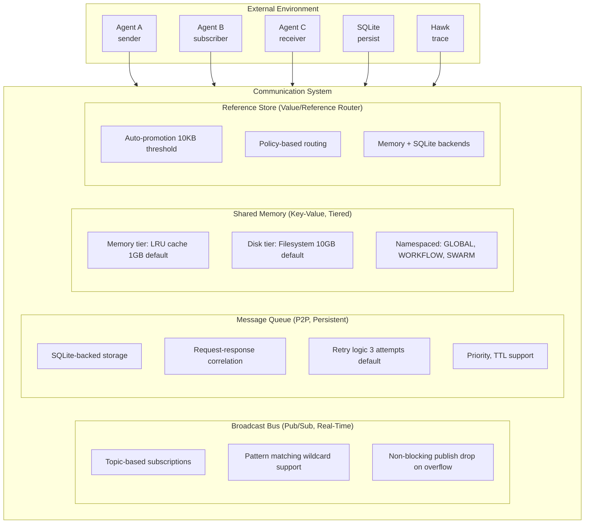

# Communication System Architecture

Comprehensive architecture of Loom's tri-modal communication system for agent-to-agent messaging with intelligent routing between value and reference semantics.

**Target Audience**: Architects, academics, and advanced developers

**Version**: v1.0.0-beta.1

---

## Table of Contents

- [Overview](#overview)
- [Design Goals](#design-goals)
- [System Context](#system-context)
- [Architecture Overview](#architecture-overview)
- [Components](#components)
  - [Broadcast Bus (Pub/Sub)](#broadcast-bus-pubsub)
  - [Message Queue (P2P)](#message-queue-p2p)
  - [Shared Memory (Key-Value)](#shared-memory-key-value)
  - [Reference Store](#reference-store)
  - [Policy Manager](#policy-manager)
  - [Interrupt System](#interrupt-system)
- [Key Interactions](#key-interactions)
  - [Value vs Reference Semantics](#value-vs-reference-semantics)
  - [Auto-Promotion Flow](#auto-promotion-flow)
  - [Pub/Sub Pattern Matching](#pubsub-pattern-matching)
- [Data Structures](#data-structures)
- [Algorithms](#algorithms)
  - [Topic Pattern Matching](#topic-pattern-matching)
  - [Auto-Promotion Decision](#auto-promotion-decision)
  - [Message Delivery](#message-delivery)
- [Design Trade-offs](#design-trade-offs)
- [Constraints and Limitations](#constraints-and-limitations)
- [Performance Characteristics](#performance-characteristics)
- [Concurrency Model](#concurrency-model)
- [Error Handling](#error-handling)
- [Security Considerations](#security-considerations)
- [Related Work](#related-work)
- [References](#references)
- [Further Reading](#further-reading)

---

## Overview

The Communication System enables **efficient agent-to-agent messaging** with three complementary modes:

1. **Broadcast Bus**: Topic-based pub/sub for real-time events and coordination
2. **Message Queue**: Persistent P2P messaging with offline support and retries
3. **Shared Memory**: Key-value store for large datasets with tiered storage

The system intelligently routes messages using **value semantics** (inline data) or **reference semantics** (stored data with reference ID) based on payload size and message type.

**Key Innovation**: Three-tier routing strategy that optimizes for both small ephemeral messages and large persistent data.

---

## Design Goals

1. **Efficient Large Payloads**: Pass 10MB+ datasets without overwhelming message bus
2. **Zero-Copy Sharing**: Multi-agent workflows share data via references, not copies
3. **Flexible Semantics**: Choose between value (inline) and reference (stored) per message type
4. **Real-Time Coordination**: Sub-millisecond pub/sub for event notifications
5. **Persistent Messaging**: SQLite-backed queue for offline agents and retries
6. **Observable**: Every message traced to Hawk with delivery guarantees

**Non-goals**:
- Distributed consensus (single-process multi-agent server only)
- Exactly-once delivery (at-most-once for bus, at-least-once for queue)
- Message ordering across topics (order guaranteed per topic/queue only)

---

## System Context



**External Dependencies**:
- **Agents**: Message producers and consumers
- **SQLite**: Persistent storage for queue and references
- **Hawk**: Observability tracing

---

## Architecture Overview

```
┌──────────────────────────────────────────────────────────────────────────────┐
│                    Communication System                                      │
│                                                                              │
│  ┌────────────────────────────────────────────────────────────────────────┐  │
│  │                  Broadcast Bus                               │         │  │
│  │                                                              │         │  │
│  │  Topics (map[string]*TopicBroadcaster)                       │         │  │
│  │    ├─ "workflow.start" → [agent1, agent2]                   │          │  │
│  │    ├─ "workflow.*.complete" → [agent3]  (wildcard)          │          │  │
│  │    └─ "agent.status" → [monitor]                            │          │  │
│  │                                                              │         │  │
│  │  Subscribers (map[string]*Subscription)                      │         │  │
│  │    ├─ Filter support (key-value predicates)                 │          │  │
│  │    ├─ Buffered channels (100 default)                       │          │  │
│  │    └─ Non-blocking delivery (drop on full buffer)           │          │  │
│  │                                                              │         │  │
│  │  Metrics (atomic counters):                                 │          │  │
│  │    - totalPublished, totalDelivered, totalDropped           │          │  │
│  └────────────────────────────────────────────────────────────────────────┘  │
│                                                                              │
│  ┌────────────────────────────────────────────────────────────────────────┐  │
│  │                  Message Queue                               │         │  │
│  │                                                              │         │  │
│  │  SQLite Storage:                                             │         │  │
│  │    - messages table (id, from, to, payload, status)         │          │  │
│  │    - Indexes: (to_agent, status), (correlation_id)          │          │  │
│  │                                                              │         │  │
│  │  Queue Management:                                           │         │  │
│  │    ├─ Priority queue (high/normal/low)                      │          │  │
│  │    ├─ TTL cleanup (expired messages purged)                 │          │  │
│  │    ├─ Retry logic (exponential backoff)                     │          │  │
│  │    └─ Correlation IDs (request-response pairing)            │          │  │
│  │                                                              │         │  │
│  │  Delivery Guarantees:                                        │         │  │
│  │    - At-least-once (messages persisted before ACK)          │          │  │
│  │    - Retry 3 times (configurable)                           │          │  │
│  │    - Offline support (queued until agent available)         │          │  │
│  └────────────────────────────────────────────────────────────────────────┘  │
│                                                                              │
│  ┌────────────────────────────────────────────────────────────────────────┐  │
│  │                  Shared Memory                               │         │  │
│  │                                                              │         │  │
│  │  Namespaces (Scope):                                         │         │  │
│  │    - GLOBAL:   Shared across all agents                     │          │  │
│  │    - WORKFLOW: Scoped to workflow ID                        │          │  │
│  │    - SWARM:    Scoped to swarm ID                           │          │  │
│  │    - DEBATE:   Scoped to debate ID                          │          │  │
│  │    - SESSION:  Scoped to session ID                         │          │  │
│  │                                                              │         │  │
│  │  Memory Tier (LRU cache, 1GB):                              │          │  │
│  │    - In-memory map[string]*StoredData                       │          │  │
│  │    - Zstd compression (>1MB auto-compress)                  │          │  │
│  │    - SHA-256 checksums (integrity)                          │          │  │
│  │    - Reference counting (prevent eviction)                  │          │  │
│  │                                                              │         │  │
│  │  Disk Tier (Filesystem, 10GB):                              │          │  │
│  │    - Path: /tmp/loom-cache/{namespace}/{key}.dat           │           │  │
│  │    - TTL cleanup (1 hour default)                           │          │  │
│  │    - Auto-promotion on access (disk → memory)               │          │  │
│  │    - Atomic writes (temp + rename)                          │          │  │
│  └────────────────────────────────────────────────────────────────────────┘  │
│                                                                              │
│  ┌────────────────────────────────────────────────────────────────────────┐  │
│  │              Reference Store + Policy Manager                │         │  │
│  │                                                              │         │  │
│  │  Three-Tier Routing:                                         │         │  │
│  │  ┌──────────────────────────────────────────────────────────────────┐  │  │
│  │    │ Tier 1: Always Reference                │              │          │  │
│  │    │ (session_state, workflow_context)       │              │          │  │
│  │    │ → Always stored in SQLite/Memory        │              │          │  │
│  │  └──────────────────────────────────────────────────────────────────┘  │  │
│  │                     ▼                                        │         │  │
│  │  ┌──────────────────────────────────────────────────────────────────┐  │  │
│  │    │ Tier 2: Auto-Promote (10KB threshold)  │              │           │  │
│  │    │ (tool_result, general)                  │              │          │  │
│  │    │ Small: inline | Large: reference        │              │          │  │
│  │  └──────────────────────────────────────────────────────────────────┘  │  │
│  │                     ▼                                        │         │  │
│  │  ┌──────────────────────────────────────────────────────────────────┐  │  │
│  │    │ Tier 3: Always Value                    │              │          │  │
│  │    │ (control, ack, status)                  │              │          │  │
│  │    │ → Always passed inline                  │              │          │  │
│  │  └──────────────────────────────────────────────────────────────────┘  │  │
│  │                                                              │         │  │
│  │  Backends:                                                   │         │  │
│  │    - MemoryStore (TTL GC, 5-10 min default)                 │          │  │
│  │    - SQLiteStore (ref_counting, manual GC)                  │          │  │
│  │    - RedisStore (planned for distributed)                   │          │  │
│  └────────────────────────────────────────────────────────────────────────┘  │
│                                                                              │
│  ┌────────────────────────────────────────────────────────────────────────┐  │
│  │                  Interrupt System (Optional)                 │         │  │
│  │                                                              │         │  │
│  │  InterruptRouter:                                            │         │  │
│  │    - Routes interrupts to active agents                     │          │  │
│  │    - Priority-based delivery                                │          │  │
│  │    - Integration with Judge for safety checks               │          │  │
│  │                                                              │         │  │
│  │  InterruptQueue:                                             │         │  │
│  │    - Per-agent interrupt queue                              │          │  │
│  │    - Buffered channel (10 default)                          │          │  │
│  │    - Drop on overflow (log warning)                         │          │  │
│  └────────────────────────────────────────────────────────────────────────┘  │
└──────────────────────────────────────────────────────────────────────────────┘
```

---

## Components

### Broadcast Bus (Pub/Sub)

**Responsibility**: Real-time event notifications via topic-based pub/sub.

**Core Structure** (`pkg/communication/bus.go:34`):
```go
type MessageBus struct {
    mu              sync.RWMutex
    topics          map[string]*TopicBroadcaster
    subscriptions   map[string]*Subscription
    refStore        ReferenceStore
    policy          *PolicyManager
    tracer          observability.Tracer
    totalPublished  atomic.Int64
    totalDelivered  atomic.Int64
    totalDropped    atomic.Int64
}
```

**Pub/Sub Pattern**:
```
Publisher ───▶ Topic ───▶ Subscriber A                                          
                     ├───▶ Subscriber B                                         
                     └───▶ Subscriber C                                         
```

**Topic Patterns** (wildcard support):
- `workflow.start` - Exact match
- `workflow.*` - Any single-segment wildcard (matches `workflow.start`, `workflow.complete`)
- `workflow.**` - Multi-segment wildcard (matches `workflow.step.1.start`)

**Subscription Filters** (key-value predicates):
```go
filter := &loomv1.SubscriptionFilter{
    Conditions: []*loomv1.FilterCondition{
        {Key: "priority", Operator: "equals", Value: "high"},
        {Key: "workflow_id", Operator: "equals", Value: "wf-123"},
    },
}
```

**Delivery Guarantees**:
- **Non-blocking**: Publish never blocks on slow subscribers
- **Drop on overflow**: If subscriber buffer full (100 messages), message dropped
- **No persistence**: Messages not persisted (use Queue for reliable delivery)
- **At-most-once**: Each subscriber receives message once (if available)

**Rationale**:
- **Real-time coordination**: Sub-millisecond latency for events
- **No backpressure**: Publishers never blocked by slow consumers
- **Ephemeral**: Events are transient (use Queue for important messages)

---

### Message Queue (P2P)

**Responsibility**: Persistent point-to-point messaging with offline support and retries.

**Core Structure** (`pkg/communication/queue.go`):
```go
type MessageQueue struct {
    db              *sql.DB              // SQLite connection
    mu              sync.RWMutex
    subscribers     map[string]chan *QueueMessage
    policy          *PolicyManager
    tracer          observability.Tracer
}
```

**SQLite Schema**:
```sql
CREATE TABLE messages (
    id              TEXT PRIMARY KEY,
    from_agent      TEXT NOT NULL,
    to_agent        TEXT NOT NULL,
    message_type    TEXT NOT NULL,
    payload_type    TEXT NOT NULL,  -- 'value' or 'reference'
    payload         BLOB,            -- Inline data or serialized Reference
    priority        INTEGER DEFAULT 0,
    correlation_id  TEXT,
    created_at      INTEGER NOT NULL,
    expires_at      INTEGER,
    status          TEXT DEFAULT 'pending',
    retry_count     INTEGER DEFAULT 0,
    max_retries     INTEGER DEFAULT 3,
    last_error      TEXT,
    updated_at      INTEGER NOT NULL
);

CREATE INDEX idx_to_agent_status ON messages(to_agent, status);
CREATE INDEX idx_correlation_id ON messages(correlation_id);
CREATE INDEX idx_expires_at ON messages(expires_at);
```

**Message States**:
- `pending`: Queued, awaiting delivery
- `delivered`: Successfully delivered to agent
- `failed`: Max retries exceeded
- `expired`: TTL exceeded

**Delivery Flow**:
```
Send(msg) ───▶ Persist to SQLite ───▶ Notify subscriber ───▶ Agent receives     
                  │                                             │               
                  ▼                                             ▼
            ACK persisted                                  ACK sent back
                  │                                             │               
└──────────────────────────────────────────────────────────────────────────────┘
```

**Retry Logic** (exponential backoff):
```
Attempt 1: Immediate
Attempt 2: 1s delay
Attempt 3: 4s delay (2^2)
Attempt 4: 16s delay (2^4)
→ Mark as failed
```

**Request-Response Correlation**:
```go
// Agent A sends request
requestID := uuid.New()
queue.Send(ctx, &QueueMessage{
    ToAgent:       "agent-b",
    CorrelationID: requestID,
    Payload:       requestData,
})

// Agent B sends response
queue.Send(ctx, &QueueMessage{
    ToAgent:       "agent-a",
    CorrelationID: requestID,  // Same correlation ID
    Payload:       responseData,
})
```

**Rationale**:
- **Persistent**: Messages survive server restart
- **Reliable**: At-least-once delivery with retries
- **Offline support**: Messages queued until agent available
- **Request-response**: Correlation IDs enable RPC-style interaction

---

### Shared Memory (Key-Value)

**Responsibility**: Large dataset storage with tiered memory → disk eviction.

**Core Structure** (`pkg/communication/shared_memory.go`):
```go
type SharedMemory struct {
    mu               sync.RWMutex
    memoryTier       map[string]*StoredData  // Key → data
    diskPath         string                   // /tmp/loom-cache
    maxMemoryBytes   int64                    // 1GB default
    maxDiskBytes     int64                    // 10GB default
    compressionThresh int64                   // 1MB
    ttl              time.Duration            // 1 hour
    refCounts        map[string]int           // Reference counting
}
```

**Namespaced Keys**:
```
Format: {namespace}:{scope_id}:{key}

Examples:
  GLOBAL:*:schema_cache
  WORKFLOW:wf-123:query_results
  SWARM:swarm-456:consensus_data
  SESSION:sess-789:conversation_history
```

**Storage Tiers**:
```
┌──────────────────────────────────────────────────────────────────────────────┐
│   Memory Tier (LRU cache, 1GB)                                               │
│                                                                              │
│   Fast access (<1ms)                                                         │
│   Zstd compression (>1MB)                                                    │
│   SHA-256 checksums                                                          │
│   Reference counting                                                         │
└──────────────────────────────────────────────────────────────────────────────┘
               │ eviction                                                       
               ▼
┌──────────────────────────────────────────────────────────────────────────────┐
│   Disk Tier (Filesystem, 10GB)                                               │
│                                                                              │
│   Persistent (5-15ms)                                                        │
│   TTL cleanup (1 hour default)                                               │
│   Auto-promotion on access                                                   │
│   Atomic writes (temp + rename)                                              │
└──────────────────────────────────────────────────────────────────────────────┘
```

**LRU Eviction**:
```
1. Memory tier full (>1GB)
2. Find LRU entry (lowest AccessedAt)
3. Check refCount (skip if >0)
4. Write to disk tier
5. Remove from memory tier
6. Log eviction to Hawk
```

**Auto-Promotion** (disk → memory on access):
```go
func (sm *SharedMemory) Get(ctx context.Context, key string) ([]byte, error) {
    // Try memory tier first
    if data, found := sm.memoryTier[key]; found {
        data.AccessedAt = time.Now()  // Update LRU
        return data.Data, nil
    }

    // Fall back to disk tier
    diskData, err := sm.loadFromDisk(key)
    if err != nil {
        return nil, err
    }

    // Promote to memory tier (if space available)
    if sm.hasMemorySpace() {
        sm.memoryTier[key] = &StoredData{
            Data:       diskData,
            AccessedAt: time.Now(),
        }
    }

    return diskData, nil
}
```

**Compression** (>1MB auto-compress with zstd):
- Compression ratio: ~3-5x for JSON/CSV, ~1.5-2x for binary
- Latency: ~10ms compression, ~5ms decompression

**Rationale**:
- **Zero-copy**: Agents share large datasets via references
- **Tiered storage**: Hot data in memory, cold data on disk
- **Bounded memory**: LRU eviction prevents OOM
- **Integrity**: SHA-256 checksums detect corruption

---

### Reference Store

**Responsibility**: Route messages between value (inline) and reference (stored) semantics.

**Three-Tier Routing**:
```
Message Type ───▶ Policy Lookup ───▶ Tier Assignment                            
                                          │                                     
┌──────────────────────────────────────────────────────────────────────────────┐
                   │                      │                      │              
                   ▼                      ▼                      ▼
┌──────────────────────────────────────────────────────────────────────────────┐
           │ Tier 1:      │      │ Tier 2:      │      │ Tier 3:      │         
           │ Always Ref   │      │ Auto-Promote │      │ Always Value │         
           │              │      │              │      │              │         
           │ session_state│      │ tool_result  │      │ control      │         
           │ workflow_ctx │      │ general      │      │ ack          │         
└──────────────────────────────────────────────────────────────────────────────┘
                   │                      │                      │              
                   ▼                      ▼                      ▼
            Store in DB         Size > 10KB?              Inline value
            Return ref ID       Yes: ref, No: value
```

**ReferenceStore Interface**:
```go
type ReferenceStore interface {
    Store(ctx context.Context, data []byte, opts StoreOptions) (*loomv1.Reference, error)
    Resolve(ctx context.Context, ref *loomv1.Reference) ([]byte, error)
    Delete(ctx context.Context, refID string) error
    List(ctx context.Context) ([]*loomv1.Reference, error)
    Stats(ctx context.Context) (*StoreStats, error)
    Close() error
}
```

**Implementations**:
1. **MemoryStore**: In-memory with TTL-based GC (5-10 min default)
2. **SQLiteStore**: Persistent with reference counting and manual GC
3. **RedisStore**: (Planned) Distributed deployments

**Policy Examples**:
```go
// Always reference
policy := NewAlwaysReferencePolicy()

// Always value
policy := NewAlwaysValuePolicy()

// Auto-promote (10KB threshold)
policy := NewAutoPromotePolicy(10 * 1024)

// Session state (always reference)
policy := NewSessionStatePolicy()

// Tool result (auto-promote, 10KB)
policy := NewToolResultPolicy()
```

---

### Policy Manager

**Responsibility**: Determine routing strategy (value vs reference) per message type.

**Core Structure** (`pkg/communication/policy.go`):
```go
type PolicyManager struct {
    mu       sync.RWMutex
    policies map[string]*loomv1.CommunicationPolicy
}

type CommunicationPolicy struct {
    MessageType      string
    Routing          RoutingStrategy  // ALWAYS_VALUE, ALWAYS_REFERENCE, AUTO_PROMOTE
    SizeThreshold    int64            // Bytes (for AUTO_PROMOTE)
    TTL              int64            // Seconds (for reference storage)
    RefCountEnabled  bool             // Enable reference counting
}
```

**Decision Algorithm**:
```go
func (pm *PolicyManager) ShouldUseReference(messageType string, sizeBytes int64) bool {
    policy := pm.GetPolicy(messageType)

    switch policy.Routing {
    case ALWAYS_VALUE:
        return false
    case ALWAYS_REFERENCE:
        return true
    case AUTO_PROMOTE:
        return sizeBytes > policy.SizeThreshold
    default:
        return false
    }
}
```

---

### Interrupt System

**Responsibility**: Priority-based agent interruption for safety-critical events.

**Core Structure** (`pkg/communication/interrupt/router.go`):
```go
type InterruptRouter struct {
    mu              sync.RWMutex
    agents          map[string]*InterruptQueue
    judgeIntegration bool  // Integrate with Judge system
}

type InterruptQueue struct {
    agentID  string
    queue    chan *Interrupt
    capacity int  // 10 default
}
```

**Interrupt Types**:
- `SAFETY_VIOLATION`: Judge detected unsafe action (immediate stop)
- `RESOURCE_LIMIT`: Token/cost limit exceeded
- `USER_STOP`: User requested stop
- `TIMEOUT`: Operation timeout

**Priority Delivery**:
```
High Priority (safety) ───▶ Immediate delivery (blocking)                       
Normal Priority         ───▶ Non-blocking (drop if full)                        
Low Priority           ───▶ Best-effort                                         
```

**Integration with Judge**:
```
Agent Action ───▶ Judge Evaluation ───▶ Safety Violation?                       
                                              │                                 
                                              ├─ Yes: Send Interrupt            
                                              │        (SAFETY_VIOLATION)       
                                              │                                 
                                              └─ No: Continue                   
```

---

## Key Interactions

### Value vs Reference Semantics

```
Agent Send        Policy Manager    Reference Store    Agent Receive
  │                     │                  │                │                   
  ├─ Send(data, type) ─▶│                  │                │                   
  │                     ├─ Lookup policy   │                │                   
  │                     ├─ Check size      │                │                   
  │                     │                  │                │                   
  │  (Small message, value semantics)      │                │                   
  │                     ├─ Return VALUE    │                │                   
  │◀─ Message(value) ───┤                  │                │                   
  │                     │                  │                │                   
  ├─ Publish/Enqueue ───┼──────────────────┼───────────────▶│                   
  │  (inline value)     │                  │                ├─ Receive(msg)     
  │                     │                  │                ├─ Extract value    
  │                     │                  │                │                   
  │                     │                  │                │                   
  │  (Large message, reference semantics)  │                │                   
  │                     ├─ Store(data) ────▶│                │                  
  │                     │◀─ ref_id ─────────┤                │                  
  │◀─ Message(ref) ─────┤                  │                │                   
  │                     │                  │                │                   
  ├─ Publish/Enqueue ───┼──────────────────┼───────────────▶│                   
  │  (ref_id only)      │                  │                ├─ Receive(msg)     
  │                     │                  │                ├─ Resolve(ref) ─▶│ 
  │                     │                  │◀─ data ─────────┤                  
  │                     │                  │                │                   
```

**Token Optimization**:
```
Before (value): 10K-row SQL result = 1.3MB JSON = ~15,000 tokens
After (reference): ref_id = "ref_abc123" = ~50 tokens
Savings: 99.67%
```

---

### Auto-Promotion Flow

```
Send(data, "tool_result") ───▶ Policy: AUTO_PROMOTE (10KB threshold)            
                                   │                                            
                                   ├─ Serialize data → JSON                     
                                   ├─ Check size: len(JSON)                     
                                   │                                            
                                   ├─ Size < 10KB?                              
                                   │   ├─ Yes: Return VALUE message             
                                   │   │       (inline JSON)                    
                                   │   │                                        
                                   │   └─ No: Store in ReferenceStore           
                                   │         │                                  
                                   │         ├─ Write to SQLite/Memory          
                                   │         ├─ Generate ref_id                 
                                   │         └─ Return REFERENCE message        
                                   │               (ref_id only)                
                                   │                                            
                                   ▼
                            Message with payload
```

**Size Calculation**:
```go
func calculateSize(data interface{}) (int64, error) {
    jsonData, err := json.Marshal(data)
    if err != nil {
        return 0, err
    }
    return int64(len(jsonData)), nil
}
```

---

### Pub/Sub Pattern Matching

```
Subscribe("workflow.*") ───▶ Pattern: workflow.{segment}                        
                                │                                               
                                ▼
                         Incoming topics:
                            ├─ "workflow.start" ✓ (match)                       
                            ├─ "workflow.complete" ✓ (match)                    
                            ├─ "workflow.step.1" ✗ (no match, multi-segment)    
                            └─ "agent.status" ✗ (no match, different prefix)    

Subscribe("workflow.**") ───▶ Pattern: workflow.{any_depth}                     
                                │                                               
                                ▼
                         Incoming topics:
                            ├─ "workflow.start" ✓ (match)                       
                            ├─ "workflow.step.1" ✓ (match)                      
                            ├─ "workflow.step.1.complete" ✓ (match)             
                            └─ "agent.status" ✗ (no match, different prefix)    
```

**Matching Algorithm** (`pkg/communication/bus.go`):
```go
func matchesTopicPattern(pattern, topic string) bool {
    patternParts := strings.Split(pattern, ".")
    topicParts := strings.Split(topic, ".")

    i, j := 0, 0
    for i < len(patternParts) && j < len(topicParts) {
        if patternParts[i] == "**" {
            // Multi-segment wildcard: match remaining
            return true
        } else if patternParts[i] == "*" {
            // Single-segment wildcard: match one
            i++
            j++
        } else if patternParts[i] == topicParts[j] {
            // Exact match
            i++
            j++
        } else {
            return false
        }
    }

    return i == len(patternParts) && j == len(topicParts)
}
```

---

## Data Structures

### BusMessage

**Definition** (`proto/loom/v1/communication.proto`):
```protobuf
message BusMessage {
  string id = 1;                      // Unique message ID
  string topic = 2;                   // Topic name
  string from_agent = 3;              // Sender agent ID
  int64 timestamp = 4;                // Unix timestamp

  oneof payload {
    google.protobuf.Any value = 5;    // Inline value
    Reference reference = 6;           // Stored reference
  }

  map<string, string> metadata = 7;   // Key-value metadata
}
```

### QueueMessage

**Definition**:
```protobuf
message QueueMessage {
  string id = 1;
  string from_agent = 2;
  string to_agent = 3;
  string message_type = 4;
  string correlation_id = 5;          // Request-response pairing

  oneof payload {
    google.protobuf.Any value = 6;
    Reference reference = 7;
  }

  int32 priority = 8;                 // 0=normal, 1=high, -1=low
  int64 expires_at = 9;               // Unix timestamp
  int32 retry_count = 10;
  int32 max_retries = 11;
}
```

### Reference

**Definition**:
```protobuf
message Reference {
  string id = 1;                      // ref_abc123
  int64 size_bytes = 2;               // Original size
  StorageLocation location = 3;       // MEMORY or DISK
  string checksum = 4;                // SHA-256
  bool compressed = 5;                // Zstd compression
  string content_type = 6;            // MIME type
  map<string, string> metadata = 7;
  int64 stored_at = 8;
}

enum StorageLocation {
  MEMORY = 0;
  DISK = 1;
  SQLITE = 2;
  REDIS = 3;
}
```

---

## Algorithms

### Topic Pattern Matching

**Problem**: Match incoming topic against wildcard patterns efficiently.

**Solution**: Segment-by-segment matching with wildcard support.

**Algorithm**:
```
Input: pattern="workflow.*", topic="workflow.start"

1. Split by '.' → patternParts=["workflow", "*"], topicParts=["workflow", "start"]
2. Loop i=0, j=0:
   - patternParts[0]="workflow", topicParts[0]="workflow" → exact match, i++, j++
3. Loop i=1, j=1:
   - patternParts[1]="*" → single wildcard, i++, j++
4. i==2, j==2 → both exhausted → MATCH

Input: pattern="workflow.*", topic="workflow.step.1"

1. Split → patternParts=["workflow", "*"], topicParts=["workflow", "step", "1"]
2. Loop i=0, j=0: exact match, i++, j++
3. Loop i=1, j=1: "*" matches "step", i++, j++
4. i==2, j==2 → but topicParts has one more segment → NO MATCH
```

**Complexity**: O(n) where n = max(len(pattern), len(topic))

---

### Auto-Promotion Decision

**Problem**: Decide whether to inline data or store as reference.

**Solution**: Three-tier policy with size threshold.

**Algorithm**:
```go
func DecideSemantics(messageType string, data interface{}) (Semantics, error) {
    policy := GetPolicy(messageType)

    if policy.Routing == ALWAYS_VALUE {
        return VALUE, nil
    }

    if policy.Routing == ALWAYS_REFERENCE {
        return REFERENCE, nil
    }

    // AUTO_PROMOTE: check size
    size, err := CalculateSize(data)
    if err != nil {
        return VALUE, err
    }

    if size > policy.SizeThreshold {
        return REFERENCE, nil
    }

    return VALUE, nil
}
```

**Default Thresholds**:
- Tier 1 (Always Reference): N/A (always stored)
- Tier 2 (Auto-Promote): 10KB
- Tier 3 (Always Value): N/A (never stored)

---

### Message Delivery

**Problem**: Deliver messages to subscribers without blocking publisher.

**Solution**: Non-blocking channel send with drop on overflow.

**Algorithm**:
```go
func DeliverMessage(subscriber *Subscriber, msg *BusMessage) bool {
    select {
    case subscriber.channel <- msg:
        // Delivered successfully
        return true
    default:
        // Channel full, drop message
        return false
    }
}
```

**Rationale**: Publisher never blocks on slow subscriber (prevents cascading failures).

---

## Design Trade-offs

### Decision 1: Non-Blocking Pub/Sub vs. Reliable Delivery

**Chosen**: Non-blocking pub/sub (drop on overflow)

**Rationale**:
- **No backpressure**: Fast publishers not slowed by slow subscribers
- **Bounded memory**: Buffer size limits memory usage per subscriber
- **Cascading failure prevention**: One slow subscriber doesn't affect others

**Alternatives**:
1. **Blocking publish** (wait for all subscribers):
   - ✅ Guaranteed delivery
   - ❌ Publishers blocked by slowest subscriber
   - ❌ Cascading failures

2. **Persistent pub/sub** (store all messages):
   - ✅ No message loss
   - ❌ Unbounded memory growth
   - ❌ Complex GC logic

**Consequences**:
- ✅ Fast, predictable pub/sub latency
- ✅ No cascading failures
- ❌ At-most-once delivery (messages may be dropped)
- ❌ Use Queue for important messages

**Mitigation**: Use Message Queue for reliable delivery (at-least-once with retries).

---

### Decision 2: SQLite Queue vs. In-Memory Queue

**Chosen**: SQLite-backed queue with persistence

**Rationale**:
- **Crash recovery**: Messages survive server restart
- **Offline agents**: Messages queued until agent available
- **Audit trail**: Full message history for debugging

**Alternatives**:
1. **In-memory queue only**:
   - ✅ Faster (no disk I/O)
   - ❌ Messages lost on restart
   - ❌ No offline support

2. **Redis/RabbitMQ**:
   - ✅ Distributed queuing
   - ❌ External dependency
   - ❌ Deployment complexity

**Consequences**:
- ✅ Reliable, persistent messaging
- ✅ Offline agent support
- ✅ No external dependencies
- ❌ Disk I/O latency (5-15ms write)
- ❌ Single-process only (no distribution)

---

### Decision 3: Three-Tier Routing vs. Single Threshold

**Chosen**: Three-tier routing (Always Ref / Auto-Promote / Always Value)

**Rationale**:
- **Flexibility**: Different message types have different needs
- **Optimization**: Small control messages always inline (no storage overhead)
- **Safety**: Session state always persistent (no data loss)

**Alternatives**:
1. **Single threshold** (e.g., always auto-promote at 10KB):
   - ✅ Simpler implementation
   - ❌ Cannot enforce "always reference" for session state
   - ❌ Wastes storage on small ephemeral messages

2. **Two-tier** (Value or Reference only):
   - ✅ Simpler decision logic
   - ❌ No auto-promotion (manual threshold checks everywhere)

**Consequences**:
- ✅ Per-message-type optimization
- ✅ Enforce data persistence for critical types
- ✅ Avoid storage overhead for ephemeral messages
- ❌ More complex policy configuration
- ❌ Three code paths to test

---

## Constraints and Limitations

### Constraint 1: Single-Process Only

**Description**: Message Queue and Shared Memory do not support distributed agents

**Impact**: All agents must run in same process (multi-agent server)

**Workaround**: Future RedisStore implementation for distributed deployments

---

### Constraint 2: At-Most-Once Pub/Sub

**Description**: Broadcast Bus drops messages if subscriber buffer full

**Impact**: Events may be lost if subscriber slow

**Workaround**: Use Message Queue for reliable delivery

---

### Constraint 3: Reference GC Manual

**Description**: SQLiteStore requires manual GC (reference counting)

**Impact**: Unused references accumulate until GC runs

**Workaround**: Use MemoryStore (TTL-based GC) or run periodic GC

---

## Performance Characteristics

### Latency (P50/P99)

| Operation | P50 | P99 | Notes |
|-----------|-----|-----|-------|
| Bus publish | <1ms | 2ms | In-memory, non-blocking |
| Bus subscribe | <1ms | 2ms | Map insert |
| Queue send (SQLite) | 5ms | 15ms | Disk write + fsync |
| Queue receive | 3ms | 8ms | SQLite read |
| Shared mem write (memory) | <1ms | 5ms | In-memory map |
| Shared mem write (disk) | 15ms | 35ms | Filesystem write |
| Shared mem read (memory) | <1ms | 2ms | Map lookup |
| Shared mem read (disk) | 8ms | 20ms | Filesystem read + promotion |
| Reference store (memory) | <1ms | 5ms | In-memory |
| Reference store (SQLite) | 5ms | 15ms | Database write |
| Reference resolve (memory) | <1ms | 2ms | Map lookup |
| Reference resolve (SQLite) | 3ms | 8ms | Database read |

### Memory Usage

| Component | Size |
|-----------|------|
| Broadcast Bus (1000 subscribers) | ~500KB (channels + metadata) |
| Message Queue (1000 messages) | ~10MB (SQLite + indexes) |
| Shared Memory (memory tier) | 1GB (configurable) |
| Shared Memory (disk tier) | 10GB (configurable) |
| Reference Store (memory) | Included in Shared Memory |
| Reference Store (SQLite) | ~5MB per 1000 refs |

### Throughput

- **Bus publish**: 100,000+ msg/s (in-memory)
- **Queue send**: 1,000 msg/s (SQLite bound)
- **Shared memory write (memory)**: 10,000+ writes/s
- **Shared memory write (disk)**: 100 writes/s (filesystem bound)

---

## Concurrency Model

### Broadcast Bus

**Model**: RWMutex protects topics map, atomic counters for metrics

**Readers**: Concurrent publishes (RLock)
**Writers**: Subscribe/unsubscribe (Lock)

**Delivery**: Non-blocking channel send (drop on full)

---

### Message Queue

**Model**: SQLite transactions + goroutine per agent subscriber

**Write Path**: Serialized through SQLite (ACID guarantees)
**Read Path**: Parallel reads from different agents

**Subscriber Goroutines**: One goroutine per agent polls SQLite for messages

---

### Shared Memory

**Model**: RWMutex protects memory tier map, atomic file writes for disk tier

**Memory Tier**: RWMutex (concurrent reads, exclusive writes)
**Disk Tier**: Atomic writes (temp + rename), concurrent reads

**LRU Eviction**: Write lock required (exclusive)

---

## Error Handling

### Strategy

1. **Graceful Degradation**: If ReferenceStore unavailable, fall back to inline value
2. **Retry Logic**: Message Queue retries failed deliveries (3 attempts)
3. **Drop Non-Critical**: Broadcast Bus drops overflow messages (log warning)
4. **Fail Fast**: Invalid references return error immediately

### Error Propagation

```
Reference Resolve Failure ───▶ Return Error ───▶ Agent handles                  
                                    │                                           
                                    ▼
                              Log + Trace to Hawk


Queue Send Failure ───▶ Retry (3 attempts) ───▶ Mark as failed                  
                             │                       │                          
                             ▼                       ▼
                        Exponential backoff     Log + Notify


Bus Publish Overflow ───▶ Drop Message ───▶ Increment totalDropped              
                               │                                                
                               ▼
                          Log Warning
```

---

## Security Considerations

### Threat Model

1. **Unauthorized Reference Access**: Agent accesses reference from different namespace
2. **Message Injection**: Malicious agent sends fake messages
3. **Resource Exhaustion**: Agent fills queue/memory with large messages

### Mitigations

**Unauthorized Access**:
- Namespace scoping (WORKFLOW, SWARM, SESSION)
- Reference IDs include namespace prefix
- Validation on Resolve()

**Message Injection**:
- Agent ID validation (from_agent must match authenticated agent)
- Signature/MAC for critical messages (future)

**Resource Exhaustion**:
- Queue size limits (1000 messages per agent)
- Memory tier limits (1GB)
- Disk tier limits (10GB)
- TTL cleanup (expired references purged)

---

## Related Work

### Message Passing Systems

1. **Akka** (Scala): Actor-based messaging
   - **Similar**: Pub/sub, P2P messaging
   - **Loom differs**: Value/reference routing, tiered storage

2. **RabbitMQ**: Message broker
   - **Similar**: Queue-based messaging, persistence
   - **Loom differs**: Embedded (no separate broker), auto-promotion

3. **Redis Pub/Sub**: In-memory pub/sub
   - **Similar**: Topic-based subscriptions
   - **Loom differs**: Reference semantics, integrated with Queue/Shared Memory

### Reference Passing

1. **Apache Arrow Flight**: Zero-copy data transfer
   - **Similar**: Reference-based large data passing
   - **Loom differs**: Automatic value/reference decision, tiered storage

2. **Cap'n Proto**: Serialization with capability-based references
   - **Similar**: Reference semantics for large structures
   - **Loom differs**: Runtime decision (not compile-time), policy-based

---

## References

1. Akka Documentation. Actor Model and Message Passing. https://doc.akka.io/docs/akka/current/typed/actors.html

2. RabbitMQ Patterns. Message Queue Patterns and Best Practices. https://www.rabbitmq.com/getstarted.html

3. Gregor Hohpe & Bobby Woolf (2003). *Enterprise Integration Patterns*. Addison-Wesley. (Pub/Sub, Message Queue patterns)

---

## Further Reading

### Architecture Deep Dives

- [Multi-Agent Orchestration](multi-agent.md) - Workflow patterns using tri-modal communication
- [Memory System Architecture](memory-systems.md) - Shared Memory integration
- [Loom System Architecture](loom-system-architecture.md) - Overall system design

### Reference Documentation

- [Communication API Reference](/docs/reference/communication-api.md) - RPC definitions
- [Agent Configuration Reference](/docs/reference/agent-configuration.md) - Communication configuration

### Guides

- [Getting Started](/docs/guides/quickstart.md) - Quick start guide
- [Multi-Agent Communication Guide](/docs/guides/multi-agent-communication.md) - Usage examples
