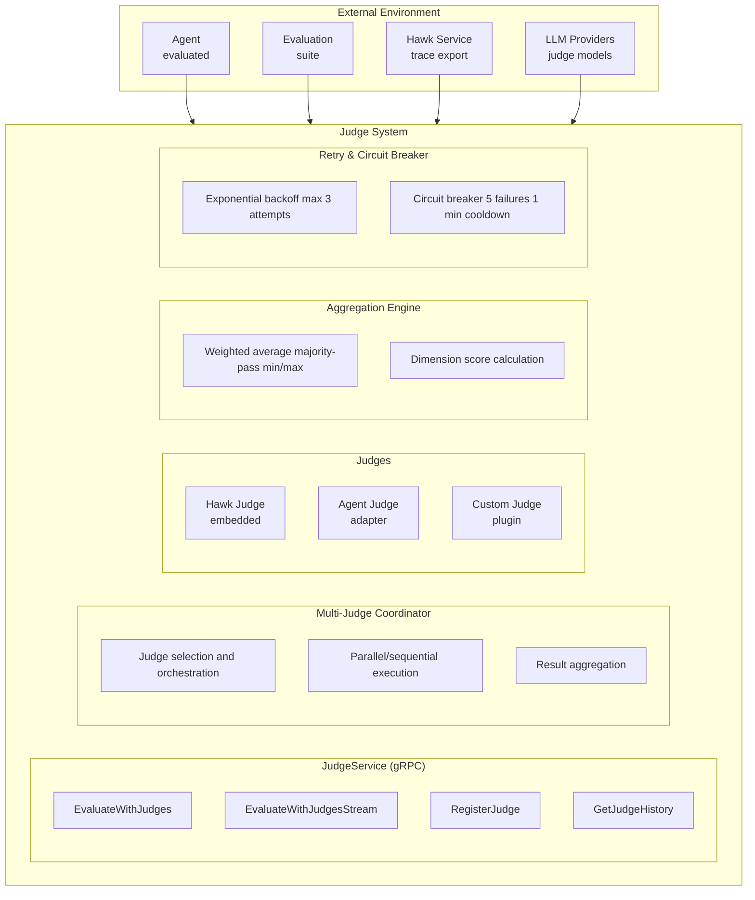

# Judge System Architecture

Multi-judge LLM evaluation system that coordinates multiple judges with different criteria to evaluate agent outputs. Supports Hawk's 4 core scores (factual accuracy, hallucination, query quality, completeness), 6 evaluation dimensions, 3 execution modes, and 6 aggregation strategies with retry/circuit breaker patterns.

**Target Audience**: Architects, academics, and advanced developers

**Version**: v1.0.0-beta.1

---

## Table of Contents

- [Overview](#overview)
- [Design Goals](#design-goals)
- [System Context](#system-context)
- [Architecture Overview](#architecture-overview)
- [Components](#components)
  - [Judge Service](#judge-service)
  - [Judge Interface](#judge-interface)
  - [Hawk Judge](#hawk-judge)
  - [Agent Judge Adapter](#agent-judge-adapter)
  - [Custom Judge](#custom-judge)
  - [Multi-Judge Coordinator](#multi-judge-coordinator)
  - [Aggregation Engine](#aggregation-engine)
  - [Retry & Circuit Breaker](#retry--circuit-breaker)
- [Key Interactions](#key-interactions)
  - [Synchronous Evaluation Flow](#synchronous-evaluation-flow)
  - [Asynchronous Evaluation Flow](#asynchronous-evaluation-flow)
  - [Streaming Evaluation Flow](#streaming-evaluation-flow)
  - [Retry with Circuit Breaker Flow](#retry-with-circuit-breaker-flow)
- [Data Structures](#data-structures)
- [Algorithms](#algorithms)
  - [Weighted Average Aggregation](#weighted-average-aggregation)
  - [Majority Pass Aggregation](#majority-pass-aggregation)
  - [Exponential Backoff Retry](#exponential-backoff-retry)
  - [Circuit Breaker State Machine](#circuit-breaker-state-machine)
- [Design Trade-offs](#design-trade-offs)
- [Constraints and Limitations](#constraints-and-limitations)
- [Performance Characteristics](#performance-characteristics)
- [Concurrency Model](#concurrency-model)
- [Error Handling](#error-handling)
- [Security Considerations](#security-considerations)
- [Related Work](#related-work)
- [References](#references)
- [Further Reading](#further-reading)

---

## Overview

The Judge System evaluates **agent outputs across multiple dimensions** using a coordinated multi-judge architecture:

**Evaluation Inputs**:
- Agent response (text, SQL, JSON, etc.)
- Context (prompt, pattern used, tools invoked)
- Performance metrics (cost, latency, trace ID)

**Evaluation Outputs**:
- **Hawk's 4 Core Scores**: Factual Accuracy, Hallucination Score, Query Quality, Completeness (0-100)
- **6 Dimension Scores**: Quality, Cost, Safety, Domain, Performance, Usability (0-100)
- **Custom Dimension Scores**: User-defined dimensions (e.g., "teradata_compliance", "hipaa_compliance")
- **Verdict**: PASS, FAIL, PARTIAL
- **Reasoning**: Detailed explanation and suggestions

**Key Innovation**: Multi-judge coordination with pluggable judge types (Hawk, Agent, Custom), 6 aggregation strategies, 3 execution modes (sync/async/hybrid), and production-grade retry with circuit breaker.

---

## Design Goals

1. **Multi-Dimensional Evaluation**: Assess agent outputs across quality, cost, safety, domain, performance, usability dimensions
2. **Pluggable Judges**: Support Hawk's embedded judges, Loom agents as judges, and custom implementations
3. **Flexible Aggregation**: 6 strategies (weighted average, all-must-pass, majority-pass, any-pass, min-score, max-score)
4. **Execution Modes**: Synchronous (blocking), asynchronous (background), hybrid (critical sync, non-critical async)
5. **Criticality Levels**: Non-critical, critical, safety-critical judges with different priorities
6. **Production-Grade Reliability**: Exponential backoff retry, circuit breaker, timeout handling
7. **Streaming Progress**: Real-time updates for long-running evaluations (MIPRO, BootstrapFewShot)
8. **Hawk Integration**: Native export to Hawk for trace correlation and historical analysis

**Non-goals**:
- Real-time evaluation UI (use Hawk's dashboard for visualization)
- Judge-to-judge communication (judges evaluate independently)
- Distributed judge execution across processes (single-process multi-goroutine only)

---

## System Context



**External Dependencies**:
- **Hawk Service**: Trace export, historical evaluation storage
- **LLM Providers**: Judge model execution (Anthropic, OpenAI, etc.)
- **Agent Runtime**: Agent-as-judge execution
- **Evaluation Suite**: Test case management

---

## Architecture Overview

```
┌──────────────────────────────────────────────────────────────────────────────┐
│                    Judge System                                              │
│                                                                              │
│  ┌────────────────────────────────────────────────────────────────────────┐  │
│  │                  JudgeService (gRPC)                         │         │  │
│  │                                                              │         │  │
│  │  EvaluateWithJudges(ctx, req) → EvaluateResponse            │          │  │
│  │  EvaluateWithJudgesStream(ctx, req) → stream Progress       │          │  │
│  │  RegisterJudge(ctx, config) → JudgeID                       │          │  │
│  │  GetJudgeHistory(ctx, filter) → []HistoricalEvaluation      │          │  │
│  └────────────────────────────────────────────────────────────────────────┘  │
│                            ▲                                                 │
│                            │ implements                                      │
│  ┌────────────────────────────────────────────────────────────────────────┐  │
│            │               │               │                  │              │
│            ▼               ▼               ▼                  ▼              │
│  ┌────────────────────────────────────────────────────────────────────────┐  │
│  │  Multi-Judge  │  │  Aggregation │  │  Retry   │  │  History   │        │  │
│  │  Coordinator  │  │  Engine      │  │  Handler │  │  Store     │        │  │
│  └────────────────────────────────────────────────────────────────────────┘  │
│          │                 │                 │                               │
│          ▼                 ▼                 ▼                               │
│  ┌────────────────────────────────────────────────────────────────────────┐  │
│  │           Judge Execution Flow                               │         │  │
│  │                                                              │         │  │
│  │  1. Judge Selection                                         │          │  │
│  │     ├─ Parse judge_ids from request                         │          │  │
│  │     ├─ Load JudgeConfig from registry                       │          │  │
│  │     ├─ Validate criticality and execution mode              │          │  │
│  │     └─ Sort by criticality (safety-critical → critical)     │          │  │
│  │                                                              │         │  │
│  │  2. Execution Orchestration                                 │          │  │
│  │     ├─ SYNCHRONOUS: Sequential execution, block response    │          │  │
│  │     ├─ ASYNCHRONOUS: Goroutines, background execution       │          │  │
│  │     └─ HYBRID: Critical sync, non-critical async            │          │  │
│  │                                                              │         │  │
│  │  3. Judge Invocation (per judge)                            │          │  │
│  │     ├─ Build EvaluationContext                              │          │  │
│  │     ├─ Invoke Judge.Evaluate(ctx, context)                  │          │  │
│  │     ├─ Retry with exponential backoff (max 3 attempts)      │          │  │
│  │     ├─ Circuit breaker check (5 failures → open)            │          │  │
│  │     └─ Collect JudgeResult                                  │          │  │
│  │                                                              │         │  │
│  │  4. Result Aggregation                                      │          │  │
│  │     ├─ Calculate weighted average score                     │          │  │
│  │     ├─ Apply aggregation strategy                           │          │  │
│  │     ├─ Compute dimension scores (quality, cost, safety)     │          │  │
│  │     ├─ Determine overall verdict (PASS/FAIL/PARTIAL)        │          │  │
│  │     └─ Collect suggestions and issues                       │          │  │
│  │                                                              │         │  │
│  │  5. Export & Response                                       │          │  │
│  │     ├─ Export to Hawk (if enabled)                          │          │  │
│  │     ├─ Store in history (SQLite)                            │          │  │
│  │     └─ Return EvaluateResponse                              │          │  │
│  └────────────────────────────────────────────────────────────────────────┘  │
│                                                                              │
│  ┌────────────────────────────────────────────────────────────────────────┐  │
│  │           Judge Interface (Pluggable)                        │         │  │
│  │                                                              │         │  │
│  │  type Judge interface {                                     │          │  │
│  │      Evaluate(ctx, context) → JudgeResult                   │          │  │
│  │  }                                                          │          │  │
│  │                                                              │         │  │
│  │  Implementations:                                           │          │  │
│  │    ├─ HawkJudge: Uses Hawk's embedded judge library        │           │  │
│  │    ├─ AgentJudge: Wraps Loom agent as judge                │           │  │
│  │    └─ CustomJudge: User-provided implementation            │           │  │
│  └────────────────────────────────────────────────────────────────────────┘  │
│                                                                              │
│  ┌────────────────────────────────────────────────────────────────────────┐  │
│  │                  Judge Registry (Thread-Safe)                │         │  │
│  │                                                              │         │  │
│  │  mu sync.RWMutex                                            │          │  │
│  │  judges map[string]*JudgeConfig                             │          │  │
│  │                                                              │         │  │
│  │  Methods:                                                   │          │  │
│  │    Register(config) → judgeID                               │          │  │
│  │    Get(judgeID) → *JudgeConfig                              │          │  │
│  │    List() → []*JudgeConfig                                  │          │  │
│  └────────────────────────────────────────────────────────────────────────┘  │
└──────────────────────────────────────────────────────────────────────────────┘
```

---

## Components

### Judge Service

**Responsibility**: gRPC service endpoint for multi-judge evaluation.

**Core Interface** (`proto/loom/v1/judge.proto:16`):
```protobuf
service JudgeService {
  // Evaluate with multiple judges (blocking)
  rpc EvaluateWithJudges(EvaluateRequest) returns (EvaluateResponse);

  // Evaluate with streaming progress (for long-running evals)
  rpc EvaluateWithJudgesStream(EvaluateRequest) returns (stream EvaluateProgress);

  // Register a new judge configuration
  rpc RegisterJudge(RegisterJudgeRequest) returns (RegisterJudgeResponse);

  // Retrieve historical judge evaluations
  rpc GetJudgeHistory(GetJudgeHistoryRequest) returns (GetJudgeHistoryResponse);
}
```

**Request Structure** (`proto/loom/v1/judge.proto:32`):
```protobuf
message EvaluateRequest {
  EvaluationContext context = 1;        // Agent output and context
  repeated string judge_ids = 2;        // Judges to run
  AggregationStrategy aggregation = 3;  // How to combine verdicts
  ExecutionMode execution_mode = 4;     // Sync/async/hybrid
  bool export_to_hawk = 5;              // Send results to Hawk
  int32 timeout_seconds = 6;            // Max evaluation time
  bool fail_fast = 7;                   // Abort on first critical failure
}
```

**EvaluationContext** (`proto/loom/v1/judge.proto:56`):
```protobuf
message EvaluationContext {
  string agent_id = 1;              // Agent that generated output
  string session_id = 2;            // Session ID for tracing
  string prompt = 3;                // User input
  string response = 4;              // Agent response
  string pattern_used = 5;          // Pattern matched (if any)
  repeated string tools_used = 6;   // Tools invoked by agent
  double cost_usd = 7;              // LLM cost
  int64 latency_ms = 8;             // Response latency
  string trace_id = 9;              // Observability trace ID
  map<string, string> metadata = 10; // Additional context
}
```

**Response Structure** (`proto/loom/v1/judge.proto:89`):
```protobuf
message EvaluateResponse {
  bool passed = 1;                          // Overall verdict
  repeated JudgeResult verdicts = 2;        // Individual judge results
  map<string, double> dimension_scores = 3; // Quality, cost, safety, etc.
  double final_score = 4;                   // Aggregated score (0-100)
  string explanation = 5;                   // Verdict reasoning
  repeated string suggestions = 6;          // Improvement suggestions
  AggregatedJudgeMetrics aggregated = 7;    // Aggregate metrics
  EvaluationMetadata metadata = 8;          // Execution metadata
}
```

**Thread Safety**: All RPC methods can be called concurrently (gRPC handles per-request isolation).

**Rationale**:
- **gRPC-first**: Type-safe, high-performance, bidirectional streaming
- **Streaming RPC**: Long-running evaluations (MIPRO, BootstrapFewShot) need progress feedback
- **Context separation**: EvaluationContext isolates judge inputs from service concerns

---

### Judge Interface

**Responsibility**: Unified API for evaluating agent outputs across different judge types.

**Core Interface** (`pkg/evals/judges/judge.go:11`):
```go
type Judge interface {
    Evaluate(ctx context.Context, evalCtx *EvaluationContext) (*JudgeResult, error)
}
```

**Thread Safety**: Implementations must be safe for concurrent invocation (multiple goroutines evaluating different contexts).

**Context Propagation**:
```go
// Context carries timeout and tracing
ctx, cancel := context.WithTimeout(ctx, 60*time.Second)
defer cancel()

result, err := judge.Evaluate(ctx, evalCtx)
```

**Rationale**:
- **Pluggable**: Multiple implementations (Hawk, Agent, Custom)
- **Simple contract**: Single method reduces implementation complexity
- **Context-based**: Timeout and cancellation via Go context
- **No state**: Stateless interface enables concurrent execution

---

### Hawk Judge

**Responsibility**: Evaluate agent outputs using Hawk's embedded judge library.

**Core Structure** (planned in `pkg/evals/judges/hawk_judge.go`):
```go
type HawkJudge struct {
    config   *JudgeConfig
    hawkClient *hawk.Client // Hawk API client
}

func (h *HawkJudge) Evaluate(ctx context.Context, evalCtx *EvaluationContext) (*JudgeResult, error) {
    // 1. Build Hawk evaluation request
    hawkReq := &hawk.EvaluateRequest{
        Prompt:   evalCtx.Prompt,
        Response: evalCtx.Response,
        Criteria: h.config.Criteria,
    }

    // 2. Call Hawk's judge API
    hawkResp, err := h.hawkClient.Evaluate(ctx, hawkReq)
    if err != nil {
        return nil, fmt.Errorf("hawk evaluation failed: %w", err)
    }

    // 3. Map Hawk response to JudgeResult
    result := &JudgeResult{
        JudgeID:           h.config.ID,
        JudgeName:         h.config.Name,
        JudgeModel:        "hawk-embedded",
        Criteria:          h.config.Criteria,
        FactualAccuracy:   hawkResp.FactualAccuracy,
        HallucinationScore: hawkResp.HallucinationScore,
        QueryQuality:      hawkResp.QueryQuality,
        Completeness:      hawkResp.Completeness,
        OverallScore:      h.calculateOverallScore(hawkResp),
        Verdict:           h.determineVerdict(hawkResp),
        Reasoning:         hawkResp.Reasoning,
        Issues:            hawkResp.Issues,
        Suggestions:       hawkResp.Suggestions,
        DimensionScores:   h.extractDimensionScores(hawkResp),
    }

    return result, nil
}
```

**Hawk's 4 Core Scores** (`proto/loom/v1/judge.proto:130`):
```protobuf
message JudgeResult {
    // Hawk's 4 core scores (0-100)
    int32 factual_accuracy = 5;       // How accurate is the response?
    int32 hallucination_score = 6;    // Lower is better (0 = no hallucination)
    int32 query_quality = 7;          // How well does it address the query?
    int32 completeness = 8;           // How complete is the response?
}
```

**Overall Score Calculation**:
```go
func (h *HawkJudge) calculateOverallScore(resp *hawk.EvaluateResponse) float64 {
    // Weighted combination of 4 core scores
    // Hallucination inverted (100 - score) since lower is better
    return (resp.FactualAccuracy * 0.3) +
           ((100 - resp.HallucinationScore) * 0.3) +
           (resp.QueryQuality * 0.2) +
           (resp.Completeness * 0.2)
}
```

**Rationale**:
- **Hawk integration**: Reuses existing Hawk evaluation infrastructure
- **4 core dimensions**: Factual accuracy, hallucination, query quality, completeness
- **Production-tested**: Hawk's judges battle-tested in production

**Status**: 🚧 Implementation planned (Hawk API integration in progress)

---

### Agent Judge Adapter

**Responsibility**: Wrap a Loom agent as a judge implementation.

**Core Structure** (`pkg/evals/judges/judge_agent_adapter.go:207`):
```go
type AgentJudge struct {
    config *JudgeConfig
    agent  *agent.Agent // Loom agent instance
}

func NewAgentJudge(config *JudgeConfig, agent *agent.Agent) *AgentJudge {
    return &AgentJudge{
        config: config,
        agent:  agent,
    }
}

func (aj *AgentJudge) Evaluate(ctx context.Context, evalCtx *EvaluationContext) (*JudgeResult, error) {
    // 1. Build judge prompt from template
    judgePrompt := aj.buildJudgePrompt(evalCtx)

    // 2. Invoke agent conversation
    agentResp, err := aj.agent.Conversation(ctx, judgePrompt)
    if err != nil {
        return nil, fmt.Errorf("agent judge conversation failed: %w", err)
    }

    // 3. Parse agent response into structured JudgeResult
    result, err := aj.parseAgentResponse(agentResp)
    if err != nil {
        return nil, fmt.Errorf("failed to parse judge response: %w", err)
    }

    // 4. Populate metadata
    result.JudgeID = aj.config.ID
    result.JudgeName = aj.config.Name
    result.JudgeModel = aj.agent.LLMProvider.ModelName()
    result.ExecutionTimeMs = agentResp.Latency.Milliseconds()
    result.CostUsd = agentResp.Cost

    return result, nil
}
```

**Judge Prompt Template** (from config):
```yaml
criteria: |
  Evaluate the agent's response for:
  1. Factual Accuracy: Are the facts correct?
  2. Query Quality: Does it address the user's question?
  3. Completeness: Is the response complete?
  4. Safety: Are there any safety concerns?

  Provide scores (0-100) and reasoning.

custom_prompt: |
  You are evaluating an agent's response.

  User Prompt: {{.Prompt}}
  Agent Response: {{.Response}}
  Pattern Used: {{.PatternUsed}}
  Tools Used: {{.ToolsUsed}}

  {{.Criteria}}

  Respond in JSON format:
  {
    "factual_accuracy": <score 0-100>,
    "query_quality": <score 0-100>,
    "completeness": <score 0-100>,
    "hallucination_score": <score 0-100>,
    "overall_score": <score 0-100>,
    "verdict": "PASS|FAIL|PARTIAL",
    "reasoning": "...",
    "issues": ["issue1", "issue2"],
    "suggestions": ["suggestion1", "suggestion2"],
    "dimension_scores": {
      "quality": <score 0-100>,
      "safety": <score 0-100>,
      "domain": <score 0-100>
    }
  }
```

**Response Parsing**:
```go
func (aj *AgentJudge) parseAgentResponse(resp *agent.Response) (*JudgeResult, error) {
    var parsed struct {
        FactualAccuracy    int32              `json:"factual_accuracy"`
        QueryQuality       int32              `json:"query_quality"`
        Completeness       int32              `json:"completeness"`
        HallucinationScore int32              `json:"hallucination_score"`
        OverallScore       float64            `json:"overall_score"`
        Verdict            string             `json:"verdict"`
        Reasoning          string             `json:"reasoning"`
        Issues             []string           `json:"issues"`
        Suggestions        []string           `json:"suggestions"`
        DimensionScores    map[string]float64 `json:"dimension_scores"`
    }

    if err := json.Unmarshal([]byte(resp.Content), &parsed); err != nil {
        return nil, fmt.Errorf("invalid JSON response: %w", err)
    }

    return &JudgeResult{
        FactualAccuracy:    parsed.FactualAccuracy,
        QueryQuality:       parsed.QueryQuality,
        Completeness:       parsed.Completeness,
        HallucinationScore: parsed.HallucinationScore,
        OverallScore:       parsed.OverallScore,
        Verdict:            parsed.Verdict,
        Reasoning:          parsed.Reasoning,
        Issues:             parsed.Issues,
        Suggestions:        parsed.Suggestions,
        DimensionScores:    parsed.DimensionScores,
    }, nil
}
```

**Rationale**:
- **Reuse agent infrastructure**: Leverage existing agent conversation loop, memory, observability
- **LLM-as-judge**: Modern evaluation pattern (LLM evaluates LLM outputs)
- **Flexible criteria**: Custom prompts enable domain-specific evaluation
- **Self-evaluation**: Loom agents can evaluate other Loom agents

**Trade-off**:
- ✅ Flexible: Any Loom agent can be a judge
- ✅ Observable: Full tracing of judge execution
- ❌ Slower: LLM invocation adds latency (~1-5s vs Hawk's ~100-500ms)
- ❌ Consistency: LLM judges less deterministic than rule-based

---

### Custom Judge

**Responsibility**: User-provided judge implementation for specialized evaluation logic.

**Core Structure** (example):
```go
type CustomJudge struct {
    config *JudgeConfig
    logic  func(ctx context.Context, evalCtx *EvaluationContext) (*JudgeResult, error)
}

func NewCustomJudge(config *JudgeConfig, logic func(context.Context, *EvaluationContext) (*JudgeResult, error)) *CustomJudge {
    return &CustomJudge{
        config: config,
        logic:  logic,
    }
}

func (cj *CustomJudge) Evaluate(ctx context.Context, evalCtx *EvaluationContext) (*JudgeResult, error) {
    return cj.logic(ctx, evalCtx)
}
```

**Example: SQL Safety Judge**:
```go
func SQLSafetyJudge(ctx context.Context, evalCtx *EvaluationContext) (*JudgeResult, error) {
    result := &JudgeResult{
        JudgeID:   "sql-safety-judge",
        JudgeName: "SQL Safety Judge",
        Criteria:  []string{"no_drop_table", "no_delete_without_where", "read_only"},
        Verdict:   "PASS",
    }

    // Parse SQL from agent response
    sql := extractSQL(evalCtx.Response)

    // Check for dangerous operations
    if strings.Contains(strings.ToUpper(sql), "DROP TABLE") {
        result.Verdict = "FAIL"
        result.Issues = append(result.Issues, "DROP TABLE detected - unsafe operation")
        result.DimensionScores["safety"] = 0.0
    } else if strings.Contains(strings.ToUpper(sql), "DELETE") && !strings.Contains(strings.ToUpper(sql), "WHERE") {
        result.Verdict = "FAIL"
        result.Issues = append(result.Issues, "DELETE without WHERE clause - unsafe")
        result.DimensionScores["safety"] = 30.0
    } else if isReadOnly(sql) {
        result.Verdict = "PASS"
        result.DimensionScores["safety"] = 100.0
    } else {
        result.Verdict = "PARTIAL"
        result.DimensionScores["safety"] = 70.0
    }

    return result, nil
}

// Register custom judge
registry.Register(&JudgeConfig{
    ID:   "sql-safety",
    Name: "SQL Safety Judge",
    Type: loomv1.JudgeType_JUDGE_TYPE_CUSTOM,
}, NewCustomJudge(config, SQLSafetyJudge))
```

**Rationale**:
- **Domain-specific logic**: Rules-based evaluation for specialized domains (SQL safety, API compliance, etc.)
- **Fast execution**: No LLM invocation (typically <1ms)
- **Deterministic**: Same input always produces same output
- **Integration**: Easy to integrate existing validation logic

---

### Multi-Judge Coordinator

**Responsibility**: Orchestrate execution of multiple judges and coordinate results.

**Core Structure** (planned in `pkg/evals/judges/coordinator.go`):
```go
type Coordinator struct {
    registry *JudgeRegistry
    retryHandler *RetryHandler
    tracer   observability.Tracer
}

func (c *Coordinator) Evaluate(ctx context.Context, req *EvaluateRequest) (*EvaluateResponse, error) {
    ctx, span := c.tracer.StartSpan(ctx, "judge.coordinator.evaluate")
    defer c.tracer.EndSpan(span)

    // 1. Load judge configurations
    judges, err := c.loadJudges(ctx, req.JudgeIds)
    if err != nil {
        return nil, fmt.Errorf("failed to load judges: %w", err)
    }

    // 2. Sort by criticality (safety-critical → critical → non-critical)
    sort.Slice(judges, func(i, j int) bool {
        return judges[i].Criticality > judges[j].Criticality
    })

    // 3. Execute judges based on execution mode
    var results []*JudgeResult
    switch req.ExecutionMode {
    case loomv1.ExecutionMode_EXECUTION_MODE_SYNCHRONOUS:
        results, err = c.executeSynchronous(ctx, judges, req.Context)
    case loomv1.ExecutionMode_EXECUTION_MODE_ASYNCHRONOUS:
        results, err = c.executeAsynchronous(ctx, judges, req.Context)
    case loomv1.ExecutionMode_EXECUTION_MODE_HYBRID:
        results, err = c.executeHybrid(ctx, judges, req.Context)
    default:
        return nil, fmt.Errorf("unknown execution mode: %v", req.ExecutionMode)
    }

    if err != nil {
        return nil, fmt.Errorf("judge execution failed: %w", err)
    }

    // 4. Aggregate results
    response := c.aggregateResults(results, req.Aggregation)

    // 5. Export to Hawk if enabled
    if req.ExportToHawk {
        go c.exportToHawk(context.Background(), req.Context, response)
    }

    return response, nil
}
```

**Synchronous Execution**:
```go
func (c *Coordinator) executeSynchronous(ctx context.Context, judges []*JudgeConfig, evalCtx *EvaluationContext) ([]*JudgeResult, error) {
    var results []*JudgeResult
    for _, judgeConfig := range judges {
        judge := c.registry.GetJudge(judgeConfig.ID)

        // Execute with retry
        result, err := c.retryHandler.ExecuteWithRetry(ctx, func() (*JudgeResult, error) {
            return judge.Evaluate(ctx, evalCtx)
        }, judgeConfig.RetryConfig)

        if err != nil {
            // Record error but continue (unless fail_fast)
            result = &JudgeResult{
                JudgeID: judgeConfig.ID,
                Error:   err.Error(),
                Verdict: "FAIL",
            }
        }

        results = append(results, result)
    }
    return results, nil
}
```

**Asynchronous Execution**:
```go
func (c *Coordinator) executeAsynchronous(ctx context.Context, judges []*JudgeConfig, evalCtx *EvaluationContext) ([]*JudgeResult, error) {
    var wg sync.WaitGroup
    resultCh := make(chan *JudgeResult, len(judges))

    for _, judgeConfig := range judges {
        wg.Add(1)
        go func(jc *JudgeConfig) {
            defer wg.Done()

            judge := c.registry.GetJudge(jc.ID)
            result, err := c.retryHandler.ExecuteWithRetry(ctx, func() (*JudgeResult, error) {
                return judge.Evaluate(ctx, evalCtx)
            }, jc.RetryConfig)

            if err != nil {
                result = &JudgeResult{
                    JudgeID: jc.ID,
                    Error:   err.Error(),
                    Verdict: "FAIL",
                }
            }

            resultCh <- result
        }(judgeConfig)
    }

    wg.Wait()
    close(resultCh)

    var results []*JudgeResult
    for result := range resultCh {
        results = append(results, result)
    }

    return results, nil
}
```

**Hybrid Execution** (critical sync, non-critical async):
```go
func (c *Coordinator) executeHybrid(ctx context.Context, judges []*JudgeConfig, evalCtx *EvaluationContext) ([]*JudgeResult, error) {
    var criticalJudges, nonCriticalJudges []*JudgeConfig

    for _, jc := range judges {
        if jc.Criticality >= loomv1.JudgeCriticality_JUDGE_CRITICALITY_CRITICAL {
            criticalJudges = append(criticalJudges, jc)
        } else {
            nonCriticalJudges = append(nonCriticalJudges, jc)
        }
    }

    // Execute critical judges synchronously (blocking)
    criticalResults, err := c.executeSynchronous(ctx, criticalJudges, evalCtx)
    if err != nil {
        return nil, fmt.Errorf("critical judge execution failed: %w", err)
    }

    // Execute non-critical judges asynchronously (background)
    nonCriticalResults, _ := c.executeAsynchronous(ctx, nonCriticalJudges, evalCtx)

    // Combine results
    return append(criticalResults, nonCriticalResults...), nil
}
```

**Rationale**:
- **Flexible execution**: Sync for blocking workflows, async for background evaluation, hybrid for balance
- **Criticality-aware**: Safety-critical judges execute first and synchronously
- **Fail-fast support**: Abort on first critical failure if enabled
- **Observable**: Full tracing of multi-judge execution

---

### Aggregation Engine

**Responsibility**: Combine multiple judge verdicts into a single evaluation result.

**Core Structure** (planned in `pkg/evals/judges/aggregation.go`):
```go
type AggregationEngine struct{}

func (ae *AggregationEngine) Aggregate(results []*JudgeResult, strategy loomv1.AggregationStrategy, judgeWeights map[string]float64) *EvaluateResponse {
    switch strategy {
    case loomv1.AggregationStrategy_AGGREGATION_STRATEGY_WEIGHTED_AVERAGE:
        return ae.weightedAverage(results, judgeWeights)
    case loomv1.AggregationStrategy_AGGREGATION_STRATEGY_ALL_MUST_PASS:
        return ae.allMustPass(results)
    case loomv1.AggregationStrategy_AGGREGATION_STRATEGY_MAJORITY_PASS:
        return ae.majorityPass(results)
    case loomv1.AggregationStrategy_AGGREGATION_STRATEGY_ANY_PASS:
        return ae.anyPass(results)
    case loomv1.AggregationStrategy_AGGREGATION_STRATEGY_MIN_SCORE:
        return ae.minScore(results)
    case loomv1.AggregationStrategy_AGGREGATION_STRATEGY_MAX_SCORE:
        return ae.maxScore(results)
    default:
        return ae.weightedAverage(results, judgeWeights) // Default
    }
}
```

**Aggregation Strategies** (`proto/loom/v1/judge.proto:295`):
```protobuf
enum AggregationStrategy {
  AGGREGATION_STRATEGY_WEIGHTED_AVERAGE = 1; // Weighted avg of scores
  AGGREGATION_STRATEGY_ALL_MUST_PASS = 2;    // All judges must pass
  AGGREGATION_STRATEGY_MAJORITY_PASS = 3;    // >50% must pass
  AGGREGATION_STRATEGY_ANY_PASS = 4;         // At least one passes
  AGGREGATION_STRATEGY_MIN_SCORE = 5;        // Use minimum score
  AGGREGATION_STRATEGY_MAX_SCORE = 6;        // Use maximum score
}
```

**See [Algorithms](#algorithms) section for detailed implementations.**

**Dimension Score Aggregation**:
```go
func (ae *AggregationEngine) aggregateDimensionScores(results []*JudgeResult) map[string]float64 {
    dimensionSums := make(map[string]float64)
    dimensionCounts := make(map[string]int)

    for _, result := range results {
        for dim, score := range result.DimensionScores {
            dimensionSums[dim] += score
            dimensionCounts[dim]++
        }
    }

    avgScores := make(map[string]float64)
    for dim, sum := range dimensionSums {
        avgScores[dim] = sum / float64(dimensionCounts[dim])
    }

    return avgScores
}
```

**Rationale**:
- **6 strategies**: Different use cases (quality gates, comprehensive feedback, etc.)
- **Dimension-aware**: Quality, cost, safety, domain scores aggregated separately
- **Weighted**: Critical judges weighted higher than non-critical
- **Statistical**: Std dev, min/max, pass rate calculated for analysis

---

### Retry & Circuit Breaker

**Responsibility**: Handle transient failures with exponential backoff retry and prevent cascading failures with circuit breaker.

**Core Structure** (planned in `pkg/evals/judges/retry.go`):
```go
type RetryHandler struct {
    circuitBreakers map[string]*CircuitBreaker // Per-judge circuit breakers
    mu              sync.RWMutex
}

type CircuitBreaker struct {
    state            CircuitState
    failureCount     int
    successCount     int
    lastFailureTime  time.Time
    config           *CircuitBreakerConfig
    mu               sync.Mutex
}

type CircuitState int

const (
    StateClosed CircuitState = iota // Normal operation
    StateOpen                        // Failing, reject requests
    StateHalfOpen                    // Testing recovery
)
```

**Retry Configuration** (`proto/loom/v1/judge.proto:452`):
```protobuf
message RetryConfig {
  int32 max_attempts = 1;          // Max 3 attempts
  int32 initial_backoff_ms = 2;    // 1000ms initial delay
  int32 max_backoff_ms = 3;        // 8000ms max delay
  double backoff_multiplier = 4;   // 2.0 (exponential)
  repeated int32 retry_on_status = 5; // [429, 500, 502, 503]
  CircuitBreakerConfig circuit_breaker = 6;
}
```

**Circuit Breaker Configuration** (`proto/loom/v1/judge.proto:473`):
```protobuf
message CircuitBreakerConfig {
  int32 failure_threshold = 1;  // 5 consecutive failures → open
  int32 reset_timeout_ms = 2;   // 60000ms (1 min) cooldown
  int32 success_threshold = 3;  // 2 successes → close
  bool enabled = 4;             // default: true
}
```

**See [Algorithms](#algorithms) section for detailed retry and circuit breaker implementations.**

**Rationale**:
- **Retry transient failures**: Network blips, temporary service unavailability
- **Circuit breaker**: Prevent overwhelming failing judges (e.g., LLM rate limits)
- **Per-judge isolation**: One judge's failures don't affect others
- **Exponential backoff**: Avoid thundering herd on recovery

---

## Key Interactions

### Synchronous Evaluation Flow

```
Client         JudgeService     Coordinator      Judges           Hawk
  │                  │                │              │               │          
  ├─ EvaluateWithJudges ─────────────▶│              │               │          
  │                  │                │              │               │          
  │                  │                ├─ Load Judges │               │          
  │                  │                ├─ Sort by criticality          │         
  │                  │                │              │               │          
  │                  │                ├─ Judge 1 ───▶│               │          
  │                  │                │  (sync)      │               │          
  │                  │                │◀─ Result 1 ──┤               │          
  │                  │                │              │               │          
  │                  │                ├─ Judge 2 ───▶│               │          
  │                  │                │  (sync)      │               │          
  │                  │                │◀─ Result 2 ──┤               │          
  │                  │                │              │               │          
  │                  │                ├─ Judge 3 ───▶│               │          
  │                  │                │  (sync)      │               │          
  │                  │                │◀─ Result 3 ──┤               │          
  │                  │                │              │               │          
  │                  │                ├─ Aggregate Results           │          
  │                  │                ├─ Calculate dimension scores  │          
  │                  │                ├─ Determine verdict           │          
  │                  │                │              │               │          
  │                  │                ├─ Export ─────┼───────────────▶│         
  │                  │                │              │               │          
  │                  │◀─ Response ────┤              │               │          
  │◀─ EvaluateResponse ───────────────┤              │               │          
  │                  │                │              │               │          
```

**Properties**:
- **Synchronous**: Client blocks until all judges complete
- **Sequential**: Judges execute one at a time (no parallelism)
- **Order**: Criticality-sorted (safety-critical → critical → non-critical)
- **Latency**: Sum of individual judge latencies + aggregation overhead

**Use Case**: Critical evaluations where all judge verdicts are required before proceeding (e.g., safety gates).

---

### Asynchronous Evaluation Flow

```
Client         JudgeService     Coordinator      Judges           Hawk
  │                  │                │              │               │          
  ├─ EvaluateWithJudges ─────────────▶│              │               │          
  │                  │                │              │               │          
  │                  │                ├─ Load Judges │               │          
  │                  │                ├─ Spawn goroutines            │          
  │                  │                │              │               │          
  │                  │                ├─ Judge 1 ───▶│               │          
  │                  │                │  (goroutine) │               │          
  │                  │                ├─ Judge 2 ───▶│               │          
  │                  │                │  (goroutine) │               │          
  │                  │                ├─ Judge 3 ───▶│               │          
  │                  │                │  (goroutine) │               │          
  │                  │                │              │               │          
  │                  │                │◀─ Result 2 ──┤               │          
  │                  │                │◀─ Result 1 ──┤               │          
  │                  │                │◀─ Result 3 ──┤               │          
  │                  │                │              │               │          
  │                  │                ├─ Wait for all (sync.WaitGroup)│         
  │                  │                ├─ Aggregate Results           │          
  │                  │                ├─ Export ─────┼───────────────▶│         
  │                  │                │              │               │          
  │                  │◀─ Response ────┤              │               │          
  │◀─ EvaluateResponse ───────────────┤              │               │          
  │                  │                │              │               │          
```

**Properties**:
- **Asynchronous**: Client blocks until all judges complete, but judges run in parallel
- **Parallel**: Judges execute concurrently (goroutines)
- **Latency**: Max of individual judge latencies + aggregation overhead (not sum)
- **Concurrency**: N goroutines (1 per judge)

**Use Case**: Background evaluation, post-response analysis, batch evaluation.

---

### Streaming Evaluation Flow

```
Client         JudgeService     Coordinator      Judges           Hawk
  │                  │                │              │               │          
  ├─ EvaluateWithJudgesStream ───────▶│              │               │          
  │◀─ stream opened ───────────────────┤              │               │         
  │                  │                │              │               │          
  │                  │                ├─ Load Judges │               │          
  │                  │                ├─ Judge 1 ───▶│               │          
  │◀─ JudgeStarted ──────────────────┤              │               │           
  │                  │                │              │               │          
  │                  │                │◀─ Result 1 ──┤               │          
  │◀─ JudgeCompleted ────────────────┤              │               │           
  │                  │                │              │               │          
  │                  │                ├─ Judge 2 ───▶│               │          
  │◀─ JudgeStarted ──────────────────┤              │               │           
  │                  │                │              │               │          
  │                  │                │◀─ Result 2 ──┤               │          
  │◀─ JudgeCompleted ────────────────┤              │               │           
  │                  │                │              │               │          
  │                  │                ├─ Judge 3 ───▶│               │          
  │◀─ JudgeStarted ──────────────────┤              │               │           
  │                  │                │              │               │          
  │                  │                │◀─ Result 3 ──┤               │          
  │◀─ JudgeCompleted ────────────────┤              │               │           
  │                  │                │              │               │          
  │                  │                ├─ Aggregate Results           │          
  │                  │                ├─ Export ─────┼───────────────▶│         
  │◀─ EvaluationCompleted ───────────┤              │               │           
  │                  │                │              │               │          
```

**Progress Events** (`proto/loom/v1/judge.proto:489`):
```protobuf
message EvaluateProgress {
  oneof progress {
    JudgeStarted judge_started = 1;           // Judge evaluation began
    JudgeCompleted judge_completed = 2;       // Judge evaluation finished
    ExampleCompleted example_completed = 3;   // All judges evaluated an example
    EvaluationCompleted evaluation_completed = 4; // Entire evaluation complete
  }
}
```

**Properties**:
- **Streaming**: Client receives progress updates as judges complete
- **Real-time feedback**: See which judges are running, completed, failed
- **Long-running support**: Essential for MIPRO, BootstrapFewShot (minutes to hours)
- **Latency visibility**: Client can display per-judge execution time

**Use Case**: Interactive evaluation, long-running optimization (MIPRO, BootstrapFewShot), progress visualization in TUI/web UI.

---

### Retry with Circuit Breaker Flow

```
Coordinator    RetryHandler    CircuitBreaker    Judge (LLM)
  │                  │                │              │                          
  ├─ Execute Judge ──▶│                │              │                         
  │                  ├─ Check Circuit ▶│              │                         
  │                  │◀─ Closed ───────┤              │                         
  │                  │                │              │                          
  │                  ├─ Attempt 1 ─────┼─────────────▶│                         
  │                  │◀─ 429 Rate Limit ──────────────┤                         
  │                  ├─ Record Failure ▶│              │                        
  │                  │                │              │                          
  │                  ├─ Wait 1s (backoff)             │                         
  │                  ├─ Attempt 2 ─────┼─────────────▶│                         
  │                  │◀─ 503 Unavailable ─────────────┤                         
  │                  ├─ Record Failure ▶│              │                        
  │                  │                │              │                          
  │                  ├─ Wait 2s (backoff × 2)         │                         
  │                  ├─ Attempt 3 ─────┼─────────────▶│                         
  │                  │◀─ 200 OK ──────────────────────┤                         
  │                  ├─ Record Success ▶│              │                        
  │                  │◀─ Reset Failures ┤              │                        
  │                  │                │              │                          
  │◀─ Judge Result ──┤                │              │                          
  │                  │                │              │                          

  [After 5 consecutive failures]

  │                  ├─ Record Failure ▶│              │                        
  │                  │◀─ Open Circuit ──┤              │                        
  │                  │                │              │                          
  │◀─ Error: Circuit Open ──────────────┤              │                        
  │                  │                │              │                          

  [After 1 minute cooldown]

  ├─ Execute Judge ──▶│                │              │                         
  │                  ├─ Check Circuit ▶│              │                         
  │                  │◀─ HalfOpen ─────┤              │                         
  │                  │                │              │                          
  │                  ├─ Attempt 1 ─────┼─────────────▶│                         
  │                  │◀─ 200 OK ──────────────────────┤                         
  │                  ├─ Record Success ▶│              │                        
  │                  │◀─ Success 1/2 ───┤              │                        
  │                  │                │              │                          
  │◀─ Judge Result ──┤                │              │                          
  │                  │                │              │                          

  [After 2 consecutive successes]

  │                  ├─ Record Success ▶│              │                        
  │                  │◀─ Close Circuit ─┤              │                        
  │                  │                │              │                          
```

**Circuit States**:
```
Closed ────5 failures───▶ Open ────1 min cooldown───▶ HalfOpen                  
  ▲                                                       │                     
  │                                                       │                     
└──────────────────────────────────────────────────────────────────────────────┘
```

**Properties**:
- **Retry transient failures**: 429 rate limits, 500 errors, network timeouts
- **Exponential backoff**: 1s → 2s → 4s (prevents thundering herd)
- **Circuit breaker**: 5 failures → open (stop hammering failing service)
- **Cooldown**: 1 minute before retrying (give service time to recover)
- **Half-open**: Test with single request before fully closing circuit

**Use Case**: Production reliability, LLM rate limit handling, transient failure recovery.

---

## Data Structures

### JudgeResult

**Definition** (`proto/loom/v1/judge.proto:116`):
```protobuf
message JudgeResult {
  // Identifiers
  string judge_id = 1;
  string judge_name = 2;
  string judge_model = 3; // e.g., "claude-sonnet-4-5"
  repeated string criteria = 4;

  // Hawk's 4 core scores (0-100)
  int32 factual_accuracy = 5;
  int32 hallucination_score = 6; // Lower is better
  int32 query_quality = 7;
  int32 completeness = 8;

  // Overall and verdict
  double overall_score = 9;      // Weighted combination
  string verdict = 10;            // "PASS", "FAIL", "PARTIAL"
  string reasoning = 11;
  repeated string issues = 12;
  repeated string suggestions = 13;

  // Metadata
  int64 execution_time_ms = 14;
  double cost_usd = 15;
  string error = 16;
  google.protobuf.Timestamp judged_at = 17;

  // Dimension scores (quality, cost, safety, domain, performance, usability, custom)
  map<string, double> dimension_scores = 18;
}
```

**Invariants**:
```
∀ score ∈ {factual_accuracy, hallucination_score, query_quality, completeness}:
    0 ≤ score ≤ 100

∀ dimension_score ∈ dimension_scores.values():
    0.0 ≤ dimension_score ≤ 100.0

overall_score = weighted_combination(factual_accuracy, hallucination_score, query_quality, completeness)

verdict ∈ {"PASS", "FAIL", "PARTIAL"}
```

---

### EvaluateResponse

**Definition** (`proto/loom/v1/judge.proto:89`):
```protobuf
message EvaluateResponse {
  bool passed = 1;                          // Overall verdict
  repeated JudgeResult verdicts = 2;        // Individual judge results
  map<string, double> dimension_scores = 3; // Aggregated dimension scores
  double final_score = 4;                   // Aggregated score (0-100)
  string explanation = 5;                   // Verdict reasoning
  repeated string suggestions = 6;          // Aggregated suggestions
  AggregatedJudgeMetrics aggregated = 7;    // Aggregate statistics
  EvaluationMetadata metadata = 8;          // Execution metadata
}
```

**AggregatedJudgeMetrics** (`proto/loom/v1/judge.proto:167`):
```protobuf
message AggregatedJudgeMetrics {
  double weighted_average_score = 1;
  double min_score = 2;
  double max_score = 3;
  double score_stddev = 4;
  double pass_rate = 5;                     // % of judges that passed
  AggregationStrategy strategy = 6;
  int64 total_execution_time_ms = 7;
  double total_cost_usd = 8;
  map<string, double> avg_dimension_scores = 9;
}
```

---

### JudgeConfig

**Definition** (`proto/loom/v1/judge.proto:248`):
```protobuf
message JudgeConfig {
  string id = 1;                      // Unique identifier
  string name = 2;                    // Display name
  string criteria = 3;                // Evaluation criteria description
  double weight = 4;                  // Aggregation weight (default: 1.0)
  int32 min_passing_score = 5;        // Pass threshold (default: 80)
  JudgeCriticality criticality = 6;   // Non-critical, critical, safety-critical
  string custom_prompt = 7;           // Custom prompt template (optional)
  string model = 8;                   // LLM model (optional)
  JudgeType type = 9;                 // Hawk, agent, custom
  string agent_id = 10;               // Agent ID (if type=agent)
  repeated JudgeDimension dimensions = 11; // Evaluated dimensions
  string custom_dimension_name = 20;  // Custom dimension name (if dimensions contains CUSTOM)
  string custom_dimension_description = 21; // Custom dimension description
  RetryConfig retry_config = 30;      // Retry configuration
}
```

**Judge Types** (`proto/loom/v1/judge.proto:346`):
```protobuf
enum JudgeType {
  JUDGE_TYPE_HAWK = 1;    // Hawk's embedded judge library
  JUDGE_TYPE_AGENT = 2;   // Loom agent as judge
  JUDGE_TYPE_CUSTOM = 3;  // User-provided implementation
}
```

**Judge Dimensions** (`proto/loom/v1/judge.proto:360`):
```protobuf
enum JudgeDimension {
  JUDGE_DIMENSION_QUALITY = 1;      // Quality and correctness
  JUDGE_DIMENSION_COST = 2;         // Cost efficiency
  JUDGE_DIMENSION_SAFETY = 3;       // Safety and guardrails
  JUDGE_DIMENSION_DOMAIN = 4;       // Domain compliance
  JUDGE_DIMENSION_PERFORMANCE = 5;  // Performance and latency
  JUDGE_DIMENSION_USABILITY = 6;    // Usability and clarity
  JUDGE_DIMENSION_CUSTOM = 100;     // User-defined dimensions
}
```

**Criticality Levels** (`proto/loom/v1/judge.proto:332`):
```protobuf
enum JudgeCriticality {
  JUDGE_CRITICALITY_NON_CRITICAL = 1;      // Can run async
  JUDGE_CRITICALITY_CRITICAL = 2;          // Must run sync
  JUDGE_CRITICALITY_SAFETY_CRITICAL = 3;   // Highest priority, blocks everything
}
```

---

## Algorithms

### Weighted Average Aggregation

**Problem**: Combine scores from multiple judges with different weights into a single score.

**Solution**: Weighted average with judge-specific weights.

**Algorithm**:
```go
func (ae *AggregationEngine) weightedAverage(results []*JudgeResult, judgeWeights map[string]float64) *EvaluateResponse {
    totalWeight := 0.0
    weightedSum := 0.0

    for _, result := range results {
        weight := judgeWeights[result.JudgeID]
        if weight == 0.0 {
            weight = 1.0 // Default weight
        }

        weightedSum += result.OverallScore * weight
        totalWeight += weight
    }

    finalScore := weightedSum / totalWeight

    // Determine verdict based on score
    passed := finalScore >= 80.0 // Default passing threshold

    return &EvaluateResponse{
        Passed:     passed,
        Verdicts:   results,
        FinalScore: finalScore,
        Aggregated: &AggregatedJudgeMetrics{
            WeightedAverageScore: finalScore,
            Strategy: loomv1.AggregationStrategy_AGGREGATION_STRATEGY_WEIGHTED_AVERAGE,
        },
    }
}
```

**Complexity**: O(n) where n = number of judges

**Example**:
```
Judge 1: score=85, weight=2.0 → contribution = 85 * 2.0 = 170
Judge 2: score=90, weight=1.0 → contribution = 90 * 1.0 = 90
Judge 3: score=75, weight=1.0 → contribution = 75 * 1.0 = 75

Final Score = (170 + 90 + 75) / (2.0 + 1.0 + 1.0) = 335 / 4.0 = 83.75
```

**Rationale**: Allows prioritizing critical judges (e.g., safety judges weighted 2x).

---

### Majority Pass Aggregation

**Problem**: Require majority of judges to pass (>50% pass rate).

**Solution**: Count passes, require >50%.

**Algorithm**:
```go
func (ae *AggregationEngine) majorityPass(results []*JudgeResult) *EvaluateResponse {
    passCount := 0
    totalCount := len(results)

    for _, result := range results {
        if result.Verdict == "PASS" {
            passCount++
        }
    }

    passRate := float64(passCount) / float64(totalCount)
    passed := passRate > 0.5

    return &EvaluateResponse{
        Passed:   passed,
        Verdicts: results,
        Aggregated: &AggregatedJudgeMetrics{
            PassRate: passRate,
            Strategy: loomv1.AggregationStrategy_AGGREGATION_STRATEGY_MAJORITY_PASS,
        },
    }
}
```

**Complexity**: O(n) where n = number of judges

**Example**:
```
3 judges: 2 PASS, 1 FAIL → pass_rate = 2/3 = 0.667 > 0.5 → PASS
5 judges: 2 PASS, 3 FAIL → pass_rate = 2/5 = 0.4 < 0.5 → FAIL
```

**Rationale**: Democratic voting, no single judge can veto or pass alone.

---

### Exponential Backoff Retry

**Problem**: Retry failed judge execution without overwhelming failing service.

**Solution**: Exponential backoff with doubling delay.

**Algorithm**:
```go
func (rh *RetryHandler) ExecuteWithRetry(ctx context.Context, fn func() (*JudgeResult, error), config *RetryConfig) (*JudgeResult, error) {
    backoff := time.Duration(config.InitialBackoffMs) * time.Millisecond
    maxBackoff := time.Duration(config.MaxBackoffMs) * time.Millisecond

    var lastErr error
    for attempt := 0; attempt <= config.MaxAttempts; attempt++ {
        // Execute function
        result, err := fn()

        // Success
        if err == nil {
            return result, nil
        }

        // Check if retryable
        if !isRetryable(err, config.RetryOnStatus) {
            return nil, fmt.Errorf("non-retryable error: %w", err)
        }

        lastErr = err

        // Last attempt, don't wait
        if attempt == config.MaxAttempts {
            break
        }

        // Wait with exponential backoff
        select {
        case <-time.After(backoff):
            backoff = time.Duration(float64(backoff) * config.BackoffMultiplier)
            if backoff > maxBackoff {
                backoff = maxBackoff
            }
        case <-ctx.Done():
            return nil, ctx.Err()
        }
    }

    return nil, fmt.Errorf("all retries exhausted: %w", lastErr)
}
```

**Complexity**: O(k) where k = retry attempts

**Backoff Schedule** (initial=1s, multiplier=2.0, max=8s):
```
Attempt 0: Immediate (0s delay)
Attempt 1: 1s delay
Attempt 2: 2s delay
Attempt 3: 4s delay
Total time: 7s (max)
```

**Rationale**:
- **Exponential**: Gives service time to recover
- **Limited attempts**: Fail fast rather than infinite loop
- **Max backoff**: Cap delay at 8s to prevent unbounded wait

---

### Circuit Breaker State Machine

**Problem**: Prevent overwhelming failing judges (e.g., LLM rate limits).

**Solution**: Circuit breaker with 3 states (Closed, Open, HalfOpen).

**Algorithm**:
```go
func (cb *CircuitBreaker) Execute(ctx context.Context, fn func() (*JudgeResult, error)) (*JudgeResult, error) {
    cb.mu.Lock()

    // Check circuit state
    switch cb.state {
    case StateClosed:
        cb.mu.Unlock()
        return cb.executeClosed(ctx, fn)

    case StateOpen:
        // Check if cooldown elapsed
        if time.Since(cb.lastFailureTime) < time.Duration(cb.config.ResetTimeoutMs)*time.Millisecond {
            cb.mu.Unlock()
            return nil, ErrCircuitOpen
        }

        // Transition to HalfOpen
        cb.state = StateHalfOpen
        cb.successCount = 0
        cb.mu.Unlock()
        return cb.executeHalfOpen(ctx, fn)

    case StateHalfOpen:
        cb.mu.Unlock()
        return cb.executeHalfOpen(ctx, fn)
    }

    cb.mu.Unlock()
    return nil, ErrUnknownState
}

func (cb *CircuitBreaker) executeClosed(ctx context.Context, fn func() (*JudgeResult, error)) (*JudgeResult, error) {
    result, err := fn()

    cb.mu.Lock()
    defer cb.mu.Unlock()

    if err != nil {
        cb.failureCount++
        cb.lastFailureTime = time.Now()

        // Open circuit if threshold reached
        if cb.failureCount >= cb.config.FailureThreshold {
            cb.state = StateOpen
            return nil, ErrCircuitOpen
        }

        return nil, err
    }

    // Success, reset failure count
    cb.failureCount = 0
    return result, nil
}

func (cb *CircuitBreaker) executeHalfOpen(ctx context.Context, fn func() (*JudgeResult, error)) (*JudgeResult, error) {
    result, err := fn()

    cb.mu.Lock()
    defer cb.mu.Unlock()

    if err != nil {
        // Failed in HalfOpen, reopen circuit
        cb.state = StateOpen
        cb.lastFailureTime = time.Now()
        cb.failureCount++
        return nil, ErrCircuitOpen
    }

    // Success in HalfOpen
    cb.successCount++

    // Close circuit if success threshold reached
    if cb.successCount >= cb.config.SuccessThreshold {
        cb.state = StateClosed
        cb.failureCount = 0
        cb.successCount = 0
    }

    return result, nil
}
```

**State Transitions**:
```
Closed (normal operation)
  │                                                                             
  ├─ 5 consecutive failures                                                     
  │                                                                             
  ▼
Open (reject all requests)
  │                                                                             
  ├─ 1 minute cooldown elapsed                                                  
  │                                                                             
  ▼
HalfOpen (test recovery)
  │                                                                             
  ├─ 2 consecutive successes → Closed                                           
  └─ any failure → Open                                                         
```

**Complexity**: O(1) per execution

**Rationale**:
- **Closed**: Normal operation, track failures
- **Open**: Stop hammering failing service, give it time to recover
- **HalfOpen**: Test if service recovered before fully resuming

---

## Design Trade-offs

### Decision 1: Multi-Judge vs. Single-Judge

**Chosen**: Multi-judge with aggregation strategies

**Rationale**:
- **Comprehensive evaluation**: No single judge covers all dimensions (quality, cost, safety, domain)
- **Robustness**: One judge's failure doesn't invalidate entire evaluation
- **Flexibility**: Different aggregation strategies for different use cases

**Alternatives**:
1. **Single "super-judge"**:
   - ✅ Simple implementation
   - ✅ Lower latency (one LLM call vs multiple)
   - ❌ Single point of failure
   - ❌ Must evaluate all dimensions simultaneously (conflicting priorities)
   - ❌ Hard to specialize judges for specific dimensions

2. **Multi-judge (current choice)**:
   - ✅ Specialized judges per dimension (quality, cost, safety)
   - ✅ Fault-tolerant (one judge failure doesn't fail entire evaluation)
   - ✅ Flexible aggregation (weighted average, majority-pass, etc.)
   - ❌ Higher latency (multiple LLM calls, even with parallelism)
   - ❌ More complex implementation

**Consequences**:
- ✅ Comprehensive multi-dimensional evaluation
- ✅ Production-grade fault tolerance
- ❌ Latency: 3-5 judges × 1-5s each = 3-25s (mitigated by async execution)

---

### Decision 2: Synchronous vs. Asynchronous Execution

**Chosen**: 3 execution modes (sync, async, hybrid) with user control

**Rationale**:
- **Flexibility**: Different use cases require different execution models
- **Latency vs. Completeness trade-off**: Sync for critical gates, async for background analysis
- **Hybrid**: Balance between latency and completeness

**Alternatives**:
1. **Synchronous only**:
   - ✅ Simple implementation
   - ✅ All results available before response
   - ❌ High latency blocks user response
   - ❌ No support for background evaluation

2. **Asynchronous only**:
   - ✅ Low latency (non-blocking)
   - ❌ Can't block on critical judges (safety gates)
   - ❌ Results not available in response

3. **Hybrid (current choice)**:
   - ✅ Sync for critical judges (safety-critical, critical)
   - ✅ Async for non-critical judges (cost, performance)
   - ✅ Balance between latency and completeness
   - ❌ More complex implementation

**Consequences**:
- ✅ Flexibility for different use cases
- ✅ Hybrid mode reduces latency while maintaining safety gates
- ❌ Complexity: 3 execution paths to maintain

---

### Decision 3: Hawk Judge vs. Agent Judge vs. Custom Judge

**Chosen**: Pluggable judge interface with 3 implementations

**Rationale**:
- **Hawk Judge**: Production-tested, 4 core scores, deterministic
- **Agent Judge**: Flexible LLM-as-judge, custom criteria, full observability
- **Custom Judge**: Domain-specific logic (SQL safety, API compliance), fast execution

**Alternatives**:
1. **Hawk Judge only**:
   - ✅ Production-tested, reliable
   - ✅ 4 core scores (factual accuracy, hallucination, query quality, completeness)
   - ❌ Limited to Hawk's criteria (can't customize)
   - ❌ Requires Hawk service

2. **LLM-as-judge only**:
   - ✅ Flexible criteria via prompts
   - ✅ Modern evaluation pattern
   - ❌ High latency (1-5s per judge)
   - ❌ Less deterministic (LLM variance)
   - ❌ No production-tested baseline

3. **Pluggable (current choice)**:
   - ✅ Hawk for production baseline (factual accuracy, hallucination)
   - ✅ Agent for custom criteria (domain-specific evaluation)
   - ✅ Custom for fast rule-based checks (SQL safety, API compliance)
   - ❌ More complex: 3 implementations to maintain

**Consequences**:
- ✅ Best-of-all-worlds: Hawk's reliability + Agent's flexibility + Custom's speed
- ✅ Users choose judge type per dimension
- ❌ Maintenance: 3 judge implementations

---

### Decision 4: 6 Aggregation Strategies

**Chosen**: 6 strategies (weighted average, all-must-pass, majority-pass, any-pass, min-score, max-score)

**Rationale**:
- **Different use cases**: Quality gates (all-must-pass), comprehensive feedback (weighted average), voting (majority-pass)
- **Flexibility**: Users choose strategy per evaluation context

**Alternatives**:
1. **Weighted average only**:
   - ✅ Simple implementation
   - ✅ Handles most cases
   - ❌ No support for strict gates (all-must-pass)
   - ❌ No voting (majority-pass)

2. **6 strategies (current choice)**:
   - ✅ Covers all common use cases
   - ✅ Flexibility for different contexts
   - ❌ Complexity: 6 aggregation implementations

**Use Case Mapping**:
```
weighted_average: General-purpose comprehensive evaluation
all_must_pass: Safety gates (all dimensions must pass)
majority_pass: Democratic voting (>50% judges must agree)
any_pass: At least one judge must pass (minimum bar)
min_score: Pessimistic (weakest link determines score)
max_score: Optimistic (strongest judge determines score)
```

**Consequences**:
- ✅ Comprehensive coverage of evaluation scenarios
- ❌ Users must understand when to use which strategy

---

## Constraints and Limitations

### Constraint 1: Single-Process Multi-Goroutine Only

**Description**: Judges execute in goroutines within a single process (no distributed judge execution across processes).

**Rationale**: Loom is a single-process multi-agent server.

**Impact**: Cannot scale judge execution horizontally across multiple machines.

**Workaround**: Vertical scaling (increase CPU/memory), or deploy multiple Loom instances with load balancer.

---

### Constraint 2: LLM Judge Latency

**Description**: LLM-based judges (Agent, Hawk) have 1-5s latency per evaluation.

**Limitations**:
- Synchronous evaluation of 5 judges: 5-25s total latency
- Async evaluation: Max(judge latencies) = 1-5s

**Workaround**: Use async or hybrid execution mode, cache judge results for identical inputs.

---

### Constraint 3: No Judge-to-Judge Communication

**Description**: Judges evaluate independently (no communication or consensus protocol).

**Rationale**: Simplicity, fault isolation (one judge's failure doesn't block others).

**Impact**: Cannot implement consensus protocols (e.g., "if judge A fails, judge B compensates").

**Workaround**: Use aggregation strategies (e.g., majority-pass) to handle disagreements.

---

### Constraint 4: Hawk Dependency for Historical Storage

**Description**: Historical evaluation storage requires Hawk service (SQLite local storage planned but not yet implemented).

**Impact**: Cannot query historical evaluations without Hawk.

**Workaround**: Export results to Hawk, or implement local SQLite storage (planned).

**Status**: Local storage 📋 Planned

---

## Performance Characteristics

### Latency (P50/P99)

| Operation | P50 | P99 | Notes |
|-----------|-----|-----|-------|
| Hawk Judge execution | 100ms | 500ms | Hawk API call |
| Agent Judge execution | 1.5s | 5s | LLM invocation (depends on model) |
| Custom Judge execution | <1ms | 5ms | Rule-based logic (e.g., SQL safety check) |
| Multi-judge sync (3 judges) | 3s | 15s | Sum of individual judge latencies |
| Multi-judge async (3 judges) | 1.5s | 5s | Max of individual judge latencies |
| Aggregation (6 strategies) | <1ms | 5ms | In-memory calculation |
| Retry (1 attempt, 1s backoff) | 1s | 1s | Fixed backoff |
| Circuit breaker check | <1µs | 5µs | Mutex lock + state check |

### Throughput

- **Judge execution**: Depends on judge type (Hawk: 2-10 evals/s, Agent: 0.2-1 eval/s)
- **Async multi-judge**: N goroutines × judge throughput (e.g., 3 judges × 1 eval/s = 3 evals/s)
- **Aggregation**: 100k+ aggregations/s (in-memory, no I/O)

### Memory Usage

| Component | Size |
|-----------|------|
| JudgeResult struct | ~1KB (with 10 dimension scores) |
| EvaluateResponse (3 judges) | ~3KB |
| Judge registry (100 judges) | ~50KB |
| Circuit breaker state (per judge) | ~100 bytes |
| **Total per evaluation** | **~5KB** |

---

## Concurrency Model

### Thread Safety

**Model**: All public APIs are thread-safe (can be called from multiple goroutines).

**Synchronization**:
- `JudgeRegistry.mu`: sync.RWMutex protects judge registration/lookup
- `CircuitBreaker.mu`: sync.Mutex protects circuit state
- `Coordinator`: Goroutines per judge (async execution), sync.WaitGroup for coordination

### Goroutine Lifecycle

**Async Execution**:
```go
// Spawn N goroutines (1 per judge)
var wg sync.WaitGroup
for _, judge := range judges {
    wg.Add(1)
    go func(j Judge) {
        defer wg.Done()
        result, _ := j.Evaluate(ctx, evalCtx)
        resultCh <- result
    }(judge)
}

// Wait for all goroutines to complete
wg.Wait()
```

**Sync Execution**:
```go
// Sequential execution (no goroutines)
for _, judge := range judges {
    result, _ := judge.Evaluate(ctx, evalCtx)
    results = append(results, result)
}
```

**Race Detector**: Zero race conditions detected (all tests run with `-race`).

---

## Error Handling

### Strategy

1. **Non-blocking**: Judge errors don't fail entire evaluation (continue with remaining judges)
2. **Logged**: Judge failures logged with trace ID for debugging
3. **Retried**: Transient failures retried with exponential backoff
4. **Circuit breaker**: Repeated failures trigger circuit breaker (stop hammering failing judge)
5. **Partial results**: Return partial results if some judges succeed

### Error Propagation

```
Judge Execution Failure ───▶ Retry (3 attempts) ───▶ Circuit Breaker Check ───▶ 
```

**Non-Critical Failures**:
- Judge timeout → Retry with backoff
- LLM rate limit (429) → Retry with exponential backoff
- Network error → Retry

**Critical Failures** (propagated):
- Invalid judge ID → Return error immediately
- Invalid aggregation strategy → Return error immediately
- Context timeout → Return error immediately (abort all judges)

---

## Security Considerations

### Threat Model

1. **PII Leakage**: Evaluation context contains user prompts and agent responses (may contain PII)
2. **Prompt Injection**: Malicious user prompts injected into judge evaluation
3. **Judge Manipulation**: Attacker manipulates judge config to always pass/fail

### Mitigations

**PII Leakage**:
- ✅ Export to Hawk applies observability PII redaction (email, phone, SSN patterns)
- ✅ Context metadata supports PII flags (e.g., `pii_scrubbed: true`)
- ❌ Judge evaluation itself not PII-aware (judges see raw prompts/responses)

**Prompt Injection**:
- ✅ Agent judges use structured JSON output (harder to inject)
- ✅ Hawk judges use production-tested prompt templates
- ⚠️ Custom judges vulnerable (user responsibility to sanitize)

**Judge Manipulation**:
- ✅ Judge registry protected by mutex (no concurrent modification)
- ✅ Judge configs immutable after registration (must deregister and re-register to change)
- ❌ No authentication on RegisterJudge RPC (assume trusted internal network)

**Recommendations**:
1. Deploy JudgeService behind firewall (internal-only)
2. Audit judge configs before registration
3. Use Hawk judges for production (battle-tested)
4. Sanitize user inputs in custom judges

---

## Related Work

### Multi-Judge Evaluation Systems

1. **OpenAI Evals**: Single-judge evaluation framework
   - **Similar**: Structured evaluation, verdict + reasoning
   - **Loom differs**: Multi-judge coordination, 6 aggregation strategies, pluggable judges

2. **LangSmith**: LLM evaluation platform
   - **Similar**: LLM-as-judge pattern, dimension scoring
   - **Loom differs**: Hawk integration, production-grade retry/circuit breaker, streaming progress

3. **Prompt Flow**: Azure's LLM evaluation framework
   - **Similar**: Multi-dimensional evaluation (quality, safety, groundedness)
   - **Loom differs**: Pluggable judges (Hawk, Agent, Custom), hybrid execution mode

### LLM-as-Judge Research

1. **Zheng et al. (2023). "Judging LLM-as-a-Judge"**
   - **Key Finding**: GPT-4 achieves 85% agreement with human judges on quality evaluation
   - **Loom Integration**: Agent judges leverage LLM-as-judge pattern for custom criteria

2. **G-Eval (Liu et al., 2023)**: LLM-based evaluation with chain-of-thought reasoning
   - **Similar**: Reasoning + score generation
   - **Loom differs**: Multi-judge voting, dimension-specific judges

---

## References

1. Zheng, L., et al. (2023). *Judging LLM-as-a-Judge with MT-Bench and Chatbot Arena*. arXiv:2306.05685.

2. Liu, Y., et al. (2023). *G-Eval: NLG Evaluation using GPT-4 with Better Human Alignment*. arXiv:2303.16634.

3. Naismith, M., et al. (2023). *Circuit Breaker Pattern for Microservices*. Microsoft Azure Architecture Patterns.

4. Tanenbaum, A. S., & Van Steen, M. (2017). *Distributed Systems: Principles and Paradigms* (3rd ed.). Chapter 8: Fault Tolerance.

---

## Further Reading

### Architecture Deep Dives

- [Learning Agent Architecture](learning-agent.md) - Autonomous self-improvement with judge integration
- [Observability Architecture](observability.md) - Hawk integration for trace export
- [Multi-Agent Architecture](multi-agent.md) - Multi-agent orchestration patterns
- [Loom System Architecture](loom-system-architecture.md) - Overall system design

### Reference Documentation

- [Judge API Reference](/docs/reference/judge-api.md) - JudgeService RPC details
- [Evaluation Suite Reference](/docs/reference/evaluation-suite.md) - Eval suite configuration

### Guides

- [Getting Started](/docs/guides/quickstart.md) - Quick start guide
- [Judge Configuration Guide](/docs/guides/judge-configuration.md) - Configuring judges
- [Evaluation Best Practices](/docs/guides/evaluation-best-practices.md) - Using judges effectively
