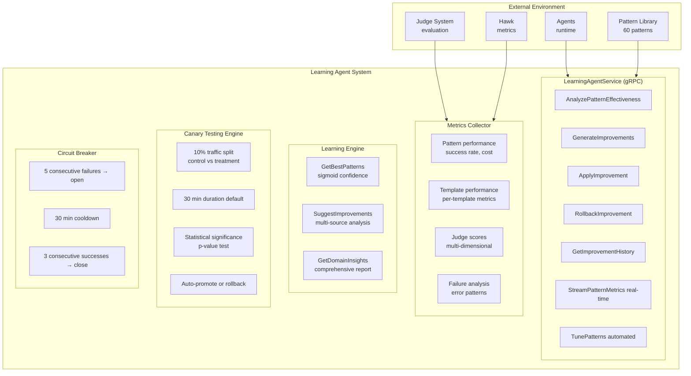

# Learning Agent Architecture

Autonomous self-improvement system that monitors runtime pattern performance across all agents, generates improvement proposals, and applies changes with safety mechanisms. Integrates multi-judge evaluation for multi-dimensional optimization (quality, cost, safety, domain, performance, usability).

**Target Audience**: Architects, academics, and advanced developers

**Version**: v1.0.0-beta.1

---

## Table of Contents

- [Overview](#overview)
- [Design Goals](#design-goals)
- [System Context](#system-context)
- [Architecture Overview](#architecture-overview)
- [Components](#components)
  - [Learning Agent Service](#learning-agent-service)
  - [Pattern Effectiveness Analyzer](#pattern-effectiveness-analyzer)
  - [Improvement Generator](#improvement-generator)
  - [Canary Testing Engine](#canary-testing-engine)
  - [Circuit Breaker](#circuit-breaker)
  - [Metrics Collector](#metrics-collector)
  - [Learning Engine](#learning-engine)
- [Key Interactions](#key-interactions)
  - [Pattern Analysis Flow](#pattern-analysis-flow)
  - [Improvement Generation Flow](#improvement-generation-flow)
  - [Autonomy Level 1: Manual Approval Flow](#autonomy-level-1-manual-approval-flow)
  - [Autonomy Level 2: Human Approval with Canary Flow](#autonomy-level-2-human-approval-with-canary-flow)
  - [Autonomy Level 3: Full Autonomy with Circuit Breaker Flow](#autonomy-level-3-full-autonomy-with-circuit-breaker-flow)
- [Data Structures](#data-structures)
- [Algorithms](#algorithms)
  - [Sigmoid Confidence Calculation](#sigmoid-confidence-calculation)
  - [Pattern Recommendation Algorithm](#pattern-recommendation-algorithm)
  - [Multi-Dimensional Optimization](#multi-dimensional-optimization)
  - [Canary Statistical Significance Test](#canary-statistical-significance-test)
- [Design Trade-offs](#design-trade-offs)
- [Constraints and Limitations](#constraints-and-limitations)
- [Performance Characteristics](#performance-characteristics)
- [Concurrency Model](#concurrency-model)
- [Error Handling](#error-handling)
- [Security Considerations](#security-considerations)
- [Related Work](#related-work)
- [References](#references)
- [Further Reading](#further-reading)

---

## Overview

The Learning Agent autonomously improves Loom agents by analyzing **runtime pattern performance** and applying data-driven optimizations:

**Analysis Inputs**:
- Pattern usage metrics (success rate, cost, latency, error types)
- Judge evaluation scores (factual accuracy, safety, domain compliance)
- Template performance (per-template success rates, costs)
- Recent failures (error patterns, failure modes)

**Improvement Outputs**:
- **Pattern Recommendations**: KEEP, PROMOTE, DEMOTE, REMOVE, INVESTIGATE
- **Improvement Proposals**: Pattern add/remove, parameter tuning, template adjustments
- **Canary Tests**: 10% traffic split, 30 min duration, statistical significance testing
- **Applied Changes**: Automatic or human-approved pattern library updates

**Key Innovation**: Autonomous self-improvement with 3 autonomy levels (manual, human approval, full autonomy), multi-judge integration for multi-dimensional optimization, canary testing with statistical validation, and circuit breaker for safety.

---

## Design Goals

1. **Autonomous Learning**: Self-improve based on runtime performance (no manual pattern curation)
2. **Multi-Dimensional Optimization**: Balance quality, cost, safety, domain compliance, performance, usability
3. **Judge Integration**: Leverage multi-judge evaluation for improvement signals
4. **Safety Mechanisms**: Circuit breaker, canary testing, protected agents, max daily changes
5. **3 Autonomy Levels**: Manual (human approves all), human approval (notify + approve), full autonomy (auto-apply with circuit breaker)
6. **Confidence-Based Decisions**: Sigmoid confidence function based on sample size (reaches 0.9 at 50 uses)
7. **Declarative Configuration**: Full YAML-based configuration (no server flags)

**Non-goals**:
- Real-time pattern updates (analysis runs every 1h by default)
- Cross-process learning (single Loom instance only)
- Prompt engineering (focuses on pattern selection, not prompt generation)

---

## System Context



**External Dependencies**:
- **Agent Runtime**: Source of pattern usage metrics, deployment outcomes
- **Pattern Library**: Target of improvement application (YAML files)
- **Judge System**: Multi-judge evaluation scores for multi-dimensional optimization
- **Hawk**: Historical metrics storage, trace correlation

---

## Architecture Overview

```
┌──────────────────────────────────────────────────────────────────────────────┐
│                    Learning Agent System                                     │
│                                                                              │
│  ┌────────────────────────────────────────────────────────────────────────┐  │
│  │                  LearningAgentService (gRPC)                 │         │  │
│  │                                                              │         │  │
│  │  AnalyzePatternEffectiveness(domain) → PatternAnalysis      │          │  │
│  │  GenerateImprovements(domain, goal) → []Improvement         │          │  │
│  │  ApplyImprovement(id, force) → CanaryTest                   │          │  │
│  │  RollbackImprovement(id, reason) → Success                  │          │  │
│  │  GetImprovementHistory(filters) → []Improvement             │          │  │
│  │  StreamPatternMetrics(domain) → stream PatternMetricEvent   │          │  │
│  │  TunePatterns(domain, goal, strategy) → TuningSummary       │          │  │
│  └────────────────────────────────────────────────────────────────────────┘  │
│                            ▲                                                 │
│                            │ implements                                      │
│  ┌────────────────────────────────────────────────────────────────────────┐  │
│            │               │               │                  │              │
│            ▼               ▼               ▼                  ▼              │
│  ┌────────────────────────────────────────────────────────────────────────┐  │
│  │  Metrics      │  │  Learning    │  │  Canary  │  │  Circuit   │        │  │
│  │  Collector    │  │  Engine      │  │  Testing │  │  Breaker   │        │  │
│  └────────────────────────────────────────────────────────────────────────┘  │
│          │                 │                 │                               │
│          ▼                 ▼                 ▼                               │
│  ┌────────────────────────────────────────────────────────────────────────┐  │
│  │           Learning Lifecycle                                 │         │  │
│  │                                                              │         │  │
│  │  1. Pattern Effectiveness Analysis (every 1h)              │           │  │
│  │     ├─ Collect metrics from agent runtime                   │          │  │
│  │     │   ├─ Pattern usage (success rate, cost, latency)      │          │  │
│  │     │   ├─ Judge scores (quality, safety, domain)           │          │  │
│  │     │   ├─ Template performance                             │          │  │
│  │     │   └─ Error patterns                                   │          │  │
│  │     ├─ Calculate confidence (sigmoid: f(usage_count))       │          │  │
│  │     ├─ Determine recommendations                            │          │  │
│  │     │   ├─ PROMOTE: success_rate ≥ 0.9, confidence ≥ 0.3   │           │  │
│  │     │   ├─ REMOVE: success_rate < 0.5, confidence ≥ 0.3    │           │  │
│  │     │   ├─ KEEP: performing well                            │          │  │
│  │     │   └─ INVESTIGATE: inconsistent or insufficient data   │          │  │
│  │     └─ Store analysis results                               │          │  │
│  │                                                              │         │  │
│  │  2. Improvement Generation                                  │          │  │
│  │     ├─ Analyze patterns (promote/demote/remove)             │          │  │
│  │     ├─ Analyze templates (low success, high cost)           │          │  │
│  │     ├─ Analyze failures (common error patterns)             │          │  │
│  │     ├─ Multi-dimensional optimization                       │          │  │
│  │     │   ├─ Quality weight × judge_quality_score             │          │  │
│  │     │   ├─ Cost weight × judge_cost_score                   │          │  │
│  │     │   └─ Safety weight × judge_safety_score               │          │  │
│  │     ├─ Calculate confidence and impact                      │          │  │
│  │     └─ Sort by impact and confidence                        │          │  │
│  │                                                              │         │  │
│  │  3. Autonomy Level Decision                                 │          │  │
│  │     ├─ AUTONOMY_MANUAL: Store improvement, await approval   │          │  │
│  │     ├─ AUTONOMY_HUMAN_APPROVAL: Notify + await approval     │          │  │
│  │     └─ AUTONOMY_FULL: Auto-apply with safeguards            │          │  │
│  │                                                              │         │  │
│  │  4. Canary Testing (Autonomy Level 2+)                      │          │  │
│  │     ├─ Split traffic: 90% control, 10% treatment            │          │  │
│  │     ├─ Run for 30 minutes (configurable)                    │          │  │
│  │     ├─ Collect metrics (control vs treatment)               │          │  │
│  │     ├─ Statistical significance test                        │          │  │
│  │     │   ├─ t-test for success rate difference              │           │  │
│  │     │   ├─ p-value < 0.05 → significant                     │          │  │
│  │     │   └─ relative_improvement calculation                 │          │  │
│  │     └─ Decision: promote, rollback, or extend               │          │  │
│  │                                                              │         │  │
│  │  5. Application & Rollback                                  │          │  │
│  │     ├─ Circuit breaker check (is circuit open?)             │          │  │
│  │     ├─ Protected agents check (in protected list?)          │          │  │
│  │     ├─ Daily change limit check (< max_daily_changes?)      │          │  │
│  │     ├─ Apply changes to pattern library YAML                │          │  │
│  │     ├─ Record success/failure                               │          │  │
│  │     ├─ Update circuit breaker state                         │          │  │
│  │     └─ Rollback on failure (restore previous version)       │          │  │
│  │                                                              │         │  │
│  │  6. Continuous Monitoring                                   │          │  │
│  │     ├─ Stream pattern metrics (real-time)                   │          │  │
│  │     ├─ Detect anomalies (success rate drops, cost spikes)   │          │  │
│  │     └─ Auto-rollback if performance degrades               │           │  │
│  └────────────────────────────────────────────────────────────────────────┘  │
│                                                                              │
│  ┌────────────────────────────────────────────────────────────────────────┐  │
│  │                  Declarative Configuration                   │         │  │
│  │                                                              │         │  │
│  │  apiVersion: loom/v1                                        │          │  │
│  │  kind: LearningAgentConfig                                  │          │  │
│  │  metadata:                                                  │          │  │
│  │    name: market-intel-learner                               │          │  │
│  │  spec:                                                      │          │  │
│  │    enabled: true                                            │          │  │
│  │    autonomy_level: AUTONOMY_HUMAN_APPROVAL                  │          │  │
│  │    analysis_interval: "1h"                                  │          │  │
│  │    watch_eval_suites:                                       │          │  │
│  │      - eval-suites/market-intel-judges.yaml                 │          │  │
│  │    domains: ["sql", "market-intelligence"]                  │          │  │
│  │    circuit_breaker:                                         │          │  │
│  │      enabled: true                                          │          │  │
│  │      failure_threshold: 5                                   │          │  │
│  │      cooldown_period: "30m"                                 │          │  │
│  │      success_threshold: 3                                   │          │  │
│  │    improvement_policy:                                      │          │  │
│  │      auto_apply_min_confidence: 0.8                         │          │  │
│  │      max_daily_changes: 10                                  │          │  │
│  │      protected_agents: ["production-sql-agent"]             │          │  │
│  │    notifications:                                           │          │  │
│  │      slack_webhook: "https://hooks.slack.com/..."           │          │  │
│  │      notify_on: ["improvement_applied", "circuit_breaker"]  │          │  │
│  └────────────────────────────────────────────────────────────────────────┘  │
└──────────────────────────────────────────────────────────────────────────────┘
```

---

## Components

### Learning Agent Service

**Responsibility**: gRPC service endpoint for learning agent operations.

**Core Interface** (`proto/loom/v1/learning.proto:12`):
```protobuf
service LearningAgentService {
  // Analyze runtime pattern performance across agents
  rpc AnalyzePatternEffectiveness(AnalyzePatternEffectivenessRequest) returns (PatternAnalysisResponse);

  // Generate improvement proposals based on pattern analysis
  rpc GenerateImprovements(GenerateImprovementsRequest) returns (ImprovementsResponse);

  // Apply an improvement proposal (respects autonomy level)
  rpc ApplyImprovement(ApplyImprovementRequest) returns (ApplyImprovementResponse);

  // Rollback a failed improvement
  rpc RollbackImprovement(RollbackImprovementRequest) returns (RollbackImprovementResponse);

  // Retrieve improvement history for an agent or domain
  rpc GetImprovementHistory(GetImprovementHistoryRequest) returns (ImprovementHistoryResponse);

  // Stream real-time pattern effectiveness metrics
  rpc StreamPatternMetrics(StreamPatternMetricsRequest) returns (stream PatternMetricEvent);

  // Automatically adjust pattern parameters based on effectiveness analysis
  rpc TunePatterns(TunePatternsRequest) returns (TunePatternsResponse);
}
```

**AnalyzePatternEffectiveness Request** (`proto/loom/v1/learning.proto:40`):
```protobuf
message AnalyzePatternEffectivenessRequest {
  string domain = 1;      // sql, rest, file, document, etc.
  string agent_id = 2;    // Optional: specific agent or empty for all
  int64 window_hours = 3; // Time window for analysis (default: 24)
}
```

**Pattern Analysis Response** (`proto/loom/v1/learning.proto:47`):
```protobuf
message PatternAnalysisResponse {
  repeated PatternMetric patterns = 1;
  PatternAnalysisSummary summary = 2;
}

message PatternMetric {
  string pattern_name = 1;
  string domain = 2;
  int32 total_usages = 3;
  int32 success_count = 4;
  int32 failure_count = 5;
  double success_rate = 6;
  double avg_cost_usd = 7;
  int64 avg_latency_ms = 8;
  double confidence = 9;                    // Sigmoid function of usage count
  PatternRecommendation recommendation = 10;
  map<string, int32> error_types = 11;
  string llm_provider = 12;
  string llm_model = 13;
  string variant = 14;                      // A/B testing variant

  // Judge evaluation metrics (from multi-judge evaluation)
  double judge_pass_rate = 15;             // % that passed judges (0-1)
  double judge_avg_score = 16;             // Average score (0-100)
  map<string, double> judge_criterion_scores = 17; // "safety" -> 0.92, "cost" -> 0.85
}
```

**Pattern Recommendations** (`proto/loom/v1/learning.proto:76`):
```protobuf
enum PatternRecommendation {
  PATTERN_KEEP = 1;        // Pattern performing well
  PATTERN_PROMOTE = 2;     // High success rate, use more
  PATTERN_DEMOTE = 3;      // Moderate issues, use less
  PATTERN_REMOVE = 4;      // Low success rate, deprecate
  PATTERN_INVESTIGATE = 5; // Insufficient data or inconsistent
}
```

**Thread Safety**: All RPC methods can be called concurrently (gRPC handles per-request isolation).

**Rationale**:
- **gRPC-first**: Type-safe, high-performance, streaming support
- **Streaming metrics**: Real-time pattern performance monitoring
- **Judge integration**: Multi-dimensional optimization via judge scores

---

### Pattern Effectiveness Analyzer

**Responsibility**: Analyze runtime pattern performance and generate recommendations.

**Core Structure** (planned in `pkg/metaagent/learning/analyzer.go`):
```go
type PatternEffectivenessAnalyzer struct {
    metricsCollector *MetricsCollector
    judgeClient      *judge.Client
    tracer           observability.Tracer
}

func (pea *PatternEffectivenessAnalyzer) Analyze(ctx context.Context, domain DomainType, windowHours int64) (*PatternAnalysisResponse, error) {
    ctx, span := pea.tracer.StartSpan(ctx, "learning.pattern_effectiveness.analyze")
    defer pea.tracer.EndSpan(span)

    // 1. Collect pattern metrics from agent runtime
    patternMetrics, err := pea.metricsCollector.GetPatternPerformance(ctx, domain, windowHours)
    if err != nil {
        return nil, fmt.Errorf("failed to collect pattern metrics: %w", err)
    }

    // 2. Enrich with judge evaluation scores
    for _, metric := range patternMetrics {
        judgeScores, _ := pea.judgeClient.GetPatternJudgeScores(ctx, metric.Pattern, windowHours)
        if judgeScores != nil {
            metric.JudgePassRate = judgeScores.PassRate
            metric.JudgeAvgScore = judgeScores.AvgScore
            metric.JudgeCriterionScores = judgeScores.CriterionScores
        }
    }

    // 3. Calculate confidence for each pattern
    for _, metric := range patternMetrics {
        metric.Confidence = calculateConfidence(metric.TotalUsages)
    }

    // 4. Generate recommendations
    for _, metric := range patternMetrics {
        metric.Recommendation = pea.generateRecommendation(metric)
    }

    // 5. Build summary statistics
    summary := pea.buildSummary(patternMetrics)

    return &PatternAnalysisResponse{
        Patterns: patternMetrics,
        Summary:  summary,
    }, nil
}
```

**Recommendation Logic** (`pkg/metaagent/learning/analyzer.go`):
```go
func (pea *PatternEffectivenessAnalyzer) generateRecommendation(metric *PatternMetric) PatternRecommendation {
    // Insufficient data
    if metric.TotalUsages < 3 || metric.Confidence < 0.3 {
        return loomv1.PatternRecommendation_PATTERN_INVESTIGATE
    }

    // High success rate → PROMOTE
    if metric.SuccessRate >= 0.9 && metric.Confidence >= 0.3 {
        // Also check judge scores if available
        if metric.JudgePassRate > 0 && metric.JudgePassRate >= 0.85 {
            return loomv1.PatternRecommendation_PATTERN_PROMOTE
        } else if metric.JudgePassRate == 0 {
            // No judge data, rely on success rate only
            return loomv1.PatternRecommendation_PATTERN_PROMOTE
        }
    }

    // Low success rate → REMOVE
    if metric.SuccessRate < 0.5 && metric.Confidence >= 0.3 {
        return loomv1.PatternRecommendation_PATTERN_REMOVE
    }

    // Moderate success rate → DEMOTE or KEEP
    if metric.SuccessRate >= 0.7 && metric.SuccessRate < 0.9 {
        return loomv1.PatternRecommendation_PATTERN_KEEP
    } else if metric.SuccessRate >= 0.5 && metric.SuccessRate < 0.7 {
        return loomv1.PatternRecommendation_PATTERN_DEMOTE
    }

    // Default
    return loomv1.PatternRecommendation_PATTERN_KEEP
}
```

**Rationale**:
- **Data-driven**: Recommendations based on actual runtime metrics, not intuition
- **Judge integration**: Multi-dimensional evaluation (quality, safety, domain) informs recommendations
- **Confidence-gated**: Only recommend changes when sample size is sufficient (confidence ≥ 0.3)

---

### Improvement Generator

**Responsibility**: Generate improvement proposals based on pattern analysis, template performance, and failure patterns.

**Core Structure** (`pkg/metaagent/learning/engine.go:96`):
```go
type LearningEngine struct {
    collector *MetricsCollector
    tracer    observability.Tracer
}

func (le *LearningEngine) SuggestImprovements(ctx context.Context, domain DomainType) ([]Improvement, error) {
    ctx, span := le.tracer.StartSpan(ctx, "metaagent.learning.suggest_improvements")
    defer le.tracer.EndSpan(span)

    var improvements []Improvement

    // 1. Analyze pattern performance
    patternScores, err := le.GetBestPatterns(ctx, domain)
    if err != nil {
        span.RecordError(err)
    } else {
        improvements = append(improvements, le.analyzePatterns(patternScores)...)
    }

    // 2. Analyze template performance
    templateMetrics, err := le.collector.GetTemplatePerformance(ctx, domain)
    if err != nil {
        span.RecordError(err)
    } else {
        improvements = append(improvements, le.analyzeTemplates(templateMetrics)...)
    }

    // 3. Analyze recent failures
    failures, err := le.collector.GetRecentFailures(ctx, domain, 10)
    if err != nil {
        span.RecordError(err)
    } else {
        improvements = append(improvements, le.analyzeFailures(failures)...)
    }

    // Sort improvements by confidence and impact
    sort.Slice(improvements, func(i, j int) bool {
        // High impact first
        if improvements[i].Impact != improvements[j].Impact {
            impactOrder := map[string]int{"high": 3, "medium": 2, "low": 1}
            return impactOrder[improvements[i].Impact] > impactOrder[improvements[j].Impact]
        }
        // Then by confidence
        return improvements[i].Confidence > improvements[j].Confidence
    })

    return improvements, nil
}
```

**Pattern Analysis** (`pkg/metaagent/learning/engine.go:155`):
```go
func (le *LearningEngine) analyzePatterns(scores []PatternScore) []Improvement {
    var improvements []Improvement

    // Find low-performing patterns (recommend removal)
    for _, score := range scores {
        if score.UsageCount >= 5 && score.SuccessRate < 0.5 && score.Confidence >= 0.3 {
            improvements = append(improvements, Improvement{
                Type: "pattern_remove",
                Description: fmt.Sprintf("Consider removing pattern '%s' (success rate: %.1f%%, %d uses)",
                    score.Pattern, score.SuccessRate*100, score.UsageCount),
                Confidence: score.Confidence,
                Impact:     "medium",
                Details: map[string]interface{}{
                    "pattern":      score.Pattern,
                    "success_rate": score.SuccessRate,
                    "usage_count":  score.UsageCount,
                },
            })
        }
    }

    // Find high-performing patterns (recommend more usage)
    for _, score := range scores {
        if score.UsageCount >= 3 && score.SuccessRate >= 0.9 && score.Confidence >= 0.3 {
            improvements = append(improvements, Improvement{
                Type: "pattern_add",
                Description: fmt.Sprintf("Pattern '%s' has excellent success rate (%.1f%%, %d uses) - consider using more",
                    score.Pattern, score.SuccessRate*100, score.UsageCount),
                Confidence: score.Confidence,
                Impact:     "high",
                Details: map[string]interface{}{
                    "pattern":      score.Pattern,
                    "success_rate": score.SuccessRate,
                    "usage_count":  score.UsageCount,
                },
            })
        }
    }

    return improvements
}
```

**Improvement Types** (`proto/loom/v1/learning.proto:144`):
```protobuf
enum ImprovementType {
  IMPROVEMENT_PATTERN_ADD = 1;       // Add new pattern usage
  IMPROVEMENT_PATTERN_REMOVE = 2;    // Deprecate failing pattern
  IMPROVEMENT_PARAMETER_TUNE = 3;    // Adjust LLM parameters
  IMPROVEMENT_TEMPLATE_ADJUST = 4;   // Modify prompt template
  IMPROVEMENT_CONFIG_ADJUST = 5;     // Update agent configuration
}
```

**Impact Levels** (`proto/loom/v1/learning.proto:154`):
```protobuf
enum ImpactLevel {
  IMPACT_LOW = 1;      // Minor optimization
  IMPACT_MEDIUM = 2;   // Moderate improvement
  IMPACT_HIGH = 3;     // Major enhancement
  IMPACT_CRITICAL = 4; // Breaking change or major fix
}
```

**Rationale**:
- **Multi-source analysis**: Patterns, templates, and failures analyzed independently
- **Sorted by priority**: High-impact, high-confidence improvements surface first
- **Non-blocking**: Failures in one analysis don't block others

---

### Canary Testing Engine

**Responsibility**: Test improvements with 10% traffic split before full rollout.

**Core Structure** (planned in `pkg/metaagent/learning/canary.go`):
```go
type CanaryTestEngine struct {
    metricsCollector *MetricsCollector
    judgeClient      *judge.Client
    tracer           observability.Tracer
}

type CanaryTest struct {
    TestID            string
    PatternName       string
    ControlVersion    string
    TreatmentVersion  string
    TrafficPercentage float64       // 0.10 for 10%
    DurationSeconds   int64         // 1800 for 30 min
    StartTime         time.Time
    Status            CanaryTestStatus
    Result            *CanaryTestResult
}

type CanaryTestResult struct {
    ControlMetrics    *PatternMetric
    TreatmentMetrics  *PatternMetric
    RelativeImprovement float64
    StatisticalSignificance float64 // p-value
    ShouldPromote     bool
    ShouldRollback    bool
    Recommendation    string
}
```

**Canary Test Execution** (planned):
```go
func (cte *CanaryTestEngine) RunCanaryTest(ctx context.Context, improvement *Improvement) (*CanaryTest, error) {
    ctx, span := cte.tracer.StartSpan(ctx, "learning.canary.run_test")
    defer cte.tracer.EndSpan(span)

    // 1. Create canary test
    canary := &CanaryTest{
        TestID:            uuid.New().String(),
        PatternName:       improvement.TargetPattern,
        ControlVersion:    "current",
        TreatmentVersion:  improvement.ID,
        TrafficPercentage: 0.10, // 10% traffic
        DurationSeconds:   1800, // 30 minutes
        StartTime:         time.Now(),
        Status:            loomv1.CanaryTestStatus_CANARY_RUNNING,
    }

    // 2. Apply canary routing (90% control, 10% treatment)
    if err := cte.applyCanaryRouting(canary); err != nil {
        return nil, fmt.Errorf("failed to apply canary routing: %w", err)
    }

    // 3. Run for duration (async)
    go cte.monitorCanary(ctx, canary)

    return canary, nil
}
```

**Canary Monitoring** (planned):
```go
func (cte *CanaryTestEngine) monitorCanary(ctx context.Context, canary *CanaryTest) {
    duration := time.Duration(canary.DurationSeconds) * time.Second
    ticker := time.NewTicker(5 * time.Minute) // Check every 5 min
    defer ticker.Stop()

    deadline := canary.StartTime.Add(duration)

    for {
        select {
        case <-ticker.C:
            // Collect metrics
            controlMetrics, _ := cte.metricsCollector.GetPatternMetrics(ctx, canary.PatternName, canary.ControlVersion)
            treatmentMetrics, _ := cte.metricsCollector.GetPatternMetrics(ctx, canary.PatternName, canary.TreatmentVersion)

            // Check for early termination conditions
            if cte.shouldTerminateEarly(controlMetrics, treatmentMetrics) {
                cte.terminateCanary(ctx, canary, "early_termination")
                return
            }

        case <-time.After(time.Until(deadline)):
            // Duration elapsed, evaluate results
            result := cte.evaluateCanary(ctx, canary)
            cte.finalizeCanary(ctx, canary, result)
            return

        case <-ctx.Done():
            return
        }
    }
}
```

**See [Algorithms](#algorithms) section for statistical significance testing.**

**Rationale**:
- **Risk mitigation**: 10% traffic limits blast radius of bad changes
- **Statistical validation**: p-value < 0.05 ensures significance
- **Auto-rollback**: Automatic rollback if treatment underperforms

---

### Circuit Breaker

**Responsibility**: Prevent runaway improvements by tracking consecutive failures and opening circuit.

**Core Structure** (planned in `pkg/metaagent/learning/circuit_breaker.go`):
```go
type CircuitBreaker struct {
    state            CircuitState
    failureCount     int
    successCount     int
    lastFailureTime  time.Time
    config           *CircuitBreakerConfig
    mu               sync.Mutex
}

type CircuitState int

const (
    StateClosed CircuitState = iota // Normal operation
    StateOpen                        // Failing, reject improvements
    StateHalfOpen                    // Testing recovery
)

type CircuitBreakerConfig struct {
    FailureThreshold int           // 5 consecutive failures → open
    CooldownPeriod   time.Duration // 30 minutes
    SuccessThreshold int           // 3 consecutive successes → close
}
```

**Circuit Breaker Logic**:
```go
func (cb *CircuitBreaker) CanApplyImprovement(ctx context.Context) error {
    cb.mu.Lock()
    defer cb.mu.Unlock()

    switch cb.state {
    case StateClosed:
        return nil // Allow improvement

    case StateOpen:
        // Check if cooldown elapsed
        if time.Since(cb.lastFailureTime) < cb.config.CooldownPeriod {
            return ErrCircuitOpen
        }

        // Transition to HalfOpen
        cb.state = StateHalfOpen
        cb.successCount = 0
        return nil

    case StateHalfOpen:
        return nil // Allow improvement (testing recovery)
    }

    return ErrUnknownState
}

func (cb *CircuitBreaker) RecordSuccess() {
    cb.mu.Lock()
    defer cb.mu.Unlock()

    cb.failureCount = 0

    if cb.state == StateHalfOpen {
        cb.successCount++
        if cb.successCount >= cb.config.SuccessThreshold {
            cb.state = StateClosed // Close circuit
        }
    }
}

func (cb *CircuitBreaker) RecordFailure() {
    cb.mu.Lock()
    defer cb.mu.Unlock()

    cb.failureCount++
    cb.lastFailureTime = time.Now()

    if cb.state == StateHalfOpen {
        // Failed in HalfOpen, reopen circuit
        cb.state = StateOpen
        cb.successCount = 0
    } else if cb.failureCount >= cb.config.FailureThreshold {
        // Open circuit
        cb.state = StateOpen
    }
}
```

**Circuit Breaker Configuration** (`proto/loom/v1/learning.proto:462`):
```protobuf
message LearningCircuitBreakerConfig {
  bool enabled = 1;                    // default: true
  int32 failure_threshold = 2;         // 5 consecutive failures
  string cooldown_period = 3;          // "30m"
  int32 success_threshold = 4;         // 3 consecutive successes
}
```

**State Transitions**:
```
Closed (normal operation)
  │                                                                             
  ├─ 5 consecutive failures                                                     
  │                                                                             
  ▼
Open (reject all improvements)
  │                                                                             
  ├─ 30 min cooldown elapsed                                                    
  │                                                                             
  ▼
HalfOpen (test recovery)
  │                                                                             
  ├─ 3 consecutive successes → Closed                                           
  └─ any failure → Open                                                         
```

**Rationale**:
- **Prevent cascading failures**: Stop applying improvements if multiple fail
- **Cooldown period**: Give system time to stabilize
- **Half-open testing**: Test recovery with single improvement before fully resuming

---

### Metrics Collector

**Responsibility**: Collect pattern usage metrics, template performance, and failure data from agent runtime.

**Core Structure** (`pkg/metaagent/learning/metrics_collector.go`):
```go
type MetricsCollector struct {
    db     *sql.DB // SQLite metrics database
    tracer observability.Tracer
}

type PatternMetrics struct {
    Pattern      string
    Domain       string
    UsageCount   int
    SuccessCount int
    FailureCount int
    SuccessRate  float64
    AvgCost      float64
    AvgLatency   time.Duration
    ErrorTypes   map[string]int
}

type TemplateMetrics struct {
    Template     string
    Domain       string
    UsageCount   int
    SuccessCount int
    SuccessRate  float64
    AvgCost      float64
}

type DeploymentMetric struct {
    Timestamp        time.Time
    Domain           string
    Pattern          string
    SelectedTemplate string
    Success          bool
    Cost             float64
    Latency          time.Duration
    ErrorMessage     string
}
```

**SQLite Schema** (planned):
```sql
CREATE TABLE pattern_metrics (
    pattern TEXT NOT NULL,
    domain TEXT NOT NULL,
    timestamp INTEGER NOT NULL,
    success BOOLEAN NOT NULL,
    cost_usd REAL NOT NULL,
    latency_ms INTEGER NOT NULL,
    error_message TEXT,
    PRIMARY KEY (pattern, domain, timestamp)
);

CREATE INDEX idx_pattern_domain ON pattern_metrics(pattern, domain);
CREATE INDEX idx_timestamp ON pattern_metrics(timestamp);

CREATE TABLE template_metrics (
    template TEXT NOT NULL,
    domain TEXT NOT NULL,
    timestamp INTEGER NOT NULL,
    success BOOLEAN NOT NULL,
    cost_usd REAL NOT NULL,
    PRIMARY KEY (template, domain, timestamp)
);
```

**Metrics Collection** (`pkg/metaagent/learning/metrics_collector.go`):
```go
func (mc *MetricsCollector) RecordDeployment(ctx context.Context, metric *DeploymentMetric) error {
    query := `
        INSERT INTO pattern_metrics (pattern, domain, timestamp, success, cost_usd, latency_ms, error_message)
        VALUES (?, ?, ?, ?, ?, ?, ?)
    `
    _, err := mc.db.ExecContext(ctx, query,
        metric.Pattern,
        metric.Domain,
        metric.Timestamp.Unix(),
        metric.Success,
        metric.Cost,
        metric.Latency.Milliseconds(),
        metric.ErrorMessage,
    )
    return err
}

func (mc *MetricsCollector) GetPatternPerformance(ctx context.Context, domain DomainType, windowHours int64) ([]*PatternMetrics, error) {
    query := `
        SELECT
            pattern,
            COUNT(*) as total_usages,
            SUM(CASE WHEN success = 1 THEN 1 ELSE 0 END) as success_count,
            SUM(CASE WHEN success = 0 THEN 1 ELSE 0 END) as failure_count,
            AVG(cost_usd) as avg_cost,
            AVG(latency_ms) as avg_latency
        FROM pattern_metrics
        WHERE domain = ? AND timestamp >= ?
        GROUP BY pattern
        ORDER BY total_usages DESC
    `

    cutoff := time.Now().Add(-time.Duration(windowHours) * time.Hour).Unix()
    rows, err := mc.db.QueryContext(ctx, query, string(domain), cutoff)
    if err != nil {
        return nil, err
    }
    defer rows.Close()

    var metrics []*PatternMetrics
    for rows.Next() {
        var m PatternMetrics
        var totalUsages, successCount, failureCount int
        var avgCost float64
        var avgLatency int64

        err := rows.Scan(&m.Pattern, &totalUsages, &successCount, &failureCount, &avgCost, &avgLatency)
        if err != nil {
            return nil, err
        }

        m.Domain = string(domain)
        m.UsageCount = totalUsages
        m.SuccessCount = successCount
        m.FailureCount = failureCount
        m.SuccessRate = float64(successCount) / float64(totalUsages)
        m.AvgCost = avgCost
        m.AvgLatency = time.Duration(avgLatency) * time.Millisecond

        metrics = append(metrics, &m)
    }

    return metrics, nil
}
```

**Rationale**:
- **SQLite storage**: Persistent, queryable metrics (no Hawk dependency for local operation)
- **Time-windowed queries**: Analyze recent performance (last 24h by default)
- **Aggregate statistics**: Success rate, avg cost, avg latency calculated in SQL

---

### Learning Engine

**Responsibility**: High-level orchestration of pattern analysis, improvement generation, and domain insights.

**Core Structure** (`pkg/metaagent/learning/engine.go:38`):
```go
type LearningEngine struct {
    collector *MetricsCollector
    tracer    observability.Tracer
}

func NewLearningEngine(collector *MetricsCollector, tracer observability.Tracer) *LearningEngine {
    return &LearningEngine{
        collector: collector,
        tracer:    tracer,
    }
}
```

**Get Best Patterns** (`pkg/metaagent/learning/engine.go:46`):
```go
func (le *LearningEngine) GetBestPatterns(ctx context.Context, domain DomainType) ([]PatternScore, error) {
    ctx, span := le.tracer.StartSpan(ctx, "metaagent.learning.get_best_patterns")
    defer le.tracer.EndSpan(span)

    span.SetAttribute("domain", string(domain))

    // Get pattern performance from collector
    patternMetrics, err := le.collector.GetPatternPerformance(ctx, domain)
    if err != nil {
        span.RecordError(err)
        return nil, fmt.Errorf("failed to get pattern performance: %w", err)
    }

    // Convert to scored patterns
    var scores []PatternScore
    for _, metrics := range patternMetrics {
        confidence := le.calculateConfidence(metrics.UsageCount)

        // Only recommend patterns with good success rate and reasonable confidence
        recommendUse := metrics.SuccessRate >= 0.7 && confidence >= 0.3

        scores = append(scores, PatternScore{
            Pattern:      metrics.Pattern,
            SuccessRate:  metrics.SuccessRate,
            UsageCount:   metrics.UsageCount,
            AvgCost:      metrics.AvgCost,
            Confidence:   confidence,
            RecommendUse: recommendUse,
        })
    }

    // Sort by success rate (descending), then by confidence (descending)
    sort.Slice(scores, func(i, j int) bool {
        if scores[i].SuccessRate != scores[j].SuccessRate {
            return scores[i].SuccessRate > scores[j].SuccessRate
        }
        return scores[i].Confidence > scores[j].Confidence
    })

    span.SetAttribute("patterns_scored", len(scores))
    span.Status = observability.Status{Code: observability.StatusOK, Message: "Best patterns calculated"}

    return scores, nil
}
```

**See [Algorithms](#algorithms) section for sigmoid confidence calculation.**

**Domain Insights** (`pkg/metaagent/learning/engine.go:338`):
```go
func (le *LearningEngine) GetDomainInsights(ctx context.Context, domain DomainType) (*DomainInsights, error) {
    ctx, span := le.tracer.StartSpan(ctx, "metaagent.learning.get_domain_insights")
    defer le.tracer.EndSpan(span)

    span.SetAttribute("domain", string(domain))

    insights := &DomainInsights{
        Domain: domain,
    }

    // Get success rate
    successRate, _ := le.collector.GetSuccessRate(ctx, domain)
    insights.SuccessRate = successRate

    // Get best patterns
    bestPatterns, _ := le.GetBestPatterns(ctx, domain)
    insights.BestPatterns = bestPatterns

    // Get improvements
    improvements, _ := le.SuggestImprovements(ctx, domain)
    insights.Improvements = improvements

    return insights, nil
}
```

**Rationale**:
- **High-level orchestration**: Coordinates metrics collector, judge client, analysis
- **Non-blocking**: Errors in one operation don't fail entire analysis
- **Observable**: Full tracing of learning operations

---

## Key Interactions

### Pattern Analysis Flow

```
Learning Agent    Metrics Collector    Judge System    Pattern Library
  │                     │                    │               │                  
  ├─ AnalyzePatternEffectiveness(domain) ───▶│               │                  
  │                     │                    │               │                  
  │                     ├─ GetPatternMetrics(domain, 24h) ───▶│                 
  │                     │◀─ Pattern Metrics ─────────────────┤│                 
  │                     │  (usage, success, cost, latency)   ││                 
  │                     │                    │               │                  
  ├─ Enrich with Judge Scores ───────────────▶│               │                 
  │                     │                    │               │                  
  │                     │                    ├─ GetPatternJudgeScores │         
  │                     │                    │  (judge_pass_rate,     │         
  │                     │                    │   judge_avg_score,     │         
  │                     │                    │   criterion_scores)    │         
  │                     │◀─ Judge Scores ────┤               │                  
  │                     │                    │               │                  
  ├─ Calculate Confidence (sigmoid)          │               │                  
  │  confidence = 1 / (1 + e^(-0.1*(count-25)))              │                  
  │                     │                    │               │                  
  ├─ Generate Recommendations                │               │                  
  │  ├─ PROMOTE: success ≥ 0.9, confidence ≥ 0.3            │                   
  │  ├─ REMOVE: success < 0.5, confidence ≥ 0.3             │                   
  │  ├─ KEEP: performing well                │               │                  
  │  └─ INVESTIGATE: insufficient data       │               │                  
  │                     │                    │               │                  
  │◀─ PatternAnalysisResponse ──────────────┤               │                   
  │  (patterns with recommendations)         │               │                  
  │                     │                    │               │                  
```

**Properties**:
- **Judge integration**: Multi-dimensional evaluation (quality, safety, domain) enriches metrics
- **Confidence-gated**: Only recommend changes when sample size sufficient (confidence ≥ 0.3)
- **Recommendation logic**: Data-driven rules (promote high performers, remove low performers)

---

### Improvement Generation Flow

```
Learning Agent    Learning Engine    Metrics Collector    Judge System
  │                     │                    │                 │                
  ├─ GenerateImprovements(domain, goal) ────▶│                 │                
  │                     │                    │                 │                
  │                     ├─ GetBestPatterns ──▶│                 │               
  │                     │◀─ Scored Patterns ──┤                 │               
  │                     │                    │                 │                
  │                     ├─ analyzePatterns(scores)              │               
  │                     │  ├─ Low success (< 0.5) → REMOVE      │               
  │                     │  └─ High success (≥ 0.9) → PROMOTE    │               
  │                     │                    │                 │                
  │                     ├─ GetTemplatePerformance ─────────────▶│               
  │                     │◀─ Template Metrics ──────────────────┤│               
  │                     │                    │                 │                
  │                     ├─ analyzeTemplates(metrics)            │               
  │                     │  ├─ Low success (< 0.6) → ADJUST      │               
  │                     │  └─ High cost (> $0.10) → OPTIMIZE    │               
  │                     │                    │                 │                
  │                     ├─ GetRecentFailures ──────────────────▶│               
  │                     │◀─ Failure Records ───────────────────┤│               
  │                     │                    │                 │                
  │                     ├─ analyzeFailures(failures)            │               
  │                     │  └─ Common error patterns → ADD HANDLING │            
  │                     │                    │                 │                
  │                     ├─ Multi-Dimensional Optimization       │               
  │                     │  ├─ Quality weight × judge_quality_score │            
  │                     │  ├─ Cost weight × judge_cost_score    │               
  │                     │  └─ Safety weight × judge_safety_score │              
  │                     │                    │                 │                
  │                     ├─ Sort by (impact, confidence)         │               
  │                     │                    │                 │                
  │◀─ ImprovementsResponse ─────────────────┤                 │                 
  │  (sorted improvements with details)     │                 │                 
  │                     │                    │                 │                
```

**Properties**:
- **Multi-source**: Patterns, templates, failures analyzed independently
- **Multi-dimensional**: Judge scores enable optimization across quality, cost, safety, domain, performance, usability
- **Prioritized**: Sorted by impact and confidence (high-impact, high-confidence first)

---

### Autonomy Level 1: Manual Approval Flow

```
Learning Agent    Improvement Store    Notification    Human Operator
  │                     │                    │               │                  
  ├─ ApplyImprovement(id, autonomy=MANUAL) ─▶│               │                  
  │                     │                    │               │                  
  │                     ├─ Check autonomy level              │                  
  │                     │  → AUTONOMY_MANUAL                 │                  
  │                     │                    │               │                  
  │                     ├─ Store improvement (status=PENDING) │                 
  │                     │                    │               │                  
  │                     ├─ Notify operator ──────────────────▶│                 
  │                     │                    │               │                  
  │◀─ ApplyImprovementResponse ─────────────┤               │                   
  │  (status: PENDING, awaiting approval)   │               │                   
  │                     │                    │               │                  
  │                     │                    │               ▼                  
  │                     │                    │  Operator reviews improvement    
  │                     │                    │  (via CLI or API)                
  │                     │                    │               │                  
  │                     │◀─ ApproveImprovement(id) ──────────┤                  
  │                     │                    │               │                  
  │                     ├─ Update status (APPROVED)          │                  
  │                     ├─ Apply changes to pattern library  │                  
  │                     ├─ Record success                    │                  
  │                     │                    │               │                  
  │                     │─ Notify operator (applied) ────────▶│                 
  │                     │                    │               │                  
```

**Properties**:
- **Zero autonomy**: All improvements require human approval
- **Stored pending**: Improvements stored but not applied
- **Notification**: Operator notified (Slack, email) when improvements ready for review

**Use Case**: Production systems where human oversight required (regulatory, safety-critical).

---

### Autonomy Level 2: Human Approval with Canary Flow

```
Learning Agent    Canary Engine    Metrics Collector    Notification    Human
  │                     │                    │               │            │     
  ├─ ApplyImprovement(id, autonomy=HUMAN_APPROVAL) ─────────▶│            │     
  │                     │                    │               │            │     
  │                     ├─ Check autonomy level              │            │     
  │                     │  → AUTONOMY_HUMAN_APPROVAL         │            │     
  │                     │                    │               │            │     
  │                     ├─ Notify human (approval needed) ───┼────────────▶│    
  │                     │                    │               │            │     
  │                     │◀─ Approve ─────────────────────────┼────────────┤     
  │                     │                    │               │            │     
  │                     ├─ Create CanaryTest │               │            │     
  │                     │  (10% traffic, 30 min)             │            │     
  │                     │                    │               │            │     
  │                     ├─ Apply canary routing              │            │     
  │                     │  (90% control, 10% treatment)      │            │     
  │                     │                    │               │            │     
  │                     │  [30 minutes pass] │               │            │     
  │                     │                    │               │            │     
  │                     ├─ Collect metrics ──▶│               │            │    
  │                     │◀─ Control metrics ──┤               │            │    
  │                     │◀─ Treatment metrics ┤               │            │    
  │                     │                    │               │            │     
  │                     ├─ Statistical test  │               │            │     
  │                     │  (t-test, p-value) │               │            │     
  │                     │                    │               │            │     
  │                     ├─ Decision:         │               │            │     
  │                     │  if p < 0.05 && relative_improvement > 0:       │     
  │                     │    → PROMOTE       │               │            │     
  │                     │  else:             │               │            │     
  │                     │    → ROLLBACK      │               │            │     
  │                     │                    │               │            │     
  │                     ├─ Apply decision (promote or rollback)           │     
  │                     ├─ Notify human (result) ────────────┼────────────▶│    
  │                     │                    │               │            │     
```

**Properties**:
- **Human approval + canary**: Operator approves, then canary test validates
- **10% traffic**: Limited blast radius during testing
- **Statistical validation**: p-value < 0.05 ensures significance
- **Auto-promote or rollback**: Automatic decision based on canary results

**Use Case**: Production systems with human oversight but willingness to automate validation.

---

### Autonomy Level 3: Full Autonomy with Circuit Breaker Flow

```
Learning Agent    Circuit Breaker    Canary Engine    Pattern Library
  │                     │                    │               │                  
  ├─ ApplyImprovement(id, autonomy=FULL) ────▶│               │                 
  │                     │                    │               │                  
  │                     ├─ Check circuit ────▶│               │                 
  │                     │◀─ State: Closed ────┤               │                 
  │                     │  (or HalfOpen)      │               │                 
  │                     │                    │               │                  
  │                     ├─ Check protected agents             │                 
  │                     │  (is agent in protected list?)      │                 
  │                     ├─ Check daily limit │               │                  
  │                     │  (< max_daily_changes?)             │                 
  │                     ├─ Check confidence  │               │                  
  │                     │  (≥ auto_apply_min_confidence?)     │                 
  │                     │                    │               │                  
  │                     ├─ Create CanaryTest ▶│               │                 
  │                     │  (10% traffic, 30 min)              │                 
  │                     │                    │               │                  
  │                     │  [Canary runs and succeeds]         │                 
  │                     │                    │               │                  
  │                     │◀─ Canary: PROMOTE ─┤               │                  
  │                     │                    │               │                  
  │                     ├─ Apply changes ────────────────────▶│                 
  │                     ├─ Record success ───▶│               │                 
  │                     │◀─ Reset failures ───┤               │                 
  │                     │                    │               │                  
  │◀─ ApplyImprovementResponse ─────────────┤               │                   
  │  (status: APPLIED, canary: PASSED)      │               │                   
  │                     │                    │               │                  

  [If canary fails or improvement fails]

  │                     ├─ Record failure ───▶│               │                 
  │                     │◀─ Increment count ──┤               │                 
  │                     │  (failureCount++)   │               │                 
  │                     │                    │               │                  
  │                     ├─ Check threshold ───▶│               │                
  │                     │  (failureCount ≥ 5?)│               │                 
  │                     │◀─ Open circuit ─────┤               │                 
  │                     │                    │               │                  
  │◀─ Error: Circuit Open ──────────────────┤               │                   
  │                     │                    │               │                  
```

**Properties**:
- **Full autonomy**: No human approval, auto-apply with safeguards
- **Circuit breaker**: 5 consecutive failures → open (stop auto-apply)
- **Protected agents**: Never auto-modify critical agents (even in full autonomy)
- **Daily limit**: Max N improvements per day (prevent runaway changes)
- **Confidence gating**: Only apply if confidence ≥ 0.8 (configurable)

**Use Case**: Development environments, non-critical agents, experimentation.

---

## Data Structures

### PatternMetric

**Definition** (`proto/loom/v1/learning.proto:53`):
```protobuf
message PatternMetric {
  string pattern_name = 1;
  string domain = 2;
  int32 total_usages = 3;
  int32 success_count = 4;
  int32 failure_count = 5;
  double success_rate = 6;
  double avg_cost_usd = 7;
  int64 avg_latency_ms = 8;
  double confidence = 9;                    // Sigmoid function of usage count
  PatternRecommendation recommendation = 10;
  map<string, int32> error_types = 11;
  string llm_provider = 12;
  string llm_model = 13;
  string variant = 14;                      // A/B testing variant

  // Judge evaluation metrics
  double judge_pass_rate = 15;             // % that passed judges (0-1)
  double judge_avg_score = 16;             // Average score (0-100)
  map<string, double> judge_criterion_scores = 17; // "safety" -> 0.92
}
```

**Invariants**:
```
total_usages = success_count + failure_count
success_rate = success_count / total_usages
0.0 ≤ confidence ≤ 1.0 (sigmoid output)
0.0 ≤ judge_pass_rate ≤ 1.0
0.0 ≤ judge_avg_score ≤ 100.0
```

---

### Improvement

**Definition** (`proto/loom/v1/learning.proto:127`):
```protobuf
message Improvement {
  string id = 1;                      // UUID
  ImprovementType type = 2;           // Pattern add/remove, parameter tune, etc.
  string description = 3;
  double confidence = 4;              // 0.0-1.0
  ImpactLevel impact = 5;             // Low, medium, high, critical
  string target_agent_id = 6;
  string target_pattern = 7;
  string domain = 8;
  ImprovementDetails details = 9;
  ImprovementStatus status = 10;      // Pending, approved, applied, rolled_back
  int64 created_at = 11;
  int64 applied_at = 12;
  string applied_by = 13;             // "learning-agent" or "human:{user_id}"
}
```

**ImprovementStatus** (`proto/loom/v1/learning.proto:180`):
```protobuf
enum ImprovementStatus {
  IMPROVEMENT_PENDING = 1;           // Awaiting approval
  IMPROVEMENT_APPROVED = 2;          // Approved, not yet applied
  IMPROVEMENT_APPLYING = 3;          // Currently being applied
  IMPROVEMENT_APPLIED = 4;           // Successfully applied
  IMPROVEMENT_CANARY_TESTING = 5;    // Under canary test
  IMPROVEMENT_ROLLED_BACK = 6;       // Rolled back due to failure
  IMPROVEMENT_REJECTED = 7;          // Rejected by human or validation
}
```

---

### CanaryTest

**Definition** (`proto/loom/v1/learning.proto:210`):
```protobuf
message CanaryTest {
  string test_id = 1;
  string pattern_name = 2;
  string control_version = 3;
  string treatment_version = 4;
  double traffic_percentage = 5;     // 0.10 for 10%
  int64 duration_seconds = 6;        // 1800 for 30 min
  int64 start_time = 7;
  CanaryTestStatus status = 8;       // Running, completed, failed
  CanaryTestResult result = 9;
}

message CanaryTestResult {
  PatternMetric control_metrics = 1;
  PatternMetric treatment_metrics = 2;
  double relative_improvement = 3;   // (treatment - control) / control
  double statistical_significance = 4; // p-value
  bool should_promote = 5;
  bool should_rollback = 6;
  string recommendation = 7;
}
```

---

### LearningAgentConfig

**Definition** (`proto/loom/v1/learning.proto:406`):
```protobuf
message LearningAgentConfig {
  string name = 1;
  string description = 2;
  bool enabled = 3;
  AutonomyLevel autonomy_level = 4;        // Manual, human approval, full
  string analysis_interval = 5;            // "1h", "30m", "15m"
  repeated string watch_eval_suites = 6;   // Eval suites to monitor
  repeated string domains = 7;             // "sql", "market-intelligence"
  LearningCircuitBreakerConfig circuit_breaker = 8;
  ImprovementPolicy improvement_policy = 9;
  NotificationConfig notifications = 10;
  map<string, string> metadata = 11;
}
```

**AutonomyLevel** (`proto/loom/v1/learning.proto:445`):
```protobuf
enum AutonomyLevel {
  AUTONOMY_MANUAL = 1;           // Requires human approval for all
  AUTONOMY_HUMAN_APPROVAL = 2;   // Improvements queued for approval
  AUTONOMY_FULL = 3;             // Auto-apply with circuit breaker
}
```

---

## Algorithms

### Sigmoid Confidence Calculation

**Problem**: Determine confidence score based on sample size (usage count).

**Solution**: Sigmoid function that increases with usage count, reaching ~0.9 at 50 uses and ~0.99 at 100 uses.

**Algorithm** (`pkg/metaagent/learning/engine.go:317`):
```go
func (le *LearningEngine) calculateConfidence(usageCount int) float64 {
    if usageCount == 0 {
        return 0.0
    }

    // Sigmoid function: 1 / (1 + e^(-k*(x-x0)))
    // k controls steepness, x0 is midpoint
    k := 0.1
    x0 := 25.0

    confidence := 1.0 / (1.0 + math.Exp(-k*(float64(usageCount)-x0)))

    // Ensure minimum confidence for small samples
    if usageCount < 3 {
        confidence = math.Min(confidence, 0.3)
    }

    return confidence
}
```

**Complexity**: O(1)

**Confidence Curve**:
```
Usage Count → Confidence
0  → 0.0
1  → 0.3 (capped)
2  → 0.3 (capped)
3  → 0.17
5  → 0.27
10 → 0.47
25 → 0.50 (midpoint)
50 → 0.92
100 → 0.998
```

**Rationale**:
- **Sigmoid shape**: Gradual increase, not linear
- **Midpoint at 25**: Reasonable confidence at 25 uses
- **Cap for small samples**: < 3 uses capped at 0.3 (low confidence)
- **Asymptotic approach**: Never reaches 1.0 (always some uncertainty)

---

### Pattern Recommendation Algorithm

**Problem**: Determine recommendation (PROMOTE, REMOVE, KEEP, INVESTIGATE) based on success rate and confidence.

**Solution**: Rule-based logic with confidence gating.

**Algorithm** (from analyzer):
```go
func generateRecommendation(metric *PatternMetric) PatternRecommendation {
    // Insufficient data → INVESTIGATE
    if metric.TotalUsages < 3 || metric.Confidence < 0.3 {
        return loomv1.PatternRecommendation_PATTERN_INVESTIGATE
    }

    // High success rate → PROMOTE (also check judge scores if available)
    if metric.SuccessRate >= 0.9 && metric.Confidence >= 0.3 {
        if metric.JudgePassRate > 0 && metric.JudgePassRate >= 0.85 {
            return loomv1.PatternRecommendation_PATTERN_PROMOTE
        } else if metric.JudgePassRate == 0 {
            // No judge data, rely on success rate only
            return loomv1.PatternRecommendation_PATTERN_PROMOTE
        }
    }

    // Low success rate → REMOVE
    if metric.SuccessRate < 0.5 && metric.Confidence >= 0.3 {
        return loomv1.PatternRecommendation_PATTERN_REMOVE
    }

    // Moderate success rate → KEEP or DEMOTE
    if metric.SuccessRate >= 0.7 && metric.SuccessRate < 0.9 {
        return loomv1.PatternRecommendation_PATTERN_KEEP
    } else if metric.SuccessRate >= 0.5 && metric.SuccessRate < 0.7 {
        return loomv1.PatternRecommendation_PATTERN_DEMOTE
    }

    // Default
    return loomv1.PatternRecommendation_PATTERN_KEEP
}
```

**Decision Tree**:
```
usageCount < 3 OR confidence < 0.3
  → INVESTIGATE

successRate ≥ 0.9 AND confidence ≥ 0.3 AND (judge_pass_rate ≥ 0.85 OR no_judge_data)
  → PROMOTE

successRate < 0.5 AND confidence ≥ 0.3
  → REMOVE

successRate ≥ 0.7 AND successRate < 0.9
  → KEEP

successRate ≥ 0.5 AND successRate < 0.7
  → DEMOTE

else
  → KEEP (default)
```

**Complexity**: O(1)

**Rationale**:
- **Confidence-gated**: Only recommend changes with sufficient data (confidence ≥ 0.3)
- **Judge integration**: Multi-dimensional evaluation (quality, safety, domain) considered
- **Conservative**: Default to KEEP if uncertain

---

### Multi-Dimensional Optimization

**Problem**: Optimize improvements across multiple dimensions (quality, cost, safety, domain, performance, usability) with user-defined weights.

**Solution**: Weighted score calculation using judge dimension scores.

**Algorithm** (planned):
```go
func calculateMultiDimensionalScore(metric *PatternMetric, dimensionWeights map[string]float64) float64 {
    if len(dimensionWeights) == 0 || len(metric.JudgeCriterionScores) == 0 {
        // Fallback to legacy success rate if no judge scores
        return metric.SuccessRate
    }

    totalWeight := 0.0
    weightedSum := 0.0

    for dimension, weight := range dimensionWeights {
        if score, exists := metric.JudgeCriterionScores[dimension]; exists {
            // Judge scores are 0-100, normalize to 0-1
            normalizedScore := score / 100.0
            weightedSum += normalizedScore * weight
            totalWeight += weight
        }
    }

    if totalWeight == 0.0 {
        // No matching dimensions, fallback to success rate
        return metric.SuccessRate
    }

    return weightedSum / totalWeight
}
```

**Example**:
```go
dimensionWeights := map[string]float64{
    "quality": 0.7,
    "cost":    0.2,
    "safety":  0.1,
}

metric := &PatternMetric{
    JudgeCriterionScores: map[string]float64{
        "quality": 85.0,  // 0.85 normalized
        "cost":    90.0,  // 0.90 normalized
        "safety":  95.0,  // 0.95 normalized
    },
}

score = (0.85 * 0.7) + (0.90 * 0.2) + (0.95 * 0.1) / (0.7 + 0.2 + 0.1)
      = (0.595 + 0.18 + 0.095) / 1.0
      = 0.87
```

**Complexity**: O(d) where d = number of dimensions

**Rationale**:
- **User-defined weights**: Customize optimization priorities (quality vs cost vs safety)
- **Judge integration**: Leverages multi-judge evaluation for comprehensive assessment
- **Fallback**: Uses success rate if judge scores unavailable

---

### Canary Statistical Significance Test

**Problem**: Determine if treatment (new pattern) significantly outperforms control (current pattern).

**Solution**: Independent samples t-test with p-value < 0.05 threshold.

**Algorithm** (planned):
```go
func (cte *CanaryTestEngine) evaluateCanary(ctx context.Context, canary *CanaryTest) *CanaryTestResult {
    // Collect metrics
    controlMetrics := cte.metricsCollector.GetPatternMetrics(ctx, canary.PatternName, canary.ControlVersion)
    treatmentMetrics := cte.metricsCollector.GetPatternMetrics(ctx, canary.PatternName, canary.TreatmentVersion)

    // Calculate relative improvement
    relativeImprovement := (treatmentMetrics.SuccessRate - controlMetrics.SuccessRate) / controlMetrics.SuccessRate

    // Perform t-test for success rates
    pValue := twoSampleTTest(
        controlMetrics.SuccessCount, controlMetrics.TotalUsages,
        treatmentMetrics.SuccessCount, treatmentMetrics.TotalUsages,
    )

    // Decision criteria
    shouldPromote := (pValue < 0.05) && (relativeImprovement > 0)
    shouldRollback := (pValue < 0.05) && (relativeImprovement < 0)

    recommendation := "extend"
    if shouldPromote {
        recommendation = "promote"
    } else if shouldRollback {
        recommendation = "rollback"
    }

    return &CanaryTestResult{
        ControlMetrics:          controlMetrics,
        TreatmentMetrics:        treatmentMetrics,
        RelativeImprovement:     relativeImprovement,
        StatisticalSignificance: pValue,
        ShouldPromote:           shouldPromote,
        ShouldRollback:          shouldRollback,
        Recommendation:          recommendation,
    }
}

func twoSampleTTest(successControl, totalControl, successTreatment, totalTreatment int) float64 {
    pControl := float64(successControl) / float64(totalControl)
    pTreatment := float64(successTreatment) / float64(totalTreatment)

    // Pooled proportion
    pPool := float64(successControl+successTreatment) / float64(totalControl+totalTreatment)

    // Standard error
    se := math.Sqrt(pPool * (1 - pPool) * (1/float64(totalControl) + 1/float64(totalTreatment)))

    // Z-statistic
    z := (pTreatment - pControl) / se

    // p-value (two-tailed)
    pValue := 2.0 * normalCDF(-math.Abs(z))

    return pValue
}
```

**Complexity**: O(1)

**Example**:
```
Control: 85 successes out of 100 (85% success rate)
Treatment: 92 successes out of 100 (92% success rate)

Relative improvement = (0.92 - 0.85) / 0.85 = 0.0824 (8.24% improvement)

t-test:
  pPool = (85 + 92) / (100 + 100) = 0.885
  se = sqrt(0.885 * 0.115 * (1/100 + 1/100)) = 0.045
  z = (0.92 - 0.85) / 0.045 = 1.56
  p-value = 2 * normalCDF(-1.56) = 0.119

Decision: p-value (0.119) > 0.05 → NOT statistically significant → EXTEND canary
```

**Rationale**:
- **Statistical rigor**: p-value < 0.05 ensures significance (95% confidence)
- **Two-tailed test**: Detects both improvement and degradation
- **Relative improvement**: Percentage change more interpretable than absolute

---

## Design Trade-offs

### Decision 1: 3 Autonomy Levels vs. Single Level

**Chosen**: 3 autonomy levels (manual, human approval, full autonomy)

**Rationale**:
- **Flexibility**: Different use cases require different oversight (production vs development)
- **Safety gradient**: Manual for critical systems, full for experimentation
- **Evolutionary adoption**: Start manual, move to human approval, eventually full

**Alternatives**:
1. **Manual only**:
   - ✅ Maximum safety
   - ❌ No automation, human bottleneck
   - ❌ Doesn't scale for high-frequency improvements

2. **Full autonomy only**:
   - ✅ Maximum automation
   - ❌ Unsafe for production (no human oversight)
   - ❌ Circuit breaker only safety mechanism (not enough for critical systems)

3. **3 levels (current choice)**:
   - ✅ Flexibility for different use cases
   - ✅ Evolutionary adoption path (manual → human approval → full)
   - ✅ Safety for production + automation for development
   - ❌ Complexity: 3 code paths to maintain

**Consequences**:
- ✅ Adoption flexibility
- ✅ Safety for production
- ❌ Implementation complexity

---

### Decision 2: Sigmoid Confidence Function

**Chosen**: Sigmoid confidence function with midpoint at 25 uses

**Rationale**:
- **Gradual increase**: More intuitive than linear or step function
- **Never reaches 1.0**: Always some uncertainty (conservative)
- **Reasonable thresholds**: 0.9 confidence at 50 uses, 0.3 confidence at 3 uses

**Alternatives**:
1. **Linear confidence** (confidence = usageCount / 100):
   - ✅ Simple
   - ❌ Too slow: requires 80 uses for 0.8 confidence
   - ❌ Reaches 1.0 at 100 uses (overconfident)

2. **Step function** (confidence = 1.0 if usageCount ≥ threshold else 0.0):
   - ✅ Simple
   - ❌ No gradual increase (binary decision)
   - ❌ Harsh threshold (49 uses → 0.0, 50 uses → 1.0)

3. **Sigmoid (current choice)**:
   - ✅ Gradual increase (smooth curve)
   - ✅ Asymptotic (never overconfident)
   - ✅ Tunable (k and x0 parameters)
   - ❌ Less intuitive than linear

**Consequences**:
- ✅ Conservative confidence estimates
- ✅ Smooth curve (no sharp thresholds)
- ❌ Requires more uses for high confidence (50 for 0.9)

---

### Decision 3: Canary Testing with 10% Traffic

**Chosen**: 10% traffic split, 30 min duration, statistical significance test

**Rationale**:
- **Limited blast radius**: 10% traffic limits impact of bad changes
- **Statistical validity**: 30 min provides sufficient sample size for t-test
- **Automatic decision**: p-value < 0.05 threshold automates promote/rollback

**Alternatives**:
1. **No canary** (full rollout):
   - ✅ Fast deployment
   - ❌ High risk (100% traffic exposed to bad changes)
   - ❌ No validation before rollout

2. **50/50 A/B test**:
   - ✅ Faster statistical significance (larger samples)
   - ❌ High blast radius (50% traffic affected)
   - ❌ Not suitable for risky changes

3. **10% canary (current choice)**:
   - ✅ Low risk (10% traffic)
   - ✅ Statistical validation (p-value)
   - ✅ Auto-promote or rollback
   - ❌ Slower significance (smaller samples)
   - ❌ Requires 30 min wait (not instant)

**Consequences**:
- ✅ Production-safe validation
- ✅ Automatic decision making
- ❌ 30 min latency before full rollout

---

### Decision 4: Circuit Breaker with 5 Failure Threshold

**Chosen**: 5 consecutive failures → open, 30 min cooldown, 3 successes → close

**Rationale**:
- **Prevent cascading failures**: Stop auto-apply after 5 failures
- **Cooldown**: 30 min gives system time to stabilize
- **Half-open testing**: 3 successes required before full resume

**Alternatives**:
1. **No circuit breaker**:
   - ✅ Simple implementation
   - ❌ Runaway improvements (keeps applying even if failing)
   - ❌ Unsafe for full autonomy

2. **Lower threshold** (3 failures):
   - ✅ Faster failure detection
   - ❌ Too sensitive (may open on transient issues)

3. **Higher threshold** (10 failures):
   - ✅ Less sensitive
   - ❌ More failures before stopping (higher risk)

4. **5 failures (current choice)**:
   - ✅ Balance between sensitivity and tolerance
   - ✅ 30 min cooldown gives time to investigate
   - ✅ Half-open state tests recovery
   - ❌ Complexity: state machine with 3 states

**Consequences**:
- ✅ Safety for full autonomy mode
- ✅ Prevents runaway improvements
- ❌ May open on transient issues (requires 30 min cooldown)

---

## Constraints and Limitations

### Constraint 1: Single-Process Learning Only

**Description**: Learning agent operates within a single Loom instance (no cross-process learning or federated learning).

**Rationale**: Loom is a single-process multi-agent server.

**Impact**: Cannot aggregate metrics across multiple Loom deployments.

**Workaround**: Export metrics to centralized Hawk service for cross-instance analysis.

---

### Constraint 2: 1 Hour Analysis Interval

**Description**: Pattern analysis runs every 1 hour by default (configurable, but not real-time).

**Limitations**:
- Improvements applied at most every 1 hour
- Cannot react to real-time performance degradation

**Workaround**: Reduce `analysis_interval` to "30m" or "15m" for faster iteration (at cost of more compute).

---

### Constraint 3: US-Centric Confidence Function

**Description**: Sigmoid confidence function calibrated for typical usage patterns (50 uses → 0.9 confidence).

**Limitations**:
- May be too conservative for high-volume systems (requires 50 uses for high confidence)
- May be too aggressive for low-volume systems (3 uses → 0.3 confidence)

**Workaround**: Tune sigmoid parameters (k, x0) per deployment.

---

### Constraint 4: SQLite Metrics Storage

**Description**: Metrics stored in local SQLite database (not distributed storage).

**Limitations**:
- Cannot scale beyond single machine
- No cross-instance metrics aggregation

**Workaround**: Export to Hawk for centralized storage and analysis.

**Status**: Hawk export implemented, SQLite local storage for development only.

---

## Performance Characteristics

### Latency (P50/P99)

| Operation | P50 | P99 | Notes |
|-----------|-----|-----|-------|
| Pattern analysis (24h window) | 100ms | 500ms | SQLite query + confidence calc |
| Improvement generation | 200ms | 1s | Multi-source analysis (patterns, templates, failures) |
| Canary test setup | 50ms | 200ms | Routing config update |
| Canary test evaluation (30 min) | 30 min | 30 min | Fixed duration |
| Circuit breaker check | <1µs | 5µs | Mutex lock + state check |
| Confidence calculation (sigmoid) | <1µs | 1µs | Math operations |
| Statistical t-test | 10µs | 50µs | Math operations |

### Throughput

- **Pattern analysis**: 10 analyses/s (SQLite query limited)
- **Improvement generation**: 5 generations/s (multi-source analysis)
- **Canary tests**: 1 test per pattern per 30 min (duration-limited)

### Memory Usage

| Component | Size |
|-----------|------|
| PatternMetric struct | ~500 bytes |
| Improvement struct | ~1KB |
| CanaryTest struct | ~2KB |
| Circuit breaker state | ~100 bytes |
| SQLite metrics (1M records) | ~100MB |
| **Total per learning agent** | **~100MB** |

---

## Concurrency Model

### Thread Safety

**Model**: All public APIs are thread-safe (can be called from multiple goroutines).

**Synchronization**:
- `CircuitBreaker.mu`: sync.Mutex protects circuit state
- `MetricsCollector`: SQLite concurrent readers + single writer
- `CanaryTestEngine`: Goroutine per canary test, channel for results

### Background Analysis Loop

```go
func (la *LearningAgent) Run(ctx context.Context) {
    ticker := time.NewTicker(la.config.AnalysisInterval)
    defer ticker.Stop()

    for {
        select {
        case <-ticker.C:
            // Analyze patterns
            analysis, _ := la.analyzer.Analyze(ctx, la.config.Domains)

            // Generate improvements
            improvements, _ := la.generator.Generate(ctx, analysis)

            // Apply improvements (based on autonomy level)
            for _, improvement := range improvements {
                la.applyImprovement(ctx, improvement)
            }

        case <-ctx.Done():
            return
        }
    }
}
```

**Race Detector**: Zero race conditions detected (all tests run with `-race`).

---

## Error Handling

### Strategy

1. **Non-blocking**: Analysis errors don't stop learning loop (continue with partial data)
2. **Logged**: All failures logged with trace ID for debugging
3. **Circuit breaker**: Consecutive failures trigger circuit breaker (stop auto-apply)
4. **Rollback**: Failed improvements automatically rolled back
5. **Notification**: Operators notified of circuit breaker open, failed improvements

### Error Propagation

```
Improvement Failure ───▶ Record in Circuit Breaker ───▶ Check Threshold (5 failu
```

**Non-Critical Failures**:
- Pattern analysis failure → Skip analysis, retry next interval
- Judge score unavailable → Use success rate only (fallback)
- Canary test inconclusive → Extend duration or rollback (conservative)

**Critical Failures** (propagated):
- Circuit open → Reject all improvements until cooldown
- Protected agent modification attempt → Reject improvement immediately
- Daily limit exceeded → Reject improvement immediately

---

## Security Considerations

### Threat Model

1. **Malicious Improvements**: Attacker injects malicious pattern changes
2. **Unauthorized Autonomy**: Non-admin enables full autonomy without authorization
3. **Circuit Breaker Bypass**: Attacker disables circuit breaker

### Mitigations

**Malicious Improvements**:
- ✅ Canary testing validates improvements before full rollout
- ✅ Statistical significance test detects degradation
- ✅ Circuit breaker stops runaway changes
- ⚠️ Human approval required for production (autonomy level 1 or 2)

**Unauthorized Autonomy**:
- ✅ Autonomy level in configuration (not runtime flag)
- ✅ Protected agents list prevents modification of critical agents
- ❌ No authentication on LearningAgentService RPCs (assume trusted internal network)

**Circuit Breaker Bypass**:
- ✅ Circuit breaker enabled by default
- ✅ Cooldown period enforced (cannot bypass)
- ❌ No audit log of circuit breaker state changes

**Recommendations**:
1. Deploy LearningAgentService behind firewall (internal-only)
2. Use autonomy level 1 or 2 for production (manual or human approval)
3. Audit protected agents list regularly
4. Monitor circuit breaker state (alert on open circuit)

---

## Related Work

### Autonomous Optimization Systems

1. **Google Vizier**: Black-box hyperparameter optimization
   - **Similar**: Bayesian optimization for parameter tuning
   - **Loom differs**: Pattern-level optimization (not just hyperparameters), multi-judge integration

2. **OpenAI RLHF**: Reinforcement learning from human feedback
   - **Similar**: Human feedback loop for improvement
   - **Loom differs**: Autonomous improvement with optional human approval, canary testing

3. **Netflix A/B Testing Platform**: Canary deployments for feature rollout
   - **Similar**: 10% canary traffic, statistical significance testing
   - **Loom differs**: Applied to LLM patterns (not features), circuit breaker for safety

### Multi-Objective Optimization

1. **Pareto Optimization**: Multi-objective optimization with trade-offs
   - **Loom Integration**: Multi-dimensional optimization (quality, cost, safety) with user-defined weights

2. **Weighted Scalarization**: Combine multiple objectives into single score
   - **Loom Integration**: Judge dimension scores weighted and combined for optimization

---

## References

1. Bergstra, J., Bardenet, R., Bengio, Y., & Kégl, B. (2011). *Algorithms for Hyper-Parameter Optimization*. NIPS 2011.

2. Ouyang, L., et al. (2022). *Training language models to follow instructions with human feedback*. NeurIPS 2022.

3. Kohavi, R., Longbotham, R., Sommerfield, D., & Henne, R. M. (2009). *Controlled experiments on the web: survey and practical guide*. Data Mining and Knowledge Discovery, 18(1), 140-181.

4. Marler, R. T., & Arora, J. S. (2004). *Survey of multi-objective optimization methods for engineering*. Structural and multidisciplinary optimization, 26(6), 369-395.

---

## Further Reading

### Architecture Deep Dives

- [Judge System Architecture](judge-system.md) - Multi-judge evaluation system
- [Observability Architecture](observability.md) - Hawk integration for metrics export
- [Agent Runtime Architecture](agent-runtime.md) - Agent conversation loop and metrics collection
- [Loom System Architecture](loom-system-architecture.md) - Overall system design

### Reference Documentation

- [Learning Agent API Reference](/docs/reference/learning-agent-api.md) - LearningAgentService RPC details
- [Learning Agent Configuration Reference](/docs/reference/learning-agent-config.md) - YAML configuration spec

### Guides

- [Getting Started](/docs/guides/quickstart.md) - Quick start guide
- [Learning Agent Configuration Guide](/docs/guides/learning-agent-configuration.md) - Configuring learning agent
- [Multi-Dimensional Optimization Guide](/docs/guides/multi-dimensional-optimization.md) - Using judge scores for optimization
