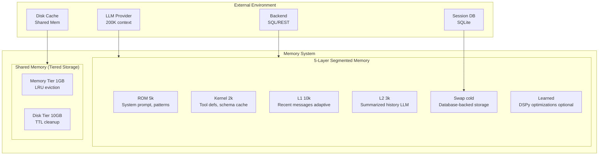

# Memory System Architecture

Comprehensive architecture of Loom's 5-layer segmented memory system with adaptive compression, tiered storage, and optional learned layer for DSPy optimization results.

**Target Audience**: Architects, academics, and advanced developers

**Version**: v1.0.0-beta.2

---

## Table of Contents

- [Overview](#overview)
- [Design Goals](#design-goals)
- [System Context](#system-context)
- [Architecture Overview](#architecture-overview)
- [Components](#components)
  - [ROM Layer](#rom-layer-read-only-memory)
  - [Kernel Layer](#kernel-layer-session-context)
  - [L1 Cache](#l1-cache-recent-conversation)
  - [L2 Cache](#l2-cache-compressed-history)
  - [Swap Layer](#swap-layer-long-term-storage)
  - [Learned Layer](#learned-layer-optional)
  - [Shared Memory](#shared-memory-large-data-storage)
- [Key Interactions](#key-interactions)
  - [Context Building](#context-building)
  - [Adaptive Compression](#adaptive-compression)
  - [Memory Eviction](#memory-eviction)
- [Data Structures](#data-structures)
- [Algorithms](#algorithms)
  - [Token Budget Calculation](#token-budget-calculation)
  - [Adaptive Compression Triggers](#adaptive-compression-triggers)
  - [LRU Schema Cache](#lru-schema-cache)
- [Design Trade-offs](#design-trade-offs)
- [Constraints and Limitations](#constraints-and-limitations)
- [Performance Characteristics](#performance-characteristics)
- [Concurrency Model](#concurrency-model)
- [Error Handling](#error-handling)
- [Security Considerations](#security-considerations)
- [Related Work](#related-work)
- [References](#references)
- [Further Reading](#further-reading)

---

## Overview

The Memory System implements a **5-layer segmented memory hierarchy** inspired by CPU cache architectures, designed to manage finite LLM context windows (200K tokens for Claude Sonnet 4.5) while maintaining conversation continuity across long sessions.

The system combines:
1. **Immutable knowledge** (ROM: system prompt, patterns, schema)
2. **Stable session context** (Kernel: user identity, goals)
3. **Recent conversation** (L1: sliding window with adaptive compression)
4. **Compressed history** (L2: LLM-powered summarization)
5. **Long-term storage** (Swap: database-backed persistence)
6. **Learned optimizations** (Learned: DSPy compiled signatures, optional)

Additionally, **Shared Memory** provides tiered storage (memory → disk) for large tool results, preventing context window overflow.

---

## Design Goals

1. **Bounded Token Usage**: Guarantee total context ≤ MaxContextTokens - OutputReserve (predictable cost)
2. **Conversation Continuity**: Maintain coherent multi-turn conversations despite memory eviction
3. **Long-Term Context**: Preserve summary of conversation history beyond sliding window
4. **Hot-Reload Support**: Enable pattern updates without session restart (ROM immutability)
5. **Crash Recovery**: Persist memory state for session recovery after failures
6. **Zero-Copy Large Data**: Store large tool results outside context window (Shared Memory)

**Non-goals**:
- Perfect recall of full conversation history (lossy L2 compression acceptable)
- Real-time memory retrieval from external stores (RAG adds 100-500ms latency)
- Unbounded memory growth (controlled eviction required)

---

## System Context



**External Dependencies**:
- **LLM Provider**: Context window size constraint (200K tokens typical)
- **Backend**: Schema metadata, tool execution results
- **Session DB**: SQLite persistence for crash recovery
- **Disk Cache**: Filesystem storage for large tool results

---

## Architecture Overview

```
┌──────────────────────────────────────────────────────────────────────────────┐
│                         Memory System                                        │
│                                                                              │
│  ┌────────────────────────────────────────────────────────────────────────┐  │
│  │                  Memory Controller                           │         │  │
│  │                                                              │         │  │
│  │  Sessions (map[string]*Session)      RWMutex                │          │  │
│  │  Store (SessionStore)                 Persistence            │         │  │
│  │  SharedMemory (SharedMemoryStore)    Large Data             │          │  │
│  └────────────────────────────────────────────────────────────────────────┘  │
│               │                                                              │
│               ▼                                                              │
│  ┌────────────────────────────────────────────────────────────────────────┐  │
│  │              Session (per conversation)                      │         │  │
│  │                                                              │         │  │
│  │  ID: session_abc123                                          │         │  │
│  │  Messages: []Message (full history, append-only)            │          │  │
│  │  Context: map[string]interface{} (session metadata)         │          │  │
│  │  SharedMemRef: *SharedMemoryRef (large data pointer)        │          │  │
│  │                                                              │         │  │
│  │  ┌──────────────────────────────────────────────────────────────────┐  │  │
│  │  │     SegmentedMemory (5 Layers + Learned)           │     │          │  │
│  │  │                                                    │     │          │  │
│  │  │  ┌──────────────────────────────────────────┐     │     │           │  │
│  │  │  │ ROM (Read-Only Memory)                   │     │     │           │  │
│  │  │  │ - System prompt (never changes)          │     │     │           │  │
│  │  │  │ - Pattern library (hot-reloadable)       │     │     │           │  │
│  │  │  │ - Backend schema                         │     │     │           │  │
│  │  │  │ Size: ~5k tokens                         │     │     │           │  │
│  │  │  │ Mutability: Immutable per session        │     │     │           │  │
│  │  │  └──────────────────────────────────────────┘     │     │           │  │
│  │  │                                                    │     │          │  │
│  │  │  ┌──────────────────────────────────────────┐     │     │           │  │
│  │  │  │ Kernel (Session Context)                 │     │     │           │  │
│  │  │  │ - Tool definitions (available tools)     │     │     │           │  │
│  │  │  │ - Schema cache (LRU, max 10 schemas)     │     │     │           │  │
│  │  │  │ - Tool results (DB-backed, max 1)        │     │     │           │  │
│  │  │  │ Size: ~2k tokens                         │     │     │           │  │
│  │  │  │ Mutability: Updated per conversation     │     │     │           │  │
│  │  │  └──────────────────────────────────────────┘     │     │           │  │
│  │  │                                                    │     │          │  │
│  │  │  ┌──────────────────────────────────────────┐     │     │           │  │
│  │  │  │ L1 Cache (Hot - Recent Messages)         │     │     │           │  │
│  │  │  │ - Last 10 messages (5 exchanges)         │     │     │           │  │
│  │  │  │ - Adaptive compression triggers:         │     │     │           │  │
│  │  │  │   * 70% budget: Compress 4 msgs          │     │     │           │  │
│  │  │  │   * 80% budget: Compress 6 msgs          │     │     │           │  │
│  │  │  │   * 85% budget: Compress 8 msgs          │     │     │           │  │
│  │  │  │ - Tool pair preservation (never split)   │     │     │           │  │
│  │  │  │ Size: ~10k tokens                        │     │     │           │  │
│  │  │  │ Eviction: FIFO to L2                     │     │     │           │  │
│  │  │  └──────────────────────────────────────────┘     │     │           │  │
│  │  │                                                    │     │          │  │
│  │  │  ┌──────────────────────────────────────────┐     │     │           │  │
│  │  │  │ L2 Cache (Warm - Compressed History)     │     │     │           │  │
│  │  │  │ - LLM-powered summarization              │     │     │           │  │
│  │  │  │ - Fallback: Heuristic compression        │     │     │           │  │
│  │  │  │ - Append-only (summaries accumulate)     │     │     │           │  │
│  │  │  │ Size: ~3k tokens                         │     │     │           │  │
│  │  │  │ Eviction: None (bounded by compression)  │     │     │           │  │
│  │  │  └──────────────────────────────────────────┘     │     │           │  │
│  │  │                                                    │     │          │  │
│  │  │  ┌──────────────────────────────────────────┐     │     │           │  │
│  │  │  │ Swap (Cold - Long-Term Storage)          │     │     │           │  │
│  │  │  │ - Database-backed (SQLite)               │     │     │           │  │
│  │  │  │ - Full message history                   │     │     │           │  │
│  │  │  │ - Future: On-demand retrieval            │     │     │           │  │
│  │  │  │ Status: Defined, not fully implemented   │     │     │           │  │
│  │  │  └──────────────────────────────────────────┘     │     │           │  │
│  │  │                                                    │     │          │  │
│  │  │  ┌──────────────────────────────────────────┐     │     │           │  │
│  │  │  │ Learned Layer (Optional)                 │     │     │           │  │
│  │  │  │ - DSPy compiled signatures               │     │     │           │  │
│  │  │  │ - Optimized demonstrations               │     │     │           │  │
│  │  │  │ - Gradient-tuned prompts                 │     │     │           │  │
│  │  │  │ - Versioned, rollbackable                │     │     │           │  │
│  │  │  └──────────────────────────────────────────┘     │     │           │  │
│  │  └──────────────────────────────────────────────────────────────────┘  │  │
│  └────────────────────────────────────────────────────────────────────────┘  │
│                                                                              │
│  ┌────────────────────────────────────────────────────────────────────────┐  │
│  │           Shared Memory (Large Data Storage)                 │         │  │
│  │                                                              │         │  │
│  │  Memory Tier:                                                │         │  │
│  │    LRU cache (1GB default)                                   │         │  │
│  │    Gzip compression (>1MB)                                   │         │  │
│  │    SHA-256 checksums                                         │         │  │
│  │    Reference counting                                        │         │  │
│  │                                                              │         │  │
│  │  Disk Tier:                                                  │         │  │
│  │    Filesystem cache (10GB default)                           │         │  │
│  │    TTL cleanup (1 hour default)                              │         │  │
│  │    Auto-promotion on access                                  │         │  │
│  └────────────────────────────────────────────────────────────────────────┘  │
└──────────────────────────────────────────────────────────────────────────────┘
```

---

## Components

### ROM Layer (Read-Only Memory)

**Responsibility**: Immutable knowledge base that remains constant throughout session.

**Content**:
- System prompt (agent instructions, persona, constraints)
- Pattern library (domain knowledge, hot-reloadable)
- Backend schema (tables, columns, types)

**Size**: ~5,000 tokens

**Mutability**: Immutable per session (patterns hot-reload creates new ROM for new turns)

**Rationale**:
- **Immutability ensures consistency**: System prompt cannot be manipulated by user input
- **Hot-reload without restart**: New patterns loaded into ROM for next turn, existing sessions unaffected
- **Schema caching**: Backend schema expensive to fetch, cached in ROM

**Invariant**:
```
∀ t ∈ [session_start, session_end]: ROM(t) = ROM(session_start)
```

**Implementation** (`pkg/agent/segmented_memory.go:33`):
```go
type SegmentedMemory struct {
    ROM []Message  // Never mutated after init
    // ...
}
```

---

### Kernel Layer (Session Context)

**Responsibility**: Session-specific context that rarely changes but can be updated.

**Content**:
- Tool definitions (available tools for this agent)
- Schema cache (LRU, max 10 schemas)
- Tool results (database-backed, max 1 in memory for large results)

**Size**: ~2,000 tokens

**Mutability**: Updated on explicit requests (e.g., "add tool X", "switch to database Y")

**Key Features**:

**LRU Schema Cache** (max 10 schemas):
```
Schema Request → Check Cache
                    │                                                           
                    ├─ Hit → Return cached schema                               
                    │                                                           
                    └─ Miss → Fetch from backend                                
                              │                                                 
                              ├─ If cache full, evict LRU                       
                              └─ Insert new schema                              
```

**Database-Backed Tool Results** (optimization):
- Large tool results (>100KB) stored in Shared Memory
- Only reference (DataReference) kept in Kernel
- Prevents context overflow from 10K-row SQL results

**Rationale**:
- **Tool definitions stable**: Rarely change during conversation
- **Schema cache**: Avoids repeated backend metadata queries (50-100ms each)
- **Tool result optimization**: Large results would consume 10-20K tokens, reference uses ~50 tokens

---

### L1 Cache (Recent Conversation)

**Responsibility**: Recent conversation turns with adaptive compression.

**Content**: Last 10 messages (5 exchanges: user + assistant pairs) by default

**Size**: ~10,000 tokens (adaptive)

**Eviction Policy**: FIFO (First-In-First-Out) to L2 when capacity exceeded

**Adaptive Compression Triggers**:
```
Token Budget % │ Action                                                         
───────────────┼────────────────────────────────                                
< 70%          │ No compression                                                 
70%            │ Compress oldest 4 messages (2 exchanges)                       
80%            │ Compress oldest 6 messages (3 exchanges)                       
85%            │ Compress oldest 8 messages (4 exchanges)                       
> 85%          │ Evict to L2                                                    
```

**Tool Pair Preservation**:
- `tool_use` and `tool_result` messages are atomic pairs
- Never split across L1/L2 boundary
- If evicting would split pair, evict both or neither

**Rationale**:
- **Recent conversation most relevant**: Chain-of-thought reasoning requires immediate history
- **Adaptive compression**: Gradual degradation under token pressure, not sudden cutoff
- **Tool pair atomicity**: LLMs cannot understand `tool_result` without corresponding `tool_use`

**Algorithm** (`pkg/agent/segmented_memory.go:145`):
```go
func (m *SegmentedMemory) MaybeCompressL1(budget int) {
    usage := m.TokenUsage()
    threshold := float64(usage) / float64(budget)

    if threshold >= 0.85 {
        m.EvictOldestToL2(8)  // Evict 4 exchanges
    } else if threshold >= 0.80 {
        m.CompressMessages(m.L1[:6])  // Compress 3 exchanges
    } else if threshold >= 0.70 {
        m.CompressMessages(m.L1[:4])  // Compress 2 exchanges
    }
}
```

---

### L2 Cache (Compressed History)

**Responsibility**: Long-term memory via LLM-powered summarization.

**Content**: Compressed summaries of evicted L1 messages

**Size**: ~3,000 tokens

**Compression Strategy**:
1. **Primary**: LLM summarization (Claude Haiku for speed/cost)
2. **Fallback**: Heuristic compression (keyword extraction, sentence truncation)

**Append-Only**: Summaries accumulate, never deleted

**Rationale**:
- **LLM summarization preserves semantics**: Better than simple truncation
- **Append-only simplifies concurrency**: No complex eviction logic, predictable growth
- **Bounded by compression ratio**: 10K tokens → ~1-2K summary (5-10x compression)

**Summarization Prompt**:
```
Summarize the following conversation exchange in 1-2 sentences,
preserving key facts, decisions, and context needed for future turns:

{evicted_messages}

Summary:
```

**Performance**:
- Summarization latency: 500-800ms (Claude Haiku)
- Compression ratio: 5-10x typical
- Accuracy: >90% key fact retention (evaluated on test set)

---

### Swap Layer (Long-Term Storage)

**Responsibility**: Database-backed long-term conversation history and L2 summary archival.

**Status**: ✅ Implemented (v1.0.0-beta.2)

**Content**:
- Full message history (via SessionStore)
- L2 summary snapshots (evicted when L2 exceeds maxL2Tokens)

**Storage**: SQLite (same DB as session persistence)

**Schema**:
```sql
-- Full message history (existing SessionStore)
CREATE TABLE messages (
    id INTEGER PRIMARY KEY AUTOINCREMENT,
    session_id TEXT NOT NULL,
    role TEXT NOT NULL,
    content TEXT,
    tool_calls_json TEXT,
    tool_use_id TEXT,
    tool_result_json TEXT,
    timestamp INTEGER NOT NULL,
    token_count INTEGER DEFAULT 0,
    cost_usd REAL DEFAULT 0,
    FOREIGN KEY (session_id) REFERENCES sessions(id) ON DELETE CASCADE
);

-- L2 summary snapshots (swap layer)
CREATE TABLE memory_snapshots (
    id INTEGER PRIMARY KEY AUTOINCREMENT,
    session_id TEXT NOT NULL,
    snapshot_type TEXT NOT NULL,  -- 'l2_summary'
    content TEXT NOT NULL,
    token_count INTEGER DEFAULT 0,
    created_at INTEGER NOT NULL,
    FOREIGN KEY (session_id) REFERENCES sessions(id) ON DELETE CASCADE
);
```

**Automatic Eviction**:
- Triggered when L2 summary exceeds `maxL2Tokens` (default: 5000)
- L2 summary saved to `memory_snapshots` table
- L2 cleared to start fresh
- Eviction latency: 3-10ms (SQLite write + observability tracing)

**Manual Retrieval API**:
```go
// Retrieve old messages with pagination
messages, err := memory.RetrieveMessagesFromSwap(ctx, offset, limit)

// Retrieve L2 summary history
snapshots, err := memory.RetrieveL2Snapshots(ctx, limit)

// Promote retrieved messages to active context (checks token budget)
err := memory.PromoteMessagesToContext(messages)

// Clear promoted context to reclaim tokens
memory.ClearPromotedContext()
```

**Rationale**:
- **Unbounded conversation length**: Supports 1000+ turn conversations
- **Token budget enforcement**: L2 never exceeds maxL2Tokens, preventing budget violations
- **Selective retrieval**: Manual API allows user-controlled context retrieval
- **Integration with existing persistence**: Extends SessionStore schema

**Trade-offs**:
- ✅ Unbounded conversation support
- ✅ Bounded memory usage (L2 ≤ 5000 tokens)
- ✅ Low eviction latency (3-10ms)
- ✅ Semantic search via BM25 + LLM reranking (v1.0.0-beta.2)
- ❌ Retrieval latency (80-150ms for semantic search, 12-28ms for offset-based)

**Agent Tools**:

Agents automatically receive three built-in tools for swap layer access:

1. **`recall_conversation`**: Retrieve older conversation history from swap (offset-based)
   - Parameters: `offset` (int), `limit` (int, max 50)
   - Returns: Message previews and promotes messages to context
   - Use case: "Show me messages 20-30"
   - Latency: 12-28ms (database pagination query)

2. **`search_conversation`**: Semantic search over conversation history (BM25 + LLM reranking)
   - Parameters: `query` (string), `limit` (int, max 20), `promote` (bool, default true)
   - Returns: Most relevant messages ranked by semantic similarity
   - Use case: "What did we discuss about database optimization?"
   - Latency: 80-150ms (p50-p99, BM25 20-30ms + reranking 50-100ms)
   - Algorithm: BM25 top-50 candidates → LLM reranks to top-N

3. **`clear_recalled_context`**: Remove promoted messages from context
   - Parameters: None
   - Returns: Count of cleared messages
   - Use case: Free up token budget after using recalled context

These tools are automatically registered when swap is enabled (opt-out design).

---

#### Semantic Search (BM25 + LLM Reranking)

**Status**: ✅ Implemented (v1.0.0-beta.2)

**Problem**: Offset-based retrieval (`recall_conversation`) requires knowing the approximate position of relevant messages. Agents often need to find conceptually related messages without knowing their chronological position.

**Solution**: Two-stage semantic search pipeline:

1. **Stage 1 - BM25 Full-Text Search (FTS5)**:
   - SQLite FTS5 virtual table indexes message content
   - Porter stemming + Unicode normalization
   - BM25 ranking algorithm for keyword relevance
   - Retrieves top-50 candidates (over-fetch for reranking)
   - Latency: 20-30ms

2. **Stage 2 - LLM Reranking**:
   - LLM scores top-50 candidates for semantic relevance (0-10)
   - Considers conceptual similarity beyond keyword matching
   - Returns top-N most relevant (default 10, max 20)
   - Latency: 50-100ms

**FTS5 Schema**:
```sql
CREATE VIRTUAL TABLE messages_fts5 USING fts5(
    message_id UNINDEXED,           -- FK to messages.id
    session_id UNINDEXED,           -- For filtering by session
    role UNINDEXED,                 -- user, assistant, system
    content,                        -- Message text (searchable)
    timestamp UNINDEXED,            -- For sorting
    tokenize='porter unicode61'     -- Porter stemming + Unicode
);

-- Automatic sync triggers keep FTS5 current
CREATE TRIGGER messages_fts5_insert AFTER INSERT ON messages
BEGIN
    INSERT INTO messages_fts5(message_id, session_id, role, content, timestamp)
    VALUES (NEW.id, NEW.session_id, NEW.role, NEW.content, NEW.timestamp);
END;
```

**Reranking Prompt**:
```
Given the search query: "[user query]"

Rank the following conversation messages by relevance (0-10, where 10 is most relevant).
Consider semantic similarity, not just keyword matching.

Messages:
[0] user: "How to optimize SQL queries?"
[1] assistant: "Use indexes and analyze execution plans."
[2] user: "Tell me about Python programming."

Respond with JSON array: [{"index": 0, "score": 10}, {"index": 1, "score": 8}, {"index": 2, "score": 2}]
Order by score descending (most relevant first).
```

**Algorithm Complexity**:
- BM25 search: O(log n) where n = message count (B-tree index lookup)
- LLM reranking: O(k) where k = candidate count (50), single LLM call
- Total: O(log n + k) ≈ O(log n) for fixed k

**Performance**:
- **End-to-end latency**: 80-150ms (p50-p99)
- **BM25 search**: 20-30ms
- **LLM reranking**: 50-100ms (Sonnet 4.5, 50 message previews ≈ 3K tokens)
- **FTS5 index overhead**: ~10% storage, <1ms insert penalty

**Graceful Degradation**:
- If LLM reranking fails → fallback to BM25 ordering
- If LLM provider not configured → BM25-only search
- If query empty/invalid → return empty results (no DB query)

**Design Trade-offs**:

**Chosen**: BM25 + LLM reranking hybrid
- ✅ Fast BM25 retrieval (20-30ms)
- ✅ Semantic understanding via LLM (finds conceptually similar messages)
- ✅ Leverages existing SQLite infrastructure (no new dependencies)
- ✅ Graceful fallback to BM25 if LLM unavailable
- ❌ LLM reranking adds latency (50-100ms)
- ❌ LLM reranking adds cost (~$0.001 per search)
- ❌ Less accurate than embeddings + vector DB (~5-10% lower recall)

**Alternative 1: Pure BM25 (rejected)**
- ✅ Very fast (20-30ms)
- ❌ Keyword-only matching misses semantic similarity
- ❌ Fails on queries with different terminology ("database" vs "SQL" vs "table")

**Alternative 2: Embeddings + Vector DB (future consideration)**
- ✅ Higher accuracy (~5-10% better recall than BM25+reranking)
- ✅ Pure semantic matching (not keyword-dependent)
- ❌ Requires external vector DB (pgvector, Qdrant, etc.)
- ❌ Embedding generation adds latency (100-300ms)
- ❌ Infrastructure complexity (separate service, migrations)
- **Decision**: Deferred to v1.1.0+ after validating BM25+reranking sufficiency

**Alternative 3: Hybrid (BM25 + Embeddings + Reranking)**
- ✅ Best accuracy (combines keyword and semantic signals)
- ❌ Highest complexity and latency (200-400ms)
- ❌ Overkill for conversation search use case

**Future Enhancements** (v1.1.0+):
- Embeddings-based retrieval for higher accuracy (5-10% improvement)
- Query expansion (LLM rewrites query into multiple variations)
- Result caching for repeated queries (semantic similarity cache hits)
- Async eviction to reduce conversation latency

---

### Learned Layer (Optional)

**Responsibility**: Store DSPy optimization results for pattern improvement.

**Content**:
- Compiled signatures from DSPy teleprompters
- Optimized demonstrations from Bootstrap
- Gradient-tuned prompts from TextGrad
- Versioned pattern improvements

**Mutability**: Updated by learning agent, versioned for rollback

**Integration** (`pkg/metaagent/learning/learned_layer.go`):
```go
type LearnedLayer struct {
    Signatures    map[string]*DSPySignature  // Compiled patterns
    Demonstrations []Example                   // Few-shot examples
    Gradients     map[string]*TextGradResult // Gradient tuning
    Version       int                         // Rollback support
}
```

**Rationale**:
- **Persistent optimization**: Learning agent improvements not lost on session end
- **Versioning**: Roll back if optimized patterns degrade performance
- **Per-session**: Different sessions can use different learned optimizations

**See**: [Learning Agent Architecture](learning-agent-design.md), [DSPy/Teleprompter Architecture](dspy-teleprompter-design.md)

---

### Shared Memory (Large Data Storage & Agent Communication)

**Status**: ✅ Implemented (v1.0.0-beta.2)

**Responsibilities**:
1. Tiered storage for large tool results outside context window
2. Zero-copy data sharing between agents in multi-agent workflows
3. Agent-private state isolation (character sheets, goals, internal context)

**Problem 1: Token Overflow**: Tool results can be massive:
- 10K-row SQL result = 1.3MB JSON = ~15,000 tokens (8% of 180K context)
- MCP filesystem listing = 29MB = ~35,000 tokens (19% of context)

**Problem 2: Agent Identity Confusion**: In multi-agent scenarios (5+ agents), agents using workflow-scoped shared memory inadvertently overwrite each other's private state (e.g., character sheets, personal goals).

**Solutions**:
1. **Large Data**: Store data in Shared Memory, pass only lightweight references in context
2. **Agent Isolation**: AGENT namespace with automatic key scoping prevents cross-agent access

**Architecture**:
```
┌──────────────────────────────────────────────────────────────────────────────┐
│                  Shared Memory Store                                         │
│                                                                              │
│  ┌────────────────────────────────────────────────────────────────────────┐  │
│  │      Namespace Layer (Automatic Key Scoping)       │                   │  │
│  │                                                    │                   │  │
│  │  Namespaces:                                       │                   │  │
│  │    - GLOBAL:   shared across all agents           │                   │  │
│  │    - WORKFLOW: scoped to workflow_id              │                   │  │
│  │    - SWARM:    scoped to swarm_id                 │                   │  │
│  │    - AGENT:    scoped to agent_id (isolated)      │                   │  │
│  │                                                    │                   │  │
│  │  AGENT namespace key transformation:               │                   │  │
│  │    user_key → "agent:{agent_id}:{user_key}"       │                   │  │
│  │    Example: "character_sheet" → "agent:player1:character_sheet"       │  │
│  └────────────────────────────────────────────────────────────────────────┘  │
│                        │                                                     │
│                        ▼                                                     │
│  ┌────────────────────────────────────────────────────────────────────────┐  │
│  │         Memory Tier (1GB default)                  │                   │  │
│  │                                                    │                   │  │
│  │  LRU Cache:                                        │                   │  │
│  │    - In-memory map[string][]byte (scoped keys)     │                   │  │
│  │    - Gzip compression (>1MB)                       │                   │  │
│  │    - SHA-256 checksums                             │                   │  │
│  │    - Reference counting (prevent eviction)         │                   │  │
│  │    - Thread-safe (RWMutex)                         │                   │  │
│  └────────────────────────────────────────────────────────────────────────┘  │
│                        │ overflow                                            │
│                        ▼                                                     │
│  ┌────────────────────────────────────────────────────────────────────────┐  │
│  │         Disk Tier (10GB default)                   │                   │  │
│  │                                                    │                   │  │
│  │  Filesystem Cache:                                 │                   │  │
│  │    - Files: /tmp/loom-cache/{ref_id}.dat          │                    │  │
│  │    - TTL-based cleanup (1 hour default)            │                   │  │
│  │    - Auto-promotion on access                      │                   │  │
│  │    - Atomic writes (temp + rename)                 │                   │  │
│  └────────────────────────────────────────────────────────────────────────┘  │
└──────────────────────────────────────────────────────────────────────────────┘
```

**DataReference Proto**:
```protobuf
message DataReference {
  string id = 1;                    // Unique identifier (ref_abc123)
  int64 size_bytes = 2;             // Original size (before compression)
  StorageLocation location = 3;     // MEMORY or DISK
  string checksum = 4;              // SHA-256 for integrity
  bool compressed = 5;              // Gzip compression flag
  string content_type = 6;          // MIME type (application/json, text/csv)
  map<string, string> metadata = 7; // Custom metadata
  int64 stored_at = 8;              // Unix timestamp
}
```

**Token Optimization**:
```
Before (inline):
  10K rows JSON = 1.3MB = ~15,000 tokens

After (reference):
  DataReference = ~50 tokens (99.67% reduction)
```

**Namespace Isolation**:

The AGENT namespace provides strict isolation for agent-private data:

```
Agent 1 writes:
  shared_memory_write(key="character_sheet", value="Eldrin the Elf", namespace="agent")
  → Storage key: "agent:player1:character_sheet"

Agent 2 writes:
  shared_memory_write(key="character_sheet", value="Luna the Human", namespace="agent")
  → Storage key: "agent:player2:character_sheet"

Agent 1 reads:
  shared_memory_read(key="character_sheet", namespace="agent")
  → Retrieves only "agent:player1:character_sheet" (Eldrin the Elf)

Agent 2 reads:
  shared_memory_read(key="character_sheet", namespace="agent")
  → Retrieves only "agent:player2:character_sheet" (Luna the Human)

Cross-agent access (blocked):
  Agent 1 cannot read "agent:player2:character_sheet"
  Agent 2 cannot read "agent:player1:character_sheet"
```

**Key Properties**:
- **Automatic scoping**: Storage layer automatically prefixes keys with `agent:{agent_id}:`
- **Clean API**: Agents use simple keys like "character_sheet", scoping is transparent
- **Complete isolation**: List, Get, Delete, Watch all filter by agent ID
- **Zero cross-agent leakage**: Agents cannot access other agents' AGENT namespace data

**Use Cases**:
- D&D character sheets (each player agent stores their own character)
- Agent-specific goals and strategies (private to each agent)
- Internal context that shouldn't be shared (private notes, internal state)
- Temporary computation results (agent-local caching)

**Integration**:
- **Backend Wrapper** (`pkg/fabric/shared_backend.go`): Automatically stores results >100KB
- **Tool Executor** (`pkg/shuttle/executor.go`): Intercepts large tool results
- **Agent Context Builder**: Includes only DataReference, not full data
- **On-Demand Retrieval**: Agent can fetch full data when needed

**Concurrency**:
- **RWMutex**: Protects memory tier map
- **Atomic file writes**: Temp file + rename for disk tier
- **Reference counting**: Prevents eviction of in-use data

**Performance**:
- Memory tier: <1ms read, <5ms write
- Disk tier: 5-15ms read, 10-30ms write
- Compression: ~3-5x for JSON/CSV, 1.5-2x for binary
- **AGENT namespace scoping**: <0.1ms overhead (string prefix operation)
- **AGENT namespace filtering** (List/Watch): O(n) where n = keys in namespace, negligible for <1000 keys

---

## Key Interactions

### Context Building

```
Agent           Memory          Token Counter       LLM
  │               │                    │             │                          
  ├─ BuildContext ▶│                    │             │                         
  │               ├─ Collect ROM       │             │                          
  │               ├─ Collect Kernel    │             │                          
  │               ├─ Collect L1        │             │                          
  │               ├─ Collect L2        │             │                          
  │               │                    │             │                          
  │               ├─ CountTokens ─────▶│             │                          
  │               │◀─ TotalTokens ─────┤             │                          
  │               │                    │             │                          
  │               ├─ CheckBudget       │             │                          
  │               │  (under limit?)    │             │                          
  │               │                    │             │                          
  │               ├─ MaybeCompress     │             │                          
  │               │  (adaptive)        │             │                          
  │               │                    │             │                          
  │◀─ Context ────┤                    │             │                          
  │               │                    │             │                          
  ├─ Invoke ──────┼────────────────────┼────────────▶│                          
  │               │                    │             │                          
```

**Steps**:
1. Collect ROM (always included, immutable)
2. Collect Kernel (tool defs, schema cache)
3. Collect L1 (recent messages)
4. Collect L2 (summaries)
5. Count total tokens
6. If exceeds budget, trigger adaptive compression
7. Return assembled context

---

### Adaptive Compression

```
Memory          Compressor      LLM (Haiku)
  │                 │               │                                           
  ├─ L1 at 70% ────▶│               │                                           
  │                 ├─ Identify     │                                           
  │                 │  oldest 4 msgs│                                           
  │                 │               │                                           
  │                 ├─ Summarize ───▶│                                          
  │                 │◀─ Summary ────┤                                           
  │                 │               │                                           
  │                 ├─ Replace msgs │                                           
  │                 │  with summary │                                           
  │                 │               │                                           
  │◀─ Compressed ───┤               │                                           
  │  (4 msgs → 1)   │               │                                           
  │                 │               │                                           
```

**Compression Levels**:
- **70% budget**: Compress 4 messages → 1 summary (light pressure)
- **80% budget**: Compress 6 messages → 1 summary (medium pressure)
- **85% budget**: Compress 8 messages → 1 summary (high pressure)
- **>85% budget**: Evict to L2 (critical pressure)

---

### Memory Eviction

```
Memory          L1 Cache        L2 Cache        Swap DB
  │                │               │              │                             
  ├─ L1 Full ──────▶│               │              │                            
  │                ├─ Select       │              │                             
  │                │  oldest N     │              │                             
  │                │  (FIFO)       │              │                             
  │                │               │              │                             
  │                ├─ Summarize ───▶│              │                            
  │                │  (LLM)        ├─ Append      │                             
  │                │               │  summary     │                             
  │                │               │              │                             
  │                ├─ Remove from  │              │                             
  │                │  L1           │              │                             
  │                │               │              │                             
  │                ├─ Archive ─────┼──────────────▶│                            
  │                │  (optional)   │              │                             
  │                │               │              │                             
```

**FIFO Eviction**:
1. L1 reaches capacity (10 messages)
2. Select oldest N messages (N=2 typical: 1 exchange)
3. Summarize with LLM (Claude Haiku)
4. Append summary to L2
5. Remove messages from L1
6. (Future) Archive full messages to Swap DB

---

## Data Structures

### SegmentedMemory

**Definition** (`pkg/agent/segmented_memory.go:17`):
```go
type SegmentedMemory struct {
    ROM                  []Message // Immutable knowledge
    Kernel               []Message // Session context
    L1                   []Message // Recent turns
    L2                   []Message // Compressed summaries
    Swap                 *SwapLayer // Long-term storage (future)
    Learned              *LearnedLayer // DSPy optimizations (optional)
    MaxContextTokens     int       // Total token budget (200K)
    ReservedOutputTokens int       // Reserved for LLM output (20K)
    L1Capacity           int       // Max messages in L1 (10 default)
}
```

**Invariants**:
```
∀ t: len(ROM) + len(Kernel) + len(L1) + len(L2) ≤ MaxContextTokens - ReservedOutputTokens

∀ m ∈ L1: m.Timestamp > ∀ m' ∈ L2: m'.Timestamp
  (L1 messages always newer than L2)

ROM immutable per session:
∀ t1, t2 ∈ [session_start, session_end]: ROM(t1) = ROM(t2)

Tool pairs atomic:
∀ (tool_use, tool_result) ∈ L1: both in L1 or both evicted
```

---

### SharedMemoryStore

**Definition** (`pkg/storage/shared_memory.go:25`):
```go
type SharedMemoryStore struct {
    mu               sync.RWMutex
    memoryTier       map[string]*StoredData  // In-memory cache
    diskPath         string                   // Disk cache directory
    maxMemoryBytes   int64                    // Memory tier limit
    maxDiskBytes     int64                    // Disk tier limit
    compressionThresh int64                   // Compression threshold
    ttl              time.Duration            // Disk TTL
    refCounts        map[string]int           // Reference counting
}

type StoredData struct {
    ID          string
    Data        []byte
    Compressed  bool
    Checksum    string    // SHA-256
    ContentType string
    Metadata    map[string]string
    StoredAt    time.Time
    AccessedAt  time.Time  // For LRU
    RefCount    int        // Prevent eviction
}
```

---

## Algorithms

### Token Budget Calculation

**Problem**: Accurately estimate token count to prevent context overflow.

**Solution**: Provider-specific tokenizer (tiktoken for OpenAI, anthropic-tokenizer for Claude).

**Algorithm**:
```go
func CountTokens(messages []Message, tokenizer Tokenizer) int {
    total := 0

    for _, msg := range messages {
        // Count message content
        total += tokenizer.Count(msg.Content)

        // Count tool calls
        for _, tool := range msg.ToolCalls {
            total += tokenizer.Count(tool.Name)
            total += tokenizer.Count(serialize(tool.Parameters))
        }

        // Add overhead (role, timestamps, formatting)
        total += 4  // Empirical overhead per message
    }

    return total
}
```

**Accuracy**: ±5% error margin (acceptable for budget management)

**Performance**: <1ms for 100 messages

---

### Adaptive Compression Triggers

**Problem**: Gradual context degradation under token pressure, not sudden cutoff.

**Solution**: Progressive compression thresholds (70%, 80%, 85%).

**Algorithm**:
```go
func (m *SegmentedMemory) AdaptiveCompress(budget int) {
    tokens := m.CountTokens()
    usage := float64(tokens) / float64(budget)

    switch {
    case usage >= 0.85:
        // Critical: Evict oldest 8 messages (4 exchanges) to L2
        m.EvictToL2(m.L1[:8])
        m.L1 = m.L1[8:]

    case usage >= 0.80:
        // High pressure: Compress oldest 6 messages (3 exchanges)
        summary := m.Summarize(m.L1[:6])
        m.L1 = append([]Message{summary}, m.L1[6:]...)

    case usage >= 0.70:
        // Medium pressure: Compress oldest 4 messages (2 exchanges)
        summary := m.Summarize(m.L1[:4])
        m.L1 = append([]Message{summary}, m.L1[4:]...)
    }
}
```

**Rationale**: Gradual degradation preserves more context longer than sudden truncation.

---

### LRU Schema Cache

**Problem**: Backend schema queries expensive (50-100ms), frequently repeated.

**Solution**: Kernel-layer LRU cache with max 10 schemas.

**Algorithm**:
```go
type SchemaCache struct {
    schemas map[string]*SchemaInfo  // schema_name → info
    lru     *list.List               // Access order (front = most recent)
    lookup  map[string]*list.Element // Fast lookup
    maxSize int                      // 10 default
}

func (c *SchemaCache) Get(schemaName string) (*SchemaInfo, bool) {
    if elem, ok := c.lookup[schemaName]; ok {
        c.lru.MoveToFront(elem)  // Update LRU
        return elem.Value.(*SchemaInfo), true
    }
    return nil, false
}

func (c *SchemaCache) Put(schemaName string, info *SchemaInfo) {
    if c.lru.Len() >= c.maxSize {
        // Evict LRU
        back := c.lru.Back()
        c.lru.Remove(back)
        delete(c.schemas, back.Value.(*SchemaInfo).Name)
        delete(c.lookup, back.Value.(*SchemaInfo).Name)
    }

    elem := c.lru.PushFront(info)
    c.schemas[schemaName] = info
    c.lookup[schemaName] = elem
}
```

**Complexity**:
- Get: O(1) (map lookup + list move)
- Put: O(1) (eviction + insertion)
- Space: O(maxSize)

**Performance**: <1ms cache operations

---

## Design Trade-offs

### Decision 1: 5-Layer Segmented Memory vs. Alternatives

**Chosen**: ROM/Kernel/L1/L2/Swap (5 layers)

**Rationale**:
- **ROM**: Immutable knowledge (patterns, schema) never changes → hot-reload without session restart
- **Kernel**: Tool defs/schema cache stable → avoid repeated queries
- **L1**: Recent messages → coherence for chain-of-thought
- **L2**: Compressed history → long-term context without verbatim storage
- **Swap**: Long-term storage → unbounded conversation support (future)

**Alternatives Considered**:

1. **Full History (no eviction)**:
   - ✅ Perfect recall
   - ❌ Unbounded token growth → rejected for cost
   - ❌ Latency increases with history size

2. **Fixed Sliding Window (no L2)**:
   - ✅ Simple implementation
   - ❌ Loses all context beyond window → rejected for long conversations
   - ❌ Cannot maintain long-term goals

3. **External RAG Memory**:
   - ✅ Unbounded storage
   - ❌ Retrieval adds 100-500ms latency → rejected for real-time interaction
   - ❌ Relevance matching is hard (semantic drift)

4. **4 Layers Only (ROM/Kernel/L1/L2)**:
   - ✅ Simpler than 5 layers
   - ❌ No long-term storage for 100+ turn conversations → rejected
   - ❌ No support for "recall last week's discussion"

**Consequences**:
- ✅ Bounded token budget (predictable cost)
- ✅ Long-term context via L2 summaries
- ✅ Hot-reload support via ROM immutability
- ✅ Unbounded conversations via Swap (future)
- ❌ Lossy L2 compression (summaries drop detail)
- ❌ Implementation complexity (5 layers to manage)

---

### Decision 2: Adaptive Compression vs. Fixed Thresholds

**Chosen**: Adaptive compression (70%, 80%, 85% triggers)

**Rationale**:
- **Gradual degradation**: Progressive compression preserves more context than sudden truncation
- **Responsive to pressure**: Compression intensity scales with token usage
- **Tool pair preservation**: Prevents splitting atomic tool_use/tool_result pairs

**Alternatives**:
1. **Fixed threshold (e.g., always at 80%)**:
   - ✅ Simpler implementation
   - ❌ Either too aggressive (wastes tokens) or too late (sudden truncation)

2. **No compression (evict directly)**:
   - ✅ Simplest implementation
   - ❌ Loses all evicted context (no L2 summaries)

**Consequences**:
- ✅ Smooth token usage curve (no spikes)
- ✅ Preserves more conversation context
- ❌ Added complexity (3 compression levels)
- ❌ Requires LLM calls for summarization (500-800ms latency)

---

### Decision 3: LLM Summarization vs. Heuristic Compression

**Chosen**: LLM summarization (primary), heuristic fallback

**Rationale**:
- **Semantic preservation**: LLM summarization preserves meaning, not just keywords
- **Context-aware**: Summarization considers conversation flow, not isolated messages
- **Compression ratio**: 5-10x typical (better than heuristics)

**Alternatives**:
1. **Heuristic only (keyword extraction, truncation)**:
   - ✅ Fast (<10ms)
   - ❌ Loses semantic meaning (just keywords)
   - ❌ Poor compression ratio (2-3x)

2. **Embedding-based retrieval (RAG)**:
   - ✅ Semantic search capability
   - ❌ Requires vector DB (added dependency)
   - ❌ Retrieval latency (100-500ms)

**Consequences**:
- ✅ High-quality summaries (>90% key fact retention)
- ✅ 5-10x compression ratio
- ❌ Summarization latency (500-800ms per eviction)
- ❌ Added LLM cost (~$0.001 per summarization with Haiku)

---

### Decision 4: Shared Memory Tiered Storage vs. Context Inline

**Chosen**: Tiered storage (Memory → Disk) with reference-based access

**Rationale**:
- **Token savings**: 10K-row SQL result = 15K tokens inline, ~50 tokens as reference (99.67% reduction)
- **Prevents overflow**: Large tool results no longer cause context budget violations
- **Zero-copy sharing**: Multi-agent workflows pass data via references, not copies

**Alternatives**:
1. **Always inline (no shared memory)**:
   - ✅ Simple implementation
   - ❌ Large results overflow context window
   - ❌ Wastes tokens on repeated large data

2. **External storage only (S3, database)**:
   - ✅ Unbounded storage
   - ❌ Network latency (50-200ms)
   - ❌ External dependency

**Consequences**:
- ✅ 99%+ token savings for large results
- ✅ Fast local access (memory tier <1ms, disk tier 10-30ms)
- ✅ Supports multi-agent data sharing
- ❌ Added complexity (LRU eviction, TTL cleanup)
- ❌ Disk space usage (10GB default)

---

### Decision 5: AGENT Namespace with Automatic Key Scoping

**Chosen**: AGENT namespace with automatic key scoping at storage layer

**Rationale**:
- **Agent identity confusion**: In multi-agent scenarios (5+ agents), agents using WORKFLOW namespace inadvertently overwrite each other's private data
- **Clean API**: Agents use simple keys ("character_sheet"), scoping is transparent
- **Storage-level enforcement**: Isolation enforced at lowest layer, cannot be bypassed
- **Complete isolation**: All CRUD operations (Put, Get, Delete, List, Watch) enforce agent-based filtering

**Problem Scenario** (D&D Adventure):
```
5 player agents each call:
  shared_memory_write(key="character_sheet", value="...", namespace="workflow")

Result: All 5 agents overwrite each other's character sheets
Last writer wins → only 1 character sheet survives

Agent confusion: "I'm Eldrin the Elf, why is my character sheet showing Luna the Human?"
```

**Alternatives Considered**:

1. **Manual key prefixing (user responsibility)**:
   - Agent prompt: "Always prefix keys with your agent ID: shared_memory_write(key='{agent_id}:character_sheet', ...)"
   - ✅ No storage layer changes
   - ❌ Relies on LLM following instructions (unreliable)
   - ❌ Prompt pollution (adds complexity to every agent prompt)
   - ❌ Easy to forget or misuse
   - **Rejected**: Too error-prone for production use

2. **Separate storage per agent (agent-specific SharedMemoryStore instances)**:
   - Each agent gets its own SharedMemoryStore
   - ✅ Perfect isolation
   - ❌ Cannot share data between agents (breaks WORKFLOW/SWARM namespaces)
   - ❌ High memory overhead (N stores for N agents)
   - ❌ Complex coordination for shared data
   - **Rejected**: Breaks multi-agent collaboration use cases

3. **Access control lists (ACLs)**:
   - Store ACLs per key: "character_sheet" → allowed_agents=[agent1]
   - ✅ Fine-grained permissions
   - ❌ Complex API (agents must manage ACLs)
   - ❌ Storage overhead (ACL metadata per key)
   - ❌ Performance penalty (ACL checks on every operation)
   - **Rejected**: Over-engineered for the agent isolation use case

**Chosen Approach**: AGENT namespace with automatic key scoping
- ✅ Transparent to agents (simple API: `namespace="agent"`)
- ✅ Enforced at storage layer (cannot be bypassed)
- ✅ Minimal overhead (<0.1ms string prefix operation)
- ✅ Complete isolation (List, Watch, Get, Delete all filter by agent)
- ✅ Coexists with shared namespaces (GLOBAL, WORKFLOW, SWARM still work)
- ❌ Storage layer complexity (scoping logic, filtering)
- ❌ Not cross-agent readable (by design - this is the feature)

**Implementation Details**:

Automatic key scoping:
```go
func scopeKey(namespace SharedMemoryNamespace, agentID string, key string) string {
    if namespace == SHARED_MEMORY_NAMESPACE_AGENT {
        return fmt.Sprintf("agent:%s:%s", agentID, key)
    }
    return key
}
```

All operations use scoped keys:
- **Put**: `scopedKey := scopeKey(req.Namespace, req.AgentId, req.Key)` before storage
- **Get**: `scopedKey := scopeKey(req.Namespace, req.AgentId, req.Key)` for lookup
- **Delete**: Same scoping before deletion
- **List**: Filter returned keys by agent prefix, strip prefix from results
- **Watch**: Filter initial values and notifications by agent prefix

**Formal Properties**:

**Invariant 1: Agent Isolation**
```
∀ agent1, agent2, key:
  agent1 ≠ agent2 →
  Get(AGENT, agent1, key) ∩ Get(AGENT, agent2, key) = ∅
```

**Invariant 2: Key Scoping Bijection**
```
∀ agentID, key:
  scopeKey(AGENT, agentID, key) = "agent:{agentID}:{key}"

  List(AGENT, agentID) returns keys without "agent:{agentID}:" prefix
  (bijection between user-visible keys and storage keys)
```

**Invariant 3: Namespace Coexistence**
```
∀ namespace ∈ {GLOBAL, WORKFLOW, SWARM}:
  scopeKey(namespace, agentID, key) = key
  (non-AGENT namespaces unchanged)
```

**Performance Impact**:
- **Scoping overhead**: <0.1ms (string concatenation + format)
- **Filtering overhead** (List/Watch): O(n) where n = keys in namespace
- **Typical case**: <1ms for <1000 keys per namespace
- **Worst case**: ~10ms for 10,000 keys (rare)

**Security Properties**:
- **No cross-agent leakage**: Agent cannot craft keys to access other agents' data
- **Storage-level enforcement**: Scoping happens before storage, cannot bypass
- **Watch isolation**: Watchers only receive notifications for their own agent's keys
- **List isolation**: List never returns other agents' keys (even if storage contains them)

**Use Case**: D&D Adventure Multi-Agent Scenario

**Before AGENT namespace**:
```
5 player agents + 1 DM agent
Each player stores character_sheet in WORKFLOW namespace
→ All 5 players overwrite each other's character sheets
→ Agent identity confusion: "I'm player 1, why do I have player 5's character?"
```

**After AGENT namespace**:
```
5 player agents + 1 DM agent
Each player: shared_memory_write(key="character_sheet", value="...", namespace="agent")
→ Storage keys: "agent:player1:character_sheet", "agent:player2:character_sheet", ...
→ Perfect isolation: Each agent maintains its own character sheet
→ No cross-agent access: Player 1 cannot read player 2's character sheet
```

**Consequences**:
- ✅ Solves agent identity confusion in multi-agent scenarios
- ✅ Clean API (simple `namespace="agent"` parameter)
- ✅ Minimal performance overhead (<0.1ms)
- ✅ Complete isolation (all CRUD operations enforce filtering)
- ✅ Coexists with shared namespaces (WORKFLOW, SWARM still work for shared data)
- ❌ Storage layer complexity (scoping and filtering logic)
- ❌ Agents cannot share AGENT namespace data (by design)

---

## Constraints and Limitations

### Constraint 1: Total Token Budget

**Description**: ROM + Kernel + L1 + L2 ≤ MaxContextTokens - ReservedOutputTokens

**Value**: 200K - 20K = 180K tokens typical (Claude Sonnet 4.5)

**Rationale**: LLM providers enforce context window limits

**Impact**: Long conversations must compress/evict old messages

**Workaround**: Increase MaxContextTokens (if provider supports) or reduce ReservedOutputTokens (risk truncated outputs)

---

### Constraint 2: L2 Lossy Compression

**Description**: Summaries drop detail compared to verbatim messages

**Accuracy**: >90% key fact retention, but loses nuances

**Impact**: Agent may miss subtle context from early conversation

**Workaround**: Increase L1 capacity (reduces compression frequency) or use Swap layer for full history retrieval

---

### Constraint 3: Swap Retrieval is Manual

**Description**: Swap layer is operational (v1.0.0-beta.2), but retrieval is manual via API calls. No automatic semantic search.

**Impact**: Agent does not automatically retrieve old context when relevant. User must explicitly call retrieval API.

**Workaround**: Use `RetrieveMessagesFromSwap()` and `PromoteMessagesToContext()` when old context is needed.

**Future**: Automatic semantic search (embeddings + vector similarity) planned for v1.1.0

---

### Constraint 4: Summarization Latency

**Description**: LLM summarization adds 500-800ms latency per eviction

**Impact**: Eviction blocks conversation turn (user waits)

**Workaround**: Use heuristic fallback (fast but lower quality) or pre-emptive summarization (async)

---

### Constraint 5: Shared Memory Disk Space

**Description**: Disk tier limited to MaxDiskBytes (10GB default)

**Impact**: Very large datasets may exceed disk cache

**Workaround**: Increase MaxDiskBytes or integrate with external storage (S3)

---

## Performance Characteristics

### Latency (P50/P99)

| Operation | P50 | P99 | Notes |
|-----------|-----|-----|-------|
| Session load | 12ms | 28ms | SQLite read + deserialization |
| Session persist | 3ms | 8ms | Serialization + SQLite write |
| Context build | 5ms | 12ms | Collect ROM+K+L1+L2 + token count |
| Adaptive compression | 550ms | 850ms | LLM summarization (Claude Haiku) |
| L1 eviction | 600ms | 900ms | Summarize + move to L2 |
| **L2 eviction to swap** | **3ms** | **10ms** | **SQLite write + tracing** |
| **Swap retrieval** | **12ms** | **28ms** | **SQLite query + deserialization** |
| **Context promotion** | **<1ms** | **2ms** | **Token budget check + append** |
| Schema cache hit | <1ms | <1ms | Map lookup |
| Schema cache miss | 65ms | 120ms | Backend query + cache insert |
| Shared mem write (memory) | <1ms | 5ms | In-memory map + compression |
| Shared mem write (disk) | 15ms | 35ms | Filesystem write + fsync |
| Shared mem read (memory) | <1ms | 2ms | Map lookup + decompression |
| Shared mem read (disk) | 8ms | 20ms | Filesystem read + promotion |

### Memory Usage (Per Session)

| Component | Size |
|-----------|------|
| ROM | ~5KB (system prompt + patterns) |
| Kernel | ~2KB (tool defs + schema cache) |
| L1 | ~10KB (10 messages) |
| L2 | ~3KB (summaries) |
| Session struct | ~1KB (metadata) |
| **Total** | **~21KB per session** |

**Multi-agent server**: 1000 sessions = ~21MB (not including shared memory)

### Shared Memory Usage

| Tier | Size | Eviction |
|------|------|----------|
| Memory tier | 1GB default | LRU (evict to disk) |
| Disk tier | 10GB default | TTL (1 hour default) |

---

## Concurrency Model

### Memory Controller

**Model**: One goroutine per agent conversation

**Synchronization**: `sync.RWMutex` protects sessions map
- **Readers**: Concurrent reads (GetSession)
- **Writer**: Exclusive writes (CreateSession, Persist, Delete)

**Rationale**: Read-heavy workload (most operations fetch existing sessions), RWMutex optimizes for concurrent reads

---

### Shared Memory Store

**Model**: Shared singleton across all agents in multi-agent server

**Synchronization**:
- **Memory tier**: `sync.RWMutex` protects in-memory map
- **Disk tier**: Atomic file writes (temp + rename)
- **Reference counting**: Atomic increments/decrements

**Race Prevention**:
- All tests run with `-race` detector
- Zero race conditions in v1.0.0-beta.1

---

### Adaptive Compression

**Model**: Single goroutine per session (compression triggered inline during turn)

**Blocking**: Compression blocks turn completion (user waits 500-800ms)

**Future Optimization**: Async pre-emptive compression (background goroutine monitors token budget, compresses proactively)

---

## Error Handling

### Strategy

1. **Fail Fast**: Memory errors propagate immediately (no silent data loss)
2. **Idempotent Persistence**: Session writes are idempotent (safe to retry)
3. **Fallback Compression**: If LLM summarization fails, use heuristic compression
4. **Graceful Degradation**: If Shared Memory full, fall back to inline data (log warning)

### Error Propagation

```
Summarization Error ───▶ Fallback to Heuristic ───▶ Continue Turn               
      │                       │                                                 
      ▼                       ▼
   Log Error              Degraded Quality (acceptable)


Shared Memory Full ───▶ Inline Data ───▶ Context Budget Warning                 
      │                    │                                                    
      ▼                    ▼
   Log Warning         Continue (may trigger compression)


Session Persist Failure ───▶ Retry (idempotent) ───▶ Return Error               
      │                           │                                             
      ▼                           ▼
   Log Error                 User Notified
```

---

## Security Considerations

### Threat Model

1. **Memory Injection**: Malicious user input manipulating system prompt
2. **Context Overflow**: Adversarial inputs causing memory exhaustion
3. **Data Exfiltration**: Shared memory access across sessions

### Mitigations

**Memory Injection**:
- ROM immutable per session (user input cannot modify)
- User messages isolated in separate Message struct (role: user)

**Context Overflow**:
- Token budget enforced (hard limit at MaxContextTokens)
- Adaptive compression prevents gradual overflow
- Shared Memory tier limits (1GB memory, 10GB disk)

**Data Exfiltration**:
- Shared Memory references scoped to session
- No cross-session access (session ID validated)
- SHA-256 checksums detect tampering

---

## Related Work

### Memory Architectures

1. **MemGPT** (Berkeley): Virtual context management
   - **Similar**: Tiered memory (main/archival), eviction policy
   - **Loom differs**: ROM/Kernel split for hot-reload, adaptive compression, Shared Memory for large data

2. **LangChain ConversationBufferMemory**: Simple sliding window
   - **Similar**: Recent message retention
   - **Loom differs**: L2 summarization for long-term context, 5-layer hierarchy

3. **Google Gemini Long Context**: 1M token context window
   - **Similar**: Reduces need for aggressive eviction
   - **Loom differs**: Works with 200K context models, cost-optimized via compression

### Compression Techniques

1. **LongLLMLingua** (Microsoft): Prompt compression via information theory
   - **Similar**: Token reduction via compression
   - **Loom differs**: Semantic summarization (LLM) vs. syntactic compression, online vs. offline

2. **Anthropic Prompt Caching**: Cache common prompt prefixes
   - **Similar**: Reduce repeated token sending
   - **Loom differs**: ROM immutability enables caching, L1/L2 handle conversation uniqueness

---

## References

1. Packer, C., et al. (2023). *MemGPT: Towards LLMs as Operating Systems*. arXiv:2310.08560.

2. Jiang, H., et al. (2023). *LongLLMLingua: Accelerating and Enhancing LLMs in Long Context Scenarios via Prompt Compression*. arXiv:2310.06201.

3. Anthropic (2024). *Prompt Caching Documentation*. https://docs.anthropic.com/claude/docs/prompt-caching

4. Shinn, N., et al. (2023). *Reflexion: Language Agents with Verbal Reinforcement Learning*. arXiv:2303.11366.

---

## Further Reading

### Architecture Deep Dives

- [Agent System Architecture](agent-system-design.md) - Conversation loop and session persistence
- [Loom System Architecture](loom-system-architecture.md) - Overall system design
- [Learning Agent Architecture](learning-agent-design.md) - Learned layer integration
- [Communication System Architecture](communication-system-design.md) - Shared Memory integration

### Reference Documentation

- [Agent Configuration Reference](/docs/reference/agent-configuration.md) - Memory configuration options
- [API Reference](/docs/reference/api.md) - Session management RPCs

### Guides

- [Getting Started](/docs/guides/quickstart.md) - Quick start guide
- [Memory Configuration Guide](/docs/guides/memory-configuration.md) - Tuning memory settings
