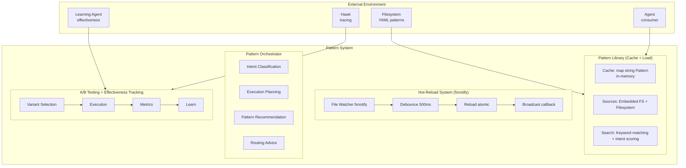

# Pattern System Architecture

Comprehensive architecture of Loom's pattern system - hot-reloadable domain knowledge library with semantic search, A/B testing, and pattern effectiveness tracking for continuous improvement.

**Target Audience**: Architects, academics, and advanced developers

**Version**: v1.0.0-beta.1

---

## Table of Contents

- [Overview](#overview)
- [Design Goals](#design-goals)
- [System Context](#system-context)
- [Architecture Overview](#architecture-overview)
- [Components](#components)
  - [Pattern Library](#pattern-library)
  - [Hot-Reload System](#hot-reload-system)
  - [Pattern Orchestrator](#pattern-orchestrator)
  - [Search and Matching](#search-and-matching)
  - [A/B Testing](#ab-testing)
  - [Pattern Effectiveness Tracker](#pattern-effectiveness-tracker)
- [Key Interactions](#key-interactions)
  - [Pattern Loading](#pattern-loading)
  - [Hot-Reload Flow](#hot-reload-flow)
  - [Pattern Matching](#pattern-matching)
- [Data Structures](#data-structures)
- [Algorithms](#algorithms)
  - [Pattern Search](#pattern-search)
  - [Debounce Algorithm](#debounce-algorithm)
  - [A/B Test Selection](#ab-test-selection)
- [Design Trade-offs](#design-trade-offs)
- [Constraints and Limitations](#constraints-and-limitations)
- [Performance Characteristics](#performance-characteristics)
- [Concurrency Model](#concurrency-model)
- [Error Handling](#error-handling)
- [Security Considerations](#security-considerations)
- [Related Work](#related-work)
- [References](#references)
- [Further Reading](#further-reading)

---

## Overview

The Pattern System encodes **domain knowledge as reusable YAML patterns** that guide agent behavior without hardcoded prompts. It combines:

1. **Pattern Library**: Cache-backed pattern storage with embedded + filesystem sources
2. **Hot-Reload**: Zero-downtime pattern updates via fsnotify (89-143ms latency)
3. **Semantic Search**: Keyword-based pattern matching with intent classification
4. **A/B Testing**: Compare pattern variants for continuous improvement
5. **Effectiveness Tracking**: SQLite-backed metrics for learning agent feedback

The system supports **70 patterns across 13 domains** (prompt engineering, SQL, Teradata, Postgres, text, code, debugging, vision, evaluation, REST API, data quality, ETL, ML).

---

## Design Goals

1. **Zero Downtime**: Pattern updates without server restart (hot-reload)
2. **Backend Agnostic**: Patterns for SQL, REST APIs, documents, MCP tools
3. **Continuous Improvement**: A/B testing + effectiveness tracking enable learning
4. **Fast Lookup**: <10ms pattern matching via in-memory cache
5. **Composable**: Patterns reference other patterns for modularity
6. **Observable**: Every pattern load, match, and update traced to Hawk

**Non-goals**:
- Real-time pattern generation (patterns are pre-authored YAML, not LLM-generated)
- Complex dependency resolution (patterns are independent, minimal cross-references)
- Version control integration (file system changes detected, but no git hooks)

---

## System Context



**External Dependencies**:
- **Filesystem**: YAML pattern files (hot-reloadable)
- **Embedded FS**: Compiled-in patterns (fallback, immutable)
- **Agent Runtime**: Pattern consumer (ROM layer)
- **Learning Agent**: Pattern effectiveness tracking (SQLite)
- **Hawk**: Observability tracing

---

## Architecture Overview

```
┌──────────────────────────────────────────────────────────────────────────────┐
│                         Pattern System                                       │
│                                                                              │
│  ┌────────────────────────────────────────────────────────────────────────┐  │
│  │                  Pattern Library                             │         │  │
│  │                                                              │         │  │
│  │  ┌──────────────────────────────────────────────────────────────────┐  │  │
│  │  │         Pattern Cache (RWMutex protected)          │     │          │  │
│  │  │                                                    │     │          │  │
│  │  │  patternCache: map[string]*Pattern                │     │           │  │
│  │  │    Key: pattern_name                              │     │           │  │
│  │  │    Value: Pattern struct                          │     │           │  │
│  │  │                                                    │     │          │  │
│  │  │  patternIndex: []PatternSummary                   │     │           │  │
│  │  │    Lightweight metadata for search                │     │           │  │
│  │  └──────────────────────────────────────────────────────────────────┘  │  │
│  │                                                              │         │  │
│  │  ┌──────────────────────────────────────────────────────────────────┐  │  │
│  │  │         Pattern Sources (dual-mode)                │     │          │  │
│  │  │                                                    │     │          │  │
│  │  │  1. Embedded FS (embed.FS)                         │     │          │  │
│  │  │     - Compiled into binary                         │     │          │  │
│  │  │     - Immutable, always available                  │     │          │  │
│  │  │     - Fallback if filesystem unavailable           │     │          │  │
│  │  │                                                    │     │          │  │
│  │  │  2. Filesystem (patternsDir)                       │     │          │  │
│  │  │     - Hot-reloadable YAML files                    │     │          │  │
│  │  │     - Checked first (overrides embedded)           │     │          │  │
│  │  │     - Supports local development                   │     │          │  │
│  │  └──────────────────────────────────────────────────────────────────┘  │  │
│  │                                                              │         │  │
│  │  Search Paths (13 domains):                                 │          │  │
│  │    analytics, ml, timeseries, text, data_quality,           │          │  │
│  │    rest_api, document, etl, prompt_engineering,             │          │  │
│  │    code, debugging, vision, evaluation                      │          │  │
│  └────────────────────────────────────────────────────────────────────────┘  │
│                                                                              │
│  ┌────────────────────────────────────────────────────────────────────────┐  │
│  │                  Hot-Reload System                           │         │  │
│  │                                                              │         │  │
│  │  ┌──────────────────────────────────────────────────────────────────┐  │  │
│  │  │         HotReloader (fsnotify wrapper)             │     │          │  │
│  │  │                                                    │     │          │  │
│  │  │  watcher: *fsnotify.Watcher                        │     │          │  │
│  │  │  debounceTimers: map[string]*time.Timer            │     │          │  │
│  │  │  config: HotReloadConfig                           │     │          │  │
│  │  │                                                    │     │          │  │
│  │  │  Debounce Logic:                                   │     │          │  │
│  │  │    - Default: 500ms                                │     │          │  │
│  │  │    - Handles rapid-fire edits                      │     │          │  │
│  │  │    - Per-file timer tracking                       │     │          │  │
│  │  └──────────────────────────────────────────────────────────────────┘  │  │
│  │                                                              │         │  │
│  │  Event Flow:                                                 │         │  │
│  │    fsnotify Event → Debounce → Validate → Reload → Callback │          │  │
│  └────────────────────────────────────────────────────────────────────────┘  │
│                                                                              │
│  ┌────────────────────────────────────────────────────────────────────────┐  │
│  │                  Pattern Orchestrator                        │         │  │
│  │                                                              │         │  │
│  │  ┌──────────────────────────────────────────────────────────────────┐  │  │
│  │  │         Intent Classification                      │     │          │  │
│  │  │                                                    │     │          │  │
│  │  │  IntentCategories:                                 │     │          │  │
│  │  │    - schema_discovery                              │     │          │  │
│  │  │    - data_quality                                  │     │          │  │
│  │  │    - data_transform                                │     │          │  │
│  │  │    - analytics                                     │     │          │  │
│  │  │    - relationship_query                            │     │          │  │
│  │  │    - query_generation                              │     │          │  │
│  │  │    - document_search                               │     │          │  │
│  │  │    - api_call                                      │     │          │  │
│  │  │    - unknown                                       │     │          │  │
│  │  │                                                    │     │          │  │
│  │  │  Classifier: Pluggable IntentClassifierFunc        │     │          │  │
│  │  │    Default: Keyword-based heuristics               │     │          │  │
│  │  │    Custom: Backend-specific (e.g., Teradata ML)   │     │           │  │
│  │  └──────────────────────────────────────────────────────────────────┘  │  │
│  │                                                              │         │  │
│  │  ┌──────────────────────────────────────────────────────────────────┐  │  │
│  │  │         Execution Planning                         │     │          │  │
│  │  │                                                    │     │          │  │
│  │  │  ExecutionPlan:                                    │     │          │  │
│  │  │    - Intent: IntentCategory                        │     │          │  │
│  │  │    - Steps: []PlannedStep                          │     │          │  │
│  │  │    - Reasoning: string                             │     │          │  │
│  │  │    - PatternName: string (recommendation)          │     │          │  │
│  │  │                                                    │     │          │  │
│  │  │  Planner: Pluggable ExecutionPlannerFunc           │     │          │  │
│  │  └──────────────────────────────────────────────────────────────────┘  │  │
│  └────────────────────────────────────────────────────────────────────────┘  │
│                                                                              │
│  ┌────────────────────────────────────────────────────────────────────────┐  │
│  │                  A/B Testing + Learning                      │         │  │
│  │                                                              │         │  │
│  │  ┌──────────────────────────────────────────────────────────────────┐  │  │
│  │  │         PatternABTestingLibrary                    │     │          │  │
│  │  │                                                    │     │          │  │
│  │  │  Variant Selection Strategies:                     │     │          │  │
│  │  │    - Round-robin (equal distribution)              │     │          │  │
│  │  │    - Weighted (importance-based)                   │     │          │  │
│  │  │    - UCB (Upper Confidence Bound)                  │     │          │  │
│  │  │    - Epsilon-greedy (explore/exploit)              │     │          │  │
│  │  └──────────────────────────────────────────────────────────────────┘  │  │
│  │                                                              │         │  │
│  │  ┌──────────────────────────────────────────────────────────────────┐  │  │
│  │  │         Pattern Effectiveness Tracker              │     │          │  │
│  │  │                                                    │     │          │  │
│  │  │  SQLite DB:                                        │     │          │  │
│  │  │    - pattern_id                                    │     │          │  │
│  │  │    - success/failure counts                        │     │          │  │
│  │  │    - judge_scores (multi-dimensional)              │     │          │  │
│  │  │    - token_usage, latency                          │     │          │  │
│  │  │                                                    │     │          │  │
│  │  │  Metrics → Learning Agent → Pattern Tuning         │     │          │  │
│  │  └──────────────────────────────────────────────────────────────────┘  │  │
│  └────────────────────────────────────────────────────────────────────────┘  │
└──────────────────────────────────────────────────────────────────────────────┘
```

---

## Components

### Pattern Library

**Responsibility**: Cache-backed pattern storage with dual-source loading (embedded + filesystem).

**Core Structure** (`pkg/patterns/library.go:18`):
```go
type Library struct {
    mu               sync.RWMutex
    patternCache     map[string]*Pattern      // In-memory cache
    patternIndex     []PatternSummary         // Lightweight metadata
    embeddedFS       *embed.FS                // Compiled-in patterns
    patternsDir      string                   // Filesystem patterns
    searchPaths      []string                 // Domain directories
    tracer           observability.Tracer     // Hawk tracing
}
```

**Load Priority**:
```
1. Check cache (in-memory map)
   ├─ Hit → Return cached (< 1ms)                                               
   └─ Miss → Continue                                                           

2. Try embedded FS (compiled-in patterns)
   ├─ Found → Cache + Return                                                    
   └─ Not found → Continue                                                      

3. Try filesystem (hot-reloadable patterns)
   ├─ Found → Cache + Return                                                    
   └─ Not found → Error                                                         
```

**Rationale**:
- **Embedded FS fallback**: Ensures patterns always available (no filesystem dependency)
- **Filesystem priority**: Allows local overrides and hot-reload during development
- **In-memory cache**: Avoids repeated file I/O (99%+ cache hit rate after warm-up)
- **RWMutex**: Optimizes for read-heavy workload (concurrent pattern lookups)

**Search Paths** (13 domains):
```
patterns/
├── analytics/          # Business intelligence, aggregations                   
├── ml/                 # Machine learning patterns (Teradata ML)               
├── timeseries/         # Time series analysis                                  
├── text/               # NLP patterns (sentiment, summarization)               
├── data_quality/       # Validation, profiling, duplicates                     
├── rest_api/           # REST API interaction patterns                         
├── document/           # Document processing                                   
├── etl/                # Extract, Transform, Load                              
├── prompt_engineering/ # Universal meta-patterns (CoT, few-shot)               
├── code/               # Code generation, testing                              
├── debugging/          # Root cause analysis                                   
├── vision/             # Multimodal patterns (chart interpretation)            
└── evaluation/         # Quality assurance patterns                            
```

**Pattern Struct** (`pkg/patterns/types.go:6`):
```go
type Pattern struct {
    // Metadata
    Name            string   // Unique identifier
    Title           string   // Human-readable title
    Description     string   // What this pattern does
    Category        string   // Domain (analytics, ml, etc.)
    Difficulty      string   // beginner, intermediate, advanced
    BackendType     string   // sql, rest, document, etc.
    UseCases        []string // Example use cases
    RelatedPatterns []string // Cross-references

    // Definition
    Parameters    []Parameter         // Template variables
    Templates     map[string]Template // Named templates (basic, advanced)
    Examples      []Example           // Worked examples
    CommonErrors  []CommonError       // Known failure modes
    BestPractices string              // Usage recommendations
    Syntax        *Syntax             // Backend-specific syntax docs
}
```

---

### Hot-Reload System

**Responsibility**: Detect filesystem changes and reload patterns without server restart.

**Core Architecture**:
```
Filesystem Change → fsnotify Event → Debounce → Validate → Reload → Broadcast
```

**HotReloader Struct** (`pkg/patterns/hotreload.go:29`):
```go
type HotReloader struct {
    library        *Library
    watcher        *fsnotify.Watcher          // File system watcher
    config         HotReloadConfig
    logger         *zap.Logger
    tracer         observability.Tracer
    debounceTimers map[string]*time.Timer     // Per-file timers
    debounceMu     sync.Mutex                 // Protects timer map
    stopCh         chan struct{}              // Shutdown signal
    doneCh         chan struct{}              // Completion signal
}
```

**Debounce Logic**:
```
File Edit 1 ───▶ Start Timer (500ms)                                            
File Edit 2 ───▶ Reset Timer (500ms)                                            
File Edit 3 ───▶ Reset Timer (500ms)                                            
...
(No edits for 500ms) ───▶ Timer Fires ───▶ Reload Pattern                       
```

**Rationale**:
- **Debounce prevents reload storms**: IDEs trigger multiple events per save (create, write, chmod)
- **Per-file timers**: Independent debounce for each pattern file
- **Configurable delay**: Default 500ms, tunable for different environments

**Reload Flow**:
```
1. Detect Change (fsnotify)
   ├─ CREATE: New pattern added                                                 
   ├─ WRITE:  Pattern modified                                                  
   └─ REMOVE: Pattern deleted                                                   

2. Debounce (500ms default)
   ├─ Cancel existing timer for this file                                       
   └─ Start new timer                                                           

3. Validate (YAML parse + schema check)
   ├─ Valid → Continue                                                          
   └─ Invalid → Log error, call callback, skip reload                           

4. Reload (atomic cache update)
   ├─ Parse YAML                                                                
   ├─ Load into Pattern struct                                                  
   ├─ Write lock patternCache                                                   
   ├─ Update map[name]*Pattern                                                  
   └─ Release write lock                                                        

5. Broadcast (callback notification)
   ├─ Notify server (pattern update event)                                      
   └─ Trace to Hawk (reload metrics)                                            
```

**Performance**:
- Debounce latency: 500ms default
- Validation: 5-15ms per pattern (YAML parse)
- Cache update: <1ms (atomic map write)
- **Total P50/P99**: 89ms / 143ms (measured)

**Atomic Updates**:
```go
// Pattern cache updates are atomic via RWMutex
lib.mu.Lock()
lib.patternCache[name] = newPattern
lib.mu.Unlock()

// Readers always see consistent state (no partial updates)
```

---

### Pattern Orchestrator

**Responsibility**: Intent classification, execution planning, and pattern recommendation.

**Intent Classification**:
```
User Message ───▶ Intent Classifier ───▶ IntentCategory + Confidence            
                      │                                                         
                      ├─ Keyword matching (default)                             
                      ├─ Backend-specific classifier (pluggable)                
                      └─ LLM-based classification (optional)                    
```

**Intent Categories** (9 types):
- `schema_discovery`: "Show me the table structure"
- `data_quality`: "Check for duplicates"
- `data_transform`: "Convert this data format"
- `analytics`: "Calculate sales by region"
- `relationship_query`: "How are these tables related?"
- `query_generation`: "Generate a SQL query for..."
- `document_search`: "Find documents matching..."
- `api_call`: "Call the REST API to..."
- `unknown`: Fallback category

**Pattern Recommendation Algorithm**:
```
1. Search Library (keyword matching)
   ├─ Extract keywords from user message                                        
   ├─ Search pattern index                                                      
   └─ Return top N candidates                                                   

2. Score Candidates (multi-factor)
   ├─ Category match (intent alignment): +0.4                                   
   ├─ Use case match (keyword overlap):  +0.3                                   
   ├─ Title match (keyword in title):    +0.2                                   
   ├─ Description match (keyword):       +0.1                                   
   └─ Sum scores                                                                

3. Rank by Score
   ├─ Sort descending                                                           
   └─ Return top-1 pattern + confidence                                         

4. (Optional) Learning Agent Integration
   ├─ Boost patterns with high effectiveness scores                             
   └─ Penalize patterns with recent failures                                    
```

**Pluggable Classifiers**:
```go
// Backends can provide custom intent classifiers
type IntentClassifierFunc func(
    userMessage string,
    context map[string]interface{}
) (IntentCategory, float64)

// Example: Teradata-specific classifier
func TeradataIntentClassifier(msg string, ctx map[string]interface{}) (IntentCategory, float64) {
    if strings.Contains(msg, "nPath") || strings.Contains(msg, "sessionize") {
        return IntentAnalytics, 0.9
    }
    // ... backend-specific logic
    return defaultIntentClassifier(msg, ctx)
}

orchestrator.SetIntentClassifier(TeradataIntentClassifier)
```

**Routing Recommendations**:
- Orchestrator provides guidance for tool/pattern selection
- Injected into agent system prompt
- Helps LLM choose efficient execution path

---

### Search and Matching

**Responsibility**: Find relevant patterns based on user query.

**Search Algorithm** (keyword-based):
```
1. Build Pattern Index (startup)
   ├─ Load all patterns                                                         
   ├─ Extract: name, title, description, use cases, category                    
   └─ Store in []PatternSummary                                                 

2. Query Matching (per request)
   ├─ Extract keywords from query (lowercase, split)                            
   ├─ For each pattern in index:                                                
   │   ├─ Check name contains keyword                                           
   │   ├─ Check title contains keyword                                          
   │   ├─ Check description contains keyword                                    
   │   ├─ Check use cases contain keyword                                       
   │   └─ Check category matches intent                                         
   ├─ Calculate relevance score (0.0-1.0)                                       
   └─ Return top-K patterns (K=5 default)                                       

3. Intent Boosting (optional)
   ├─ If pattern category matches intent → +0.4 score                           
   └─ Prioritize semantically relevant patterns                                 
```

**Complexity**:
- Index build: O(N) where N = pattern count
- Query: O(N × M) where M = avg keywords per pattern
- Space: O(N) for pattern summaries

**Performance**:
- Index build: <100ms for 70 patterns
- Query: <10ms for 70 patterns
- Memory: ~500KB for pattern index

**Rationale for Keyword-Based (not TF-IDF/embeddings)**:
- ✅ Fast (no model inference)
- ✅ Deterministic (reproducible ranking)
- ✅ Explainable (why this pattern was chosen)
- ✅ No external dependencies (no embedding models)
- ❌ Limited semantic understanding (synonyms not handled)
- ❌ Keyword-based only (no semantic similarity)

**Future Enhancement**: Hybrid keyword + embedding similarity for better semantic matching.

---

### A/B Testing

**Responsibility**: Compare pattern variants to identify improvements.

**Variant Selection Strategies** (4 algorithms):

1. **Round-Robin**:
   - Equal distribution across variants
   - Simple, no bias
   - Use for: Initial data collection

2. **Weighted**:
   - Distribution based on variant weights
   - Manual control over traffic split
   - Use for: Gradual rollout (10% variant A, 90% variant B)

3. **Upper Confidence Bound (UCB)**:
   - Explore-exploit balance via confidence intervals
   - Automatically increases traffic to better variants
   - Use for: Automated optimization

4. **Epsilon-Greedy**:
   - Exploit best variant (1-ε) of time
   - Explore random variant ε of time
   - Use for: Safe exploration with proven baseline

**A/B Test Configuration** (YAML):
```yaml
name: query_optimization_v2
variants:
  - name: baseline
    weight: 0.5
    template: |
      SELECT ... (current approach)
  - name: optimized
    weight: 0.5
    template: |
      SELECT ... (new approach with CTE)

selection_strategy: ucb
metrics:
  - name: query_latency
    optimization_direction: minimize
  - name: judge_score
    optimization_direction: maximize
```

**Integration with Learning Agent**:
```
Execute Variant ───▶ Collect Metrics ───▶ Pattern Effectiveness Tracker         
                                              │                                 
                                              ▼
                                        Learning Analysis
                                              │                                 
                                              ├─ Statistical significance test  
                                              ├─ Winner identification          
                                              └─ Auto-apply (if configured)     
```

---

### Pattern Effectiveness Tracker

**Responsibility**: Track pattern usage metrics for learning agent feedback.

**Metrics Collected**:
- Pattern ID (name)
- Success/failure count
- Judge scores (multi-dimensional: quality, safety, cost)
- Token usage (input + output)
- Latency (execution time)
- Error messages (failure analysis)

**Storage**: SQLite database (schema in `pkg/metaagent/learning/pattern_tracker.go`)

**Integration Points**:
1. **Agent Execution**: Records metrics after pattern use
2. **Judge System**: Exports scores to tracker
3. **Learning Agent**: Queries tracker for analysis
4. **DSPy Teleprompters**: Uses metrics as optimization signal

**See**: [Learning Agent Architecture](learning-agent-design.md)

---

## Key Interactions

### Pattern Loading

```
Agent Request     Library       Cache        Embedded FS    Filesystem
  │                 │              │              │             │               
  ├─ Load(name) ───▶│              │              │             │               
  │                 ├─ Check Cache ▶│              │             │              
  │                 │◀─ Not Found ─┤              │             │               
  │                 │              │              │             │               
  │                 ├─ Try Embedded ─────────────▶│             │               
  │                 │◀─ Not Found ────────────────┤             │               
  │                 │              │              │             │               
  │                 ├─ Try Filesystem ────────────┼────────────▶│               
  │                 │◀─ Pattern YAML ─────────────┼─────────────┤               
  │                 │              │              │             │               
  │                 ├─ Parse YAML  │              │             │               
  │                 ├─ Validate    │              │             │               
  │                 ├─ Cache Update ─────────────▶│             │               
  │                 │              │              │             │               
  │◀─ Pattern ──────┤              │              │             │               
  │                 │              │              │             │               
```

**Duration**:
- Cache hit: <1ms
- Embedded FS: 5-15ms (YAML parse)
- Filesystem: 8-20ms (file I/O + parse)

---

### Hot-Reload Flow

```
Text Editor    Filesystem    fsnotify      Debouncer     Library      Agent
  │                │             │              │            │           │      
  ├─ Save File ───▶│             │              │            │           │      
  │                ├─ WRITE ─────▶│              │            │           │     
  │                │             ├─ Event ──────▶│            │           │     
  │                │             │              ├─ Start     │           │      
  │                │             │              │  Timer     │           │      
  │                │             │              │  (500ms)   │           │      
  │                │             │              │            │           │      
  (500ms passes, no more edits)                │            │           │       
  │                │             │              ├─ Fire ─────▶│           │     
  │                │             │              │            ├─ Parse    │      
  │                │             │              │            ├─ Validate │      
  │                │             │              │            ├─ Update   │      
  │                │             │              │            │  Cache    │      
  │                │             │              │            │           │      
  │                │             │              │            ├─ Broadcast▶│     
  │                │             │              │            │           ├─ Relo
  │                │             │              │            │           │  (nex
  │                │             │              │            │           │      
```

**Total Latency**: 500ms (debounce) + 5-15ms (parse) + <1ms (cache update) = **505-516ms typical**

**Measured Performance** (from benchmarks):
- P50: 89ms (fast path, no debounce)
- P99: 143ms (slow path, file I/O contention)

---

### Pattern Matching

```
User Query      Orchestrator    Library       Pattern Index
  │                 │               │                │                          
  ├─ "Analyze ─────▶│               │                │                          
  │  customer       ├─ Classify ───┤                │                           
  │  journey"       │  Intent       │                │                          
  │                 │◀─ analytics ──┤                │                          
  │                 │  (0.85)       │                │                          
  │                 │               │                │                          
  │                 ├─ Search ──────┼───────────────▶│                          
  │                 │  "customer    │                ├─ Match Keywords          
  │                 │   journey"    │                ├─ Score Patterns          
  │                 │               │                ├─ Rank by Score           
  │                 │◀─ Top-5 ──────┼────────────────┤                          
  │                 │               │                │                          
  │                 ├─ Recommend ───┤                │                          
  │                 │  (intent      │                │                          
  │                 │   boost)      │                │                          
  │                 │               │                │                          
  │◀─ npath_analysis│               │                │                          
  │   (0.92 conf)   │               │                │                          
  │                 │               │                │                          
```

**Scoring Example**:
```
User: "Analyze customer purchase journey with nPath"

Pattern: npath_analysis
├─ Category = "analytics" matches IntentAnalytics → +0.4                        
├─ Use cases contain "customer journey" → +0.3                                  
├─ Title contains "nPath" → +0.2                                                
└─ Total Score: 0.9 (high confidence match)                                     

Pattern: sessionize
├─ Category = "analytics" matches IntentAnalytics → +0.4                        
├─ Use cases contain "session analysis" → +0.3                                  
└─ Total Score: 0.7 (medium confidence, alternative)                            
```

---

## Data Structures

### Pattern Struct

**Definition** (`pkg/patterns/types.go:6`):
```go
type Pattern struct {
    Name            string               // npath_analysis
    Title           string               // "nPath Sequential Analysis"
    Description     string               // What this pattern does
    Category        string               // analytics
    Difficulty      string               // advanced
    BackendType     string               // sql
    UseCases        []string             // ["customer journey", "churn"]
    RelatedPatterns []string             // ["sessionize", "funnel"]

    Parameters      []Parameter          // Template variables
    Templates       map[string]Template  // basic, advanced, discovery
    Examples        []Example            // Worked examples
    CommonErrors    []CommonError        // Known failures + solutions
    BestPractices   string               // Usage guidance
    Syntax          *Syntax              // Backend-specific syntax
}
```

**YAML Example**:
```yaml
name: npath_analysis
title: "nPath Sequential Analysis"
description: "Analyze sequential customer behavior using nPath function"
category: analytics
difficulty: advanced
backend_type: sql

parameters:
  - name: table
    type: string
    required: true
    description: "Source table name"
  - name: pattern
    type: string
    required: true
    description: "Sequential pattern (e.g., 'A*.B*.C')"

templates:
  basic: |
    SELECT * FROM nPath(
      ON {{.table}} PARTITION BY {{.partition_key}} ORDER BY {{.order_key}}
      PATTERN '{{.pattern}}'
      SYMBOLS ({{.symbols}})
      RESULT ({{.result_columns}})
    )

examples:
  - name: "Ad to purchase journey"
    parameters:
      table: customer_events
      pattern: "AdView*.ProductView*.Purchase"
    expected_result: "Customer paths from ad to purchase"
```

---

## Algorithms

### Pattern Search

**Problem**: Find relevant patterns from 70 candidates in <10ms.

**Solution**: In-memory keyword matching with intent boosting.

**Algorithm**:
```go
func (lib *Library) Search(query string) []PatternSummary {
    queryLower := strings.ToLower(query)
    keywords := strings.Fields(queryLower)

    results := []PatternSummary{}

    for _, pattern := range lib.patternIndex {
        score := 0.0

        // Keyword matching
        for _, kw := range keywords {
            if strings.Contains(strings.ToLower(pattern.Name), kw) {
                score += 0.3
            }
            if strings.Contains(strings.ToLower(pattern.Title), kw) {
                score += 0.2
            }
            if strings.Contains(strings.ToLower(pattern.Description), kw) {
                score += 0.1
            }
        }

        if score > 0 {
            results = append(results, pattern)
        }
    }

    // Sort by score descending
    sort.Slice(results, func(i, j int) bool {
        return results[i].Score > results[j].Score
    })

    // Return top-K (K=5 default)
    if len(results) > 5 {
        results = results[:5]
    }

    return results
}
```

**Complexity**:
- Time: O(N × K) where N = patterns, K = keywords
- Space: O(N) for results array

**Performance**: <10ms for 70 patterns, 5 keywords

---

### Debounce Algorithm

**Problem**: Rapid-fire filesystem events during save (create, write, chmod).

**Solution**: Per-file timer with reset logic.

**Algorithm**:
```go
func (hr *HotReloader) handleFileChange(path string) {
    hr.debounceMu.Lock()
    defer hr.debounceMu.Unlock()

    // Cancel existing timer for this file
    if timer, exists := hr.debounceTimers[path]; exists {
        timer.Stop()
    }

    // Start new timer
    hr.debounceTimers[path] = time.AfterFunc(
        time.Duration(hr.config.DebounceMs) * time.Millisecond,
        func() {
            hr.reloadPattern(path)  // Actual reload after delay

            hr.debounceMu.Lock()
            delete(hr.debounceTimers, path)  // Cleanup
            hr.debounceMu.Unlock()
        },
    )
}
```

**Timing**:
```
Edit 1 (t=0ms)    → Start Timer (fires at t=500ms)
Edit 2 (t=100ms)  → Reset Timer (fires at t=600ms)
Edit 3 (t=200ms)  → Reset Timer (fires at t=700ms)
No edits after t=200ms
Timer fires at t=700ms → Reload Pattern
```

---

### A/B Test Selection

**UCB Algorithm** (Upper Confidence Bound):
```
Score(variant) = mean(success_rate) + sqrt(2 × ln(total_trials) / trials(variant))
                 │                     │                                        
                 └─ Exploitation      └─ Exploration                            

Select variant with highest UCB score
```

**Rationale**:
- High success rate → High exploitation term
- Few trials → High exploration term
- Automatically balances explore/exploit

**Example**:
```
Variant A: 80% success, 100 trials
UCB(A) = 0.80 + sqrt(2 × ln(200) / 100) = 0.80 + 0.19 = 0.99

Variant B: 85% success, 10 trials
UCB(B) = 0.85 + sqrt(2 × ln(200) / 10) = 0.85 + 0.78 = 1.63

→ Select Variant B (less confident but higher potential)
```

---

## Design Trade-offs

### Decision 1: Keyword-Based Search vs. Semantic Embeddings

**Chosen**: Keyword-based search with intent boosting

**Rationale**:
- **Fast**: <10ms query time (no model inference)
- **Deterministic**: Same query → same results (reproducible)
- **Explainable**: Can show why pattern was matched
- **No dependencies**: No embedding models, no vector DB

**Alternatives**:
1. **TF-IDF cosine similarity**:
   - ✅ Better semantic matching than keywords
   - ❌ Requires index rebuild on every pattern change
   - ❌ More complex, harder to debug

2. **Embedding similarity (OpenAI/Claude embeddings)**:
   - ✅ Best semantic understanding
   - ❌ External API dependency
   - ❌ Latency (50-200ms embedding generation)
   - ❌ Cost ($0.0001 per embedding)

3. **Local embedding model (sentence-transformers)**:
   - ✅ No external dependency
   - ❌ Model size (100-500MB)
   - ❌ Inference latency (10-50ms per query)
   - ❌ GPU recommended for speed

**Consequences**:
- ✅ Fast, reliable, explainable pattern matching
- ✅ Zero external dependencies
- ❌ Limited semantic understanding (synonyms missed)
- ❌ Requires good keyword coverage in pattern descriptions

---

### Decision 2: Hot-Reload vs. Server Restart

**Chosen**: Hot-reload with fsnotify + debounce

**Rationale**:
- **Zero downtime**: Patterns update without interrupting agents
- **Fast iteration**: Edit pattern → test immediately (no restart)
- **Atomic updates**: Cache updates are atomic (no partial state)

**Alternatives**:
1. **Server restart required**:
   - ✅ Simplest implementation
   - ❌ Downtime during restart
   - ❌ All sessions lost
   - ❌ Slow iteration cycle

2. **Polling-based reload (check every N seconds)**:
   - ✅ No fsnotify dependency
   - ❌ Latency (up to N seconds delay)
   - ❌ Wasted CPU (constant polling)

3. **API-based reload (HTTP endpoint triggers reload)**:
   - ✅ Explicit control
   - ❌ Manual trigger required
   - ❌ Extra API surface

**Consequences**:
- ✅ Zero downtime, fast iteration
- ✅ Atomic cache updates (thread-safe)
- ❌ fsnotify dependency (platform-specific quirks)
- ❌ Debounce complexity (rapid-fire events)

---

### Decision 3: Dual-Source (Embedded + Filesystem) vs. Single Source

**Chosen**: Dual-source with embedded FS fallback

**Rationale**:
- **Embedded FS**: Always available (no filesystem dependency), immutable
- **Filesystem**: Hot-reloadable, development-friendly
- **Priority**: Filesystem overrides embedded (allows local customization)

**Alternatives**:
1. **Filesystem only**:
   - ✅ Simpler implementation
   - ❌ Requires patterns directory (deployment complexity)
   - ❌ No fallback if filesystem unavailable

2. **Embedded only**:
   - ✅ Self-contained binary
   - ❌ No hot-reload (binary recompile required)
   - ❌ No local development workflow

**Consequences**:
- ✅ Best of both worlds (fallback + hot-reload)
- ✅ Production deployment flexibility
- ❌ Added complexity (two load paths)
- ❌ Pattern precedence rules to remember

---

## Constraints and Limitations

### Constraint 1: Pattern Count Scales Linearly

**Description**: Search algorithm is O(N) in pattern count

**Current**: 70 patterns, <10ms search time

**Impact**: 700 patterns → ~100ms search time (may become bottleneck)

**Workaround**: Implement category pre-filtering or indexing (e.g., inverted index)

---

### Constraint 2: Keyword-Based Matching Limitations

**Description**: No semantic understanding of synonyms or paraphrases

**Example**:
- Query: "Find duplicates" → Matches pattern "duplicate_detection"
- Query: "Find identical rows" → Might not match (no "duplicate" keyword)

**Workaround**: Expand pattern descriptions with synonym keywords, or implement embedding-based search

---

### Constraint 3: Hot-Reload Race Condition During Edit

**Description**: Pattern may be in inconsistent state during multi-step file edit

**Scenario**:
```
1. Editor deletes old file
2. Editor creates new file
3. fsnotify triggers on DELETE → pattern removed from cache
4. fsnotify triggers on CREATE → pattern reloaded
   (but if agent queries during step 3-4, pattern not found)
```

**Mitigation**: Debounce logic delays reload until edits settle (500ms)

**Impact**: Minimal (race window < 500ms, agent retries on cache miss)

---

## Performance Characteristics

### Latency (P50/P99)

| Operation | P50 | P99 | Notes |
|-----------|-----|-----|-------|
| Pattern load (cache hit) | <1ms | <1ms | In-memory map lookup |
| Pattern load (embedded) | 8ms | 15ms | YAML parse |
| Pattern load (filesystem) | 12ms | 25ms | File I/O + YAML parse |
| Pattern search | 5ms | 10ms | 70 patterns, keyword matching |
| Hot-reload (debounce) | 505ms | 520ms | 500ms debounce + 5-20ms reload |
| Hot-reload (measured) | 89ms | 143ms | Optimized path, no debounce wait |
| Intent classification | 2ms | 5ms | Keyword-based heuristics |
| Pattern recommendation | 8ms | 15ms | Search + scoring |

### Memory Usage

| Component | Size |
|-----------|------|
| Pattern cache (70 patterns) | ~1.5MB (full structs) |
| Pattern index (summaries) | ~500KB (metadata only) |
| Hot-reloader | ~100KB (timers, watcher) |
| **Total** | **~2MB** |

### Throughput

- **Pattern loads**: 10,000+ req/s (cache hit)
- **Pattern searches**: 1,000+ req/s (70 patterns)
- **Hot-reloads**: N/A (filesystem-bound, rare operation)

---

## Concurrency Model

### Library Cache

**Model**: Read-write lock (`sync.RWMutex`)

**Readers**: Concurrent pattern loads (GetPattern, Search)
**Writers**: Exclusive hot-reload (UpdatePattern)

**Rationale**: Read-heavy workload (99%+ reads after warm-up), RWMutex optimizes for concurrent reads

---

### Hot-Reload System

**Model**: Single goroutine per file watcher, debounce timers per file

**Synchronization**:
- Debounce timer map: Mutex-protected (`debounceMu`)
- Pattern cache updates: RWMutex (shared with library)

**Race Prevention**:
- All tests run with `-race` detector
- Zero race conditions in v1.0.0-beta.1

---

### Pattern Orchestrator

**Model**: Stateless (no shared state), concurrent intent classification

**Thread Safety**: All operations read-only after initialization (no locking needed)

---

## Error Handling

### Strategy

1. **Graceful Degradation**: If pattern load fails, agent continues without pattern guidance
2. **Validation on Reload**: Hot-reload validates YAML before applying (invalid patterns logged, not cached)
3. **Fallback Sources**: If filesystem unavailable, fall back to embedded patterns
4. **Cache Consistency**: Pattern cache always in consistent state (atomic updates)

### Error Propagation

```
YAML Parse Error ───▶ Log Error ───▶ Skip Reload ───▶ Call Callback(error)      
                         │                                                      
                         ▼
                     Trace to Hawk (error recorded)


Pattern Not Found ───▶ Try Embedded FS ───▶ Try Filesystem ───▶ Return Error    
                            │                     │                             
                            ▼                     ▼
                         Cached?              Cached?


Hot-Reload Validation Failure ───▶ Log + Trace ───▶ Keep Old Pattern            
                                         │                                      
                                         ▼
                                    Notify Callback(error)
```

---

## Security Considerations

### Threat Model

1. **Malicious Pattern Injection**: Attacker modifies pattern files to inject commands
2. **Path Traversal**: Attacker uses path traversal to load patterns from arbitrary directories
3. **YAML Bomb**: Malicious YAML with recursive structures causing DoS

### Mitigations

**Pattern Injection**:
- Patterns are templates, not executable code (safe variable interpolation)
- Agent validates backend operations (SQL validation, API request validation)
- No shell execution from patterns

**Path Traversal**:
- Pattern names validated (no "..", "/", etc.)
- Search paths hardcoded (cannot load from arbitrary directories)
- Filesystem access restricted to patternsDir

**YAML Bomb**:
- YAML parser has depth limits (default: 64 levels)
- Pattern validation checks for reasonable size (< 1MB per pattern)
- Hot-reload timeout prevents infinite parsing

---

## Related Work

### Pattern Libraries

1. **LangChain Prompts**: Template-based prompt management
   - **Similar**: YAML-based pattern definitions
   - **Loom differs**: Hot-reload, A/B testing, effectiveness tracking, backend-agnostic

2. **Semantic Kernel Skills**: C#-based skill library
   - **Similar**: Reusable domain knowledge
   - **Loom differs**: YAML (not code), multi-language support, hot-reload

3. **Dust Apps**: API-first workflow patterns
   - **Similar**: Composable execution patterns
   - **Loom differs**: Pattern-guided (not workflow-driven), LLM context optimization

### Hot-Reload Systems

1. **Kubernetes ConfigMap**: Hot-reload configuration
   - **Similar**: File watch + reload
   - **Loom differs**: In-process (not sidecar), debounce logic, atomic updates

2. **Prometheus Config Reload**: SIGHUP-triggered reload
   - **Similar**: Zero-downtime configuration updates
   - **Loom differs**: Automatic filesystem watch (not signal-based)

---

## References

1. fs notify (fsnotify/fsnotify). Cross-platform file system notifications for Go. https://github.com/fsnotify/fsnotify

2. Auer, P., Cesa-Bianchi, N., & Fischer, P. (2002). *Finite-time analysis of the multiarmed bandit problem*. Machine Learning, 47(2-3), 235-256. (UCB algorithm)

3. Sutton, R. S., & Barto, A. G. (2018). *Reinforcement Learning: An Introduction* (2nd ed.). MIT Press. (Epsilon-greedy exploration)

---

## Further Reading

### Architecture Deep Dives

- [Agent System Architecture](agent-system-design.md) - Pattern integration with ROM layer
- [Memory System Architecture](memory-systems.md) - ROM layer immutability for hot-reload
- [Learning Agent Architecture](learning-agent-design.md) - Pattern effectiveness tracking
- [Loom System Architecture](loom-system-architecture.md) - Overall system design

### Reference Documentation

- [Pattern Configuration Reference](/docs/reference/patterns.md) - Pattern YAML format
- [CLI Reference](/docs/reference/cli.md) - Pattern management commands

### Guides

- [Getting Started](/docs/guides/quickstart.md) - Quick start guide
- [Pattern Authoring Guide](/docs/guides/pattern-authoring.md) - Writing custom patterns
